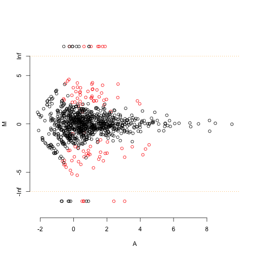
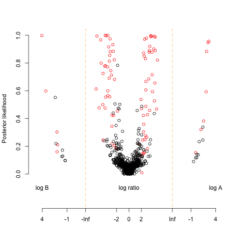

This is an R Markdown document. Markdown is a simple formatting syntax for authoring HTML, PDF, and MS Word documents. For more details on using R Markdown see <http://rmarkdown.rstudio.com>.

When you click the **Knit** button a document will be generated that includes both content as well as the output of any embedded R code chunks within the document. You can embed an R code chunk like this:


```r
rm(list=ls())
source("http://bioconductor.org/biocLite.R")
```

```
## Bioconductor version 2.14 (BiocInstaller 1.14.2), ?biocLite for
##   help
```

```r
source("http://stevenbsmith.net/source/load_R_enviornment_vars.R")
library(baySeq)
```

```
## Loading required package: GenomicRanges
## Loading required package: BiocGenerics
## Loading required package: parallel
## 
## Attaching package: 'BiocGenerics'
## 
## The following objects are masked from 'package:parallel':
## 
##     clusterApply, clusterApplyLB, clusterCall, clusterEvalQ,
##     clusterExport, clusterMap, parApply, parCapply, parLapply,
##     parLapplyLB, parRapply, parSapply, parSapplyLB
## 
## The following object is masked from 'package:stats':
## 
##     xtabs
## 
## The following objects are masked from 'package:base':
## 
##     anyDuplicated, append, as.data.frame, as.vector, cbind,
##     colnames, do.call, duplicated, eval, evalq, Filter, Find, get,
##     intersect, is.unsorted, lapply, Map, mapply, match, mget,
##     order, paste, pmax, pmax.int, pmin, pmin.int, Position, rank,
##     rbind, Reduce, rep.int, rownames, sapply, setdiff, sort,
##     table, tapply, union, unique, unlist
## 
## Loading required package: IRanges
## Loading required package: GenomeInfoDb
## 
## Attaching package: 'baySeq'
## 
## The following object is masked from 'package:GenomicRanges':
## 
##     rbind
## 
## The following object is masked from 'package:IRanges':
## 
##     rbind
## 
## The following object is masked from 'package:BiocGenerics':
## 
##     rbind
## 
## The following object is masked from 'package:base':
## 
##     rbind
```

```r
#biocLite("baySeq")
## For multiple cores. Set cl <- NULL if snow cant be used
library(snow)
```

```
## 
## Attaching package: 'snow'
## 
## The following objects are masked from 'package:BiocGenerics':
## 
##     clusterApply, clusterApplyLB, clusterCall, clusterEvalQ,
##     clusterExport, clusterMap, clusterSplit, parApply, parCapply,
##     parLapply, parRapply, parSapply
## 
## The following objects are masked from 'package:parallel':
## 
##     clusterApply, clusterApplyLB, clusterCall, clusterEvalQ,
##     clusterExport, clusterMap, clusterSplit, makeCluster,
##     parApply, parCapply, parLapply, parRapply, parSapply,
##     splitIndices, stopCluster
```

```r
cl <- makeCluster(4, "SOCK")
```
Load simulated data, as per vinette, although I should play with other data set used in DEseq to see how it compares

```r
data(simData)
simData[1:10,] ## as per vinette. The data are simulated such that the first hundred counts show differential expression between the first five libraries and the second five libraries
```

```
##       [,1] [,2] [,3] [,4] [,5] [,6] [,7] [,8] [,9] [,10]
##  [1,]    4    1    5    2    3    0    1    1    1     0
##  [2,]    1    0    9    6    5    0    1    0    0     1
##  [3,]    9    2    5    5   14    2    3    1    0     4
##  [4,]    7    3    8    2    2    0    1    0    1     0
##  [5,]    2    2    4    7    0    0    0    0    0     1
##  [6,]    2    1    0    1    0    4    3    5    5     3
##  [7,]    9    8    8    8    9    1    2    1    0     0
##  [8,]    9    5    7    8    7    1    2    0    1     2
##  [9,]    6    2    2    3    0    0    0    0    0     0
## [10,]    1    0    2    0    1    3   17    2    2    10
```

```r
replicates <- c("simA", "simA", "simA", "simA", "simA","simB", "simB", "simB", "simB", "simB")
groups <- list(NDE = c(1,1,1,1,1,1,1,1,1,1),DE = c(1,1,1,1,1,2,2,2,2,2))
## Now combine count data and groups into one object
CD <- new("countData",data=simData, replicates=replicates, groups=groups)
```

Now, for some more heavy lifting. Note the following need to be dug a bit more:
* getLibsizes
* getPriors.NB
* getLikelihoods.NB
* topCounts
* plotPosteriors
* NOTE that there are Paired Data Analysis approach as well!

Start with getLibsizes:

```r
(libsizes(CD) <-getLibsizes(CD))
```

```
## simA.1 simA.2 simA.3 simA.4 simA.5 simB.1 simB.2 simB.3 simB.4 simB.5 
##   1424    944   1519    744   1277   1186   1588    818    870   1406
```
#### getLibsizes breakdown

```r
getLibsizes
```

```
## function (cD, data, replicates, subset = NULL, estimationType = c("quantile", 
##     "total", "edgeR"), quantile = 0.75, ...) 
## {
##     if (!missing(cD)) {
##         if (inherits(cD, what = "pairedData")) {
##             data <- cbind(cD@data, cD@pairData)
##             replicates <- paste(as.character(rep(cD@replicates, 
##                 2)), rep(c("a", "b"), each = ncol(cD)), sep = "")
##         }
##         else if (inherits(cD, what = "alignmentData")) {
##             libSet <- !duplicated(as.character(values(cD@alignments)$tag))
##             data <- sapply(1:ncol(cD), function(ii) as.integer(cD@data[libSet, 
##                 ii]))
##             replicates <- cD@replicates
##         }
##         else {
##             data <- cD@data
##             replicates <- cD@replicates
##         }
##     }
##     if (missing(subset)) 
##         subset <- NULL
##     if (is.null(subset)) 
##         subset <- 1:nrow(data)
##     estimationType = match.arg(estimationType)
##     if (is.na(estimationType)) 
##         stop("'estimationType' not known")
##     estLibs <- function(data) {
##         libsizes <- switch(estimationType, total = colSums(data[subset, 
##             , drop = FALSE], na.rm = TRUE), quantile = apply(data[subset, 
##             , drop = FALSE], 2, function(z) {
##             x <- z[z > 0]
##             sum(x[x <= quantile(x, quantile, na.rm = TRUE)], 
##                 na.rm = TRUE)
##         }), edgeR = {
##             if (!("edgeR" %in% loadedNamespaces())) library(edgeR)
##             d <- DGEList(counts = data[subset, , drop = FALSE], 
##                 group = replicates, lib.size = colSums(data, 
##                   na.rm = TRUE))
##             d <- calcNormFactors(d, ...)
##             d$samples$norm.factors * d$samples$lib.size
##         })
##         names(libsizes) <- colnames(data)
##         libsizes
##     }
##     estLibsizes <- estLibs(data)
##     if (!missing(cD)) 
##         if (inherits(cD, what = "pairedData")) 
##             return(list(estLibsizes[1:ncol(cD)], estLibsizes[1:ncol(cD) + 
##                 ncol(cD)]))
##     return(estLibsizes)
## }
## <environment: namespace:baySeq>
```

MA Plot, but note that the DE and non DE are known a priori

```r
plotMA.CD(CD, samplesA = "simA", samplesB = "simB",col = c(rep("red", 100), rep("black", 900)))
```

 

```r
CD@annotation <- data.frame(name=paste("count",1:1000,sep="_"))
```


Now for the good stuff. *NB* estimation
Emperical distribution and parameters of NB are bootstrapped from data... involves a quasi-likelihood approach
See text, pg 5 for additional info. Will need to drill into this a bit more. Something about not being able to calc priors with conjugate. Different slots and suchs. 

```r
CD <- getPriors.NB(CD,samplesize=1000,estimation="QL",cl=cl)
```

```
## Finding priors...done.
```

```r
head(CD@priors)
```

```
## $sampled
##         sampled representative
##    [1,]      36              1
##    [2,]     230              2
##    [3,]     432              3
##    [4,]     144              4
##    [5,]      24              5
##    [6,]     294              6
##    [7,]     310              7
##    [8,]      43              8
##    [9,]     357              9
##   [10,]     469             10
##   [11,]      71             11
##   [12,]      66             12
##   [13,]     240             13
##   [14,]     236             14
##   [15,]     634             15
##   [16,]     533             16
##   [17,]     734             17
##   [18,]     849             18
##   [19,]     731             19
##   [20,]      79             20
##   [21,]     584             21
##   [22,]     210             22
##   [23,]      77             23
##   [24,]     932             24
##   [25,]     375             25
##   [26,]     720             26
##   [27,]     186             27
##   [28,]     371             28
##   [29,]     939             29
##   [30,]     735             30
##   [31,]      52             31
##   [32,]     199             32
##   [33,]     565             33
##   [34,]     172             34
##   [35,]     324             35
##   [36,]      65             36
##   [37,]     100             37
##   [38,]     795             38
##   [39,]     729             39
##   [40,]     303             40
##   [41,]     972             41
##   [42,]     358             42
##   [43,]     463             43
##   [44,]     668             44
##   [45,]     429             45
##   [46,]     887             46
##   [47,]     664             47
##   [48,]     182             48
##   [49,]     611             49
##   [50,]     574             50
##   [51,]     578             51
##   [52,]     380             52
##   [53,]     363             53
##   [54,]     625             54
##   [55,]     808             55
##   [56,]     885             56
##   [57,]     549             57
##   [58,]      62             58
##   [59,]      73             59
##   [60,]      72             60
##   [61,]     780             61
##   [62,]     134             62
##   [63,]     631             63
##   [64,]     933             64
##   [65,]     436             65
##   [66,]     519             66
##   [67,]     897             67
##   [68,]     777             68
##   [69,]     225             69
##   [70,]     312             70
##   [71,]     111             71
##   [72,]     895             72
##   [73,]     125             73
##   [74,]     831             74
##   [75,]     139             75
##   [76,]     269             76
##   [77,]      44             77
##   [78,]      57             78
##   [79,]     322             79
##   [80,]     229             80
##   [81,]     696             81
##   [82,]     547             82
##   [83,]     681             83
##   [84,]     745             84
##   [85,]     136             85
##   [86,]     772             86
##   [87,]     133             87
##   [88,]     529             88
##   [89,]     314             89
##   [90,]      76             90
##   [91,]     185             91
##   [92,]     866             92
##   [93,]     252             93
##   [94,]     821             94
##   [95,]     216             95
##   [96,]     953             96
##   [97,]     468             97
##   [98,]     871             98
##   [99,]     141             99
##  [100,]     120            100
##  [101,]     333            101
##  [102,]     373            102
##  [103,]     599            103
##  [104,]     916            104
##  [105,]     142            105
##  [106,]     264            106
##  [107,]     648            107
##  [108,]     426            108
##  [109,]     553            109
##  [110,]     214            110
##  [111,]      35            111
##  [112,]     466            112
##  [113,]     576            113
##  [114,]     190            114
##  [115,]     341            115
##  [116,]      85            116
##  [117,]     478            117
##  [118,]     900            118
##  [119,]     401            119
##  [120,]     955            120
##  [121,]     929            121
##  [122,]     543            122
##  [123,]     235            123
##  [124,]     211            124
##  [125,]     915            125
##  [126,]     666            126
##  [127,]     302            127
##  [128,]     520            128
##  [129,]      61            129
##  [130,]     367            130
##  [131,]     447            131
##  [132,]     854            132
##  [133,]     723            133
##  [134,]     890            134
##  [135,]     116            135
##  [136,]     816            136
##  [137,]     430            137
##  [138,]      98            138
##  [139,]     128            139
##  [140,]     505            140
##  [141,]     221            141
##  [142,]     975            142
##  [143,]     437            143
##  [144,]     455            144
##  [145,]     343            145
##  [146,]     917            146
##  [147,]     435            147
##  [148,]     984            148
##  [149,]     278            149
##  [150,]     615            150
##  [151,]     464            151
##  [152,]     626            152
##  [153,]     459            153
##  [154,]     704            154
##  [155,]     698            155
##  [156,]     175            156
##  [157,]     323            157
##  [158,]     219            158
##  [159,]     288            159
##  [160,]     818            160
##  [161,]     951            161
##  [162,]     691            162
##  [163,]     382            163
##  [164,]     445            164
##  [165,]     481            165
##  [166,]     627            166
##  [167,]     243            167
##  [168,]     653            168
##  [169,]      67            169
##  [170,]     978            170
##  [171,]     753            171
##  [172,]     293            172
##  [173,]     931            173
##  [174,]     558            174
##  [175,]     280            175
##  [176,]     606            176
##  [177,]     184            177
##  [178,]      42            178
##  [179,]     946            179
##  [180,]     337            180
##  [181,]     247            181
##  [182,]     927            182
##  [183,]     307            183
##  [184,]     261            184
##  [185,]     526            185
##  [186,]     277            186
##  [187,]     679            187
##  [188,]     506            188
##  [189,]     439            189
##  [190,]     968            190
##  [191,]     726            191
##  [192,]     253            192
##  [193,]     675            193
##  [194,]     872            194
##  [195,]     129            195
##  [196,]     315            196
##  [197,]     980            197
##  [198,]     687            198
##  [199,]     251            199
##  [200,]     665            200
##  [201,]     477            201
##  [202,]     411            202
##  [203,]     271            203
##  [204,]     151            204
##  [205,]     693            205
##  [206,]     774            206
##  [207,]     536            207
##  [208,]      32            208
##  [209,]     938            209
##  [210,]     838            210
##  [211,]     173            211
##  [212,]     212            212
##  [213,]     671            213
##  [214,]     649            214
##  [215,]     272            215
##  [216,]     886            216
##  [217,]     388            217
##  [218,]     316            218
##  [219,]     624            219
##  [220,]     647            220
##  [221,]     503            221
##  [222,]     740            222
##  [223,]     904            223
##  [224,]      93            224
##  [225,]     840            225
##  [226,]     153            226
##  [227,]     381            227
##  [228,]      60            228
##  [229,]     122            229
##  [230,]     623            230
##  [231,]     775            231
##  [232,]      49            232
##  [233,]     346            233
##  [234,]     970            234
##  [235,]     596            235
##  [236,]     531            236
##  [237,]     713            237
##  [238,]     132            238
##  [239,]     121            239
##  [240,]     262            240
##  [241,]     888            241
##  [242,]      87            242
##  [243,]     865            243
##  [244,]     539            244
##  [245,]     686            245
##  [246,]     721            246
##  [247,]      63            247
##  [248,]     485            248
##  [249,]      22            249
##  [250,]     828            250
##  [251,]     737            251
##  [252,]     751            252
##  [253,]     822            253
##  [254,]     512            254
##  [255,]     424            255
##  [256,]     757            256
##  [257,]     491            257
##  [258,]     800            258
##  [259,]     487            259
##  [260,]     695            260
##  [261,]     676            261
##  [262,]     166            262
##  [263,]     208            263
##  [264,]     832            264
##  [265,]     317            265
##  [266,]     368            266
##  [267,]     783            267
##  [268,]     353            268
##  [269,]     488            269
##  [270,]     554            270
##  [271,]     567            271
##  [272,]     461            272
##  [273,]     183            273
##  [274,]     989            274
##  [275,]     575            275
##  [276,]     847            276
##  [277,]     514            277
##  [278,]     593            278
##  [279,]     614            279
##  [280,]     848            280
##  [281,]     256            281
##  [282,]     728            282
##  [283,]     628            283
##  [284,]      48            284
##  [285,]     773            285
##  [286,]     655            286
##  [287,]     572            287
##  [288,]     223            288
##  [289,]     960            289
##  [290,]     702            290
##  [291,]     195            291
##  [292,]     942            292
##  [293,]     489            293
##  [294,]     632            294
##  [295,]     470            295
##  [296,]     903            296
##  [297,]     275            297
##  [298,]     242            298
##  [299,]     657            299
##  [300,]     259            300
##  [301,]     126            301
##  [302,]     290            302
##  [303,]      33            303
##  [304,]     502            304
##  [305,]     790            305
##  [306,]      10            306
##  [307,]      29            307
##  [308,]      40            308
##  [309,]     124            309
##  [310,]     305            310
##  [311,]     192            311
##  [312,]     680            312
##  [313,]     521            313
##  [314,]     736            314
##  [315,]     528            315
##  [316,]     947            316
##  [317,]     582            317
##  [318,]     494            318
##  [319,]     245            319
##  [320,]     858            320
##  [321,]     868            321
##  [322,]     852            322
##  [323,]     640            323
##  [324,]     222            324
##  [325,]     802            325
##  [326,]     372            326
##  [327,]     592            327
##  [328,]     538            328
##  [329,]     659            329
##  [330,]     997            330
##  [331,]       2            331
##  [332,]      82            332
##  [333,]     408            333
##  [334,]     422            334
##  [335,]     642            335
##  [336,]     597            336
##  [337,]     825            337
##  [338,]     794            338
##  [339,]     154            339
##  [340,]     806            340
##  [341,]     304            341
##  [342,]     954            342
##  [343,]     161            343
##  [344,]      78            344
##  [345,]      80            345
##  [346,]     652            346
##  [347,]     467            347
##  [348,]     298            348
##  [349,]     334            349
##  [350,]     730            350
##  [351,]     971            351
##  [352,]     109            352
##  [353,]     622            353
##  [354,]     571            354
##  [355,]     805            355
##  [356,]     385            356
##  [357,]     998            357
##  [358,]     442            358
##  [359,]     301            359
##  [360,]     586            360
##  [361,]     573            361
##  [362,]     146            362
##  [363,]     974            363
##  [364,]     981            364
##  [365,]     145            365
##  [366,]     164            366
##  [367,]     911            367
##  [368,]     792            368
##  [369,]     879            369
##  [370,]     636            370
##  [371,]     561            371
##  [372,]      95            372
##  [373,]     782            373
##  [374,]     964            374
##  [375,]      59            375
##  [376,]     590            376
##  [377,]     215            377
##  [378,]     205            378
##  [379,]     234            379
##  [380,]     147            380
##  [381,]     705            381
##  [382,]     763            382
##  [383,]     741            383
##  [384,]     177            384
##  [385,]     883            385
##  [386,]     672            386
##  [387,]     355            387
##  [388,]     944            388
##  [389,]     669            389
##  [390,]     750            390
##  [391,]     882            391
##  [392,]     260            392
##  [393,]     985            393
##  [394,]     541            394
##  [395,]     378            395
##  [396,]     321            396
##  [397,]     325            397
##  [398,]     913            398
##  [399,]     994            399
##  [400,]     224            400
##  [401,]     892            401
##  [402,]     246            402
##  [403,]     158            403
##  [404,]     639            404
##  [405,]     778            405
##  [406,]     123            406
##  [407,]     369            407
##  [408,]     862            408
##  [409,]     390            409
##  [410,]     995            410
##  [411,]     689            411
##  [412,]     374            412
##  [413,]     191            413
##  [414,]     152            414
##  [415,]     555            415
##  [416,]     453            416
##  [417,]     339            417
##  [418,]     969            418
##  [419,]     404            419
##  [420,]     115            420
##  [421,]      54            421
##  [422,]     961            422
##  [423,]     973            423
##  [424,]      45            424
##  [425,]     479            425
##  [426,]     987            426
##  [427,]     743            427
##  [428,]     893            428
##  [429,]     178            429
##  [430,]     873            430
##  [431,]     168            431
##  [432,]      94            432
##  [433,]     952            433
##  [434,]     905            434
##  [435,]     988            435
##  [436,]     856            436
##  [437,]     197            437
##  [438,]     979            438
##  [439,]      15            439
##  [440,]     966            440
##  [441,]     861            441
##  [442,]     127            442
##  [443,]     559            443
##  [444,]     694            443
##  [445,]     402            444
##  [446,]     258            445
##  [447,]     162            446
##  [448,]     612            447
##  [449,]     319            448
##  [450,]      75            449
##  [451,]     535            450
##  [452,]     508            451
##  [453,]     384            452
##  [454,]     635            453
##  [455,]     418            454
##  [456,]     633            455
##  [457,]     906            456
##  [458,]     919            457
##  [459,]     416            458
##  [460,]     295            459
##  [461,]     697            460
##  [462,]     613            461
##  [463,]     458            462
##  [464,]     901            463
##  [465,]     601            464
##  [466,]     452            465
##  [467,]     499            466
##  [468,]     457            467
##  [469,]     869            468
##  [470,]     273            469
##  [471,]     441            470
##  [472,]      21            471
##  [473,]     918            472
##  [474,]     926            473
##  [475,]     143            474
##  [476,]     174            475
##  [477,]     556            476
##  [478,]     232            477
##  [479,]     746            478
##  [480,]     914            479
##  [481,]      47            480
##  [482,]     433            481
##  [483,]     473            482
##  [484,]     309            483
##  [485,]     486            484
##  [486,]     283            485
##  [487,]    1000            486
##  [488,]     851            487
##  [489,]     835            488
##  [490,]     227            489
##  [491,]     443            490
##  [492,]     497            491
##  [493,]     714            492
##  [494,]     658            493
##  [495,]     340            494
##  [496,]     551            495
##  [497,]     804            496
##  [498,]      90            497
##  [499,]     928            498
##  [500,]     465            499
##  [501,]     609            500
##  [502,]     785            501
##  [503,]     863            502
##  [504,]     226            503
##  [505,]     356            504
##  [506,]     228            505
##  [507,]      74            506
##  [508,]      17            507
##  [509,]     722            508
##  [510,]     360            509
##  [511,]     320            510
##  [512,]       6            511
##  [513,]     540            512
##  [514,]     286            513
##  [515,]     336            514
##  [516,]     935            515
##  [517,]     417            516
##  [518,]     263            517
##  [519,]     244            518
##  [520,]     564            519
##  [521,]     674            520
##  [522,]     398            521
##  [523,]     587            522
##  [524,]     266            523
##  [525,]     500            524
##  [526,]     569            525
##  [527,]     482            526
##  [528,]     209            527
##  [529,]     603            528
##  [530,]     819            529
##  [531,]     756            530
##  [532,]     956            531
##  [533,]     552            532
##  [534,]     423            533
##  [535,]     414            534
##  [536,]     616            535
##  [537,]     759            536
##  [538,]     525            537
##  [539,]     313            538
##  [540,]     560            539
##  [541,]     761            540
##  [542,]     768            541
##  [543,]     326            542
##  [544,]     788            543
##  [545,]     876            544
##  [546,]     106            545
##  [547,]     233            546
##  [548,]     682            547
##  [549,]     370            548
##  [550,]     754            549
##  [551,]     798            550
##  [552,]     101            551
##  [553,]     515            552
##  [554,]     670            553
##  [555,]     630            554
##  [556,]     817            555
##  [557,]     165            556
##  [558,]     812            557
##  [559,]     397            558
##  [560,]     393            559
##  [561,]     881            560
##  [562,]     159            561
##  [563,]     171            562
##  [564,]     548            563
##  [565,]      51            564
##  [566,]       5            565
##  [567,]     867            566
##  [568,]     296            567
##  [569,]     605            568
##  [570,]     483            569
##  [571,]     651            570
##  [572,]     157            571
##  [573,]     770            572
##  [574,]     711            573
##  [575,]     776            574
##  [576,]     476            575
##  [577,]     522            576
##  [578,]     673            577
##  [579,]     815            578
##  [580,]     527            579
##  [581,]     809            580
##  [582,]      68            581
##  [583,]     638            582
##  [584,]     267            583
##  [585,]     331            584
##  [586,]     591            585
##  [587,]      55            586
##  [588,]     707            587
##  [589,]     878            588
##  [590,]     801            589
##  [591,]     923            590
##  [592,]     196            591
##  [593,]     690            592
##  [594,]     471            593
##  [595,]     366            594
##  [596,]     717            595
##  [597,]     703            596
##  [598,]      56            597
##  [599,]     350            598
##  [600,]     986            599
##  [601,]     643            600
##  [602,]     440            601
##  [603,]     300            602
##  [604,]     839            603
##  [605,]     758            604
##  [606,]     581            605
##  [607,]     415            606
##  [608,]     860            607
##  [609,]     155            608
##  [610,]     490            609
##  [611,]     999            610
##  [612,]     791            611
##  [613,]     237            612
##  [614,]     287            613
##  [615,]     332            614
##  [616,]     965            615
##  [617,]     991            616
##  [618,]     170            617
##  [619,]     281            618
##  [620,]     738            619
##  [621,]     511            620
##  [622,]     996            621
##  [623,]     752            622
##  [624,]     456            623
##  [625,]     311            624
##  [626,]     803            625
##  [627,]     598            626
##  [628,]     238            627
##  [629,]     589            628
##  [630,]     518            629
##  [631,]     444            630
##  [632,]     347            631
##  [633,]     875            632
##  [634,]     789            633
##  [635,]     877            634
##  [636,]     896            635
##  [637,]     449            636
##  [638,]     239            637
##  [639,]     920            638
##  [640,]      37            639
##  [641,]     130            640
##  [642,]     957            641
##  [643,]     434            642
##  [644,]     359            643
##  [645,]     544            644
##  [646,]     169            645
##  [647,]     925            646
##  [648,]     894            647
##  [649,]     362            648
##  [650,]     618            649
##  [651,]     427            650
##  [652,]     112            651
##  [653,]      28            652
##  [654,]     732            653
##  [655,]     446            654
##  [656,]     297            655
##  [657,]     621            656
##  [658,]     617            657
##  [659,]     392            658
##  [660,]     950            659
##  [661,]     796            660
##  [662,]     936            661
##  [663,]     889            662
##  [664,]     637            663
##  [665,]     874            664
##  [666,]     546            665
##  [667,]     797            666
##  [668,]     391            667
##  [669,]     365            668
##  [670,]     677            669
##  [671,]     387            670
##  [672,]     338            671
##  [673,]     836            672
##  [674,]     827            673
##  [675,]     318            674
##  [676,]      70            675
##  [677,]     678            676
##  [678,]     542            677
##  [679,]     504            678
##  [680,]     345            679
##  [681,]     135            680
##  [682,]     747            681
##  [683,]     692            682
##  [684,]      16            683
##  [685,]     163            684
##  [686,]     364            685
##  [687,]     701            686
##  [688,]     187            687
##  [689,]     781            688
##  [690,]     517            689
##  [691,]     383            690
##  [692,]     545            691
##  [693,]     983            692
##  [694,]     602            693
##  [695,]     767            694
##  [696,]     608            695
##  [697,]     220            696
##  [698,]      99            697
##  [699,]     348            698
##  [700,]     941            699
##  [701,]      13            700
##  [702,]     600            701
##  [703,]     394            702
##  [704,]     610            703
##  [705,]     793            704
##  [706,]     335            705
##  [707,]     510            706
##  [708,]     403            707
##  [709,]     824            708
##  [710,]     844            709
##  [711,]     725            710
##  [712,]     823            711
##  [713,]     937            712
##  [714,]     250            713
##  [715,]       1            714
##  [716,]     943            715
##  [717,]     898            716
##  [718,]     376            717
##  [719,]     841            718
##  [720,]     859            719
##  [721,]     891            720
##  [722,]     755            721
##  [723,]     619            722
##  [724,]     830            723
##  [725,]     420            724
##  [726,]     826            725
##  [727,]     389            726
##  [728,]     523            727
##  [729,]     176            728
##  [730,]     180            729
##  [731,]     557            730
##  [732,]     620            731
##  [733,]     399            732
##  [734,]     193            733
##  [735,]     594            734
##  [736,]     198            735
##  [737,]     396            736
##  [738,]     532            737
##  [739,]     814            738
##  [740,]     507            739
##  [741,]     412            740
##  [742,]     495            741
##  [743,]     934            742
##  [744,]     537            743
##  [745,]     550            744
##  [746,]     699            745
##  [747,]     907            746
##  [748,]     438            747
##  [749,]     107            748
##  [750,]     715            749
##  [751,]     820            750
##  [752,]     117            751
##  [753,]     563            752
##  [754,]     880            753
##  [755,]     181            754
##  [756,]     685            755
##  [757,]     744            756
##  [758,]     779            757
##  [759,]     379            758
##  [760,]     406            759
##  [761,]     629            760
##  [762,]      89            761
##  [763,]     712            762
##  [764,]     864            763
##  [765,]     354            764
##  [766,]     850            765
##  [767,]     718            766
##  [768,]     299            767
##  [769,]     138            768
##  [770,]      11            769
##  [771,]     945            770
##  [772,]     306            771
##  [773,]     254            772
##  [774,]     218            773
##  [775,]     834            774
##  [776,]     566            775
##  [777,]      86            776
##  [778,]      20            777
##  [779,]     940            778
##  [780,]     993            779
##  [781,]     282            780
##  [782,]      25            781
##  [783,]     395            782
##  [784,]     568            783
##  [785,]     200            784
##  [786,]      27            785
##  [787,]     104            786
##  [788,]     661            787
##  [789,]     241            788
##  [790,]     119            789
##  [791,]     492            790
##  [792,]      31            791
##  [793,]      81            792
##  [794,]     949            793
##  [795,]     579            794
##  [796,]      84            795
##  [797,]     207            796
##  [798,]     201            797
##  [799,]     284            798
##  [800,]     646            799
##  [801,]     958            800
##  [802,]      38            801
##  [803,]     585            802
##  [804,]     410            803
##  [805,]     344            804
##  [806,]     113            805
##  [807,]       9            806
##  [808,]     833            807
##  [809,]     454            808
##  [810,]     419            809
##  [811,]     667            810
##  [812,]     908            811
##  [813,]     194            812
##  [814,]     513            813
##  [815,]      64            814
##  [816,]     902            815
##  [817,]     857            816
##  [818,]     684            817
##  [819,]     400            818
##  [820,]     739            819
##  [821,]     709            820
##  [822,]     654            821
##  [823,]     351            822
##  [824,]     188            823
##  [825,]     279            824
##  [826,]     509            825
##  [827,]     641            826
##  [828,]     570            827
##  [829,]     807            828
##  [830,]      92            829
##  [831,]     103            830
##  [832,]     501            831
##  [833,]      50            832
##  [834,]     150            833
##  [835,]     959            834
##  [836,]     140            835
##  [837,]     203            836
##  [838,]     688            837
##  [839,]     764            838
##  [840,]       4            839
##  [841,]     474            840
##  [842,]     270            841
##  [843,]     660            842
##  [844,]     480            843
##  [845,]     268            844
##  [846,]     377            845
##  [847,]     924            846
##  [848,]     484            847
##  [849,]     595            848
##  [850,]     472            849
##  [851,]     967            850
##  [852,]     202            851
##  [853,]     167            852
##  [854,]     516            853
##  [855,]     899            854
##  [856,]      19            855
##  [857,]     475            856
##  [858,]     257            857
##  [859,]     349            858
##  [860,]     990            859
##  [861,]      18            860
##  [862,]     213            861
##  [863,]     656            862
##  [864,]     787            863
##  [865,]     248            864
##  [866,]     431            865
##  [867,]     405            866
##  [868,]     448            867
##  [869,]     291            868
##  [870,]     645            869
##  [871,]     810            870
##  [872,]     766            871
##  [873,]     450            872
##  [874,]     330            873
##  [875,]      96            874
##  [876,]      23            875
##  [877,]     706            876
##  [878,]       3            877
##  [879,]     962            878
##  [880,]     811            879
##  [881,]     719            880
##  [882,]     255            881
##  [883,]     451            882
##  [884,]     853            883
##  [885,]     982            884
##  [886,]       8            885
##  [887,]     137            886
##  [888,]      14            887
##  [889,]      88            888
##  [890,]       7            889
##  [891,]     837            890
##  [892,]      58            891
##  [893,]      91            892
##  [894,]     843            893
##  [895,]     148            894
##  [896,]     663            895
##  [897,]     493            896
##  [898,]     413            897
##  [899,]     948            898
##  [900,]     727            899
##  [901,]     580            900
##  [902,]     607            901
##  [903,]     217            902
##  [904,]     992            903
##  [905,]     845            904
##  [906,]     683            905
##  [907,]     462            906
##  [908,]     588            907
##  [909,]     842            908
##  [910,]     604            909
##  [911,]     765            910
##  [912,]      30            911
##  [913,]     118            912
##  [914,]     769            913
##  [915,]     409            914
##  [916,]     799            915
##  [917,]     156            916
##  [918,]     110            917
##  [919,]      39            918
##  [920,]     292            919
##  [921,]      26            920
##  [922,]      69            921
##  [923,]     265            922
##  [924,]      41            923
##  [925,]     308            924
##  [926,]     276            925
##  [927,]     784            926
##  [928,]     285            927
##  [929,]      83            928
##  [930,]     813            929
##  [931,]     710            930
##  [932,]     910            931
##  [933,]     662            932
##  [934,]     577            933
##  [935,]     460            934
##  [936,]     583            935
##  [937,]     909            936
##  [938,]     716            937
##  [939,]     724            938
##  [940,]     644            939
##  [941,]     977            940
##  [942,]     884            941
##  [943,]     428            942
##  [944,]      46            943
##  [945,]     930            944
##  [946,]     921            945
##  [947,]     160            946
##  [948,]     289            947
##  [949,]     749            948
##  [950,]     562            949
##  [951,]     108            950
##  [952,]     361            951
##  [953,]      12            952
##  [954,]     498            953
##  [955,]     189            954
##  [956,]     922            955
##  [957,]     352            956
##  [958,]     976            957
##  [959,]     425            958
##  [960,]     650            959
##  [961,]     534            960
##  [962,]     708            961
##  [963,]     855            962
##  [964,]     912            963
##  [965,]     742            964
##  [966,]     231            965
##  [967,]     249            966
##  [968,]     829            967
##  [969,]     524            968
##  [970,]     496            969
##  [971,]     748            970
##  [972,]     700            971
##  [973,]      97            972
##  [974,]     179            973
##  [975,]     771            974
##  [976,]     105            975
##  [977,]     131            976
##  [978,]     733            977
##  [979,]     329            978
##  [980,]     114            979
##  [981,]     149            980
##  [982,]     786            981
##  [983,]      34            982
##  [984,]     760            983
##  [985,]     963            984
##  [986,]     386            985
##  [987,]     274            986
##  [988,]     870            987
##  [989,]     421            988
##  [990,]     342            989
##  [991,]     530            990
##  [992,]     204            991
##  [993,]     102            992
##  [994,]     407            993
##  [995,]      53            994
##  [996,]     327            995
##  [997,]     762            996
##  [998,]     846            997
##  [999,]     206            998
## [1000,]     328            999
## 
## $weights
##    [1] 1 1 1 1 1 1 1 1 1 1 1 1 1 1 1 1 1 1 1 1 1 1 1 1 1 1 1 1 1 1 1 1 1 1
##   [35] 1 1 1 1 1 1 1 1 1 1 1 1 1 1 1 1 1 1 1 1 1 1 1 1 1 1 1 1 1 1 1 1 1 1
##   [69] 1 1 1 1 1 1 1 1 1 1 1 1 1 1 1 1 1 1 1 1 1 1 1 1 1 1 1 1 1 1 1 1 1 1
##  [103] 1 1 1 1 1 1 1 1 1 1 1 1 1 1 1 1 1 1 1 1 1 1 1 1 1 1 1 1 1 1 1 1 1 1
##  [137] 1 1 1 1 1 1 1 1 1 1 1 1 1 1 1 1 1 1 1 1 1 1 1 1 1 1 1 1 1 1 1 1 1 1
##  [171] 1 1 1 1 1 1 1 1 1 1 1 1 1 1 1 1 1 1 1 1 1 1 1 1 1 1 1 1 1 1 1 1 1 1
##  [205] 1 1 1 1 1 1 1 1 1 1 1 1 1 1 1 1 1 1 1 1 1 1 1 1 1 1 1 1 1 1 1 1 1 1
##  [239] 1 1 1 1 1 1 1 1 1 1 1 1 1 1 1 1 1 1 1 1 1 1 1 1 1 1 1 1 1 1 1 1 1 1
##  [273] 1 1 1 1 1 1 1 1 1 1 1 1 1 1 1 1 1 1 1 1 1 1 1 1 1 1 1 1 1 1 1 1 1 1
##  [307] 1 1 1 1 1 1 1 1 1 1 1 1 1 1 1 1 1 1 1 1 1 1 1 1 1 1 1 1 1 1 1 1 1 1
##  [341] 1 1 1 1 1 1 1 1 1 1 1 1 1 1 1 1 1 1 1 1 1 1 1 1 1 1 1 1 1 1 1 1 1 1
##  [375] 1 1 1 1 1 1 1 1 1 1 1 1 1 1 1 1 1 1 1 1 1 1 1 1 1 1 1 1 1 1 1 1 1 1
##  [409] 1 1 1 1 1 1 1 1 1 1 1 1 1 1 1 1 1 1 1 1 1 1 1 1 1 1 1 1 1 1 1 1 1 1
##  [443] 1 1 1 1 1 1 1 1 1 1 1 1 1 1 1 1 1 1 1 1 1 1 1 1 1 1 1 1 1 1 1 1 1 1
##  [477] 1 1 1 1 1 1 1 1 1 1 1 1 1 1 1 1 1 1 1 1 1 1 1 1 1 1 1 1 1 1 1 1 1 1
##  [511] 1 1 1 1 1 1 1 1 1 1 1 1 1 1 1 1 1 1 1 1 1 1 1 1 1 1 1 1 1 1 1 1 1 1
##  [545] 1 1 1 1 1 1 1 1 1 1 1 1 1 1 1 1 1 1 1 1 1 1 1 1 1 1 1 1 1 1 1 1 1 1
##  [579] 1 1 1 1 1 1 1 1 1 1 1 1 1 1 1 1 1 1 1 1 1 1 1 1 1 1 1 1 1 1 1 1 1 1
##  [613] 1 1 1 1 1 1 1 1 1 1 1 1 1 1 1 1 1 1 1 1 1 1 1 1 1 1 1 1 1 1 1 1 1 1
##  [647] 1 1 1 1 1 1 1 1 1 1 1 1 1 1 1 1 1 1 1 1 1 1 1 1 1 1 1 1 1 1 1 1 1 1
##  [681] 1 1 1 1 1 1 1 1 1 1 1 1 1 1 1 1 1 1 1 1 1 1 1 1 1 1 1 1 1 1 1 1 1 1
##  [715] 1 1 1 1 1 1 1 1 1 1 1 1 1 1 1 1 1 1 1 1 1 1 1 1 1 1 1 1 1 1 1 1 1 1
##  [749] 1 1 1 1 1 1 1 1 1 1 1 1 1 1 1 1 1 1 1 1 1 1 1 1 1 1 1 1 1 1 1 1 1 1
##  [783] 1 1 1 1 1 1 1 1 1 1 1 1 1 1 1 1 1 1 1 1 1 1 1 1 1 1 1 1 1 1 1 1 1 1
##  [817] 1 1 1 1 1 1 1 1 1 1 1 1 1 1 1 1 1 1 1 1 1 1 1 1 1 1 1 1 1 1 1 1 1 1
##  [851] 1 1 1 1 1 1 1 1 1 1 1 1 1 1 1 1 1 1 1 1 1 1 1 1 1 1 1 1 1 1 1 1 1 1
##  [885] 1 1 1 1 1 1 1 1 1 1 1 1 1 1 1 1 1 1 1 1 1 1 1 1 1 1 1 1 1 1 1 1 1 1
##  [919] 1 1 1 1 1 1 1 1 1 1 1 1 1 1 1 1 1 1 1 1 1 1 1 1 1 1 1 1 1 1 1 1 1 1
##  [953] 1 1 1 1 1 1 1 1 1 1 1 1 1 1 1 1 1 1 1 1 1 1 1 1 1 1 1 1 1 1 1 1 1 1
##  [987] 1 1 1 1 1 1 1 1 1 1 1 1 1 1
## 
## $priors
## $priors$NDE
## $priors$NDE[[1]]
##                 1          
##    [1,] 0.0005536 7.887e-01
##    [2,] 0.0002548 1.717e-08
##    [3,] 0.0007455 6.117e-01
##    [4,] 0.0003397 2.145e-08
##    [5,] 0.0023316 9.364e-01
##    [6,] 0.0002548 1.510e-08
##    [7,] 0.0004246 1.925e-08
##    [8,] 0.0005944 6.966e-09
##    [9,] 0.0007643 9.302e-09
##   [10,] 0.0003398 4.826e-03
##   [11,] 0.0005097 3.580e-03
##   [12,] 0.0036515 3.819e-09
##   [13,] 0.0003688 1.274e+00
##   [14,] 0.0004246 1.479e-08
##   [15,] 0.0002548 7.225e-09
##   [16,] 0.0006717 1.598e-01
##   [17,] 0.0007491 2.035e-01
##   [18,] 0.0008659 7.643e-01
##   [19,] 0.0005095 1.975e-08
##   [20,] 0.0012738 8.490e-09
##   [21,] 0.0004246 1.187e-08
##   [22,] 0.0005228 9.253e-01
##   [23,] 0.0031403 1.872e+00
##   [24,] 0.0010668 9.312e-01
##   [25,] 0.0003506 6.000e-01
##   [26,] 0.0004407 9.964e-01
##   [27,] 0.0005588 8.337e-01
##   [28,] 0.0005944 9.950e-09
##   [29,] 0.0005944 1.708e-08
##   [30,] 0.0006098 1.079e+00
##   [31,] 0.0014368 4.666e-01
##   [32,] 0.0007726 6.987e-01
##   [33,] 0.0002548 1.473e-08
##   [34,] 0.0003397 2.288e-08
##   [35,] 0.0005095 8.731e-09
##   [36,] 0.0019758 3.143e-01
##   [37,] 0.0027017 6.078e-01
##   [38,] 0.0004519 9.363e-01
##   [39,] 0.0003705 9.936e-01
##   [40,] 0.0010898 2.642e-01
##   [41,] 0.0004246 1.171e-08
##   [42,] 0.0007667 4.460e-02
##   [43,] 0.0006336 5.656e-01
##   [44,] 0.0007510 6.741e-01
##   [45,] 0.0013952 3.056e-01
##   [46,] 0.0010258 1.473e+00
##   [47,] 0.0009332 1.913e+00
##   [48,] 0.0009969 1.056e+00
##   [49,] 0.0010871 1.405e+00
##   [50,] 0.0003314 4.669e-01
##   [51,] 0.0003397 1.189e-08
##   [52,] 0.0003397 2.085e-08
##   [53,] 0.0004246 9.301e-09
##   [54,] 0.0005945 1.808e-01
##   [55,] 0.0003397 9.300e-09
##   [56,] 0.0004246 1.847e-08
##   [57,] 0.0005944 9.302e-09
##   [58,] 0.0012824 3.124e-01
##   [59,] 0.0014436 7.272e-09
##   [60,] 0.0024626 3.553e-09
##   [61,] 0.0002548 2.519e-08
##   [62,] 0.0002548 1.445e-08
##   [63,] 0.0004246 1.338e-08
##   [64,] 0.0005944 2.505e-08
##   [65,] 0.0007643 7.704e-09
##   [66,] 0.0006793 2.044e-08
##   [67,] 0.0003397 1.034e-08
##   [68,] 0.0006044 4.049e-01
##   [69,] 0.0005034 2.758e-01
##   [70,] 0.0005944 1.461e-08
##   [71,] 0.0004207 5.813e-01
##   [72,] 0.0005863 7.933e-01
##   [73,] 0.0006767 1.204e+00
##   [74,] 0.0004245 8.116e-02
##   [75,] 0.0006688 2.744e-01
##   [76,] 0.0005102 3.809e-01
##   [77,] 0.0011708 9.806e-01
##   [78,] 0.0047690 3.540e-01
##   [79,] 0.0003397 1.727e-08
##   [80,] 0.0004246 1.577e-08
##   [81,] 0.0004246 1.341e-08
##   [82,] 0.0007664 2.698e-01
##   [83,] 0.0006787 4.268e-01
##   [84,] 0.0029147 9.365e-01
##   [85,] 0.0014436 1.222e-08
##   [86,] 0.0006280 6.254e-01
##   [87,] 0.0009456 1.206e+00
##   [88,] 0.0006773 1.424e+00
##   [89,] 0.0004246 1.303e-08
##   [90,] 0.0011039 1.686e-08
##   [91,] 0.0003397 9.301e-09
##   [92,] 0.0008564 2.397e-01
##   [93,] 0.0004246 1.505e-08
##   [94,] 0.0012235 7.675e-01
##   [95,] 0.0006983 6.873e-01
##   [96,] 0.0005119 1.265e-01
##   [97,] 0.0006793 1.626e-08
##   [98,] 0.0009341 1.065e-08
##   [99,] 0.0008443 8.546e-02
##  [100,] 0.0009046 1.074e+00
##  [101,] 0.0003976 1.062e+00
##  [102,] 0.0004153 6.965e-01
##  [103,] 0.0007892 2.091e+00
##  [104,] 0.0004119 4.986e-01
##  [105,] 0.0004993 2.213e-01
##  [106,] 0.0006702 2.429e-01
##  [107,] 0.0008237 3.341e-01
##  [108,] 0.0008847 8.731e-01
##  [109,] 0.0009288 4.201e-01
##  [110,] 0.0007365 1.223e+00
##  [111,] 0.0029222 1.425e+00
##  [112,] 0.0005426 1.131e+00
##  [113,] 0.0009904 2.123e+00
##  [114,] 0.0008016 5.072e-01
##  [115,] 0.0011382 6.440e-01
##  [116,] 0.0013709 6.535e-01
##  [117,] 0.0009859 1.245e+00
##  [118,] 0.0004990 2.037e-01
##  [119,] 0.0010512 1.746e+00
##  [120,] 0.0016752 1.392e+00
##  [121,] 0.0015378 4.944e-01
##  [122,] 0.0007576 1.006e+00
##  [123,] 0.0014537 1.357e+00
##  [124,] 0.0022683 8.594e-01
##  [125,] 0.0013500 1.853e+00
##  [126,] 0.0012857 1.109e+00
##  [127,] 0.0003397 1.553e-08
##  [128,] 0.0005095 1.298e-08
##  [129,] 0.0016777 1.556e-01
##  [130,] 0.0003397 1.528e-08
##  [131,] 0.0005964 1.804e-01
##  [132,] 0.0003397 1.917e-08
##  [133,] 0.0008234 1.016e+00
##  [134,] 0.0004896 1.001e+00
##  [135,] 0.0006006 3.258e-01
##  [136,] 0.0005086 7.569e-01
##  [137,] 0.0007796 1.028e+00
##  [138,] 0.0017433 1.279e-01
##  [139,] 0.0012738 1.176e-08
##  [140,] 0.0004246 1.505e-08
##  [141,] 0.0005997 8.518e-02
##  [142,] 0.0007574 6.445e-01
##  [143,] 0.0007174 9.634e-01
##  [144,] 0.0006940 5.449e-01
##  [145,] 0.0007966 4.926e-01
##  [146,] 0.0005095 1.307e-08
##  [147,] 0.0008347 3.701e-01
##  [148,] 0.0005095 8.263e-09
##  [149,] 0.0007363 3.606e-01
##  [150,] 0.0005095 1.088e-08
##  [151,] 0.0008066 6.597e-01
##  [152,] 0.0013581 7.265e-02
##  [153,] 0.0004246 8.759e-09
##  [154,] 0.0005964 1.912e-01
##  [155,] 0.0011889 9.954e-09
##  [156,] 0.0007735 8.593e-01
##  [157,] 0.0005144 1.792e-01
##  [158,] 0.0014108 5.057e-01
##  [159,] 0.0011039 9.806e-09
##  [160,] 0.0010223 3.901e-01
##  [161,] 0.0006760 1.078e+00
##  [162,] 0.0006907 1.999e-01
##  [163,] 0.0007400 1.353e+00
##  [164,] 0.0008505 1.136e+00
##  [165,] 0.0005042 3.007e-01
##  [166,] 0.0008872 6.116e-01
##  [167,] 0.0004246 1.127e-08
##  [168,] 0.0005944 1.235e-08
##  [169,] 0.0040044 4.039e-01
##  [170,] 0.0011743 3.423e-01
##  [171,] 0.0011889 1.566e-08
##  [172,] 0.0011503 5.869e-01
##  [173,] 0.0006793 1.078e-08
##  [174,] 0.0019068 2.842e-01
##  [175,] 0.0007119 9.527e-01
##  [176,] 0.0006797 1.255e-01
##  [177,] 0.0016086 9.461e-02
##  [178,] 0.0023613 8.794e-01
##  [179,] 0.0007628 3.047e-02
##  [180,] 0.0010190 8.917e-09
##  [181,] 0.0011345 7.002e-01
##  [182,] 0.0011318 5.902e-01
##  [183,] 0.0010959 3.363e-01
##  [184,] 0.0008425 7.286e-01
##  [185,] 0.0010793 5.626e-01
##  [186,] 0.0015405 8.625e-01
##  [187,] 0.0012690 3.508e-01
##  [188,] 0.0034296 1.276e+00
##  [189,] 0.0005002 9.252e-01
##  [190,] 0.0006245 4.917e-01
##  [191,] 0.0007149 6.320e-01
##  [192,] 0.0003431 1.964e-01
##  [193,] 0.0015071 1.118e+00
##  [194,] 0.0007381 1.786e+00
##  [195,] 0.0003493 3.818e-01
##  [196,] 0.0008422 9.988e-01
##  [197,] 0.0006793 8.811e-09
##  [198,] 0.0007852 7.353e-01
##  [199,] 0.0006084 4.747e-01
##  [200,] 0.0003397 7.090e-09
##  [201,] 0.0007643 1.506e-08
##  [202,] 0.0008492 7.793e-09
##  [203,] 0.0020071 1.254e-01
##  [204,] 0.0009385 8.612e-02
##  [205,] 0.0006640 1.035e+00
##  [206,] 0.0008492 1.505e-08
##  [207,] 0.0009072 1.680e+00
##  [208,] 0.0012932 1.315e+00
##  [209,] 0.0011852 7.779e-02
##  [210,] 0.0011613 3.676e-01
##  [211,] 0.0013534 1.198e+00
##  [212,] 0.0049581 1.373e+00
##  [213,] 0.0009451 1.668e+00
##  [214,] 0.0005978 3.999e-01
##  [215,] 0.0017998 5.456e-01
##  [216,] 0.0010227 1.077e+00
##  [217,] 0.0020418 1.050e-01
##  [218,] 0.0023500 4.874e-01
##  [219,] 0.0015255 8.565e-01
##  [220,] 0.0012801 4.845e-01
##  [221,] 0.0014715 1.174e+00
##  [222,] 0.0014203 3.695e-01
##  [223,] 0.0031194 9.035e-01
##  [224,] 0.0016752 5.158e-01
##  [225,] 0.0018684 1.703e+00
##  [226,] 0.0025802 1.442e+00
##  [227,] 0.0027360 1.694e+00
##  [228,] 0.0030397 1.352e+00
##  [229,] 0.0011132 1.009e-01
##  [230,] 0.0015542 1.134e+00
##  [231,] 0.0011648 5.841e-01
##  [232,] 0.0011285 3.631e-01
##  [233,] 0.0015085 1.399e+00
##  [234,] 0.0034654 3.771e-01
##  [235,] 0.0025539 1.316e+00
##  [236,] 0.0007036 1.211e+00
##  [237,] 0.0036019 6.394e-01
##  [238,] 0.0031644 3.893e-01
##  [239,] 0.0036605 7.269e-01
##  [240,] 0.0052475 8.724e-01
##  [241,] 0.0052882 1.188e+00
##  [242,] 0.0012369 1.573e+00
##  [243,] 0.0003397 9.452e-09
##  [244,] 0.0003298 3.414e-01
##  [245,] 0.0005095 8.624e-09
##  [246,] 0.0005944 7.779e-09
##  [247,] 0.0010190 4.590e-09
##  [248,] 0.0007643 8.803e-09
##  [249,] 0.0019387 1.247e+00
##  [250,] 0.0004246 1.621e-08
##  [251,] 0.0010892 1.208e+00
##  [252,] 0.0005095 1.029e-08
##  [253,] 0.0007613 3.547e-02
##  [254,] 0.0004239 1.204e+00
##  [255,] 0.0002548 1.983e-08
##  [256,] 0.0005095 2.016e-08
##  [257,] 0.0012249 3.956e-01
##  [258,] 0.0011847 1.080e-01
##  [259,] 0.0005095 1.518e-08
##  [260,] 0.0009341 9.550e-09
##  [261,] 0.0002548 1.194e-08
##  [262,] 0.0005396 5.492e-01
##  [263,] 0.0005944 1.632e-08
##  [264,] 0.0011889 5.688e-09
##  [265,] 0.0013612 8.714e-01
##  [266,] 0.0010532 1.603e+00
##  [267,] 0.0016715 1.653e+00
##  [268,] 0.0011921 4.984e-01
##  [269,] 0.0004246 1.166e-08
##  [270,] 0.0007643 5.253e-09
##  [271,] 0.0002548 2.519e-08
##  [272,] 0.0003397 2.435e-08
##  [273,] 0.0005944 1.954e-08
##  [274,] 0.0006793 1.571e-08
##  [275,] 0.0010614 2.523e-01
##  [276,] 0.0004246 1.821e-08
##  [277,] 0.0005944 1.513e-08
##  [278,] 0.0005944 1.311e-08
##  [279,] 0.0004246 1.911e-08
##  [280,] 0.0006793 1.515e-08
##  [281,] 0.0007643 1.131e-08
##  [282,] 0.0009341 1.185e-08
##  [283,] 0.0014436 2.414e-08
##  [284,] 0.0015929 6.743e-02
##  [285,] 0.0006793 9.277e-09
##  [286,] 0.0005944 9.690e-09
##  [287,] 0.0006177 6.905e-01
##  [288,] 0.0009612 5.494e-01
##  [289,] 0.0005095 9.143e-09
##  [290,] 0.0008492 1.348e-08
##  [291,] 0.0009341 6.187e-09
##  [292,] 0.0007643 2.855e-08
##  [293,] 0.0013997 3.789e-01
##  [294,] 0.0007643 2.452e-08
##  [295,] 0.0008492 9.302e-09
##  [296,] 0.0003397 1.433e-08
##  [297,] 0.0009533 1.311e-01
##  [298,] 0.0012704 4.797e-02
##  [299,] 0.0005945 8.250e-04
##  [300,] 0.0011128 1.065e-01
##  [301,] 0.0005944 1.270e-08
##  [302,] 0.0006793 1.558e-08
##  [303,] 0.0024184 4.657e-01
##  [304,] 0.0007651 1.015e-01
##  [305,] 0.0007643 8.223e-09
##  [306,] 0.0030667 1.604e-01
##  [307,] 0.0004246 1.465e-08
##  [308,] 0.0008318 7.593e-01
##  [309,] 0.0005095 2.296e-08
##  [310,] 0.0007643 7.106e-09
##  [311,] 0.0009970 8.835e-01
##  [312,] 0.0017334 4.913e-01
##  [313,] 0.0016736 8.793e-01
##  [314,] 0.0011825 5.359e-02
##  [315,] 0.0007485 5.482e-01
##  [316,] 0.0010190 6.150e-09
##  [317,] 0.0010190 7.813e-09
##  [318,] 0.0013928 4.637e-01
##  [319,] 0.0020853 4.919e-01
##  [320,] 0.0011039 8.450e-09
##  [321,] 0.0010981 1.095e-01
##  [322,] 0.0006949 2.823e-01
##  [323,] 0.0013316 1.118e-01
##  [324,] 0.0006703 1.461e-01
##  [325,] 0.0012649 1.825e-01
##  [326,] 0.0007595 1.311e-01
##  [327,] 0.0019531 5.749e-09
##  [328,] 0.0009130 8.663e-01
##  [329,] 0.0012302 3.752e-01
##  [330,] 0.0013875 1.174e+00
##  [331,] 0.0019616 6.173e-01
##  [332,] 0.0027508 1.003e+00
##  [333,] 0.0004246 9.302e-09
##  [334,] 0.0007738 1.174e-01
##  [335,] 0.0007643 1.210e-08
##  [336,] 0.0010190 1.238e-08
##  [337,] 0.0007643 1.301e-08
##  [338,] 0.0011039 9.281e-09
##  [339,] 0.0009341 2.067e-01
##  [340,] 0.0006793 1.579e-08
##  [341,] 0.0005944 3.635e-09
##  [342,] 0.0005944 2.341e-08
##  [343,] 0.0010405 3.013e-01
##  [344,] 0.0043308 7.303e-09
##  [345,] 0.0061141 1.913e-09
##  [346,] 0.0010935 2.816e-01
##  [347,] 0.0004252 2.052e-02
##  [348,] 0.0008603 1.648e-01
##  [349,] 0.0014477 5.079e-01
##  [350,] 0.0003397 1.296e-08
##  [351,] 0.0009341 9.801e-09
##  [352,] 0.0005907 1.271e-01
##  [353,] 0.0006793 2.312e-09
##  [354,] 0.0007745 5.117e-01
##  [355,] 0.0005944 1.098e-08
##  [356,] 0.0013256 2.580e-01
##  [357,] 0.0008492 2.831e-08
##  [358,] 0.0011578 3.228e-01
##  [359,] 0.0008432 2.053e-01
##  [360,] 0.0016946 6.621e-01
##  [361,] 0.0005933 3.231e-01
##  [362,] 0.0010190 9.302e-09
##  [363,] 0.0008492 2.324e-08
##  [364,] 0.0005095 2.723e-08
##  [365,] 0.0012738 1.163e-08
##  [366,] 0.0011039 2.303e-08
##  [367,] 0.0005944 1.367e-08
##  [368,] 0.0017040 1.230e-01
##  [369,] 0.0008492 1.276e-08
##  [370,] 0.0013587 1.087e-08
##  [371,] 0.0011889 1.173e-08
##  [372,] 0.0051806 3.743e-01
##  [373,] 0.0013587 1.498e-08
##  [374,] 0.0013214 7.560e-01
##  [375,] 0.0005944 2.467e-08
##  [376,] 0.0018020 4.871e-01
##  [377,] 0.0011481 5.358e-01
##  [378,] 0.0011112 2.246e-01
##  [379,] 0.0013587 9.757e-09
##  [380,] 0.0011734 1.937e-01
##  [381,] 0.0015285 5.340e-09
##  [382,] 0.0008492 7.057e-09
##  [383,] 0.0015219 2.306e-02
##  [384,] 0.0009324 9.776e-02
##  [385,] 0.0017833 3.947e-09
##  [386,] 0.0012738 7.991e-09
##  [387,] 0.0007603 7.855e-02
##  [388,] 0.0008394 7.221e-01
##  [389,] 0.0020493 2.294e-01
##  [390,] 0.0024488 1.654e-01
##  [391,] 0.0012930 1.088e+00
##  [392,] 0.0033065 1.144e+00
##  [393,] 0.0022118 1.048e+00
##  [394,] 0.0003401 5.336e-02
##  [395,] 0.0010971 2.711e-01
##  [396,] 0.0004365 9.214e-01
##  [397,] 0.0007447 4.806e-01
##  [398,] 0.0012700 1.485e+00
##  [399,] 0.0007643 6.797e-09
##  [400,] 0.0019322 1.314e+00
##  [401,] 0.0005095 1.186e-08
##  [402,] 0.0006793 7.548e-09
##  [403,] 0.0014436 6.061e-09
##  [404,] 0.0016126 5.196e-01
##  [405,] 0.0012999 5.599e-01
##  [406,] 0.0010972 8.937e-01
##  [407,] 0.0008492 1.193e-08
##  [408,] 0.0011407 5.137e-01
##  [409,] 0.0018727 3.011e-01
##  [410,] 0.0011039 1.207e-08
##  [411,] 0.0005944 1.532e-08
##  [412,] 0.0017747 6.018e-01
##  [413,] 0.0006647 5.281e-01
##  [414,] 0.0011167 2.562e-01
##  [415,] 0.0012273 6.022e-01
##  [416,] 0.0015285 6.825e-09
##  [417,] 0.0028023 5.797e-09
##  [418,] 0.0012738 1.505e-08
##  [419,] 0.0022282 6.426e-02
##  [420,] 0.0027343 4.599e-01
##  [421,] 0.0018582 7.417e-01
##  [422,] 0.0018909 4.685e-01
##  [423,] 0.0018138 2.326e-01
##  [424,] 0.0012118 1.423e-01
##  [425,] 0.0026305 1.469e-01
##  [426,] 0.0018682 4.927e-09
##  [427,] 0.0011039 4.191e-09
##  [428,] 0.0024626 7.446e-09
##  [429,] 0.0106486 2.167e+00
##  [430,] 0.0008825 4.131e-01
##  [431,] 0.0010554 2.703e-01
##  [432,] 0.0128960 8.964e-01
##  [433,] 0.0014799 6.925e-01
##  [434,] 0.0010363 1.281e-01
##  [435,] 0.0018734 2.202e-01
##  [436,] 0.0026334 1.679e-03
##  [437,] 0.0035759 3.601e-01
##  [438,] 0.0014634 7.753e-01
##  [439,] 0.0007643 6.630e-09
##  [440,] 0.0017521 2.813e-01
##  [441,] 0.0025769 1.023e+00
##  [442,] 0.0023817 4.084e-01
##  [443,] 0.0002548 1.929e-08
##  [444,] 0.0003393 1.906e-01
##  [445,] 0.0005959 6.832e-02
##  [446,] 0.0005882 1.287e-01
##  [447,] 0.0006750 6.410e-01
##  [448,] 0.0008142 7.749e-01
##  [449,] 0.0010410 4.460e-01
##  [450,] 0.0007776 3.046e-01
##  [451,] 0.0005095 1.562e-08
##  [452,] 0.0006793 8.441e-09
##  [453,] 0.0010085 1.109e-01
##  [454,] 0.0005870 6.621e-01
##  [455,] 0.0015406 5.580e-01
##  [456,] 0.0011931 7.673e-01
##  [457,] 0.0011047 1.387e+00
##  [458,] 0.0006835 4.374e-01
##  [459,] 0.0010928 4.630e-01
##  [460,] 0.0011956 3.315e-01
##  [461,] 0.0004246 1.398e-08
##  [462,] 0.0009515 4.269e-01
##  [463,] 0.0007889 9.130e-01
##  [464,] 0.0007560 1.813e-01
##  [465,] 0.0005982 2.761e-01
##  [466,] 0.0010430 3.354e-01
##  [467,] 0.0012738 6.002e-09
##  [468,] 0.0009341 9.746e-09
##  [469,] 0.0014631 1.227e+00
##  [470,] 0.0008795 1.118e+00
##  [471,] 0.0047554 4.401e-09
##  [472,] 0.0008462 2.632e-01
##  [473,] 0.0007643 1.013e-08
##  [474,] 0.0012113 1.948e-01
##  [475,] 0.0008492 8.450e-09
##  [476,] 0.0012653 1.157e+00
##  [477,] 0.0010190 1.039e-08
##  [478,] 0.0011039 7.626e-09
##  [479,] 0.0008209 4.401e-01
##  [480,] 0.0026304 1.084e-01
##  [481,] 0.0006444 4.487e-01
##  [482,] 0.0009107 1.861e-01
##  [483,] 0.0011039 9.302e-09
##  [484,] 0.0006793 8.841e-09
##  [485,] 0.0013630 2.995e-01
##  [486,] 0.0011537 3.918e-01
##  [487,] 0.0008435 5.617e-02
##  [488,] 0.0010650 8.988e-01
##  [489,] 0.0008492 9.378e-09
##  [490,] 0.0011889 8.873e-09
##  [491,] 0.0012738 8.510e-09
##  [492,] 0.0015254 1.230e-01
##  [493,] 0.0014092 6.327e-01
##  [494,] 0.0006443 4.846e-01
##  [495,] 0.0007643 8.705e-09
##  [496,] 0.0012194 4.398e-01
##  [497,] 0.0052876 6.638e-02
##  [498,] 0.0011889 1.019e-08
##  [499,] 0.0011039 8.513e-09
##  [500,] 0.0012661 1.360e-01
##  [501,] 0.0016135 8.213e-09
##  [502,] 0.0013587 6.470e-09
##  [503,] 0.0015989 9.410e-01
##  [504,] 0.0011558 2.744e-01
##  [505,] 0.0039797 1.551e+00
##  [506,] 0.0024991 8.558e-02
##  [507,] 0.0023831 5.429e-01
##  [508,] 0.0005944 1.484e-08
##  [509,] 0.0009927 4.468e-01
##  [510,] 0.0005934 1.369e-01
##  [511,] 0.0020614 4.383e-02
##  [512,] 0.0014436 5.075e-09
##  [513,] 0.0015285 4.409e-09
##  [514,] 0.0006126 7.516e-01
##  [515,] 0.0008507 2.855e-01
##  [516,] 0.0009044 7.204e-01
##  [517,] 0.0019681 5.312e-01
##  [518,] 0.0012601 5.215e-01
##  [519,] 0.0016984 1.231e-08
##  [520,] 0.0012738 6.713e-09
##  [521,] 0.0005095 9.797e-09
##  [522,] 0.0012566 1.125e-01
##  [523,] 0.0017833 5.700e-09
##  [524,] 0.0013587 1.866e-09
##  [525,] 0.0010190 5.842e-09
##  [526,] 0.0005095 1.326e-08
##  [527,] 0.0012738 1.017e-08
##  [528,] 0.0012738 1.100e-08
##  [529,] 0.0017833 1.232e-08
##  [530,] 0.0011039 2.405e-08
##  [531,] 0.0009445 1.176e-01
##  [532,] 0.0014404 4.826e-02
##  [533,] 0.0022079 6.560e-09
##  [534,] 0.0017828 2.461e-01
##  [535,] 0.0023777 5.438e-09
##  [536,] 0.0008459 4.509e-02
##  [537,] 0.0011039 1.507e-08
##  [538,] 0.0020380 7.482e-09
##  [539,] 0.0008634 1.729e+00
##  [540,] 0.0013869 3.100e-01
##  [541,] 0.0056367 2.096e-01
##  [542,] 0.0018682 6.532e-09
##  [543,] 0.0024647 1.383e+00
##  [544,] 0.0035794 4.766e-01
##  [545,] 0.0010190 1.673e-08
##  [546,] 0.0011039 9.311e-04
##  [547,] 0.0012597 1.836e-01
##  [548,] 0.0011106 9.304e-01
##  [549,] 0.0016850 1.011e+00
##  [550,] 0.0016996 3.073e-02
##  [551,] 0.0013379 1.146e-01
##  [552,] 0.0009341 1.509e-08
##  [553,] 0.0014495 2.390e-01
##  [554,] 0.0006806 1.127e-01
##  [555,] 0.0017285 1.178e+00
##  [556,] 0.0010195 4.632e-02
##  [557,] 0.0007643 2.519e-08
##  [558,] 0.0015285 8.150e-09
##  [559,] 0.0012884 6.817e-02
##  [560,] 0.0019531 1.641e-08
##  [561,] 0.0019718 6.222e-02
##  [562,] 0.0021230 1.495e-08
##  [563,] 0.0013587 1.779e-08
##  [564,] 0.0040577 3.103e-01
##  [565,] 0.0014763 6.424e-01
##  [566,] 0.0011889 7.619e-09
##  [567,] 0.0020505 4.995e-01
##  [568,] 0.0009248 1.011e+00
##  [569,] 0.0016984 1.011e-08
##  [570,] 0.0016193 1.216e+00
##  [571,] 0.0011889 1.126e-08
##  [572,] 0.0015285 1.666e-01
##  [573,] 0.0011889 5.336e-09
##  [574,] 0.0024682 2.082e-01
##  [575,] 0.0019531 4.247e-09
##  [576,] 0.0030571 6.027e-09
##  [577,] 0.0039158 5.884e-01
##  [578,] 0.0016499 7.184e-01
##  [579,] 0.0029231 1.398e-01
##  [580,] 0.0033398 1.239e-01
##  [581,] 0.0014130 6.682e-01
##  [582,] 0.0019600 9.495e-02
##  [583,] 0.0033518 3.370e-02
##  [584,] 0.0017833 5.499e-09
##  [585,] 0.0016984 5.749e-09
##  [586,] 0.0011860 7.931e-01
##  [587,] 0.0027985 4.757e-01
##  [588,] 0.0041049 4.263e-01
##  [589,] 0.0037927 1.914e-01
##  [590,] 0.0039112 5.556e-01
##  [591,] 0.0028492 8.322e-01
##  [592,] 0.0040063 3.505e-01
##  [593,] 0.0038938 7.063e-01
##  [594,] 0.0005007 4.570e-01
##  [595,] 0.0026456 2.742e+00
##  [596,] 0.0007529 1.300e+00
##  [597,] 0.0008580 3.921e-01
##  [598,] 0.0008908 8.526e-01
##  [599,] 0.0004272 1.506e-01
##  [600,] 0.0005944 1.291e-08
##  [601,] 0.0009794 6.447e-01
##  [602,] 0.0008492 5.941e-09
##  [603,] 0.0008094 7.132e-01
##  [604,] 0.0009341 7.229e-09
##  [605,] 0.0014524 1.773e-01
##  [606,] 0.0007643 7.823e-09
##  [607,] 0.0011889 8.549e-09
##  [608,] 0.0009341 1.284e-08
##  [609,] 0.0015641 2.064e-01
##  [610,] 0.0011013 4.035e-01
##  [611,] 0.0016871 1.501e-01
##  [612,] 0.0015051 4.501e-01
##  [613,] 0.0011763 1.286e-01
##  [614,] 0.0013875 6.502e-01
##  [615,] 0.0017833 9.478e-09
##  [616,] 0.0015806 3.793e-01
##  [617,] 0.0015285 7.968e-09
##  [618,] 0.0019221 1.320e+00
##  [619,] 0.0008249 9.917e-01
##  [620,] 0.0006802 8.307e-02
##  [621,] 0.0009982 3.999e-01
##  [622,] 0.0012124 5.604e-01
##  [623,] 0.0010992 9.460e-01
##  [624,] 0.0011039 2.959e-09
##  [625,] 0.0016984 7.312e-09
##  [626,] 0.0011039 1.505e-08
##  [627,] 0.0006776 4.923e-02
##  [628,] 0.0015317 3.755e-02
##  [629,] 0.0011824 1.329e+00
##  [630,] 0.0009341 1.460e-08
##  [631,] 0.0013656 9.881e-02
##  [632,] 0.0008495 5.234e-03
##  [633,] 0.0015285 1.678e-09
##  [634,] 0.0013166 3.350e-01
##  [635,] 0.0012738 1.062e-08
##  [636,] 0.0019531 3.598e-09
##  [637,] 0.0012365 2.543e-01
##  [638,] 0.0017833 3.936e-09
##  [639,] 0.0011889 1.105e-08
##  [640,] 0.0012701 4.314e-02
##  [641,] 0.0028023 8.008e-09
##  [642,] 0.0015326 1.626e-01
##  [643,] 0.0041603 1.374e+00
##  [644,] 0.0016825 7.775e-02
##  [645,] 0.0043495 2.652e-01
##  [646,] 0.0018682 1.443e-08
##  [647,] 0.0016135 3.233e-09
##  [648,] 0.0012738 9.303e-09
##  [649,] 0.0020477 2.760e-01
##  [650,] 0.0021230 9.302e-09
##  [651,] 0.0016984 5.754e-09
##  [652,] 0.0014436 9.301e-09
##  [653,] 0.0017605 6.575e-01
##  [654,] 0.0045969 1.083e-01
##  [655,] 0.0027726 1.656e-01
##  [656,] 0.0027347 1.341e+00
##  [657,] 0.0010774 7.625e-01
##  [658,] 0.0020432 2.101e-02
##  [659,] 0.0023445 6.021e-01
##  [660,] 0.0017833 7.154e-09
##  [661,] 0.0016984 6.417e-09
##  [662,] 0.0017833 9.074e-09
##  [663,] 0.0026325 7.671e-09
##  [664,] 0.0035666 8.774e-09
##  [665,] 0.0024626 9.320e-09
##  [666,] 0.0025409 2.419e-02
##  [667,] 0.0032726 2.627e-01
##  [668,] 0.0032072 6.856e-01
##  [669,] 0.0014416 7.741e-01
##  [670,] 0.0036215 1.304e+00
##  [671,] 0.0014261 2.536e-01
##  [672,] 0.0019651 4.310e-01
##  [673,] 0.0045856 3.651e-09
##  [674,] 0.0051592 8.986e-02
##  [675,] 0.0014346 1.058e-01
##  [676,] 0.0032136 1.530e+00
##  [677,] 0.0019485 3.086e-01
##  [678,] 0.0031099 1.619e-01
##  [679,] 0.0043375 1.877e-01
##  [680,] 0.0006475 1.028e+00
##  [681,] 0.0005741 8.719e-01
##  [682,] 0.0008243 1.501e+00
##  [683,] 0.0028175 2.250e+00
##  [684,] 0.0018422 2.097e+00
##  [685,] 0.0007941 6.180e-01
##  [686,] 0.0009640 1.112e+00
##  [687,] 0.0014280 5.017e-01
##  [688,] 0.0007642 6.535e-03
##  [689,] 0.0013523 1.691e+00
##  [690,] 0.0010133 3.369e-02
##  [691,] 0.0007472 1.492e+00
##  [692,] 0.0008192 1.406e+00
##  [693,] 0.0010569 5.354e-01
##  [694,] 0.0027382 4.045e-01
##  [695,] 0.0009553 9.354e-01
##  [696,] 0.0015285 5.749e-09
##  [697,] 0.0015285 8.985e-09
##  [698,] 0.0023777 6.313e-09
##  [699,] 0.0057698 1.533e+00
##  [700,] 0.0008492 1.205e-08
##  [701,] 0.0016984 5.183e-09
##  [702,] 0.0013706 5.447e-01
##  [703,] 0.0012738 7.665e-09
##  [704,] 0.0027174 7.945e-09
##  [705,] 0.0014153 1.034e+00
##  [706,] 0.0018682 2.192e-09
##  [707,] 0.0019504 5.581e-01
##  [708,] 0.0021230 7.374e-09
##  [709,] 0.0016984 1.505e-08
##  [710,] 0.0013669 5.610e-01
##  [711,] 0.0020952 8.022e-01
##  [712,] 0.0017833 1.508e-08
##  [713,] 0.0013149 3.960e-01
##  [714,] 0.0015285 9.302e-09
##  [715,] 0.0022928 2.857e-09
##  [716,] 0.0039155 1.998e+00
##  [717,] 0.0011039 9.623e-09
##  [718,] 0.0034057 2.526e-02
##  [719,] 0.0018682 7.010e-09
##  [720,] 0.0022928 8.466e-09
##  [721,] 0.0022079 8.452e-09
##  [722,] 0.0029651 1.355e-01
##  [723,] 0.0008593 6.857e-01
##  [724,] 0.0014766 5.857e-01
##  [725,] 0.0017852 5.905e-01
##  [726,] 0.0017092 3.395e-01
##  [727,] 0.0030753 1.019e-01
##  [728,] 0.0025476 1.098e-08
##  [729,] 0.0019878 7.145e-01
##  [730,] 0.0034817 1.736e-09
##  [731,] 0.0028872 5.143e-09
##  [732,] 0.0037364 2.196e-09
##  [733,] 0.0016135 2.979e-09
##  [734,] 0.0037364 5.881e-09
##  [735,] 0.0082896 3.351e-01
##  [736,] 0.0030571 6.870e-09
##  [737,] 0.0028504 5.254e-01
##  [738,] 0.0023046 3.389e-01
##  [739,] 0.0018749 9.165e-01
##  [740,] 0.0048404 6.817e-09
##  [741,] 0.0060730 1.367e-01
##  [742,] 0.0026930 7.248e-01
##  [743,] 0.0005434 1.889e+00
##  [744,] 0.0006557 9.969e-01
##  [745,] 0.0010676 7.249e-01
##  [746,] 0.0013123 1.076e+00
##  [747,] 0.0011613 2.307e+00
##  [748,] 0.0006551 1.024e+00
##  [749,] 0.0010424 1.549e+00
##  [750,] 0.0014795 4.839e-01
##  [751,] 0.0009106 5.428e-01
##  [752,] 0.0009733 1.195e+00
##  [753,] 0.0019323 5.688e-01
##  [754,] 0.0023662 1.195e+00
##  [755,] 0.0034986 1.022e+00
##  [756,] 0.0024626 8.179e-09
##  [757,] 0.0017679 2.169e-01
##  [758,] 0.0021986 2.359e-02
##  [759,] 0.0023061 3.721e-01
##  [760,] 0.0021672 1.168e-01
##  [761,] 0.0090634 2.290e-01
##  [762,] 0.0056214 8.907e-01
##  [763,] 0.0085350 1.904e+00
##  [764,] 0.0010190 6.169e-09
##  [765,] 0.0015208 2.843e-02
##  [766,] 0.0040761 2.196e-09
##  [767,] 0.0015285 1.269e-08
##  [768,] 0.0016132 8.819e-03
##  [769,] 0.0012683 1.470e-01
##  [770,] 0.0023948 2.981e-01
##  [771,] 0.0032499 3.468e-01
##  [772,] 0.0016621 5.276e-01
##  [773,] 0.0013385 7.487e-01
##  [774,] 0.0020342 2.520e-01
##  [775,] 0.0017283 6.527e-01
##  [776,] 0.0017833 4.060e-09
##  [777,] 0.0016984 6.773e-09
##  [778,] 0.0023604 9.813e-02
##  [779,] 0.0034108 9.263e-01
##  [780,] 0.0019156 3.562e-01
##  [781,] 0.0131468 2.919e-01
##  [782,] 0.0043934 6.496e-02
##  [783,] 0.0027174 6.628e-09
##  [784,] 0.0030913 3.889e-01
##  [785,] 0.0022079 8.945e-09
##  [786,] 0.0033118 2.804e-09
##  [787,] 0.0052208 1.358e+00
##  [788,] 0.0030560 3.772e-01
##  [789,] 0.0035173 1.161e+00
##  [790,] 0.0045824 2.274e-01
##  [791,] 0.0021104 1.854e-01
##  [792,] 0.0026794 3.574e-01
##  [793,] 0.0038216 8.069e-03
##  [794,] 0.0070305 3.296e-02
##  [795,] 0.0041996 6.448e-01
##  [796,] 0.0013455 2.848e+00
##  [797,] 0.0013156 1.631e+00
##  [798,] 0.0012238 6.201e-01
##  [799,] 0.0027083 2.436e-01
##  [800,] 0.0013616 1.037e+00
##  [801,] 0.0011039 6.034e-09
##  [802,] 0.0030572 2.718e-01
##  [803,] 0.0039219 6.763e-02
##  [804,] 0.0027155 2.638e-01
##  [805,] 0.0027663 1.262e+00
##  [806,] 0.0011046 1.172e-02
##  [807,] 0.0037186 1.061e-01
##  [808,] 0.0009581 2.131e+00
##  [809,] 0.0033762 8.676e-02
##  [810,] 0.0063089 4.871e-01
##  [811,] 0.0037364 8.989e-09
##  [812,] 0.0044650 1.940e-01
##  [813,] 0.0028498 1.897e-01
##  [814,] 0.0036624 1.004e-02
##  [815,] 0.0075407 2.403e-01
##  [816,] 0.0053499 2.323e-09
##  [817,] 0.0049613 9.633e-01
##  [818,] 0.0080989 8.086e-02
##  [819,] 0.0059815 5.120e-01
##  [820,] 0.0024109 1.618e+00
##  [821,] 0.0018902 2.796e-01
##  [822,] 0.0029943 8.044e-01
##  [823,] 0.0093178 8.490e-01
##  [824,] 0.0031885 1.898e-01
##  [825,] 0.0026278 8.456e-03
##  [826,] 0.0067564 1.717e-01
##  [827,] 0.0039884 4.180e-02
##  [828,] 0.0115563 6.800e-02
##  [829,] 0.0255838 5.683e-01
##  [830,] 0.0026651 9.642e-01
##  [831,] 0.0038213 6.638e-09
##  [832,] 0.0017833 8.793e-09
##  [833,] 0.0030098 9.421e-01
##  [834,] 0.0017454 8.123e-01
##  [835,] 0.0026325 3.986e-09
##  [836,] 0.0039912 7.205e-09
##  [837,] 0.0045230 2.789e-01
##  [838,] 0.0070549 1.329e-01
##  [839,] 0.0020380 5.300e-09
##  [840,] 0.0028031 3.846e-03
##  [841,] 0.0066048 1.897e-01
##  [842,] 0.0036510 2.726e-01
##  [843,] 0.0041890 2.409e-01
##  [844,] 0.0067086 3.599e-09
##  [845,] 0.0072875 6.098e-01
##  [846,] 0.0041614 3.953e-04
##  [847,] 0.0059239 4.143e-01
##  [848,] 0.0044812 4.687e-01
##  [849,] 0.0017965 1.624e+00
##  [850,] 0.0027099 6.203e-01
##  [851,] 0.0034791 2.838e-02
##  [852,] 0.0029127 3.319e-01
##  [853,] 0.0017031 7.732e-01
##  [854,] 0.0022389 1.779e-01
##  [855,] 0.0029021 8.391e-01
##  [856,] 0.0027174 6.352e-09
##  [857,] 0.0040926 4.477e-01
##  [858,] 0.0043998 5.861e-02
##  [859,] 0.0042459 4.468e-09
##  [860,] 0.0243177 1.691e-01
##  [861,] 0.0035666 5.764e-09
##  [862,] 0.0041610 4.144e-09
##  [863,] 0.0058108 1.556e-01
##  [864,] 0.0052649 5.799e-09
##  [865,] 0.0061141 5.827e-09
##  [866,] 0.0305296 7.449e-01
##  [867,] 0.0052393 1.767e+00
##  [868,] 0.0032899 4.091e-01
##  [869,] 0.0028872 5.625e-09
##  [870,] 0.0072421 1.131e+00
##  [871,] 0.0031420 2.234e-09
##  [872,] 0.0034817 7.873e-09
##  [873,] 0.0037923 4.203e-02
##  [874,] 0.0025475 6.374e-02
##  [875,] 0.0017820 7.874e-02
##  [876,] 0.0033848 3.646e-01
##  [877,] 0.0037893 1.119e-01
##  [878,] 0.0035819 3.894e-01
##  [879,] 0.0017566 6.157e-01
##  [880,] 0.0040761 2.147e-09
##  [881,] 0.0062840 4.810e-09
##  [882,] 0.0045856 5.749e-09
##  [883,] 0.0028852 1.530e-01
##  [884,] 0.0033482 8.659e-01
##  [885,] 0.0035666 7.403e-09
##  [886,] 0.0054094 2.475e-01
##  [887,] 0.0044390 6.947e-01
##  [888,] 0.0026218 1.395e+00
##  [889,] 0.0039062 3.788e-09
##  [890,] 0.0129280 1.196e-01
##  [891,] 0.0079562 1.029e+00
##  [892,] 0.0254305 8.622e-01
##  [893,] 0.0028404 1.781e+00
##  [894,] 0.0044715 2.558e-01
##  [895,] 0.0028741 5.974e-01
##  [896,] 0.0044462 4.628e-01
##  [897,] 0.0026324 7.911e-03
##  [898,] 0.0058594 3.839e-09
##  [899,] 0.0090936 4.964e-01
##  [900,] 0.0070597 5.951e-02
##  [901,] 0.0066236 2.099e-09
##  [902,] 0.0074728 5.367e-09
##  [903,] 0.0073111 1.028e+00
##  [904,] 0.0010332 2.931e+00
##  [905,] 0.0014780 1.761e+00
##  [906,] 0.0045544 1.070e+00
##  [907,] 0.0034370 3.986e-01
##  [908,] 0.0066424 5.107e-02
##  [909,] 0.0052727 1.665e-01
##  [910,] 0.0049253 3.042e-09
##  [911,] 0.0060582 9.833e-01
##  [912,] 0.0144030 5.416e-01
##  [913,] 0.0056934 9.363e-02
##  [914,] 0.0046709 1.923e-02
##  [915,] 0.0054417 3.168e-02
##  [916,] 0.0057715 1.143e-01
##  [917,] 0.0079948 1.540e-01
##  [918,] 0.0022051 3.271e-01
##  [919,] 0.0079814 2.167e-01
##  [920,] 0.0036515 5.662e-09
##  [921,] 0.0027829 9.248e-02
##  [922,] 0.0053511 1.022e-01
##  [923,] 0.0046072 2.422e-01
##  [924,] 0.0079054 8.732e-02
##  [925,] 0.0014944 2.991e+00
##  [926,] 0.0053550 8.915e-01
##  [927,] 0.0036355 9.663e-01
##  [928,] 0.0036515 2.008e-09
##  [929,] 0.0107824 2.473e-01
##  [930,] 0.0049999 1.122e-01
##  [931,] 0.0044292 1.551e-01
##  [932,] 0.0063088 4.659e-02
##  [933,] 0.0073879 2.460e-09
##  [934,] 0.0072711 4.694e-01
##  [935,] 0.0116627 1.755e-01
##  [936,] 0.0065384 5.629e-04
##  [937,] 0.0094153 8.196e-03
##  [938,] 0.0085013 9.922e-01
##  [939,] 0.0128465 4.594e-01
##  [940,] 0.0082622 6.495e-02
##  [941,] 0.0133823 9.494e-01
##  [942,] 0.0095153 1.310e-01
##  [943,] 0.0041547 9.145e-02
##  [944,] 0.0052763 1.272e-01
##  [945,] 0.0089164 1.343e-09
##  [946,] 0.0109543 2.931e-02
##  [947,] 0.0144389 9.961e-01
##  [948,] 0.0382285 4.801e-01
##  [949,] 0.0046712 1.065e+00
##  [950,] 0.0099537 4.959e-01
##  [951,] 0.0372189 7.006e-01
##  [952,] 0.0046659 7.944e-01
##  [953,] 0.0045189 3.058e-01
##  [954,] 0.0101687 1.272e-01
##  [955,] 0.0124419 6.086e-02
##  [956,] 0.0038549 1.297e+00
##  [957,] 0.0120288 8.113e-03
##  [958,] 0.0196316 2.215e-01
##  [959,] 0.0165098 3.200e-01
##  [960,] 0.0105149 2.203e-01
##  [961,] 0.0080522 1.699e-01
##  [962,] 0.0106186 2.207e-01
##  [963,] 0.0120758 1.110e+00
##  [964,] 0.0194329 2.705e-01
##  [965,] 0.0161181 1.111e-01
##  [966,] 0.0145543 1.544e-01
##  [967,] 0.0136549 1.361e-01
##  [968,] 0.0221500 1.551e+00
##  [969,] 0.0160227 7.866e-03
##  [970,] 0.0101375 3.080e-01
##  [971,] 0.0238886 3.590e-02
##  [972,] 0.0119406 2.890e+00
##  [973,] 0.0060529 3.621e+00
##  [974,] 0.0225554 1.676e-01
##  [975,] 0.0282940 3.054e-02
##  [976,] 0.0143619 1.260e+00
##  [977,] 0.0267207 3.045e-01
##  [978,] 0.0199529 1.631e-01
##  [979,] 0.0236122 1.277e-02
##  [980,] 0.0293561 4.989e-01
##  [981,] 0.0185430 4.623e-01
##  [982,] 0.0163263 1.228e+00
##  [983,] 0.0229312 1.107e-01
##  [984,] 0.0683836 6.340e-02
##  [985,] 0.0570391 2.268e+00
##  [986,] 0.0476815 4.181e-02
##  [987,] 0.0375031 4.293e-02
##  [988,] 0.0384915 9.649e-02
##  [989,] 0.0428350 4.980e-01
##  [990,] 0.0431093 4.236e-01
##  [991,] 0.0461753 1.454e-01
##  [992,] 0.1115678 1.355e-01
##  [993,] 0.2528872 1.370e-01
##  [994,] 0.0168999 3.255e+00
##  [995,] 0.1079161 6.784e-02
##  [996,] 0.1532521 3.658e-02
##  [997,] 0.2435138 6.795e-02
##  [998,] 0.3084428 7.074e-01
##  [999,] 0.6157951 8.603e-01
## 
## 
## $priors$DE
## $priors$DE[[1]]
##                 1          
##    [1,] 0.0001264 7.887e-01
##    [2,] 0.0001264 1.717e-08
##    [3,] 0.0001264 6.117e-01
##    [4,] 0.0001264 2.145e-08
##    [5,] 0.0001264 9.364e-01
##    [6,] 0.0001264 1.510e-08
##    [7,] 0.0001264 1.925e-08
##    [8,] 0.0001264 6.966e-09
##    [9,] 0.0001264 9.302e-09
##   [10,] 0.0001264 4.826e-03
##   [11,] 0.0001264 3.580e-03
##   [12,] 0.0001264 3.819e-09
##   [13,] 0.0001683 1.274e+00
##   [14,] 0.0001693 1.479e-08
##   [15,] 0.0001693 7.225e-09
##   [16,] 0.0001692 1.598e-01
##   [17,] 0.0001691 2.035e-01
##   [18,] 0.0001687 7.643e-01
##   [19,] 0.0001693 1.975e-08
##   [20,] 0.0001693 8.490e-09
##   [21,] 0.0001693 1.187e-08
##   [22,] 0.0001685 9.253e-01
##   [23,] 0.0001677 1.872e+00
##   [24,] 0.0001685 9.312e-01
##   [25,] 0.0003366 6.000e-01
##   [26,] 0.0003353 9.964e-01
##   [27,] 0.0003358 8.337e-01
##   [28,] 0.0003385 9.950e-09
##   [29,] 0.0003385 1.708e-08
##   [30,] 0.0005000 1.079e+00
##   [31,] 0.0001759 4.666e-01
##   [32,] 0.0001790 6.987e-01
##   [33,] 0.0001693 1.473e-08
##   [34,] 0.0001693 2.288e-08
##   [35,] 0.0001693 8.731e-09
##   [36,] 0.0001738 3.143e-01
##   [37,] 0.0001778 6.078e-01
##   [38,] 0.0001821 9.363e-01
##   [39,] 0.0003603 9.936e-01
##   [40,] 0.0003454 2.642e-01
##   [41,] 0.0003385 1.171e-08
##   [42,] 0.0003398 4.460e-02
##   [43,] 0.0003522 5.656e-01
##   [44,] 0.0005277 6.741e-01
##   [45,] 0.0005183 3.056e-01
##   [46,] 0.0008777 1.473e+00
##   [47,] 0.0013693 1.913e+00
##   [48,] 0.0003908 1.056e+00
##   [49,] 0.0006377 1.405e+00
##   [50,] 0.0001661 4.669e-01
##   [51,] 0.0001693 1.189e-08
##   [52,] 0.0001693 2.085e-08
##   [53,] 0.0001693 9.301e-09
##   [54,] 0.0001680 1.808e-01
##   [55,] 0.0001693 9.300e-09
##   [56,] 0.0001693 1.847e-08
##   [57,] 0.0001693 9.302e-09
##   [58,] 0.0001671 3.124e-01
##   [59,] 0.0001693 7.272e-09
##   [60,] 0.0001693 3.553e-09
##   [61,] 0.0003385 2.519e-08
##   [62,] 0.0003385 1.445e-08
##   [63,] 0.0003385 1.338e-08
##   [64,] 0.0003385 2.505e-08
##   [65,] 0.0003385 7.704e-09
##   [66,] 0.0003385 2.044e-08
##   [67,] 0.0005078 1.034e-08
##   [68,] 0.0004986 4.049e-01
##   [69,] 0.0005012 2.758e-01
##   [70,] 0.0005078 1.461e-08
##   [71,] 0.0004955 5.813e-01
##   [72,] 0.0008178 7.933e-01
##   [73,] 0.0003527 1.204e+00
##   [74,] 0.0003397 8.116e-02
##   [75,] 0.0003422 2.744e-01
##   [76,] 0.0003436 3.809e-01
##   [77,] 0.0003505 9.806e-01
##   [78,] 0.0003433 3.540e-01
##   [79,] 0.0005078 1.727e-08
##   [80,] 0.0005078 1.577e-08
##   [81,] 0.0006770 1.341e-08
##   [82,] 0.0006823 2.698e-01
##   [83,] 0.0006847 4.268e-01
##   [84,] 0.0011886 9.365e-01
##   [85,] 0.0006770 1.222e-08
##   [86,] 0.0009279 6.254e-01
##   [87,] 0.0017243 1.206e+00
##   [88,] 0.0003127 1.424e+00
##   [89,] 0.0003385 1.303e-08
##   [90,] 0.0003385 1.686e-08
##   [91,] 0.0005078 9.301e-09
##   [92,] 0.0004979 2.397e-01
##   [93,] 0.0005078 1.505e-08
##   [94,] 0.0004832 7.675e-01
##   [95,] 0.0006469 6.873e-01
##   [96,] 0.0005077 1.265e-01
##   [97,] 0.0005078 1.626e-08
##   [98,] 0.0005078 1.065e-08
##   [99,] 0.0010144 8.546e-02
##  [100,] 0.0012292 1.074e+00
##  [101,] 0.0004664 1.062e+00
##  [102,] 0.0004761 6.965e-01
##  [103,] 0.0004489 2.091e+00
##  [104,] 0.0004828 4.986e-01
##  [105,] 0.0004948 2.213e-01
##  [106,] 0.0004937 2.429e-01
##  [107,] 0.0004895 3.341e-01
##  [108,] 0.0007895 8.731e-01
##  [109,] 0.0010007 4.201e-01
##  [110,] 0.0008793 1.223e+00
##  [111,] 0.0012161 1.425e+00
##  [112,] 0.0006100 1.131e+00
##  [113,] 0.0005881 2.123e+00
##  [114,] 0.0007960 5.072e-01
##  [115,] 0.0011065 6.440e-01
##  [116,] 0.0009835 6.535e-01
##  [117,] 0.0011956 1.245e+00
##  [118,] 0.0009788 2.037e-01
##  [119,] 0.0008889 1.746e+00
##  [120,] 0.0008991 1.392e+00
##  [121,] 0.0014253 4.944e-01
##  [122,] 0.0009612 1.006e+00
##  [123,] 0.0020719 1.357e+00
##  [124,] 0.0024372 8.594e-01
##  [125,] 0.0008688 1.853e+00
##  [126,] 0.0016571 1.109e+00
##  [127,] 0.0001693 1.553e-08
##  [128,] 0.0001693 1.298e-08
##  [129,] 0.0001706 1.556e-01
##  [130,] 0.0003385 1.528e-08
##  [131,] 0.0003413 1.804e-01
##  [132,] 0.0003385 1.917e-08
##  [133,] 0.0005197 1.016e+00
##  [134,] 0.0005196 1.001e+00
##  [135,] 0.0005136 3.258e-01
##  [136,] 0.0008532 7.569e-01
##  [137,] 0.0008529 1.028e+00
##  [138,] 0.0003444 1.279e-01
##  [139,] 0.0003385 1.176e-08
##  [140,] 0.0005078 1.505e-08
##  [141,] 0.0005134 8.518e-02
##  [142,] 0.0008888 6.445e-01
##  [143,] 0.0007720 9.634e-01
##  [144,] 0.0009179 5.449e-01
##  [145,] 0.0009130 4.926e-01
##  [146,] 0.0005078 1.307e-08
##  [147,] 0.0005081 3.701e-01
##  [148,] 0.0005078 8.263e-09
##  [149,] 0.0005081 3.606e-01
##  [150,] 0.0005078 1.088e-08
##  [151,] 0.0005081 6.597e-01
##  [152,] 0.0005079 7.265e-02
##  [153,] 0.0006770 8.759e-09
##  [154,] 0.0008452 1.912e-01
##  [155,] 0.0008463 9.954e-09
##  [156,] 0.0010034 8.593e-01
##  [157,] 0.0005158 1.792e-01
##  [158,] 0.0008718 5.057e-01
##  [159,] 0.0008463 9.806e-09
##  [160,] 0.0010377 3.901e-01
##  [161,] 0.0007629 1.078e+00
##  [162,] 0.0008728 1.999e-01
##  [163,] 0.0004943 1.353e+00
##  [164,] 0.0004956 1.136e+00
##  [165,] 0.0005031 3.007e-01
##  [166,] 0.0004997 6.116e-01
##  [167,] 0.0006770 1.127e-08
##  [168,] 0.0006770 1.235e-08
##  [169,] 0.0009998 4.039e-01
##  [170,] 0.0013323 3.423e-01
##  [171,] 0.0008463 1.566e-08
##  [172,] 0.0008627 5.869e-01
##  [173,] 0.0010156 1.078e-08
##  [174,] 0.0013892 2.842e-01
##  [175,] 0.0006484 9.527e-01
##  [176,] 0.0006708 1.255e-01
##  [177,] 0.0006722 9.461e-02
##  [178,] 0.0006497 8.794e-01
##  [179,] 0.0008442 3.047e-02
##  [180,] 0.0008463 8.917e-09
##  [181,] 0.0009788 7.002e-01
##  [182,] 0.0011451 5.902e-01
##  [183,] 0.0011747 3.363e-01
##  [184,] 0.0012171 7.286e-01
##  [185,] 0.0013799 5.626e-01
##  [186,] 0.0019306 8.625e-01
##  [187,] 0.0023752 3.508e-01
##  [188,] 0.0047389 1.276e+00
##  [189,] 0.0003638 9.252e-01
##  [190,] 0.0003537 4.917e-01
##  [191,] 0.0003572 6.320e-01
##  [192,] 0.0005169 1.964e-01
##  [193,] 0.0007125 1.118e+00
##  [194,] 0.0010497 1.786e+00
##  [195,] 0.0005403 3.818e-01
##  [196,] 0.0007543 9.988e-01
##  [197,] 0.0006770 8.811e-09
##  [198,] 0.0010881 7.353e-01
##  [199,] 0.0005193 4.747e-01
##  [200,] 0.0006770 7.090e-09
##  [201,] 0.0006770 1.506e-08
##  [202,] 0.0006770 7.793e-09
##  [203,] 0.0012020 1.254e-01
##  [204,] 0.0013675 8.612e-02
##  [205,] 0.0006833 1.035e+00
##  [206,] 0.0010156 1.505e-08
##  [207,] 0.0009749 1.680e+00
##  [208,] 0.0022566 1.315e+00
##  [209,] 0.0015240 7.779e-02
##  [210,] 0.0013159 3.676e-01
##  [211,] 0.0017428 1.198e+00
##  [212,] 0.0030024 1.373e+00
##  [213,] 0.0014894 1.668e+00
##  [214,] 0.0007008 3.999e-01
##  [215,] 0.0010486 5.456e-01
##  [216,] 0.0009445 1.077e+00
##  [217,] 0.0008628 1.050e-01
##  [218,] 0.0017634 4.874e-01
##  [219,] 0.0012075 8.565e-01
##  [220,] 0.0015366 4.845e-01
##  [221,] 0.0013360 1.174e+00
##  [222,] 0.0015961 3.695e-01
##  [223,] 0.0019870 9.035e-01
##  [224,] 0.0030150 5.158e-01
##  [225,] 0.0017310 1.703e+00
##  [226,] 0.0034274 1.442e+00
##  [227,] 0.0028176 1.694e+00
##  [228,] 0.0014495 1.352e+00
##  [229,] 0.0013834 1.009e-01
##  [230,] 0.0022223 1.134e+00
##  [231,] 0.0014429 5.841e-01
##  [232,] 0.0018028 3.631e-01
##  [233,] 0.0017031 1.399e+00
##  [234,] 0.0026910 3.771e-01
##  [235,] 0.0039085 1.316e+00
##  [236,] 0.0012783 1.211e+00
##  [237,] 0.0022773 6.394e-01
##  [238,] 0.0034551 3.893e-01
##  [239,] 0.0033199 7.269e-01
##  [240,] 0.0042219 8.724e-01
##  [241,] 0.0075967 1.188e+00
##  [242,] 0.0001634 1.573e+00
##  [243,] 0.0001693 9.452e-09
##  [244,] 0.0001677 3.414e-01
##  [245,] 0.0001693 8.624e-09
##  [246,] 0.0001693 7.779e-09
##  [247,] 0.0001693 4.590e-09
##  [248,] 0.0001693 8.803e-09
##  [249,] 0.0001644 1.247e+00
##  [250,] 0.0001693 1.621e-08
##  [251,] 0.0001645 1.208e+00
##  [252,] 0.0001693 1.029e-08
##  [253,] 0.0001691 3.547e-02
##  [254,] 0.0001645 1.204e+00
##  [255,] 0.0003385 1.983e-08
##  [256,] 0.0003385 2.016e-08
##  [257,] 0.0005012 3.956e-01
##  [258,] 0.0005058 1.080e-01
##  [259,] 0.0003385 1.518e-08
##  [260,] 0.0003385 9.550e-09
##  [261,] 0.0005078 1.194e-08
##  [262,] 0.0005197 5.492e-01
##  [263,] 0.0005078 1.632e-08
##  [264,] 0.0005078 5.688e-09
##  [265,] 0.0012474 8.714e-01
##  [266,] 0.0008190 1.603e+00
##  [267,] 0.0009972 1.653e+00
##  [268,] 0.0009197 4.984e-01
##  [269,] 0.0003385 1.166e-08
##  [270,] 0.0003385 5.253e-09
##  [271,] 0.0003385 2.519e-08
##  [272,] 0.0003385 2.435e-08
##  [273,] 0.0003385 1.954e-08
##  [274,] 0.0003385 1.571e-08
##  [275,] 0.0003329 2.523e-01
##  [276,] 0.0005078 1.821e-08
##  [277,] 0.0005078 1.513e-08
##  [278,] 0.0005078 1.311e-08
##  [279,] 0.0005078 1.911e-08
##  [280,] 0.0005078 1.515e-08
##  [281,] 0.0005078 1.131e-08
##  [282,] 0.0005078 1.185e-08
##  [283,] 0.0005078 2.414e-08
##  [284,] 0.0005052 6.743e-02
##  [285,] 0.0006770 9.277e-09
##  [286,] 0.0006770 9.690e-09
##  [287,] 0.0005125 6.905e-01
##  [288,] 0.0005116 5.494e-01
##  [289,] 0.0005078 9.143e-09
##  [290,] 0.0005078 1.348e-08
##  [291,] 0.0005078 6.187e-09
##  [292,] 0.0006770 2.855e-08
##  [293,] 0.0006793 3.789e-01
##  [294,] 0.0006770 2.452e-08
##  [295,] 0.0006770 9.302e-09
##  [296,] 0.0006770 1.433e-08
##  [297,] 0.0008561 1.311e-01
##  [298,] 0.0008501 4.797e-02
##  [299,] 0.0010157 8.250e-04
##  [300,] 0.0010339 1.065e-01
##  [301,] 0.0005078 1.270e-08
##  [302,] 0.0005078 1.558e-08
##  [303,] 0.0004866 4.657e-01
##  [304,] 0.0005021 1.015e-01
##  [305,] 0.0006770 8.223e-09
##  [306,] 0.0006654 1.604e-01
##  [307,] 0.0008463 1.465e-08
##  [308,] 0.0014383 7.593e-01
##  [309,] 0.0006770 2.296e-08
##  [310,] 0.0008463 7.106e-09
##  [311,] 0.0010973 8.835e-01
##  [312,] 0.0008006 4.913e-01
##  [313,] 0.0009397 8.793e-01
##  [314,] 0.0010069 5.359e-02
##  [315,] 0.0008262 5.482e-01
##  [316,] 0.0008463 6.150e-09
##  [317,] 0.0011848 7.813e-09
##  [318,] 0.0013217 4.637e-01
##  [319,] 0.0016473 4.919e-01
##  [320,] 0.0011848 8.450e-09
##  [321,] 0.0011860 1.095e-01
##  [322,] 0.0014118 2.823e-01
##  [323,] 0.0009947 1.118e-01
##  [324,] 0.0010009 1.461e-01
##  [325,] 0.0011418 1.825e-01
##  [326,] 0.0013299 1.311e-01
##  [327,] 0.0015234 5.749e-09
##  [328,] 0.0013302 8.663e-01
##  [329,] 0.0014215 3.752e-01
##  [330,] 0.0019908 1.174e+00
##  [331,] 0.0036479 6.173e-01
##  [332,] 0.0047145 1.003e+00
##  [333,] 0.0003385 9.302e-09
##  [334,] 0.0003394 1.174e-01
##  [335,] 0.0005078 1.210e-08
##  [336,] 0.0005078 1.238e-08
##  [337,] 0.0005078 1.301e-08
##  [338,] 0.0006770 9.281e-09
##  [339,] 0.0010155 2.067e-01
##  [340,] 0.0005078 1.579e-08
##  [341,] 0.0006770 3.635e-09
##  [342,] 0.0006770 2.341e-08
##  [343,] 0.0006952 3.013e-01
##  [344,] 0.0006770 7.303e-09
##  [345,] 0.0006770 1.913e-09
##  [346,] 0.0012062 2.816e-01
##  [347,] 0.0006798 2.052e-02
##  [348,] 0.0010572 1.648e-01
##  [349,] 0.0011184 5.079e-01
##  [350,] 0.0005078 1.296e-08
##  [351,] 0.0005078 9.801e-09
##  [352,] 0.0006750 1.271e-01
##  [353,] 0.0006770 2.312e-09
##  [354,] 0.0006700 5.117e-01
##  [355,] 0.0008463 1.098e-08
##  [356,] 0.0008405 2.580e-01
##  [357,] 0.0008463 2.831e-08
##  [358,] 0.0010057 3.228e-01
##  [359,] 0.0011762 2.053e-01
##  [360,] 0.0011614 6.621e-01
##  [361,] 0.0006893 3.231e-01
##  [362,] 0.0006770 9.302e-09
##  [363,] 0.0008463 2.324e-08
##  [364,] 0.0010156 2.723e-08
##  [365,] 0.0010156 1.163e-08
##  [366,] 0.0010156 2.303e-08
##  [367,] 0.0008463 1.367e-08
##  [368,] 0.0013419 1.230e-01
##  [369,] 0.0010156 1.276e-08
##  [370,] 0.0010156 1.087e-08
##  [371,] 0.0011848 1.173e-08
##  [372,] 0.0011887 3.743e-01
##  [373,] 0.0015234 1.498e-08
##  [374,] 0.0010695 7.560e-01
##  [375,] 0.0011848 2.467e-08
##  [376,] 0.0022318 4.871e-01
##  [377,] 0.0012699 5.358e-01
##  [378,] 0.0008295 2.246e-01
##  [379,] 0.0015234 9.757e-09
##  [380,] 0.0011980 1.937e-01
##  [381,] 0.0020311 5.340e-09
##  [382,] 0.0011848 7.057e-09
##  [383,] 0.0011806 2.306e-02
##  [384,] 0.0011782 9.776e-02
##  [385,] 0.0013541 3.947e-09
##  [386,] 0.0018619 7.991e-09
##  [387,] 0.0013350 7.855e-02
##  [388,] 0.0012624 7.221e-01
##  [389,] 0.0014720 2.294e-01
##  [390,] 0.0023843 1.654e-01
##  [391,] 0.0018013 1.088e+00
##  [392,] 0.0025569 1.144e+00
##  [393,] 0.0027579 1.048e+00
##  [394,] 0.0005098 5.336e-02
##  [395,] 0.0005169 2.711e-01
##  [396,] 0.0005308 9.214e-01
##  [397,] 0.0006933 4.806e-01
##  [398,] 0.0007612 1.485e+00
##  [399,] 0.0015234 6.797e-09
##  [400,] 0.0017591 1.314e+00
##  [401,] 0.0006770 1.186e-08
##  [402,] 0.0006770 7.548e-09
##  [403,] 0.0008463 6.061e-09
##  [404,] 0.0013522 5.196e-01
##  [405,] 0.0010567 5.599e-01
##  [406,] 0.0011208 8.937e-01
##  [407,] 0.0008463 1.193e-08
##  [408,] 0.0010085 5.137e-01
##  [409,] 0.0010110 3.011e-01
##  [410,] 0.0011848 1.207e-08
##  [411,] 0.0010156 1.532e-08
##  [412,] 0.0015484 6.018e-01
##  [413,] 0.0009966 5.281e-01
##  [414,] 0.0010041 2.562e-01
##  [415,] 0.0009950 6.022e-01
##  [416,] 0.0016926 6.825e-09
##  [417,] 0.0025389 5.797e-09
##  [418,] 0.0013541 1.505e-08
##  [419,] 0.0022423 6.426e-02
##  [420,] 0.0023442 4.599e-01
##  [421,] 0.0032826 7.417e-01
##  [422,] 0.0026375 4.685e-01
##  [423,] 0.0013775 2.326e-01
##  [424,] 0.0015930 1.423e-01
##  [425,] 0.0012037 1.469e-01
##  [426,] 0.0016926 4.927e-09
##  [427,] 0.0015234 4.191e-09
##  [428,] 0.0018619 7.446e-09
##  [429,] 0.0072338 2.167e+00
##  [430,] 0.0010964 4.131e-01
##  [431,] 0.0012490 2.703e-01
##  [432,] 0.0020593 8.964e-01
##  [433,] 0.0014057 6.925e-01
##  [434,] 0.0013865 1.281e-01
##  [435,] 0.0015763 2.202e-01
##  [436,] 0.0020319 1.679e-03
##  [437,] 0.0048107 3.601e-01
##  [438,] 0.0017904 7.753e-01
##  [439,] 0.0015234 6.630e-09
##  [440,] 0.0017321 2.813e-01
##  [441,] 0.0025793 1.023e+00
##  [442,] 0.0035857 4.084e-01
##  [443,] 0.0003385 1.929e-08
##  [444,] 0.0003351 1.906e-01
##  [445,] 0.0003372 6.832e-02
##  [446,] 0.0003361 1.287e-01
##  [447,] 0.0003285 6.410e-01
##  [448,] 0.0003269 7.749e-01
##  [449,] 0.0003311 4.460e-01
##  [450,] 0.0004995 3.046e-01
##  [451,] 0.0005078 1.562e-08
##  [452,] 0.0005078 8.441e-09
##  [453,] 0.0005045 1.109e-01
##  [454,] 0.0006554 6.621e-01
##  [455,] 0.0006580 5.580e-01
##  [456,] 0.0006530 7.673e-01
##  [457,] 0.0005219 1.387e+00
##  [458,] 0.0008513 4.374e-01
##  [459,] 0.0010509 4.630e-01
##  [460,] 0.0012138 3.315e-01
##  [461,] 0.0005078 1.398e-08
##  [462,] 0.0004904 4.269e-01
##  [463,] 0.0004776 9.130e-01
##  [464,] 0.0004994 1.813e-01
##  [465,] 0.0004956 2.761e-01
##  [466,] 0.0006578 3.354e-01
##  [467,] 0.0008463 6.002e-09
##  [468,] 0.0008463 9.746e-09
##  [469,] 0.0012656 1.227e+00
##  [470,] 0.0006739 1.118e+00
##  [471,] 0.0006770 4.401e-09
##  [472,] 0.0010106 2.632e-01
##  [473,] 0.0010156 1.013e-08
##  [474,] 0.0011793 1.948e-01
##  [475,] 0.0011848 8.450e-09
##  [476,] 0.0008901 1.157e+00
##  [477,] 0.0011848 1.039e-08
##  [478,] 0.0011848 7.626e-09
##  [479,] 0.0006455 4.401e-01
##  [480,] 0.0006672 1.084e-01
##  [481,] 0.0008068 4.487e-01
##  [482,] 0.0008264 1.861e-01
##  [483,] 0.0008463 9.302e-09
##  [484,] 0.0008463 8.841e-09
##  [485,] 0.0009804 2.995e-01
##  [486,] 0.0009727 3.918e-01
##  [487,] 0.0013426 5.617e-02
##  [488,] 0.0009894 8.988e-01
##  [489,] 0.0010156 9.378e-09
##  [490,] 0.0011848 8.873e-09
##  [491,] 0.0013541 8.510e-09
##  [492,] 0.0013438 1.230e-01
##  [493,] 0.0015329 6.327e-01
##  [494,] 0.0007952 4.846e-01
##  [495,] 0.0010156 8.705e-09
##  [496,] 0.0009872 4.398e-01
##  [497,] 0.0011771 6.638e-02
##  [498,] 0.0015234 1.019e-08
##  [499,] 0.0011848 8.513e-09
##  [500,] 0.0018292 1.360e-01
##  [501,] 0.0015234 8.213e-09
##  [502,] 0.0015234 6.470e-09
##  [503,] 0.0010554 9.410e-01
##  [504,] 0.0012824 2.744e-01
##  [505,] 0.0063588 1.551e+00
##  [506,] 0.0005076 8.558e-02
##  [507,] 0.0005063 5.429e-01
##  [508,] 0.0006770 1.484e-08
##  [509,] 0.0013366 4.468e-01
##  [510,] 0.0006840 1.369e-01
##  [511,] 0.0006794 4.383e-02
##  [512,] 0.0008463 5.075e-09
##  [513,] 0.0008463 4.409e-09
##  [514,] 0.0009168 7.516e-01
##  [515,] 0.0008805 2.855e-01
##  [516,] 0.0009149 7.204e-01
##  [517,] 0.0016349 5.312e-01
##  [518,] 0.0018559 5.215e-01
##  [519,] 0.0008463 1.231e-08
##  [520,] 0.0013541 6.713e-09
##  [521,] 0.0008463 9.797e-09
##  [522,] 0.0010189 1.125e-01
##  [523,] 0.0015234 5.700e-09
##  [524,] 0.0011848 1.866e-09
##  [525,] 0.0013541 5.842e-09
##  [526,] 0.0008463 1.326e-08
##  [527,] 0.0008463 1.017e-08
##  [528,] 0.0010156 1.100e-08
##  [529,] 0.0010156 1.232e-08
##  [530,] 0.0013541 2.405e-08
##  [531,] 0.0011949 1.176e-01
##  [532,] 0.0015282 4.826e-02
##  [533,] 0.0016926 6.560e-09
##  [534,] 0.0013990 2.461e-01
##  [535,] 0.0016926 5.438e-09
##  [536,] 0.0010095 4.509e-02
##  [537,] 0.0013541 1.507e-08
##  [538,] 0.0018619 7.482e-09
##  [539,] 0.0010749 1.729e+00
##  [540,] 0.0014642 3.100e-01
##  [541,] 0.0031392 2.096e-01
##  [542,] 0.0020311 6.532e-09
##  [543,] 0.0025926 1.383e+00
##  [544,] 0.0034697 4.766e-01
##  [545,] 0.0008463 1.673e-08
##  [546,] 0.0008463 9.311e-04
##  [547,] 0.0008517 1.836e-01
##  [548,] 0.0013016 9.304e-01
##  [549,] 0.0018808 1.011e+00
##  [550,] 0.0008464 3.073e-02
##  [551,] 0.0010152 1.146e-01
##  [552,] 0.0010156 1.509e-08
##  [553,] 0.0013495 2.390e-01
##  [554,] 0.0010248 1.127e-01
##  [555,] 0.0012954 1.178e+00
##  [556,] 0.0011824 4.632e-02
##  [557,] 0.0013541 2.519e-08
##  [558,] 0.0016926 8.150e-09
##  [559,] 0.0018966 6.817e-02
##  [560,] 0.0016926 1.641e-08
##  [561,] 0.0017007 6.222e-02
##  [562,] 0.0020311 1.495e-08
##  [563,] 0.0018619 1.779e-08
##  [564,] 0.0018437 3.103e-01
##  [565,] 0.0028869 6.424e-01
##  [566,] 0.0018619 7.619e-09
##  [567,] 0.0028223 4.995e-01
##  [568,] 0.0008872 1.011e+00
##  [569,] 0.0013541 1.011e-08
##  [570,] 0.0023356 1.216e+00
##  [571,] 0.0018619 1.126e-08
##  [572,] 0.0015227 1.666e-01
##  [573,] 0.0015234 5.336e-09
##  [574,] 0.0022199 2.082e-01
##  [575,] 0.0016926 4.247e-09
##  [576,] 0.0025389 6.027e-09
##  [577,] 0.0054154 5.884e-01
##  [578,] 0.0021386 7.184e-01
##  [579,] 0.0030499 1.398e-01
##  [580,] 0.0036451 1.239e-01
##  [581,] 0.0024654 6.682e-01
##  [582,] 0.0018971 9.495e-02
##  [583,] 0.0023927 3.370e-02
##  [584,] 0.0028775 5.499e-09
##  [585,] 0.0022004 5.749e-09
##  [586,] 0.0018864 7.931e-01
##  [587,] 0.0029204 4.757e-01
##  [588,] 0.0045042 4.263e-01
##  [589,] 0.0027227 1.914e-01
##  [590,] 0.0049266 5.556e-01
##  [591,] 0.0027344 8.322e-01
##  [592,] 0.0024608 3.505e-01
##  [593,] 0.0034824 7.063e-01
##  [594,] 0.0004920 4.570e-01
##  [595,] 0.0004597 2.742e+00
##  [596,] 0.0004749 1.300e+00
##  [597,] 0.0006581 3.921e-01
##  [598,] 0.0006786 8.526e-01
##  [599,] 0.0008565 1.506e-01
##  [600,] 0.0008463 1.291e-08
##  [601,] 0.0008003 6.447e-01
##  [602,] 0.0010156 5.941e-09
##  [603,] 0.0012773 7.132e-01
##  [604,] 0.0010156 7.229e-09
##  [605,] 0.0011758 1.773e-01
##  [606,] 0.0013541 7.823e-09
##  [607,] 0.0011848 8.549e-09
##  [608,] 0.0010156 1.284e-08
##  [609,] 0.0013136 2.064e-01
##  [610,] 0.0015221 4.035e-01
##  [611,] 0.0020253 1.501e-01
##  [612,] 0.0013068 4.501e-01
##  [613,] 0.0018333 1.286e-01
##  [614,] 0.0013424 6.502e-01
##  [615,] 0.0018619 9.478e-09
##  [616,] 0.0012695 3.793e-01
##  [617,] 0.0022004 7.968e-09
##  [618,] 0.0017697 1.320e+00
##  [619,] 0.0008711 9.917e-01
##  [620,] 0.0008498 8.307e-02
##  [621,] 0.0008599 3.999e-01
##  [622,] 0.0012407 5.604e-01
##  [623,] 0.0014277 9.460e-01
##  [624,] 0.0010156 2.959e-09
##  [625,] 0.0011848 7.312e-09
##  [626,] 0.0015234 1.505e-08
##  [627,] 0.0010098 4.923e-02
##  [628,] 0.0010111 3.755e-02
##  [629,] 0.0009491 1.329e+00
##  [630,] 0.0013541 1.460e-08
##  [631,] 0.0015055 9.881e-02
##  [632,] 0.0013544 5.234e-03
##  [633,] 0.0013541 1.678e-09
##  [634,] 0.0015413 3.350e-01
##  [635,] 0.0013541 1.062e-08
##  [636,] 0.0016926 3.598e-09
##  [637,] 0.0018321 2.543e-01
##  [638,] 0.0018619 3.936e-09
##  [639,] 0.0023697 1.105e-08
##  [640,] 0.0018588 4.314e-02
##  [641,] 0.0020311 8.008e-09
##  [642,] 0.0024088 1.626e-01
##  [643,] 0.0054588 1.374e+00
##  [644,] 0.0019851 7.775e-02
##  [645,] 0.0029096 2.652e-01
##  [646,] 0.0016926 1.443e-08
##  [647,] 0.0018619 3.233e-09
##  [648,] 0.0015234 9.303e-09
##  [649,] 0.0025204 2.760e-01
##  [650,] 0.0015234 9.302e-09
##  [651,] 0.0018619 5.754e-09
##  [652,] 0.0028775 9.301e-09
##  [653,] 0.0018077 6.575e-01
##  [654,] 0.0040691 1.083e-01
##  [655,] 0.0035589 1.656e-01
##  [656,] 0.0029716 1.341e+00
##  [657,] 0.0012083 7.625e-01
##  [658,] 0.0016976 2.101e-02
##  [659,] 0.0027761 6.021e-01
##  [660,] 0.0016926 7.154e-09
##  [661,] 0.0016926 6.417e-09
##  [662,] 0.0022004 9.074e-09
##  [663,] 0.0025389 7.671e-09
##  [664,] 0.0030467 8.774e-09
##  [665,] 0.0025389 9.320e-09
##  [666,] 0.0032006 2.419e-02
##  [667,] 0.0035266 2.627e-01
##  [668,] 0.0042299 6.856e-01
##  [669,] 0.0014035 7.741e-01
##  [670,] 0.0022231 1.304e+00
##  [671,] 0.0018978 2.536e-01
##  [672,] 0.0024466 4.310e-01
##  [673,] 0.0033852 3.651e-09
##  [674,] 0.0042953 8.986e-02
##  [675,] 0.0026856 1.058e-01
##  [676,] 0.0041081 1.530e+00
##  [677,] 0.0022996 3.086e-01
##  [678,] 0.0027914 1.619e-01
##  [679,] 0.0049500 1.877e-01
##  [680,] 0.0006318 1.028e+00
##  [681,] 0.0006360 8.719e-01
##  [682,] 0.0007794 1.501e+00
##  [683,] 0.0049310 2.250e+00
##  [684,] 0.0025891 2.097e+00
##  [685,] 0.0007947 6.180e-01
##  [686,] 0.0010898 1.112e+00
##  [687,] 0.0011230 5.017e-01
##  [688,] 0.0011842 6.535e-03
##  [689,] 0.0012103 1.691e+00
##  [690,] 0.0013449 3.369e-02
##  [691,] 0.0010423 1.492e+00
##  [692,] 0.0010453 1.406e+00
##  [693,] 0.0012938 5.354e-01
##  [694,] 0.0018313 4.045e-01
##  [695,] 0.0012077 9.354e-01
##  [696,] 0.0022004 5.749e-09
##  [697,] 0.0025389 8.985e-09
##  [698,] 0.0022004 6.313e-09
##  [699,] 0.0076095 1.533e+00
##  [700,] 0.0015234 1.205e-08
##  [701,] 0.0015234 5.183e-09
##  [702,] 0.0012895 5.447e-01
##  [703,] 0.0013541 7.665e-09
##  [704,] 0.0022004 7.945e-09
##  [705,] 0.0012482 1.034e+00
##  [706,] 0.0018619 2.192e-09
##  [707,] 0.0016902 5.581e-01
##  [708,] 0.0018619 7.374e-09
##  [709,] 0.0022004 1.505e-08
##  [710,] 0.0014213 5.610e-01
##  [711,] 0.0017190 8.022e-01
##  [712,] 0.0022004 1.508e-08
##  [713,] 0.0015874 3.960e-01
##  [714,] 0.0025389 9.302e-09
##  [715,] 0.0023697 2.857e-09
##  [716,] 0.0042673 1.998e+00
##  [717,] 0.0015234 9.623e-09
##  [718,] 0.0020363 2.526e-02
##  [719,] 0.0016926 7.010e-09
##  [720,] 0.0025389 8.466e-09
##  [721,] 0.0018619 8.452e-09
##  [722,] 0.0025324 1.355e-01
##  [723,] 0.0013484 6.857e-01
##  [724,] 0.0016780 5.857e-01
##  [725,] 0.0017285 5.905e-01
##  [726,] 0.0025377 3.395e-01
##  [727,] 0.0025605 1.019e-01
##  [728,] 0.0023697 1.098e-08
##  [729,] 0.0024638 7.145e-01
##  [730,] 0.0037238 1.736e-09
##  [731,] 0.0030467 5.143e-09
##  [732,] 0.0044008 2.196e-09
##  [733,] 0.0023697 2.979e-09
##  [734,] 0.0033852 5.881e-09
##  [735,] 0.0058009 3.351e-01
##  [736,] 0.0025389 6.870e-09
##  [737,] 0.0017977 5.254e-01
##  [738,] 0.0029934 3.389e-01
##  [739,] 0.0024487 9.165e-01
##  [740,] 0.0038930 6.817e-09
##  [741,] 0.0080322 1.367e-01
##  [742,] 0.0039173 7.248e-01
##  [743,] 0.0007615 1.889e+00
##  [744,] 0.0009418 9.969e-01
##  [745,] 0.0012728 7.249e-01
##  [746,] 0.0012086 1.076e+00
##  [747,] 0.0008923 2.307e+00
##  [748,] 0.0009259 1.024e+00
##  [749,] 0.0012211 1.549e+00
##  [750,] 0.0012775 4.839e-01
##  [751,] 0.0011486 5.428e-01
##  [752,] 0.0011327 1.195e+00
##  [753,] 0.0013107 5.688e-01
##  [754,] 0.0025690 1.195e+00
##  [755,] 0.0028518 1.022e+00
##  [756,] 0.0020311 8.179e-09
##  [757,] 0.0021540 2.169e-01
##  [758,] 0.0020142 2.359e-02
##  [759,] 0.0028759 3.721e-01
##  [760,] 0.0022817 1.168e-01
##  [761,] 0.0027709 2.290e-01
##  [762,] 0.0043631 8.907e-01
##  [763,] 0.0128928 1.904e+00
##  [764,] 0.0013541 6.169e-09
##  [765,] 0.0018522 2.843e-02
##  [766,] 0.0020311 2.196e-09
##  [767,] 0.0018619 1.269e-08
##  [768,] 0.0020302 8.819e-03
##  [769,] 0.0019901 1.470e-01
##  [770,] 0.0021665 2.981e-01
##  [771,] 0.0044074 3.468e-01
##  [772,] 0.0023376 5.276e-01
##  [773,] 0.0019313 7.487e-01
##  [774,] 0.0024439 2.520e-01
##  [775,] 0.0022663 6.527e-01
##  [776,] 0.0032160 4.060e-09
##  [777,] 0.0033852 6.773e-09
##  [778,] 0.0028979 9.813e-02
##  [779,] 0.0023285 9.263e-01
##  [780,] 0.0027350 3.562e-01
##  [781,] 0.0042409 2.919e-01
##  [782,] 0.0035811 6.496e-02
##  [783,] 0.0023697 6.628e-09
##  [784,] 0.0032775 3.889e-01
##  [785,] 0.0042316 8.945e-09
##  [786,] 0.0030467 2.804e-09
##  [787,] 0.0043699 1.358e+00
##  [788,] 0.0031454 3.772e-01
##  [789,] 0.0051891 1.161e+00
##  [790,] 0.0028683 2.274e-01
##  [791,] 0.0035849 1.854e-01
##  [792,] 0.0045744 3.574e-01
##  [793,] 0.0035577 8.069e-03
##  [794,] 0.0069984 3.296e-02
##  [795,] 0.0080091 6.448e-01
##  [796,] 0.0010475 2.848e+00
##  [797,] 0.0012256 1.631e+00
##  [798,] 0.0014616 6.201e-01
##  [799,] 0.0028117 2.436e-01
##  [800,] 0.0020769 1.037e+00
##  [801,] 0.0018619 6.034e-09
##  [802,] 0.0039075 2.718e-01
##  [803,] 0.0037318 6.763e-02
##  [804,] 0.0023770 2.638e-01
##  [805,] 0.0025275 1.262e+00
##  [806,] 0.0022030 1.172e-02
##  [807,] 0.0043198 1.061e-01
##  [808,] 0.0014950 2.131e+00
##  [809,] 0.0029059 8.676e-02
##  [810,] 0.0057876 4.871e-01
##  [811,] 0.0035545 8.989e-09
##  [812,] 0.0040223 1.940e-01
##  [813,] 0.0030048 1.897e-01
##  [814,] 0.0068155 1.004e-02
##  [815,] 0.0054323 2.403e-01
##  [816,] 0.0050779 2.323e-09
##  [817,] 0.0064839 9.633e-01
##  [818,] 0.0084392 8.086e-02
##  [819,] 0.0074827 5.120e-01
##  [820,] 0.0029219 1.618e+00
##  [821,] 0.0022453 2.796e-01
##  [822,] 0.0029323 8.044e-01
##  [823,] 0.0068075 8.490e-01
##  [824,] 0.0025251 1.898e-01
##  [825,] 0.0030392 8.456e-03
##  [826,] 0.0045865 1.717e-01
##  [827,] 0.0038652 4.180e-02
##  [828,] 0.0049473 6.800e-02
##  [829,] 0.0093454 5.683e-01
##  [830,] 0.0023790 9.642e-01
##  [831,] 0.0030467 6.638e-09
##  [832,] 0.0033852 8.793e-09
##  [833,] 0.0026922 9.421e-01
##  [834,] 0.0020868 8.123e-01
##  [835,] 0.0027082 3.986e-09
##  [836,] 0.0037238 7.205e-09
##  [837,] 0.0046139 2.789e-01
##  [838,] 0.0034564 1.329e-01
##  [839,] 0.0037238 5.300e-09
##  [840,] 0.0030457 3.846e-03
##  [841,] 0.0052486 1.897e-01
##  [842,] 0.0035615 2.726e-01
##  [843,] 0.0056409 2.409e-01
##  [844,] 0.0066012 3.599e-09
##  [845,] 0.0055094 6.098e-01
##  [846,] 0.0047405 3.953e-04
##  [847,] 0.0056890 4.143e-01
##  [848,] 0.0039620 4.687e-01
##  [849,] 0.0013389 1.624e+00
##  [850,] 0.0025905 6.203e-01
##  [851,] 0.0028830 2.838e-02
##  [852,] 0.0034453 3.319e-01
##  [853,] 0.0019378 7.732e-01
##  [854,] 0.0021490 1.779e-01
##  [855,] 0.0048775 8.391e-01
##  [856,] 0.0033852 6.352e-09
##  [857,] 0.0037819 4.477e-01
##  [858,] 0.0046613 5.861e-02
##  [859,] 0.0044008 4.468e-09
##  [860,] 0.0068042 1.691e-01
##  [861,] 0.0035545 5.764e-09
##  [862,] 0.0047393 4.144e-09
##  [863,] 0.0049277 1.556e-01
##  [864,] 0.0052471 5.799e-09
##  [865,] 0.0069397 5.827e-09
##  [866,] 0.0232263 7.449e-01
##  [867,] 0.0024822 1.767e+00
##  [868,] 0.0032949 4.091e-01
##  [869,] 0.0032160 5.625e-09
##  [870,] 0.0051677 1.131e+00
##  [871,] 0.0032160 2.234e-09
##  [872,] 0.0035545 7.873e-09
##  [873,] 0.0035316 4.203e-02
##  [874,] 0.0043975 6.374e-02
##  [875,] 0.0033894 7.874e-02
##  [876,] 0.0040216 3.646e-01
##  [877,] 0.0059148 1.119e-01
##  [878,] 0.0041249 3.894e-01
##  [879,] 0.0021114 6.157e-01
##  [880,] 0.0045701 2.147e-09
##  [881,] 0.0057549 4.810e-09
##  [882,] 0.0042316 5.749e-09
##  [883,] 0.0041018 1.530e-01
##  [884,] 0.0049740 8.659e-01
##  [885,] 0.0060934 7.403e-09
##  [886,] 0.0054641 2.475e-01
##  [887,] 0.0062130 6.947e-01
##  [888,] 0.0044183 1.395e+00
##  [889,] 0.0071090 3.788e-09
##  [890,] 0.0127319 1.196e-01
##  [891,] 0.0137986 1.029e+00
##  [892,] 0.0051155 8.622e-01
##  [893,] 0.0032237 1.781e+00
##  [894,] 0.0042952 2.558e-01
##  [895,] 0.0036553 5.974e-01
##  [896,] 0.0044929 4.628e-01
##  [897,] 0.0038951 7.911e-03
##  [898,] 0.0049086 3.839e-09
##  [899,] 0.0062773 4.964e-01
##  [900,] 0.0065730 5.951e-02
##  [901,] 0.0062627 2.099e-09
##  [902,] 0.0076168 5.367e-09
##  [903,] 0.0085315 1.028e+00
##  [904,] 0.0016010 2.931e+00
##  [905,] 0.0018621 1.761e+00
##  [906,] 0.0037631 1.070e+00
##  [907,] 0.0051790 3.986e-01
##  [908,] 0.0053965 5.107e-02
##  [909,] 0.0054933 1.665e-01
##  [910,] 0.0057549 3.042e-09
##  [911,] 0.0113672 9.833e-01
##  [912,] 0.0152810 5.416e-01
##  [913,] 0.0066592 9.363e-02
##  [914,] 0.0057381 1.923e-02
##  [915,] 0.0064848 3.168e-02
##  [916,] 0.0052920 1.143e-01
##  [917,] 0.0090085 1.540e-01
##  [918,] 0.0040795 3.271e-01
##  [919,] 0.0088253 2.167e-01
##  [920,] 0.0067705 5.662e-09
##  [921,] 0.0050368 9.248e-02
##  [922,] 0.0062258 1.022e-01
##  [923,] 0.0079433 2.422e-01
##  [924,] 0.0065043 8.732e-02
##  [925,] 0.0022268 2.991e+00
##  [926,] 0.0054994 8.915e-01
##  [927,] 0.0047196 9.663e-01
##  [928,] 0.0067705 2.008e-09
##  [929,] 0.0091975 2.473e-01
##  [930,] 0.0051759 1.122e-01
##  [931,] 0.0055259 1.551e-01
##  [932,] 0.0069936 4.659e-02
##  [933,] 0.0072783 2.460e-09
##  [934,] 0.0081195 4.694e-01
##  [935,] 0.0139824 1.755e-01
##  [936,] 0.0064306 5.629e-04
##  [937,] 0.0097995 8.196e-03
##  [938,] 0.0082572 9.922e-01
##  [939,] 0.0093645 4.594e-01
##  [940,] 0.0078547 6.495e-02
##  [941,] 0.0126758 9.494e-01
##  [942,] 0.0095708 1.310e-01
##  [943,] 0.0070655 9.145e-02
##  [944,] 0.0076559 1.272e-01
##  [945,] 0.0110020 1.343e-09
##  [946,] 0.0121040 2.931e-02
##  [947,] 0.0153121 9.961e-01
##  [948,] 0.0390682 4.801e-01
##  [949,] 0.0055907 1.065e+00
##  [950,] 0.0130706 4.959e-01
##  [951,] 0.0282450 7.006e-01
##  [952,] 0.0083561 7.944e-01
##  [953,] 0.0062841 3.058e-01
##  [954,] 0.0115834 1.272e-01
##  [955,] 0.0146934 6.086e-02
##  [956,] 0.0051084 1.297e+00
##  [957,] 0.0111199 8.113e-03
##  [958,] 0.0197825 2.215e-01
##  [959,] 0.0166857 3.200e-01
##  [960,] 0.0104753 2.203e-01
##  [961,] 0.0090123 1.699e-01
##  [962,] 0.0092822 2.207e-01
##  [963,] 0.0107315 1.110e+00
##  [964,] 0.0179871 2.705e-01
##  [965,] 0.0177262 1.111e-01
##  [966,] 0.0161096 1.544e-01
##  [967,] 0.0120175 1.361e-01
##  [968,] 0.0265910 1.551e+00
##  [969,] 0.0225342 7.866e-03
##  [970,] 0.0122989 3.080e-01
##  [971,] 0.0258593 3.590e-02
##  [972,] 0.0225331 2.890e+00
##  [973,] 0.0063518 3.621e+00
##  [974,] 0.0243334 1.676e-01
##  [975,] 0.0312727 3.054e-02
##  [976,] 0.0105219 1.260e+00
##  [977,] 0.0372876 3.045e-01
##  [978,] 0.0198162 1.631e-01
##  [979,] 0.0244930 1.277e-02
##  [980,] 0.0292085 4.989e-01
##  [981,] 0.0187355 4.623e-01
##  [982,] 0.0274390 1.228e+00
##  [983,] 0.0239520 1.107e-01
##  [984,] 0.0700870 6.340e-02
##  [985,] 0.0577151 2.268e+00
##  [986,] 0.0434473 4.181e-02
##  [987,] 0.0341010 4.293e-02
##  [988,] 0.0386846 9.649e-02
##  [989,] 0.0402707 4.980e-01
##  [990,] 0.0560238 4.236e-01
##  [991,] 0.0513980 1.454e-01
##  [992,] 0.1005079 1.355e-01
##  [993,] 0.1876622 1.370e-01
##  [994,] 0.0273108 3.255e+00
##  [995,] 0.1111535 6.784e-02
##  [996,] 0.1526378 3.658e-02
##  [997,] 0.2729630 6.795e-02
##  [998,] 0.3149005 7.074e-01
##  [999,] 0.6082305 8.603e-01
## 
## $priors$DE[[2]]
##                 2          
##    [1,] 0.0011572 7.887e-01
##    [2,] 0.0005112 1.717e-08
##    [3,] 0.0014792 6.117e-01
##    [4,] 0.0006817 2.145e-08
##    [5,] 0.0046125 9.364e-01
##    [6,] 0.0005112 1.510e-08
##    [7,] 0.0008521 1.925e-08
##    [8,] 0.0011929 6.966e-09
##    [9,] 0.0015337 9.302e-09
##   [10,] 0.0006820 4.826e-03
##   [11,] 0.0010234 3.580e-03
##   [12,] 0.0073279 3.819e-09
##   [13,] 0.0005915 1.274e+00
##   [14,] 0.0006817 1.479e-08
##   [15,] 0.0003408 7.225e-09
##   [16,] 0.0011686 1.598e-01
##   [17,] 0.0013159 2.035e-01
##   [18,] 0.0015797 7.643e-01
##   [19,] 0.0008521 1.975e-08
##   [20,] 0.0023858 8.490e-09
##   [21,] 0.0006817 1.187e-08
##   [22,] 0.0008878 9.253e-01
##   [23,] 0.0061678 1.872e+00
##   [24,] 0.0019442 9.312e-01
##   [25,] 0.0003655 6.000e-01
##   [26,] 0.0005536 9.964e-01
##   [27,] 0.0007703 8.337e-01
##   [28,] 0.0008521 9.950e-09
##   [29,] 0.0008521 1.708e-08
##   [30,] 0.0007258 1.079e+00
##   [31,] 0.0027202 4.666e-01
##   [32,] 0.0013430 6.987e-01
##   [33,] 0.0003408 1.473e-08
##   [34,] 0.0005112 2.288e-08
##   [35,] 0.0008521 8.731e-09
##   [36,] 0.0038303 3.143e-01
##   [37,] 0.0050888 6.078e-01
##   [38,] 0.0007171 9.363e-01
##   [39,] 0.0003811 9.936e-01
##   [40,] 0.0018065 2.642e-01
##   [41,] 0.0005112 1.171e-08
##   [42,] 0.0011961 4.460e-02
##   [43,] 0.0009242 5.656e-01
##   [44,] 0.0009608 6.741e-01
##   [45,] 0.0022824 3.056e-01
##   [46,] 0.0011642 1.473e+00
##   [47,] 0.0005014 1.913e+00
##   [48,] 0.0015715 1.056e+00
##   [49,] 0.0014940 1.405e+00
##   [50,] 0.0004959 4.669e-01
##   [51,] 0.0005112 1.189e-08
##   [52,] 0.0005112 2.085e-08
##   [53,] 0.0006817 9.301e-09
##   [54,] 0.0010297 1.808e-01
##   [55,] 0.0005112 9.300e-09
##   [56,] 0.0006817 1.847e-08
##   [57,] 0.0010225 9.302e-09
##   [58,] 0.0024246 3.124e-01
##   [59,] 0.0027267 7.272e-09
##   [60,] 0.0047716 3.553e-09
##   [61,] 0.0001704 2.519e-08
##   [62,] 0.0001704 1.445e-08
##   [63,] 0.0005112 1.338e-08
##   [64,] 0.0008521 2.505e-08
##   [65,] 0.0011929 7.704e-09
##   [66,] 0.0010225 2.044e-08
##   [67,] 0.0001704 1.034e-08
##   [68,] 0.0007168 4.049e-01
##   [69,] 0.0005055 2.758e-01
##   [70,] 0.0006817 1.461e-08
##   [71,] 0.0003436 5.813e-01
##   [72,] 0.0003450 7.933e-01
##   [73,] 0.0009867 1.204e+00
##   [74,] 0.0005093 8.116e-02
##   [75,] 0.0009843 2.744e-01
##   [76,] 0.0006736 3.809e-01
##   [77,] 0.0019987 9.806e-01
##   [78,] 0.0092511 3.540e-01
##   [79,] 0.0001704 1.727e-08
##   [80,] 0.0003408 1.577e-08
##   [81,] 0.0001704 1.341e-08
##   [82,] 0.0008502 2.698e-01
##   [83,] 0.0006727 4.268e-01
##   [84,] 0.0045855 9.365e-01
##   [85,] 0.0022154 1.222e-08
##   [86,] 0.0003442 6.254e-01
##   [87,] 0.0001837 1.206e+00
##   [88,] 0.0010676 1.424e+00
##   [89,] 0.0005112 1.303e-08
##   [90,] 0.0018746 1.686e-08
##   [91,] 0.0001704 9.301e-09
##   [92,] 0.0012328 2.397e-01
##   [93,] 0.0003408 1.505e-08
##   [94,] 0.0019358 7.675e-01
##   [95,] 0.0007552 6.873e-01
##   [96,] 0.0005162 1.265e-01
##   [97,] 0.0008521 1.626e-08
##   [98,] 0.0013633 1.065e-08
##   [99,] 0.0006746 8.546e-02
##  [100,] 0.0005689 1.074e+00
##  [101,] 0.0003267 1.062e+00
##  [102,] 0.0003499 6.965e-01
##  [103,] 0.0011640 2.091e+00
##  [104,] 0.0003381 4.986e-01
##  [105,] 0.0005039 2.213e-01
##  [106,] 0.0008517 2.429e-01
##  [107,] 0.0011621 3.341e-01
##  [108,] 0.0009819 8.731e-01
##  [109,] 0.0008555 4.201e-01
##  [110,] 0.0006050 1.223e+00
##  [111,] 0.0045603 1.425e+00
##  [112,] 0.0004739 1.131e+00
##  [113,] 0.0014355 2.123e+00
##  [114,] 0.0008073 5.072e-01
##  [115,] 0.0011710 6.440e-01
##  [116,] 0.0017718 6.535e-01
##  [117,] 0.0007840 1.245e+00
##  [118,] 0.0001272 2.037e-01
##  [119,] 0.0012325 1.746e+00
##  [120,] 0.0024760 1.392e+00
##  [121,] 0.0016532 4.944e-01
##  [122,] 0.0005409 1.006e+00
##  [123,] 0.0007915 1.357e+00
##  [124,] 0.0021042 8.594e-01
##  [125,] 0.0018658 1.853e+00
##  [126,] 0.0008882 1.109e+00
##  [127,] 0.0005112 1.553e-08
##  [128,] 0.0008521 1.298e-08
##  [129,] 0.0031506 1.556e-01
##  [130,] 0.0003408 1.528e-08
##  [131,] 0.0008509 1.804e-01
##  [132,] 0.0003408 1.917e-08
##  [133,] 0.0011441 1.016e+00
##  [134,] 0.0004616 1.001e+00
##  [135,] 0.0006880 3.258e-01
##  [136,] 0.0001674 7.569e-01
##  [137,] 0.0007048 1.028e+00
##  [138,] 0.0031662 1.279e-01
##  [139,] 0.0022154 1.176e-08
##  [140,] 0.0003408 1.505e-08
##  [141,] 0.0006862 8.518e-02
##  [142,] 0.0006351 6.445e-01
##  [143,] 0.0006675 9.634e-01
##  [144,] 0.0004884 5.449e-01
##  [145,] 0.0006855 4.926e-01
##  [146,] 0.0005112 1.307e-08
##  [147,] 0.0011548 3.701e-01
##  [148,] 0.0005112 8.263e-09
##  [149,] 0.0009539 3.606e-01
##  [150,] 0.0005112 1.088e-08
##  [151,] 0.0010904 6.597e-01
##  [152,] 0.0022127 7.265e-02
##  [153,] 0.0001704 8.759e-09
##  [154,] 0.0003437 1.912e-01
##  [155,] 0.0015337 9.954e-09
##  [156,] 0.0005349 8.593e-01
##  [157,] 0.0005129 1.792e-01
##  [158,] 0.0019253 5.057e-01
##  [159,] 0.0013633 9.806e-09
##  [160,] 0.0010072 3.901e-01
##  [161,] 0.0005882 1.078e+00
##  [162,] 0.0005122 1.999e-01
##  [163,] 0.0009848 1.353e+00
##  [164,] 0.0011869 1.136e+00
##  [165,] 0.0005052 3.007e-01
##  [166,] 0.0012608 6.116e-01
##  [167,] 0.0001704 1.127e-08
##  [168,] 0.0005112 1.235e-08
##  [169,] 0.0070912 4.039e-01
##  [170,] 0.0010145 3.423e-01
##  [171,] 0.0015337 1.566e-08
##  [172,] 0.0014437 5.869e-01
##  [173,] 0.0003408 1.078e-08
##  [174,] 0.0024226 2.842e-01
##  [175,] 0.0007737 9.527e-01
##  [176,] 0.0006889 1.255e-01
##  [177,] 0.0025565 9.461e-02
##  [178,] 0.0040889 8.794e-01
##  [179,] 0.0006807 3.047e-02
##  [180,] 0.0011929 8.917e-09
##  [181,] 0.0012900 7.002e-01
##  [182,] 0.0011186 5.902e-01
##  [183,] 0.0010167 3.363e-01
##  [184,] 0.0004852 7.286e-01
##  [185,] 0.0007942 5.626e-01
##  [186,] 0.0011619 8.625e-01
##  [187,] 0.0001689 3.508e-01
##  [188,] 0.0021156 1.276e+00
##  [189,] 0.0006237 9.252e-01
##  [190,] 0.0008989 4.917e-01
##  [191,] 0.0010721 6.320e-01
##  [192,] 0.0001707 1.964e-01
##  [193,] 0.0023293 1.118e+00
##  [194,] 0.0004441 1.786e+00
##  [195,] 0.0001688 3.818e-01
##  [196,] 0.0009212 9.988e-01
##  [197,] 0.0006817 8.811e-09
##  [198,] 0.0004983 7.353e-01
##  [199,] 0.0006981 4.747e-01
##  [200,] 0.0001272 7.090e-09
##  [201,] 0.0008521 1.506e-08
##  [202,] 0.0010225 7.793e-09
##  [203,] 0.0027836 1.254e-01
##  [204,] 0.0005108 8.612e-02
##  [205,] 0.0006452 1.035e+00
##  [206,] 0.0006817 1.505e-08
##  [207,] 0.0008384 1.680e+00
##  [208,] 0.0003244 1.315e+00
##  [209,] 0.0008465 7.779e-02
##  [210,] 0.0010048 3.676e-01
##  [211,] 0.0009543 1.198e+00
##  [212,] 0.0069392 1.373e+00
##  [213,] 0.0003901 1.668e+00
##  [214,] 0.0004990 3.999e-01
##  [215,] 0.0025391 5.456e-01
##  [216,] 0.0010995 1.077e+00
##  [217,] 0.0031976 1.050e-01
##  [218,] 0.0029160 4.874e-01
##  [219,] 0.0018521 8.565e-01
##  [220,] 0.0010229 4.845e-01
##  [221,] 0.0015987 1.174e+00
##  [222,] 0.0012443 3.695e-01
##  [223,] 0.0042478 9.035e-01
##  [224,] 0.0003340 5.158e-01
##  [225,] 0.0020104 1.703e+00
##  [226,] 0.0017256 1.442e+00
##  [227,] 0.0026536 1.694e+00
##  [228,] 0.0046250 1.352e+00
##  [229,] 0.0008476 1.009e-01
##  [230,] 0.0009092 1.134e+00
##  [231,] 0.0008894 5.841e-01
##  [232,] 0.0004946 3.631e-01
##  [233,] 0.0013227 1.399e+00
##  [234,] 0.0042088 3.771e-01
##  [235,] 0.0011449 1.316e+00
##  [236,] 0.0001615 1.211e+00
##  [237,] 0.0048458 6.394e-01
##  [238,] 0.0028759 3.893e-01
##  [239,] 0.0039972 7.269e-01
##  [240,] 0.0062801 8.724e-01
##  [241,] 0.0029804 1.188e+00
##  [242,] 0.0024149 1.573e+00
##  [243,] 0.0005112 9.452e-09
##  [244,] 0.0004876 3.414e-01
##  [245,] 0.0008521 8.624e-09
##  [246,] 0.0010225 7.779e-09
##  [247,] 0.0018746 4.590e-09
##  [248,] 0.0013633 8.803e-09
##  [249,] 0.0038151 1.247e+00
##  [250,] 0.0006817 1.621e-08
##  [251,] 0.0021104 1.208e+00
##  [252,] 0.0008521 1.029e-08
##  [253,] 0.0013541 3.547e-02
##  [254,] 0.0006894 1.204e+00
##  [255,] 0.0001704 1.983e-08
##  [256,] 0.0006817 2.016e-08
##  [257,] 0.0019338 3.956e-01
##  [258,] 0.0018680 1.080e-01
##  [259,] 0.0006817 1.518e-08
##  [260,] 0.0015337 9.550e-09
##  [261,] 0.0001272 1.194e-08
##  [262,] 0.0005607 5.492e-01
##  [263,] 0.0006817 1.632e-08
##  [264,] 0.0018746 5.688e-09
##  [265,] 0.0014765 8.714e-01
##  [266,] 0.0012663 1.603e+00
##  [267,] 0.0023149 1.653e+00
##  [268,] 0.0014419 4.984e-01
##  [269,] 0.0005112 1.166e-08
##  [270,] 0.0011929 5.253e-09
##  [271,] 0.0001704 2.519e-08
##  [272,] 0.0003408 2.435e-08
##  [273,] 0.0008521 1.954e-08
##  [274,] 0.0010225 1.571e-08
##  [275,] 0.0017711 2.523e-01
##  [276,] 0.0003408 1.821e-08
##  [277,] 0.0006817 1.513e-08
##  [278,] 0.0006817 1.311e-08
##  [279,] 0.0003408 1.911e-08
##  [280,] 0.0008521 1.515e-08
##  [281,] 0.0010225 1.131e-08
##  [282,] 0.0013633 1.185e-08
##  [283,] 0.0023858 2.414e-08
##  [284,] 0.0026731 6.743e-02
##  [285,] 0.0006817 9.277e-09
##  [286,] 0.0005112 9.690e-09
##  [287,] 0.0007272 6.905e-01
##  [288,] 0.0014233 5.494e-01
##  [289,] 0.0005112 9.143e-09
##  [290,] 0.0011929 1.348e-08
##  [291,] 0.0013633 6.187e-09
##  [292,] 0.0008521 2.855e-08
##  [293,] 0.0021416 3.789e-01
##  [294,] 0.0008521 2.452e-08
##  [295,] 0.0010225 9.302e-09
##  [296,] 0.0001272 1.433e-08
##  [297,] 0.0010524 1.311e-01
##  [298,] 0.0016880 4.797e-02
##  [299,] 0.0001704 8.250e-04
##  [300,] 0.0011908 1.065e-01
##  [301,] 0.0006817 1.270e-08
##  [302,] 0.0008521 1.558e-08
##  [303,] 0.0043519 4.657e-01
##  [304,] 0.0010357 1.015e-01
##  [305,] 0.0008521 8.223e-09
##  [306,] 0.0053998 1.604e-01
##  [307,] 0.0001272 1.465e-08
##  [308,] 0.0001792 7.593e-01
##  [309,] 0.0003408 2.296e-08
##  [310,] 0.0006817 7.106e-09
##  [311,] 0.0008987 8.835e-01
##  [312,] 0.0026946 4.913e-01
##  [313,] 0.0024644 8.793e-01
##  [314,] 0.0013603 5.359e-02
##  [315,] 0.0006705 5.482e-01
##  [316,] 0.0011929 6.150e-09
##  [317,] 0.0008521 7.813e-09
##  [318,] 0.0014631 4.637e-01
##  [319,] 0.0025149 4.919e-01
##  [320,] 0.0010225 8.450e-09
##  [321,] 0.0010107 1.095e-01
##  [322,] 0.0001272 2.823e-01
##  [323,] 0.0016709 1.118e-01
##  [324,] 0.0003369 1.461e-01
##  [325,] 0.0013949 1.825e-01
##  [326,] 0.0001718 1.311e-01
##  [327,] 0.0023858 5.749e-09
##  [328,] 0.0004992 8.663e-01
##  [329,] 0.0010281 3.752e-01
##  [330,] 0.0007960 1.174e+00
##  [331,] 0.0003271 6.173e-01
##  [332,] 0.0007850 1.003e+00
##  [333,] 0.0005112 9.302e-09
##  [334,] 0.0012180 1.174e-01
##  [335,] 0.0010225 1.210e-08
##  [336,] 0.0015337 1.238e-08
##  [337,] 0.0010225 1.301e-08
##  [338,] 0.0015337 9.281e-09
##  [339,] 0.0008521 2.067e-01
##  [340,] 0.0008521 1.579e-08
##  [341,] 0.0005112 3.635e-09
##  [342,] 0.0005112 2.341e-08
##  [343,] 0.0013853 3.013e-01
##  [344,] 0.0080095 7.303e-09
##  [345,] 0.0115883 1.913e-09
##  [346,] 0.0009847 2.816e-01
##  [347,] 0.0001702 2.052e-02
##  [348,] 0.0006716 1.648e-01
##  [349,] 0.0017659 5.079e-01
##  [350,] 0.0001704 1.296e-08
##  [351,] 0.0013633 9.801e-09
##  [352,] 0.0005064 1.271e-01
##  [353,] 0.0006817 2.312e-09
##  [354,] 0.0008825 5.117e-01
##  [355,] 0.0003408 1.098e-08
##  [356,] 0.0018031 2.580e-01
##  [357,] 0.0008521 2.831e-08
##  [358,] 0.0013076 3.228e-01
##  [359,] 0.0005076 2.053e-01
##  [360,] 0.0022217 6.621e-01
##  [361,] 0.0004999 3.231e-01
##  [362,] 0.0013633 9.302e-09
##  [363,] 0.0008521 2.324e-08
##  [364,] 0.0001272 2.723e-08
##  [365,] 0.0015337 1.163e-08
##  [366,] 0.0011929 2.303e-08
##  [367,] 0.0003408 1.367e-08
##  [368,] 0.0020750 1.230e-01
##  [369,] 0.0006817 1.276e-08
##  [370,] 0.0017042 1.087e-08
##  [371,] 0.0011929 1.173e-08
##  [372,] 0.0093838 3.743e-01
##  [373,] 0.0011929 1.498e-08
##  [374,] 0.0015710 7.560e-01
##  [375,] 0.0001272 2.467e-08
##  [376,] 0.0013729 4.871e-01
##  [377,] 0.0010310 5.358e-01
##  [378,] 0.0014057 2.246e-01
##  [379,] 0.0011929 9.757e-09
##  [380,] 0.0011497 1.937e-01
##  [381,] 0.0010225 5.340e-09
##  [382,] 0.0005112 7.057e-09
##  [383,] 0.0018649 2.306e-02
##  [384,] 0.0006834 9.776e-02
##  [385,] 0.0022154 3.947e-09
##  [386,] 0.0006817 7.991e-09
##  [387,] 0.0001713 7.855e-02
##  [388,] 0.0003719 7.221e-01
##  [389,] 0.0026581 2.294e-01
##  [390,] 0.0025125 1.654e-01
##  [391,] 0.0007781 1.088e+00
##  [392,] 0.0040419 1.144e+00
##  [393,] 0.0016459 1.048e+00
##  [394,] 0.0001702 5.336e-02
##  [395,] 0.0016621 2.711e-01
##  [396,] 0.0003443 9.214e-01
##  [397,] 0.0007931 4.806e-01
##  [398,] 0.0017868 1.485e+00
##  [399,] 0.0001272 6.797e-09
##  [400,] 0.0021015 1.314e+00
##  [401,] 0.0003408 1.186e-08
##  [402,] 0.0006817 7.548e-09
##  [403,] 0.0020450 6.061e-09
##  [404,] 0.0018622 5.196e-01
##  [405,] 0.0015243 5.599e-01
##  [406,] 0.0010758 8.937e-01
##  [407,] 0.0008521 1.193e-08
##  [408,] 0.0012794 5.137e-01
##  [409,] 0.0027444 3.011e-01
##  [410,] 0.0010225 1.207e-08
##  [411,] 0.0001704 1.532e-08
##  [412,] 0.0019973 6.018e-01
##  [413,] 0.0003327 5.281e-01
##  [414,] 0.0012336 2.562e-01
##  [415,] 0.0014555 6.022e-01
##  [416,] 0.0013633 6.825e-09
##  [417,] 0.0030675 5.797e-09
##  [418,] 0.0011929 1.505e-08
##  [419,] 0.0022143 6.426e-02
##  [420,] 0.0031297 4.599e-01
##  [421,] 0.0003557 7.417e-01
##  [422,] 0.0011484 4.685e-01
##  [423,] 0.0022526 2.326e-01
##  [424,] 0.0008451 1.423e-01
##  [425,] 0.0040354 1.469e-01
##  [426,] 0.0020450 4.927e-09
##  [427,] 0.0006817 4.191e-09
##  [428,] 0.0030675 7.446e-09
##  [429,] 0.0140817 2.167e+00
##  [430,] 0.0006794 4.131e-01
##  [431,] 0.0008659 2.703e-01
##  [432,] 0.0235784 8.964e-01
##  [433,] 0.0015501 6.925e-01
##  [434,] 0.0006883 1.281e-01
##  [435,] 0.0021604 2.202e-01
##  [436,] 0.0032390 1.679e-03
##  [437,] 0.0023033 3.601e-01
##  [438,] 0.0011473 7.753e-01
##  [439,] 0.0001272 6.630e-09
##  [440,] 0.0017725 2.813e-01
##  [441,] 0.0025746 1.023e+00
##  [442,] 0.0012013 4.084e-01
##  [443,] 0.0001704 1.929e-08
##  [444,] 0.0003437 1.906e-01
##  [445,] 0.0008593 6.832e-02
##  [446,] 0.0008403 1.287e-01
##  [447,] 0.0010312 6.410e-01
##  [448,] 0.0012999 7.749e-01
##  [449,] 0.0017873 4.460e-01
##  [450,] 0.0010723 3.046e-01
##  [451,] 0.0005112 1.562e-08
##  [452,] 0.0008521 8.441e-09
##  [453,] 0.0015124 1.109e-01
##  [454,] 0.0005160 6.621e-01
##  [455,] 0.0024529 5.580e-01
##  [456,] 0.0017219 7.673e-01
##  [457,] 0.0017047 1.387e+00
##  [458,] 0.0005147 4.374e-01
##  [459,] 0.0011326 4.630e-01
##  [460,] 0.0011779 3.315e-01
##  [461,] 0.0003408 1.398e-08
##  [462,] 0.0014460 4.269e-01
##  [463,] 0.0011323 9.130e-01
##  [464,] 0.0010168 1.813e-01
##  [465,] 0.0007067 2.761e-01
##  [466,] 0.0014169 3.354e-01
##  [467,] 0.0017042 6.002e-09
##  [468,] 0.0010225 9.746e-09
##  [469,] 0.0016640 1.227e+00
##  [470,] 0.0010747 1.118e+00
##  [471,] 0.0088616 4.401e-09
##  [472,] 0.0006804 2.632e-01
##  [473,] 0.0005112 1.013e-08
##  [474,] 0.0012448 1.948e-01
##  [475,] 0.0005112 8.450e-09
##  [476,] 0.0016248 1.157e+00
##  [477,] 0.0008521 1.039e-08
##  [478,] 0.0010225 7.626e-09
##  [479,] 0.0010005 4.401e-01
##  [480,] 0.0046358 1.084e-01
##  [481,] 0.0004822 4.487e-01
##  [482,] 0.0009954 1.861e-01
##  [483,] 0.0013633 9.302e-09
##  [484,] 0.0005112 8.841e-09
##  [485,] 0.0017675 2.995e-01
##  [486,] 0.0013389 3.918e-01
##  [487,] 0.0003393 5.617e-02
##  [488,] 0.0011397 8.988e-01
##  [489,] 0.0006817 9.378e-09
##  [490,] 0.0011929 8.873e-09
##  [491,] 0.0011929 8.510e-09
##  [492,] 0.0017096 1.230e-01
##  [493,] 0.0012813 6.327e-01
##  [494,] 0.0004904 4.846e-01
##  [495,] 0.0005112 8.705e-09
##  [496,] 0.0014475 4.398e-01
##  [497,] 0.0093854 6.638e-02
##  [498,] 0.0008521 1.019e-08
##  [499,] 0.0010225 8.513e-09
##  [500,] 0.0006871 1.360e-01
##  [501,] 0.0017042 8.213e-09
##  [502,] 0.0011929 6.470e-09
##  [503,] 0.0021637 9.410e-01
##  [504,] 0.0010235 2.744e-01
##  [505,] 0.0015949 1.551e+00
##  [506,] 0.0045437 8.558e-02
##  [507,] 0.0042622 5.429e-01
##  [508,] 0.0005112 1.484e-08
##  [509,] 0.0006529 4.468e-01
##  [510,] 0.0005041 1.369e-01
##  [511,] 0.0034709 4.383e-02
##  [512,] 0.0020450 5.075e-09
##  [513,] 0.0022154 4.409e-09
##  [514,] 0.0003300 7.516e-01
##  [515,] 0.0008225 2.855e-01
##  [516,] 0.0008941 7.204e-01
##  [517,] 0.0022946 5.312e-01
##  [518,] 0.0006906 5.215e-01
##  [519,] 0.0025562 1.231e-08
##  [520,] 0.0011929 6.713e-09
##  [521,] 0.0001704 9.797e-09
##  [522,] 0.0014890 1.125e-01
##  [523,] 0.0020450 5.700e-09
##  [524,] 0.0015337 1.866e-09
##  [525,] 0.0006817 5.842e-09
##  [526,] 0.0001704 1.326e-08
##  [527,] 0.0017042 1.017e-08
##  [528,] 0.0015337 1.100e-08
##  [529,] 0.0025562 1.232e-08
##  [530,] 0.0008521 2.405e-08
##  [531,] 0.0006914 1.176e-01
##  [532,] 0.0013528 4.826e-02
##  [533,] 0.0027267 6.560e-09
##  [534,] 0.0021515 2.461e-01
##  [535,] 0.0030675 5.438e-09
##  [536,] 0.0006805 4.509e-02
##  [537,] 0.0008521 1.507e-08
##  [538,] 0.0022154 7.482e-09
##  [539,] 0.0006257 1.729e+00
##  [540,] 0.0013091 3.100e-01
##  [541,] 0.0081992 2.096e-01
##  [542,] 0.0017042 6.532e-09
##  [543,] 0.0023277 1.383e+00
##  [544,] 0.0036896 4.766e-01
##  [545,] 0.0011929 1.673e-08
##  [546,] 0.0013631 9.311e-04
##  [547,] 0.0016600 1.836e-01
##  [548,] 0.0009344 9.304e-01
##  [549,] 0.0014892 1.011e+00
##  [550,] 0.0025591 3.073e-02
##  [551,] 0.0016545 1.146e-01
##  [552,] 0.0008521 1.509e-08
##  [553,] 0.0015510 2.390e-01
##  [554,] 0.0003389 1.127e-01
##  [555,] 0.0021331 1.178e+00
##  [556,] 0.0008547 4.632e-02
##  [557,] 0.0001704 2.519e-08
##  [558,] 0.0013633 8.150e-09
##  [559,] 0.0006845 6.817e-02
##  [560,] 0.0022154 1.641e-08
##  [561,] 0.0022469 6.222e-02
##  [562,] 0.0022154 1.495e-08
##  [563,] 0.0008521 1.779e-08
##  [564,] 0.0063758 3.103e-01
##  [565,] 0.0001678 6.424e-01
##  [566,] 0.0005112 7.619e-09
##  [567,] 0.0012908 4.995e-01
##  [568,] 0.0009605 1.011e+00
##  [569,] 0.0020450 1.011e-08
##  [570,] 0.0008849 1.216e+00
##  [571,] 0.0005112 1.126e-08
##  [572,] 0.0015343 1.666e-01
##  [573,] 0.0008521 5.336e-09
##  [574,] 0.0027265 2.082e-01
##  [575,] 0.0022154 4.247e-09
##  [576,] 0.0035787 6.027e-09
##  [577,] 0.0024614 5.884e-01
##  [578,] 0.0011596 7.184e-01
##  [579,] 0.0027990 1.398e-01
##  [580,] 0.0030198 1.239e-01
##  [581,] 0.0003545 6.682e-01
##  [582,] 0.0020217 9.495e-02
##  [583,] 0.0043206 3.370e-02
##  [584,] 0.0006817 5.499e-09
##  [585,] 0.0011929 5.749e-09
##  [586,] 0.0005166 7.931e-01
##  [587,] 0.0026813 4.757e-01
##  [588,] 0.0036875 4.263e-01
##  [589,] 0.0048764 1.914e-01
##  [590,] 0.0028854 5.556e-01
##  [591,] 0.0029649 8.322e-01
##  [592,] 0.0055436 3.505e-01
##  [593,] 0.0042964 7.063e-01
##  [594,] 0.0005097 4.570e-01
##  [595,] 0.0048346 2.742e+00
##  [596,] 0.0010430 1.300e+00
##  [597,] 0.0010701 3.921e-01
##  [598,] 0.0010929 8.526e-01
##  [599,] 0.0001272 1.506e-01
##  [600,] 0.0003408 1.291e-08
##  [601,] 0.0011622 6.447e-01
##  [602,] 0.0006817 5.941e-09
##  [603,] 0.0003304 7.132e-01
##  [604,] 0.0008521 7.229e-09
##  [605,] 0.0017365 1.773e-01
##  [606,] 0.0001704 7.823e-09
##  [607,] 0.0011929 8.549e-09
##  [608,] 0.0008521 1.284e-08
##  [609,] 0.0018161 2.064e-01
##  [610,] 0.0006798 4.035e-01
##  [611,] 0.0013493 1.501e-01
##  [612,] 0.0016967 4.501e-01
##  [613,] 0.0005088 1.286e-01
##  [614,] 0.0014338 6.502e-01
##  [615,] 0.0017042 9.478e-09
##  [616,] 0.0019089 3.793e-01
##  [617,] 0.0008521 7.968e-09
##  [618,] 0.0020737 1.320e+00
##  [619,] 0.0007815 9.917e-01
##  [620,] 0.0005105 8.307e-02
##  [621,] 0.0011306 3.999e-01
##  [622,] 0.0011849 5.604e-01
##  [623,] 0.0007619 9.460e-01
##  [624,] 0.0011929 2.959e-09
##  [625,] 0.0022154 7.312e-09
##  [626,] 0.0006817 1.505e-08
##  [627,] 0.0003411 4.923e-02
##  [628,] 0.0020621 3.755e-02
##  [629,] 0.0014145 1.329e+00
##  [630,] 0.0005112 1.460e-08
##  [631,] 0.0012205 9.881e-02
##  [632,] 0.0003410 5.234e-03
##  [633,] 0.0017042 1.678e-09
##  [634,] 0.0010842 3.350e-01
##  [635,] 0.0011929 1.062e-08
##  [636,] 0.0022154 3.598e-09
##  [637,] 0.0006504 2.543e-01
##  [638,] 0.0017042 3.936e-09
##  [639,] 0.0001272 1.105e-08
##  [640,] 0.0006789 4.314e-02
##  [641,] 0.0035787 8.008e-09
##  [642,] 0.0006724 1.626e-01
##  [643,] 0.0028734 1.374e+00
##  [644,] 0.0013704 7.775e-02
##  [645,] 0.0057909 2.652e-01
##  [646,] 0.0020450 1.443e-08
##  [647,] 0.0013633 3.233e-09
##  [648,] 0.0010225 9.303e-09
##  [649,] 0.0016072 2.760e-01
##  [650,] 0.0027267 9.302e-09
##  [651,] 0.0015337 5.754e-09
##  [652,] 0.0001272 9.301e-09
##  [653,] 0.0017101 6.575e-01
##  [654,] 0.0051164 1.083e-01
##  [655,] 0.0019607 1.656e-01
##  [656,] 0.0024990 1.341e+00
##  [657,] 0.0009515 7.625e-01
##  [658,] 0.0023908 2.101e-02
##  [659,] 0.0019221 6.021e-01
##  [660,] 0.0018746 7.154e-09
##  [661,] 0.0017042 6.417e-09
##  [662,] 0.0013633 9.074e-09
##  [663,] 0.0027267 7.671e-09
##  [664,] 0.0040900 8.774e-09
##  [665,] 0.0023858 9.320e-09
##  [666,] 0.0018741 2.419e-02
##  [667,] 0.0030193 2.627e-01
##  [668,] 0.0021656 6.856e-01
##  [669,] 0.0014788 7.741e-01
##  [670,] 0.0050171 1.304e+00
##  [671,] 0.0009741 2.536e-01
##  [672,] 0.0014725 4.310e-01
##  [673,] 0.0057941 3.651e-09
##  [674,] 0.0060502 8.986e-02
##  [675,] 0.0001699 1.058e-01
##  [676,] 0.0023324 1.530e+00
##  [677,] 0.0015967 3.086e-01
##  [678,] 0.0034249 1.619e-01
##  [679,] 0.0037238 1.877e-01
##  [680,] 0.0006638 1.028e+00
##  [681,] 0.0005092 8.719e-01
##  [682,] 0.0008681 1.501e+00
##  [683,] 0.0007393 2.250e+00
##  [684,] 0.0011212 2.097e+00
##  [685,] 0.0007935 6.180e-01
##  [686,] 0.0008339 1.112e+00
##  [687,] 0.0017307 5.017e-01
##  [688,] 0.0003409 6.535e-03
##  [689,] 0.0014986 1.691e+00
##  [690,] 0.0006787 3.369e-02
##  [691,] 0.0004496 1.492e+00
##  [692,] 0.0005684 1.406e+00
##  [693,] 0.0008180 5.354e-01
##  [694,] 0.0036885 4.045e-01
##  [695,] 0.0006864 9.354e-01
##  [696,] 0.0008521 5.749e-09
##  [697,] 0.0005112 8.985e-09
##  [698,] 0.0025562 6.313e-09
##  [699,] 0.0039682 1.533e+00
##  [700,] 0.0001704 1.205e-08
##  [701,] 0.0018746 5.183e-09
##  [702,] 0.0014522 5.447e-01
##  [703,] 0.0011929 7.665e-09
##  [704,] 0.0032379 7.945e-09
##  [705,] 0.0015916 1.034e+00
##  [706,] 0.0018746 2.192e-09
##  [707,] 0.0022210 5.581e-01
##  [708,] 0.0023858 7.374e-09
##  [709,] 0.0011929 1.505e-08
##  [710,] 0.0013114 5.610e-01
##  [711,] 0.0024807 8.022e-01
##  [712,] 0.0013633 1.508e-08
##  [713,] 0.0010283 3.960e-01
##  [714,] 0.0005112 9.302e-09
##  [715,] 0.0022154 2.857e-09
##  [716,] 0.0035643 1.998e+00
##  [717,] 0.0006817 9.623e-09
##  [718,] 0.0047836 2.526e-02
##  [719,] 0.0020450 7.010e-09
##  [720,] 0.0020450 8.466e-09
##  [721,] 0.0025562 8.452e-09
##  [722,] 0.0033992 1.355e-01
##  [723,] 0.0003548 6.857e-01
##  [724,] 0.0012670 5.857e-01
##  [725,] 0.0018410 5.905e-01
##  [726,] 0.0008668 3.395e-01
##  [727,] 0.0035918 1.019e-01
##  [728,] 0.0027267 1.098e-08
##  [729,] 0.0015372 7.145e-01
##  [730,] 0.0032379 1.736e-09
##  [731,] 0.0027267 5.143e-09
##  [732,] 0.0030675 2.196e-09
##  [733,] 0.0008521 2.979e-09
##  [734,] 0.0040900 5.881e-09
##  [735,] 0.0107371 3.351e-01
##  [736,] 0.0035787 6.870e-09
##  [737,] 0.0038795 5.254e-01
##  [738,] 0.0016594 3.389e-01
##  [739,] 0.0013263 9.165e-01
##  [740,] 0.0057941 6.817e-09
##  [741,] 0.0040747 1.367e-01
##  [742,] 0.0015274 7.248e-01
##  [743,] 0.0003200 1.889e+00
##  [744,] 0.0003501 9.969e-01
##  [745,] 0.0008539 7.249e-01
##  [746,] 0.0014118 1.076e+00
##  [747,] 0.0014463 2.307e+00
##  [748,] 0.0003596 1.024e+00
##  [749,] 0.0008412 1.549e+00
##  [750,] 0.0016886 4.839e-01
##  [751,] 0.0006697 5.428e-01
##  [752,] 0.0008146 1.195e+00
##  [753,] 0.0025899 5.688e-01
##  [754,] 0.0021580 1.195e+00
##  [755,] 0.0041531 1.022e+00
##  [756,] 0.0028971 8.179e-09
##  [757,] 0.0013729 2.169e-01
##  [758,] 0.0023857 2.359e-02
##  [759,] 0.0017313 3.721e-01
##  [760,] 0.0020484 1.168e-01
##  [761,] 0.0153965 2.290e-01
##  [762,] 0.0069109 8.907e-01
##  [763,] 0.0041632 1.904e+00
##  [764,] 0.0006817 6.169e-09
##  [765,] 0.0011870 2.843e-02
##  [766,] 0.0061350 2.196e-09
##  [767,] 0.0011929 1.269e-08
##  [768,] 0.0011931 8.819e-03
##  [769,] 0.0005198 1.470e-01
##  [770,] 0.0026393 2.981e-01
##  [771,] 0.0021022 3.468e-01
##  [772,] 0.0009246 5.276e-01
##  [773,] 0.0007781 7.487e-01
##  [774,] 0.0016405 2.520e-01
##  [775,] 0.0011960 6.527e-01
##  [776,] 0.0003408 4.060e-09
##  [777,] 0.0001272 6.773e-09
##  [778,] 0.0018328 9.813e-02
##  [779,] 0.0045370 9.263e-01
##  [780,] 0.0010545 3.562e-01
##  [781,] 0.0220845 2.919e-01
##  [782,] 0.0051950 6.496e-02
##  [783,] 0.0030675 6.628e-09
##  [784,] 0.0029146 3.889e-01
##  [785,] 0.0001704 8.945e-09
##  [786,] 0.0035787 2.804e-09
##  [787,] 0.0060732 1.358e+00
##  [788,] 0.0029623 3.772e-01
##  [789,] 0.0019235 1.161e+00
##  [790,] 0.0063104 2.274e-01
##  [791,] 0.0006643 1.854e-01
##  [792,] 0.0007212 3.574e-01
##  [793,] 0.0040869 8.069e-03
##  [794,] 0.0070623 3.296e-02
##  [795,] 0.0004915 6.448e-01
##  [796,] 0.0016431 2.848e+00
##  [797,] 0.0014060 1.631e+00
##  [798,] 0.0009848 6.201e-01
##  [799,] 0.0026022 2.436e-01
##  [800,] 0.0006287 1.037e+00
##  [801,] 0.0003408 6.034e-09
##  [802,] 0.0021583 2.718e-01
##  [803,] 0.0041135 6.763e-02
##  [804,] 0.0030689 2.638e-01
##  [805,] 0.0030120 1.262e+00
##  [806,] 0.0001272 1.172e-02
##  [807,] 0.0031224 1.061e-01
##  [808,] 0.0004387 2.131e+00
##  [809,] 0.0038388 8.676e-02
##  [810,] 0.0068236 4.871e-01
##  [811,] 0.0039196 8.989e-09
##  [812,] 0.0048942 1.940e-01
##  [813,] 0.0026874 1.897e-01
##  [814,] 0.0005109 1.004e-02
##  [815,] 0.0095594 2.403e-01
##  [816,] 0.0056237 2.323e-09
##  [817,] 0.0034075 9.633e-01
##  [818,] 0.0077591 8.086e-02
##  [819,] 0.0045011 5.120e-01
##  [820,] 0.0019285 1.618e+00
##  [821,] 0.0015221 2.796e-01
##  [822,] 0.0030554 8.044e-01
##  [823,] 0.0118308 8.490e-01
##  [824,] 0.0038686 1.898e-01
##  [825,] 0.0022131 8.456e-03
##  [826,] 0.0089206 1.717e-01
##  [827,] 0.0041137 4.180e-02
##  [828,] 0.0182123 6.800e-02
##  [829,] 0.0417767 5.683e-01
##  [830,] 0.0029460 9.642e-01
##  [831,] 0.0046012 6.638e-09
##  [832,] 0.0001704 8.793e-09
##  [833,] 0.0033300 9.421e-01
##  [834,] 0.0013928 8.123e-01
##  [835,] 0.0025562 3.986e-09
##  [836,] 0.0042604 7.205e-09
##  [837,] 0.0044325 2.789e-01
##  [838,] 0.0107378 1.329e-01
##  [839,] 0.0003408 5.300e-09
##  [840,] 0.0025587 3.846e-03
##  [841,] 0.0079157 1.897e-01
##  [842,] 0.0037425 2.726e-01
##  [843,] 0.0027076 2.409e-01
##  [844,] 0.0068166 3.599e-09
##  [845,] 0.0090506 6.098e-01
##  [846,] 0.0035785 3.953e-04
##  [847,] 0.0061471 4.143e-01
##  [848,] 0.0050213 4.687e-01
##  [849,] 0.0022725 1.624e+00
##  [850,] 0.0028358 6.203e-01
##  [851,] 0.0040761 2.838e-02
##  [852,] 0.0023732 3.319e-01
##  [853,] 0.0014664 7.732e-01
##  [854,] 0.0023293 1.779e-01
##  [855,] 0.0010048 8.391e-01
##  [856,] 0.0020450 6.352e-09
##  [857,] 0.0044030 4.477e-01
##  [858,] 0.0041311 5.861e-02
##  [859,] 0.0040900 4.468e-09
##  [860,] 0.0417855 1.691e-01
##  [861,] 0.0035787 5.764e-09
##  [862,] 0.0035787 4.144e-09
##  [863,] 0.0067020 1.556e-01
##  [864,] 0.0052829 5.799e-09
##  [865,] 0.0052829 5.827e-09
##  [866,] 0.0378350 7.449e-01
##  [867,] 0.0080517 1.767e+00
##  [868,] 0.0032848 4.091e-01
##  [869,] 0.0025562 5.625e-09
##  [870,] 0.0093044 1.131e+00
##  [871,] 0.0030675 2.234e-09
##  [872,] 0.0034083 7.873e-09
##  [873,] 0.0040540 4.203e-02
##  [874,] 0.0006829 6.374e-02
##  [875,] 0.0001701 7.874e-02
##  [876,] 0.0027682 3.646e-01
##  [877,] 0.0016752 1.119e-01
##  [878,] 0.0030272 3.894e-01
##  [879,] 0.0013895 6.157e-01
##  [880,] 0.0035787 2.147e-09
##  [881,] 0.0068166 4.810e-09
##  [882,] 0.0049421 5.749e-09
##  [883,] 0.0016803 1.530e-01
##  [884,] 0.0017434 8.659e-01
##  [885,] 0.0010225 7.403e-09
##  [886,] 0.0053534 2.475e-01
##  [887,] 0.0027242 6.947e-01
##  [888,] 0.0007800 1.395e+00
##  [889,] 0.0006817 3.788e-09
##  [890,] 0.0131213 1.196e-01
##  [891,] 0.0020242 1.029e+00
##  [892,] 0.0458949 8.622e-01
##  [893,] 0.0024427 1.781e+00
##  [894,] 0.0046548 2.558e-01
##  [895,] 0.0021048 5.974e-01
##  [896,] 0.0043994 4.628e-01
##  [897,] 0.0013626 7.911e-03
##  [898,] 0.0068166 3.839e-09
##  [899,] 0.0118894 4.964e-01
##  [900,] 0.0075350 5.951e-02
##  [901,] 0.0069870 2.099e-09
##  [902,] 0.0073279 5.367e-09
##  [903,] 0.0061168 1.028e+00
##  [904,] 0.0004150 2.931e+00
##  [905,] 0.0010777 1.761e+00
##  [906,] 0.0053771 1.070e+00
##  [907,] 0.0017561 3.986e-01
##  [908,] 0.0078837 5.107e-02
##  [909,] 0.0050395 1.665e-01
##  [910,] 0.0040900 3.042e-09
##  [911,] 0.0007914 9.833e-01
##  [912,] 0.0135150 5.416e-01
##  [913,] 0.0047185 9.363e-02
##  [914,] 0.0035909 1.923e-02
##  [915,] 0.0043856 3.168e-02
##  [916,] 0.0062658 1.143e-01
##  [917,] 0.0069834 1.540e-01
##  [918,] 0.0003391 3.271e-01
##  [919,] 0.0071647 2.167e-01
##  [920,] 0.0005112 5.662e-09
##  [921,] 0.0005090 9.248e-02
##  [922,] 0.0044655 1.022e-01
##  [923,] 0.0012355 2.422e-01
##  [924,] 0.0093538 8.732e-02
##  [925,] 0.0007353 2.991e+00
##  [926,] 0.0052091 8.915e-01
##  [927,] 0.0024877 9.663e-01
##  [928,] 0.0005112 2.008e-09
##  [929,] 0.0123608 2.473e-01
##  [930,] 0.0048206 1.122e-01
##  [931,] 0.0033084 1.551e-01
##  [932,] 0.0056247 4.659e-02
##  [933,] 0.0074983 2.460e-09
##  [934,] 0.0064015 4.694e-01
##  [935,] 0.0092952 1.755e-01
##  [936,] 0.0066470 5.629e-04
##  [937,] 0.0090281 8.196e-03
##  [938,] 0.0087489 9.922e-01
##  [939,] 0.0162582 4.594e-01
##  [940,] 0.0086797 6.495e-02
##  [941,] 0.0140786 9.494e-01
##  [942,] 0.0094592 1.310e-01
##  [943,] 0.0012010 9.145e-02
##  [944,] 0.0028773 1.272e-01
##  [945,] 0.0068166 1.343e-09
##  [946,] 0.0098119 2.931e-02
##  [947,] 0.0135718 9.961e-01
##  [948,] 0.0373893 4.801e-01
##  [949,] 0.0037449 1.065e+00
##  [950,] 0.0067487 4.959e-01
##  [951,] 0.0462446 7.006e-01
##  [952,] 0.0008736 7.944e-01
##  [953,] 0.0027123 3.058e-01
##  [954,] 0.0087394 1.272e-01
##  [955,] 0.0101675 6.086e-02
##  [956,] 0.0025706 1.297e+00
##  [957,] 0.0129470 8.113e-03
##  [958,] 0.0194807 2.215e-01
##  [959,] 0.0163340 3.200e-01
##  [960,] 0.0105554 2.203e-01
##  [961,] 0.0070975 1.699e-01
##  [962,] 0.0119453 2.207e-01
##  [963,] 0.0134222 1.110e+00
##  [964,] 0.0208957 2.705e-01
##  [965,] 0.0145387 1.111e-01
##  [966,] 0.0129967 1.544e-01
##  [967,] 0.0153027 1.361e-01
##  [968,] 0.0176858 1.551e+00
##  [969,] 0.0095288 7.866e-03
##  [970,] 0.0079622 3.080e-01
##  [971,] 0.0219185 3.590e-02
##  [972,] 0.0013111 2.890e+00
##  [973,] 0.0057506 3.621e+00
##  [974,] 0.0207776 1.676e-01
##  [975,] 0.0253445 3.054e-02
##  [976,] 0.0182204 1.260e+00
##  [977,] 0.0161844 3.045e-01
##  [978,] 0.0200903 1.631e-01
##  [979,] 0.0227286 1.277e-02
##  [980,] 0.0295039 4.989e-01
##  [981,] 0.0183494 4.623e-01
##  [982,] 0.0052119 1.228e+00
##  [983,] 0.0219061 1.107e-01
##  [984,] 0.0666734 6.340e-02
##  [985,] 0.0563624 2.268e+00
##  [986,] 0.0519361 4.181e-02
##  [987,] 0.0409307 4.293e-02
##  [988,] 0.0382978 9.649e-02
##  [989,] 0.0454026 4.980e-01
##  [990,] 0.0301129 4.236e-01
##  [991,] 0.0409613 1.454e-01
##  [992,] 0.1226735 1.355e-01
##  [993,] 0.3179972 1.370e-01
##  [994,] 0.0064065 3.255e+00
##  [995,] 0.1046871 6.784e-02
##  [996,] 0.1538630 3.658e-02
##  [997,] 0.2140349 6.795e-02
##  [998,] 0.3019878 7.074e-01
##  [999,] 0.6233592 8.603e-01
```

```r
CD@priors$priors
```

```
## $NDE
## $NDE[[1]]
##                 1          
##    [1,] 0.0005536 7.887e-01
##    [2,] 0.0002548 1.717e-08
##    [3,] 0.0007455 6.117e-01
##    [4,] 0.0003397 2.145e-08
##    [5,] 0.0023316 9.364e-01
##    [6,] 0.0002548 1.510e-08
##    [7,] 0.0004246 1.925e-08
##    [8,] 0.0005944 6.966e-09
##    [9,] 0.0007643 9.302e-09
##   [10,] 0.0003398 4.826e-03
##   [11,] 0.0005097 3.580e-03
##   [12,] 0.0036515 3.819e-09
##   [13,] 0.0003688 1.274e+00
##   [14,] 0.0004246 1.479e-08
##   [15,] 0.0002548 7.225e-09
##   [16,] 0.0006717 1.598e-01
##   [17,] 0.0007491 2.035e-01
##   [18,] 0.0008659 7.643e-01
##   [19,] 0.0005095 1.975e-08
##   [20,] 0.0012738 8.490e-09
##   [21,] 0.0004246 1.187e-08
##   [22,] 0.0005228 9.253e-01
##   [23,] 0.0031403 1.872e+00
##   [24,] 0.0010668 9.312e-01
##   [25,] 0.0003506 6.000e-01
##   [26,] 0.0004407 9.964e-01
##   [27,] 0.0005588 8.337e-01
##   [28,] 0.0005944 9.950e-09
##   [29,] 0.0005944 1.708e-08
##   [30,] 0.0006098 1.079e+00
##   [31,] 0.0014368 4.666e-01
##   [32,] 0.0007726 6.987e-01
##   [33,] 0.0002548 1.473e-08
##   [34,] 0.0003397 2.288e-08
##   [35,] 0.0005095 8.731e-09
##   [36,] 0.0019758 3.143e-01
##   [37,] 0.0027017 6.078e-01
##   [38,] 0.0004519 9.363e-01
##   [39,] 0.0003705 9.936e-01
##   [40,] 0.0010898 2.642e-01
##   [41,] 0.0004246 1.171e-08
##   [42,] 0.0007667 4.460e-02
##   [43,] 0.0006336 5.656e-01
##   [44,] 0.0007510 6.741e-01
##   [45,] 0.0013952 3.056e-01
##   [46,] 0.0010258 1.473e+00
##   [47,] 0.0009332 1.913e+00
##   [48,] 0.0009969 1.056e+00
##   [49,] 0.0010871 1.405e+00
##   [50,] 0.0003314 4.669e-01
##   [51,] 0.0003397 1.189e-08
##   [52,] 0.0003397 2.085e-08
##   [53,] 0.0004246 9.301e-09
##   [54,] 0.0005945 1.808e-01
##   [55,] 0.0003397 9.300e-09
##   [56,] 0.0004246 1.847e-08
##   [57,] 0.0005944 9.302e-09
##   [58,] 0.0012824 3.124e-01
##   [59,] 0.0014436 7.272e-09
##   [60,] 0.0024626 3.553e-09
##   [61,] 0.0002548 2.519e-08
##   [62,] 0.0002548 1.445e-08
##   [63,] 0.0004246 1.338e-08
##   [64,] 0.0005944 2.505e-08
##   [65,] 0.0007643 7.704e-09
##   [66,] 0.0006793 2.044e-08
##   [67,] 0.0003397 1.034e-08
##   [68,] 0.0006044 4.049e-01
##   [69,] 0.0005034 2.758e-01
##   [70,] 0.0005944 1.461e-08
##   [71,] 0.0004207 5.813e-01
##   [72,] 0.0005863 7.933e-01
##   [73,] 0.0006767 1.204e+00
##   [74,] 0.0004245 8.116e-02
##   [75,] 0.0006688 2.744e-01
##   [76,] 0.0005102 3.809e-01
##   [77,] 0.0011708 9.806e-01
##   [78,] 0.0047690 3.540e-01
##   [79,] 0.0003397 1.727e-08
##   [80,] 0.0004246 1.577e-08
##   [81,] 0.0004246 1.341e-08
##   [82,] 0.0007664 2.698e-01
##   [83,] 0.0006787 4.268e-01
##   [84,] 0.0029147 9.365e-01
##   [85,] 0.0014436 1.222e-08
##   [86,] 0.0006280 6.254e-01
##   [87,] 0.0009456 1.206e+00
##   [88,] 0.0006773 1.424e+00
##   [89,] 0.0004246 1.303e-08
##   [90,] 0.0011039 1.686e-08
##   [91,] 0.0003397 9.301e-09
##   [92,] 0.0008564 2.397e-01
##   [93,] 0.0004246 1.505e-08
##   [94,] 0.0012235 7.675e-01
##   [95,] 0.0006983 6.873e-01
##   [96,] 0.0005119 1.265e-01
##   [97,] 0.0006793 1.626e-08
##   [98,] 0.0009341 1.065e-08
##   [99,] 0.0008443 8.546e-02
##  [100,] 0.0009046 1.074e+00
##  [101,] 0.0003976 1.062e+00
##  [102,] 0.0004153 6.965e-01
##  [103,] 0.0007892 2.091e+00
##  [104,] 0.0004119 4.986e-01
##  [105,] 0.0004993 2.213e-01
##  [106,] 0.0006702 2.429e-01
##  [107,] 0.0008237 3.341e-01
##  [108,] 0.0008847 8.731e-01
##  [109,] 0.0009288 4.201e-01
##  [110,] 0.0007365 1.223e+00
##  [111,] 0.0029222 1.425e+00
##  [112,] 0.0005426 1.131e+00
##  [113,] 0.0009904 2.123e+00
##  [114,] 0.0008016 5.072e-01
##  [115,] 0.0011382 6.440e-01
##  [116,] 0.0013709 6.535e-01
##  [117,] 0.0009859 1.245e+00
##  [118,] 0.0004990 2.037e-01
##  [119,] 0.0010512 1.746e+00
##  [120,] 0.0016752 1.392e+00
##  [121,] 0.0015378 4.944e-01
##  [122,] 0.0007576 1.006e+00
##  [123,] 0.0014537 1.357e+00
##  [124,] 0.0022683 8.594e-01
##  [125,] 0.0013500 1.853e+00
##  [126,] 0.0012857 1.109e+00
##  [127,] 0.0003397 1.553e-08
##  [128,] 0.0005095 1.298e-08
##  [129,] 0.0016777 1.556e-01
##  [130,] 0.0003397 1.528e-08
##  [131,] 0.0005964 1.804e-01
##  [132,] 0.0003397 1.917e-08
##  [133,] 0.0008234 1.016e+00
##  [134,] 0.0004896 1.001e+00
##  [135,] 0.0006006 3.258e-01
##  [136,] 0.0005086 7.569e-01
##  [137,] 0.0007796 1.028e+00
##  [138,] 0.0017433 1.279e-01
##  [139,] 0.0012738 1.176e-08
##  [140,] 0.0004246 1.505e-08
##  [141,] 0.0005997 8.518e-02
##  [142,] 0.0007574 6.445e-01
##  [143,] 0.0007174 9.634e-01
##  [144,] 0.0006940 5.449e-01
##  [145,] 0.0007966 4.926e-01
##  [146,] 0.0005095 1.307e-08
##  [147,] 0.0008347 3.701e-01
##  [148,] 0.0005095 8.263e-09
##  [149,] 0.0007363 3.606e-01
##  [150,] 0.0005095 1.088e-08
##  [151,] 0.0008066 6.597e-01
##  [152,] 0.0013581 7.265e-02
##  [153,] 0.0004246 8.759e-09
##  [154,] 0.0005964 1.912e-01
##  [155,] 0.0011889 9.954e-09
##  [156,] 0.0007735 8.593e-01
##  [157,] 0.0005144 1.792e-01
##  [158,] 0.0014108 5.057e-01
##  [159,] 0.0011039 9.806e-09
##  [160,] 0.0010223 3.901e-01
##  [161,] 0.0006760 1.078e+00
##  [162,] 0.0006907 1.999e-01
##  [163,] 0.0007400 1.353e+00
##  [164,] 0.0008505 1.136e+00
##  [165,] 0.0005042 3.007e-01
##  [166,] 0.0008872 6.116e-01
##  [167,] 0.0004246 1.127e-08
##  [168,] 0.0005944 1.235e-08
##  [169,] 0.0040044 4.039e-01
##  [170,] 0.0011743 3.423e-01
##  [171,] 0.0011889 1.566e-08
##  [172,] 0.0011503 5.869e-01
##  [173,] 0.0006793 1.078e-08
##  [174,] 0.0019068 2.842e-01
##  [175,] 0.0007119 9.527e-01
##  [176,] 0.0006797 1.255e-01
##  [177,] 0.0016086 9.461e-02
##  [178,] 0.0023613 8.794e-01
##  [179,] 0.0007628 3.047e-02
##  [180,] 0.0010190 8.917e-09
##  [181,] 0.0011345 7.002e-01
##  [182,] 0.0011318 5.902e-01
##  [183,] 0.0010959 3.363e-01
##  [184,] 0.0008425 7.286e-01
##  [185,] 0.0010793 5.626e-01
##  [186,] 0.0015405 8.625e-01
##  [187,] 0.0012690 3.508e-01
##  [188,] 0.0034296 1.276e+00
##  [189,] 0.0005002 9.252e-01
##  [190,] 0.0006245 4.917e-01
##  [191,] 0.0007149 6.320e-01
##  [192,] 0.0003431 1.964e-01
##  [193,] 0.0015071 1.118e+00
##  [194,] 0.0007381 1.786e+00
##  [195,] 0.0003493 3.818e-01
##  [196,] 0.0008422 9.988e-01
##  [197,] 0.0006793 8.811e-09
##  [198,] 0.0007852 7.353e-01
##  [199,] 0.0006084 4.747e-01
##  [200,] 0.0003397 7.090e-09
##  [201,] 0.0007643 1.506e-08
##  [202,] 0.0008492 7.793e-09
##  [203,] 0.0020071 1.254e-01
##  [204,] 0.0009385 8.612e-02
##  [205,] 0.0006640 1.035e+00
##  [206,] 0.0008492 1.505e-08
##  [207,] 0.0009072 1.680e+00
##  [208,] 0.0012932 1.315e+00
##  [209,] 0.0011852 7.779e-02
##  [210,] 0.0011613 3.676e-01
##  [211,] 0.0013534 1.198e+00
##  [212,] 0.0049581 1.373e+00
##  [213,] 0.0009451 1.668e+00
##  [214,] 0.0005978 3.999e-01
##  [215,] 0.0017998 5.456e-01
##  [216,] 0.0010227 1.077e+00
##  [217,] 0.0020418 1.050e-01
##  [218,] 0.0023500 4.874e-01
##  [219,] 0.0015255 8.565e-01
##  [220,] 0.0012801 4.845e-01
##  [221,] 0.0014715 1.174e+00
##  [222,] 0.0014203 3.695e-01
##  [223,] 0.0031194 9.035e-01
##  [224,] 0.0016752 5.158e-01
##  [225,] 0.0018684 1.703e+00
##  [226,] 0.0025802 1.442e+00
##  [227,] 0.0027360 1.694e+00
##  [228,] 0.0030397 1.352e+00
##  [229,] 0.0011132 1.009e-01
##  [230,] 0.0015542 1.134e+00
##  [231,] 0.0011648 5.841e-01
##  [232,] 0.0011285 3.631e-01
##  [233,] 0.0015085 1.399e+00
##  [234,] 0.0034654 3.771e-01
##  [235,] 0.0025539 1.316e+00
##  [236,] 0.0007036 1.211e+00
##  [237,] 0.0036019 6.394e-01
##  [238,] 0.0031644 3.893e-01
##  [239,] 0.0036605 7.269e-01
##  [240,] 0.0052475 8.724e-01
##  [241,] 0.0052882 1.188e+00
##  [242,] 0.0012369 1.573e+00
##  [243,] 0.0003397 9.452e-09
##  [244,] 0.0003298 3.414e-01
##  [245,] 0.0005095 8.624e-09
##  [246,] 0.0005944 7.779e-09
##  [247,] 0.0010190 4.590e-09
##  [248,] 0.0007643 8.803e-09
##  [249,] 0.0019387 1.247e+00
##  [250,] 0.0004246 1.621e-08
##  [251,] 0.0010892 1.208e+00
##  [252,] 0.0005095 1.029e-08
##  [253,] 0.0007613 3.547e-02
##  [254,] 0.0004239 1.204e+00
##  [255,] 0.0002548 1.983e-08
##  [256,] 0.0005095 2.016e-08
##  [257,] 0.0012249 3.956e-01
##  [258,] 0.0011847 1.080e-01
##  [259,] 0.0005095 1.518e-08
##  [260,] 0.0009341 9.550e-09
##  [261,] 0.0002548 1.194e-08
##  [262,] 0.0005396 5.492e-01
##  [263,] 0.0005944 1.632e-08
##  [264,] 0.0011889 5.688e-09
##  [265,] 0.0013612 8.714e-01
##  [266,] 0.0010532 1.603e+00
##  [267,] 0.0016715 1.653e+00
##  [268,] 0.0011921 4.984e-01
##  [269,] 0.0004246 1.166e-08
##  [270,] 0.0007643 5.253e-09
##  [271,] 0.0002548 2.519e-08
##  [272,] 0.0003397 2.435e-08
##  [273,] 0.0005944 1.954e-08
##  [274,] 0.0006793 1.571e-08
##  [275,] 0.0010614 2.523e-01
##  [276,] 0.0004246 1.821e-08
##  [277,] 0.0005944 1.513e-08
##  [278,] 0.0005944 1.311e-08
##  [279,] 0.0004246 1.911e-08
##  [280,] 0.0006793 1.515e-08
##  [281,] 0.0007643 1.131e-08
##  [282,] 0.0009341 1.185e-08
##  [283,] 0.0014436 2.414e-08
##  [284,] 0.0015929 6.743e-02
##  [285,] 0.0006793 9.277e-09
##  [286,] 0.0005944 9.690e-09
##  [287,] 0.0006177 6.905e-01
##  [288,] 0.0009612 5.494e-01
##  [289,] 0.0005095 9.143e-09
##  [290,] 0.0008492 1.348e-08
##  [291,] 0.0009341 6.187e-09
##  [292,] 0.0007643 2.855e-08
##  [293,] 0.0013997 3.789e-01
##  [294,] 0.0007643 2.452e-08
##  [295,] 0.0008492 9.302e-09
##  [296,] 0.0003397 1.433e-08
##  [297,] 0.0009533 1.311e-01
##  [298,] 0.0012704 4.797e-02
##  [299,] 0.0005945 8.250e-04
##  [300,] 0.0011128 1.065e-01
##  [301,] 0.0005944 1.270e-08
##  [302,] 0.0006793 1.558e-08
##  [303,] 0.0024184 4.657e-01
##  [304,] 0.0007651 1.015e-01
##  [305,] 0.0007643 8.223e-09
##  [306,] 0.0030667 1.604e-01
##  [307,] 0.0004246 1.465e-08
##  [308,] 0.0008318 7.593e-01
##  [309,] 0.0005095 2.296e-08
##  [310,] 0.0007643 7.106e-09
##  [311,] 0.0009970 8.835e-01
##  [312,] 0.0017334 4.913e-01
##  [313,] 0.0016736 8.793e-01
##  [314,] 0.0011825 5.359e-02
##  [315,] 0.0007485 5.482e-01
##  [316,] 0.0010190 6.150e-09
##  [317,] 0.0010190 7.813e-09
##  [318,] 0.0013928 4.637e-01
##  [319,] 0.0020853 4.919e-01
##  [320,] 0.0011039 8.450e-09
##  [321,] 0.0010981 1.095e-01
##  [322,] 0.0006949 2.823e-01
##  [323,] 0.0013316 1.118e-01
##  [324,] 0.0006703 1.461e-01
##  [325,] 0.0012649 1.825e-01
##  [326,] 0.0007595 1.311e-01
##  [327,] 0.0019531 5.749e-09
##  [328,] 0.0009130 8.663e-01
##  [329,] 0.0012302 3.752e-01
##  [330,] 0.0013875 1.174e+00
##  [331,] 0.0019616 6.173e-01
##  [332,] 0.0027508 1.003e+00
##  [333,] 0.0004246 9.302e-09
##  [334,] 0.0007738 1.174e-01
##  [335,] 0.0007643 1.210e-08
##  [336,] 0.0010190 1.238e-08
##  [337,] 0.0007643 1.301e-08
##  [338,] 0.0011039 9.281e-09
##  [339,] 0.0009341 2.067e-01
##  [340,] 0.0006793 1.579e-08
##  [341,] 0.0005944 3.635e-09
##  [342,] 0.0005944 2.341e-08
##  [343,] 0.0010405 3.013e-01
##  [344,] 0.0043308 7.303e-09
##  [345,] 0.0061141 1.913e-09
##  [346,] 0.0010935 2.816e-01
##  [347,] 0.0004252 2.052e-02
##  [348,] 0.0008603 1.648e-01
##  [349,] 0.0014477 5.079e-01
##  [350,] 0.0003397 1.296e-08
##  [351,] 0.0009341 9.801e-09
##  [352,] 0.0005907 1.271e-01
##  [353,] 0.0006793 2.312e-09
##  [354,] 0.0007745 5.117e-01
##  [355,] 0.0005944 1.098e-08
##  [356,] 0.0013256 2.580e-01
##  [357,] 0.0008492 2.831e-08
##  [358,] 0.0011578 3.228e-01
##  [359,] 0.0008432 2.053e-01
##  [360,] 0.0016946 6.621e-01
##  [361,] 0.0005933 3.231e-01
##  [362,] 0.0010190 9.302e-09
##  [363,] 0.0008492 2.324e-08
##  [364,] 0.0005095 2.723e-08
##  [365,] 0.0012738 1.163e-08
##  [366,] 0.0011039 2.303e-08
##  [367,] 0.0005944 1.367e-08
##  [368,] 0.0017040 1.230e-01
##  [369,] 0.0008492 1.276e-08
##  [370,] 0.0013587 1.087e-08
##  [371,] 0.0011889 1.173e-08
##  [372,] 0.0051806 3.743e-01
##  [373,] 0.0013587 1.498e-08
##  [374,] 0.0013214 7.560e-01
##  [375,] 0.0005944 2.467e-08
##  [376,] 0.0018020 4.871e-01
##  [377,] 0.0011481 5.358e-01
##  [378,] 0.0011112 2.246e-01
##  [379,] 0.0013587 9.757e-09
##  [380,] 0.0011734 1.937e-01
##  [381,] 0.0015285 5.340e-09
##  [382,] 0.0008492 7.057e-09
##  [383,] 0.0015219 2.306e-02
##  [384,] 0.0009324 9.776e-02
##  [385,] 0.0017833 3.947e-09
##  [386,] 0.0012738 7.991e-09
##  [387,] 0.0007603 7.855e-02
##  [388,] 0.0008394 7.221e-01
##  [389,] 0.0020493 2.294e-01
##  [390,] 0.0024488 1.654e-01
##  [391,] 0.0012930 1.088e+00
##  [392,] 0.0033065 1.144e+00
##  [393,] 0.0022118 1.048e+00
##  [394,] 0.0003401 5.336e-02
##  [395,] 0.0010971 2.711e-01
##  [396,] 0.0004365 9.214e-01
##  [397,] 0.0007447 4.806e-01
##  [398,] 0.0012700 1.485e+00
##  [399,] 0.0007643 6.797e-09
##  [400,] 0.0019322 1.314e+00
##  [401,] 0.0005095 1.186e-08
##  [402,] 0.0006793 7.548e-09
##  [403,] 0.0014436 6.061e-09
##  [404,] 0.0016126 5.196e-01
##  [405,] 0.0012999 5.599e-01
##  [406,] 0.0010972 8.937e-01
##  [407,] 0.0008492 1.193e-08
##  [408,] 0.0011407 5.137e-01
##  [409,] 0.0018727 3.011e-01
##  [410,] 0.0011039 1.207e-08
##  [411,] 0.0005944 1.532e-08
##  [412,] 0.0017747 6.018e-01
##  [413,] 0.0006647 5.281e-01
##  [414,] 0.0011167 2.562e-01
##  [415,] 0.0012273 6.022e-01
##  [416,] 0.0015285 6.825e-09
##  [417,] 0.0028023 5.797e-09
##  [418,] 0.0012738 1.505e-08
##  [419,] 0.0022282 6.426e-02
##  [420,] 0.0027343 4.599e-01
##  [421,] 0.0018582 7.417e-01
##  [422,] 0.0018909 4.685e-01
##  [423,] 0.0018138 2.326e-01
##  [424,] 0.0012118 1.423e-01
##  [425,] 0.0026305 1.469e-01
##  [426,] 0.0018682 4.927e-09
##  [427,] 0.0011039 4.191e-09
##  [428,] 0.0024626 7.446e-09
##  [429,] 0.0106486 2.167e+00
##  [430,] 0.0008825 4.131e-01
##  [431,] 0.0010554 2.703e-01
##  [432,] 0.0128960 8.964e-01
##  [433,] 0.0014799 6.925e-01
##  [434,] 0.0010363 1.281e-01
##  [435,] 0.0018734 2.202e-01
##  [436,] 0.0026334 1.679e-03
##  [437,] 0.0035759 3.601e-01
##  [438,] 0.0014634 7.753e-01
##  [439,] 0.0007643 6.630e-09
##  [440,] 0.0017521 2.813e-01
##  [441,] 0.0025769 1.023e+00
##  [442,] 0.0023817 4.084e-01
##  [443,] 0.0002548 1.929e-08
##  [444,] 0.0003393 1.906e-01
##  [445,] 0.0005959 6.832e-02
##  [446,] 0.0005882 1.287e-01
##  [447,] 0.0006750 6.410e-01
##  [448,] 0.0008142 7.749e-01
##  [449,] 0.0010410 4.460e-01
##  [450,] 0.0007776 3.046e-01
##  [451,] 0.0005095 1.562e-08
##  [452,] 0.0006793 8.441e-09
##  [453,] 0.0010085 1.109e-01
##  [454,] 0.0005870 6.621e-01
##  [455,] 0.0015406 5.580e-01
##  [456,] 0.0011931 7.673e-01
##  [457,] 0.0011047 1.387e+00
##  [458,] 0.0006835 4.374e-01
##  [459,] 0.0010928 4.630e-01
##  [460,] 0.0011956 3.315e-01
##  [461,] 0.0004246 1.398e-08
##  [462,] 0.0009515 4.269e-01
##  [463,] 0.0007889 9.130e-01
##  [464,] 0.0007560 1.813e-01
##  [465,] 0.0005982 2.761e-01
##  [466,] 0.0010430 3.354e-01
##  [467,] 0.0012738 6.002e-09
##  [468,] 0.0009341 9.746e-09
##  [469,] 0.0014631 1.227e+00
##  [470,] 0.0008795 1.118e+00
##  [471,] 0.0047554 4.401e-09
##  [472,] 0.0008462 2.632e-01
##  [473,] 0.0007643 1.013e-08
##  [474,] 0.0012113 1.948e-01
##  [475,] 0.0008492 8.450e-09
##  [476,] 0.0012653 1.157e+00
##  [477,] 0.0010190 1.039e-08
##  [478,] 0.0011039 7.626e-09
##  [479,] 0.0008209 4.401e-01
##  [480,] 0.0026304 1.084e-01
##  [481,] 0.0006444 4.487e-01
##  [482,] 0.0009107 1.861e-01
##  [483,] 0.0011039 9.302e-09
##  [484,] 0.0006793 8.841e-09
##  [485,] 0.0013630 2.995e-01
##  [486,] 0.0011537 3.918e-01
##  [487,] 0.0008435 5.617e-02
##  [488,] 0.0010650 8.988e-01
##  [489,] 0.0008492 9.378e-09
##  [490,] 0.0011889 8.873e-09
##  [491,] 0.0012738 8.510e-09
##  [492,] 0.0015254 1.230e-01
##  [493,] 0.0014092 6.327e-01
##  [494,] 0.0006443 4.846e-01
##  [495,] 0.0007643 8.705e-09
##  [496,] 0.0012194 4.398e-01
##  [497,] 0.0052876 6.638e-02
##  [498,] 0.0011889 1.019e-08
##  [499,] 0.0011039 8.513e-09
##  [500,] 0.0012661 1.360e-01
##  [501,] 0.0016135 8.213e-09
##  [502,] 0.0013587 6.470e-09
##  [503,] 0.0015989 9.410e-01
##  [504,] 0.0011558 2.744e-01
##  [505,] 0.0039797 1.551e+00
##  [506,] 0.0024991 8.558e-02
##  [507,] 0.0023831 5.429e-01
##  [508,] 0.0005944 1.484e-08
##  [509,] 0.0009927 4.468e-01
##  [510,] 0.0005934 1.369e-01
##  [511,] 0.0020614 4.383e-02
##  [512,] 0.0014436 5.075e-09
##  [513,] 0.0015285 4.409e-09
##  [514,] 0.0006126 7.516e-01
##  [515,] 0.0008507 2.855e-01
##  [516,] 0.0009044 7.204e-01
##  [517,] 0.0019681 5.312e-01
##  [518,] 0.0012601 5.215e-01
##  [519,] 0.0016984 1.231e-08
##  [520,] 0.0012738 6.713e-09
##  [521,] 0.0005095 9.797e-09
##  [522,] 0.0012566 1.125e-01
##  [523,] 0.0017833 5.700e-09
##  [524,] 0.0013587 1.866e-09
##  [525,] 0.0010190 5.842e-09
##  [526,] 0.0005095 1.326e-08
##  [527,] 0.0012738 1.017e-08
##  [528,] 0.0012738 1.100e-08
##  [529,] 0.0017833 1.232e-08
##  [530,] 0.0011039 2.405e-08
##  [531,] 0.0009445 1.176e-01
##  [532,] 0.0014404 4.826e-02
##  [533,] 0.0022079 6.560e-09
##  [534,] 0.0017828 2.461e-01
##  [535,] 0.0023777 5.438e-09
##  [536,] 0.0008459 4.509e-02
##  [537,] 0.0011039 1.507e-08
##  [538,] 0.0020380 7.482e-09
##  [539,] 0.0008634 1.729e+00
##  [540,] 0.0013869 3.100e-01
##  [541,] 0.0056367 2.096e-01
##  [542,] 0.0018682 6.532e-09
##  [543,] 0.0024647 1.383e+00
##  [544,] 0.0035794 4.766e-01
##  [545,] 0.0010190 1.673e-08
##  [546,] 0.0011039 9.311e-04
##  [547,] 0.0012597 1.836e-01
##  [548,] 0.0011106 9.304e-01
##  [549,] 0.0016850 1.011e+00
##  [550,] 0.0016996 3.073e-02
##  [551,] 0.0013379 1.146e-01
##  [552,] 0.0009341 1.509e-08
##  [553,] 0.0014495 2.390e-01
##  [554,] 0.0006806 1.127e-01
##  [555,] 0.0017285 1.178e+00
##  [556,] 0.0010195 4.632e-02
##  [557,] 0.0007643 2.519e-08
##  [558,] 0.0015285 8.150e-09
##  [559,] 0.0012884 6.817e-02
##  [560,] 0.0019531 1.641e-08
##  [561,] 0.0019718 6.222e-02
##  [562,] 0.0021230 1.495e-08
##  [563,] 0.0013587 1.779e-08
##  [564,] 0.0040577 3.103e-01
##  [565,] 0.0014763 6.424e-01
##  [566,] 0.0011889 7.619e-09
##  [567,] 0.0020505 4.995e-01
##  [568,] 0.0009248 1.011e+00
##  [569,] 0.0016984 1.011e-08
##  [570,] 0.0016193 1.216e+00
##  [571,] 0.0011889 1.126e-08
##  [572,] 0.0015285 1.666e-01
##  [573,] 0.0011889 5.336e-09
##  [574,] 0.0024682 2.082e-01
##  [575,] 0.0019531 4.247e-09
##  [576,] 0.0030571 6.027e-09
##  [577,] 0.0039158 5.884e-01
##  [578,] 0.0016499 7.184e-01
##  [579,] 0.0029231 1.398e-01
##  [580,] 0.0033398 1.239e-01
##  [581,] 0.0014130 6.682e-01
##  [582,] 0.0019600 9.495e-02
##  [583,] 0.0033518 3.370e-02
##  [584,] 0.0017833 5.499e-09
##  [585,] 0.0016984 5.749e-09
##  [586,] 0.0011860 7.931e-01
##  [587,] 0.0027985 4.757e-01
##  [588,] 0.0041049 4.263e-01
##  [589,] 0.0037927 1.914e-01
##  [590,] 0.0039112 5.556e-01
##  [591,] 0.0028492 8.322e-01
##  [592,] 0.0040063 3.505e-01
##  [593,] 0.0038938 7.063e-01
##  [594,] 0.0005007 4.570e-01
##  [595,] 0.0026456 2.742e+00
##  [596,] 0.0007529 1.300e+00
##  [597,] 0.0008580 3.921e-01
##  [598,] 0.0008908 8.526e-01
##  [599,] 0.0004272 1.506e-01
##  [600,] 0.0005944 1.291e-08
##  [601,] 0.0009794 6.447e-01
##  [602,] 0.0008492 5.941e-09
##  [603,] 0.0008094 7.132e-01
##  [604,] 0.0009341 7.229e-09
##  [605,] 0.0014524 1.773e-01
##  [606,] 0.0007643 7.823e-09
##  [607,] 0.0011889 8.549e-09
##  [608,] 0.0009341 1.284e-08
##  [609,] 0.0015641 2.064e-01
##  [610,] 0.0011013 4.035e-01
##  [611,] 0.0016871 1.501e-01
##  [612,] 0.0015051 4.501e-01
##  [613,] 0.0011763 1.286e-01
##  [614,] 0.0013875 6.502e-01
##  [615,] 0.0017833 9.478e-09
##  [616,] 0.0015806 3.793e-01
##  [617,] 0.0015285 7.968e-09
##  [618,] 0.0019221 1.320e+00
##  [619,] 0.0008249 9.917e-01
##  [620,] 0.0006802 8.307e-02
##  [621,] 0.0009982 3.999e-01
##  [622,] 0.0012124 5.604e-01
##  [623,] 0.0010992 9.460e-01
##  [624,] 0.0011039 2.959e-09
##  [625,] 0.0016984 7.312e-09
##  [626,] 0.0011039 1.505e-08
##  [627,] 0.0006776 4.923e-02
##  [628,] 0.0015317 3.755e-02
##  [629,] 0.0011824 1.329e+00
##  [630,] 0.0009341 1.460e-08
##  [631,] 0.0013656 9.881e-02
##  [632,] 0.0008495 5.234e-03
##  [633,] 0.0015285 1.678e-09
##  [634,] 0.0013166 3.350e-01
##  [635,] 0.0012738 1.062e-08
##  [636,] 0.0019531 3.598e-09
##  [637,] 0.0012365 2.543e-01
##  [638,] 0.0017833 3.936e-09
##  [639,] 0.0011889 1.105e-08
##  [640,] 0.0012701 4.314e-02
##  [641,] 0.0028023 8.008e-09
##  [642,] 0.0015326 1.626e-01
##  [643,] 0.0041603 1.374e+00
##  [644,] 0.0016825 7.775e-02
##  [645,] 0.0043495 2.652e-01
##  [646,] 0.0018682 1.443e-08
##  [647,] 0.0016135 3.233e-09
##  [648,] 0.0012738 9.303e-09
##  [649,] 0.0020477 2.760e-01
##  [650,] 0.0021230 9.302e-09
##  [651,] 0.0016984 5.754e-09
##  [652,] 0.0014436 9.301e-09
##  [653,] 0.0017605 6.575e-01
##  [654,] 0.0045969 1.083e-01
##  [655,] 0.0027726 1.656e-01
##  [656,] 0.0027347 1.341e+00
##  [657,] 0.0010774 7.625e-01
##  [658,] 0.0020432 2.101e-02
##  [659,] 0.0023445 6.021e-01
##  [660,] 0.0017833 7.154e-09
##  [661,] 0.0016984 6.417e-09
##  [662,] 0.0017833 9.074e-09
##  [663,] 0.0026325 7.671e-09
##  [664,] 0.0035666 8.774e-09
##  [665,] 0.0024626 9.320e-09
##  [666,] 0.0025409 2.419e-02
##  [667,] 0.0032726 2.627e-01
##  [668,] 0.0032072 6.856e-01
##  [669,] 0.0014416 7.741e-01
##  [670,] 0.0036215 1.304e+00
##  [671,] 0.0014261 2.536e-01
##  [672,] 0.0019651 4.310e-01
##  [673,] 0.0045856 3.651e-09
##  [674,] 0.0051592 8.986e-02
##  [675,] 0.0014346 1.058e-01
##  [676,] 0.0032136 1.530e+00
##  [677,] 0.0019485 3.086e-01
##  [678,] 0.0031099 1.619e-01
##  [679,] 0.0043375 1.877e-01
##  [680,] 0.0006475 1.028e+00
##  [681,] 0.0005741 8.719e-01
##  [682,] 0.0008243 1.501e+00
##  [683,] 0.0028175 2.250e+00
##  [684,] 0.0018422 2.097e+00
##  [685,] 0.0007941 6.180e-01
##  [686,] 0.0009640 1.112e+00
##  [687,] 0.0014280 5.017e-01
##  [688,] 0.0007642 6.535e-03
##  [689,] 0.0013523 1.691e+00
##  [690,] 0.0010133 3.369e-02
##  [691,] 0.0007472 1.492e+00
##  [692,] 0.0008192 1.406e+00
##  [693,] 0.0010569 5.354e-01
##  [694,] 0.0027382 4.045e-01
##  [695,] 0.0009553 9.354e-01
##  [696,] 0.0015285 5.749e-09
##  [697,] 0.0015285 8.985e-09
##  [698,] 0.0023777 6.313e-09
##  [699,] 0.0057698 1.533e+00
##  [700,] 0.0008492 1.205e-08
##  [701,] 0.0016984 5.183e-09
##  [702,] 0.0013706 5.447e-01
##  [703,] 0.0012738 7.665e-09
##  [704,] 0.0027174 7.945e-09
##  [705,] 0.0014153 1.034e+00
##  [706,] 0.0018682 2.192e-09
##  [707,] 0.0019504 5.581e-01
##  [708,] 0.0021230 7.374e-09
##  [709,] 0.0016984 1.505e-08
##  [710,] 0.0013669 5.610e-01
##  [711,] 0.0020952 8.022e-01
##  [712,] 0.0017833 1.508e-08
##  [713,] 0.0013149 3.960e-01
##  [714,] 0.0015285 9.302e-09
##  [715,] 0.0022928 2.857e-09
##  [716,] 0.0039155 1.998e+00
##  [717,] 0.0011039 9.623e-09
##  [718,] 0.0034057 2.526e-02
##  [719,] 0.0018682 7.010e-09
##  [720,] 0.0022928 8.466e-09
##  [721,] 0.0022079 8.452e-09
##  [722,] 0.0029651 1.355e-01
##  [723,] 0.0008593 6.857e-01
##  [724,] 0.0014766 5.857e-01
##  [725,] 0.0017852 5.905e-01
##  [726,] 0.0017092 3.395e-01
##  [727,] 0.0030753 1.019e-01
##  [728,] 0.0025476 1.098e-08
##  [729,] 0.0019878 7.145e-01
##  [730,] 0.0034817 1.736e-09
##  [731,] 0.0028872 5.143e-09
##  [732,] 0.0037364 2.196e-09
##  [733,] 0.0016135 2.979e-09
##  [734,] 0.0037364 5.881e-09
##  [735,] 0.0082896 3.351e-01
##  [736,] 0.0030571 6.870e-09
##  [737,] 0.0028504 5.254e-01
##  [738,] 0.0023046 3.389e-01
##  [739,] 0.0018749 9.165e-01
##  [740,] 0.0048404 6.817e-09
##  [741,] 0.0060730 1.367e-01
##  [742,] 0.0026930 7.248e-01
##  [743,] 0.0005434 1.889e+00
##  [744,] 0.0006557 9.969e-01
##  [745,] 0.0010676 7.249e-01
##  [746,] 0.0013123 1.076e+00
##  [747,] 0.0011613 2.307e+00
##  [748,] 0.0006551 1.024e+00
##  [749,] 0.0010424 1.549e+00
##  [750,] 0.0014795 4.839e-01
##  [751,] 0.0009106 5.428e-01
##  [752,] 0.0009733 1.195e+00
##  [753,] 0.0019323 5.688e-01
##  [754,] 0.0023662 1.195e+00
##  [755,] 0.0034986 1.022e+00
##  [756,] 0.0024626 8.179e-09
##  [757,] 0.0017679 2.169e-01
##  [758,] 0.0021986 2.359e-02
##  [759,] 0.0023061 3.721e-01
##  [760,] 0.0021672 1.168e-01
##  [761,] 0.0090634 2.290e-01
##  [762,] 0.0056214 8.907e-01
##  [763,] 0.0085350 1.904e+00
##  [764,] 0.0010190 6.169e-09
##  [765,] 0.0015208 2.843e-02
##  [766,] 0.0040761 2.196e-09
##  [767,] 0.0015285 1.269e-08
##  [768,] 0.0016132 8.819e-03
##  [769,] 0.0012683 1.470e-01
##  [770,] 0.0023948 2.981e-01
##  [771,] 0.0032499 3.468e-01
##  [772,] 0.0016621 5.276e-01
##  [773,] 0.0013385 7.487e-01
##  [774,] 0.0020342 2.520e-01
##  [775,] 0.0017283 6.527e-01
##  [776,] 0.0017833 4.060e-09
##  [777,] 0.0016984 6.773e-09
##  [778,] 0.0023604 9.813e-02
##  [779,] 0.0034108 9.263e-01
##  [780,] 0.0019156 3.562e-01
##  [781,] 0.0131468 2.919e-01
##  [782,] 0.0043934 6.496e-02
##  [783,] 0.0027174 6.628e-09
##  [784,] 0.0030913 3.889e-01
##  [785,] 0.0022079 8.945e-09
##  [786,] 0.0033118 2.804e-09
##  [787,] 0.0052208 1.358e+00
##  [788,] 0.0030560 3.772e-01
##  [789,] 0.0035173 1.161e+00
##  [790,] 0.0045824 2.274e-01
##  [791,] 0.0021104 1.854e-01
##  [792,] 0.0026794 3.574e-01
##  [793,] 0.0038216 8.069e-03
##  [794,] 0.0070305 3.296e-02
##  [795,] 0.0041996 6.448e-01
##  [796,] 0.0013455 2.848e+00
##  [797,] 0.0013156 1.631e+00
##  [798,] 0.0012238 6.201e-01
##  [799,] 0.0027083 2.436e-01
##  [800,] 0.0013616 1.037e+00
##  [801,] 0.0011039 6.034e-09
##  [802,] 0.0030572 2.718e-01
##  [803,] 0.0039219 6.763e-02
##  [804,] 0.0027155 2.638e-01
##  [805,] 0.0027663 1.262e+00
##  [806,] 0.0011046 1.172e-02
##  [807,] 0.0037186 1.061e-01
##  [808,] 0.0009581 2.131e+00
##  [809,] 0.0033762 8.676e-02
##  [810,] 0.0063089 4.871e-01
##  [811,] 0.0037364 8.989e-09
##  [812,] 0.0044650 1.940e-01
##  [813,] 0.0028498 1.897e-01
##  [814,] 0.0036624 1.004e-02
##  [815,] 0.0075407 2.403e-01
##  [816,] 0.0053499 2.323e-09
##  [817,] 0.0049613 9.633e-01
##  [818,] 0.0080989 8.086e-02
##  [819,] 0.0059815 5.120e-01
##  [820,] 0.0024109 1.618e+00
##  [821,] 0.0018902 2.796e-01
##  [822,] 0.0029943 8.044e-01
##  [823,] 0.0093178 8.490e-01
##  [824,] 0.0031885 1.898e-01
##  [825,] 0.0026278 8.456e-03
##  [826,] 0.0067564 1.717e-01
##  [827,] 0.0039884 4.180e-02
##  [828,] 0.0115563 6.800e-02
##  [829,] 0.0255838 5.683e-01
##  [830,] 0.0026651 9.642e-01
##  [831,] 0.0038213 6.638e-09
##  [832,] 0.0017833 8.793e-09
##  [833,] 0.0030098 9.421e-01
##  [834,] 0.0017454 8.123e-01
##  [835,] 0.0026325 3.986e-09
##  [836,] 0.0039912 7.205e-09
##  [837,] 0.0045230 2.789e-01
##  [838,] 0.0070549 1.329e-01
##  [839,] 0.0020380 5.300e-09
##  [840,] 0.0028031 3.846e-03
##  [841,] 0.0066048 1.897e-01
##  [842,] 0.0036510 2.726e-01
##  [843,] 0.0041890 2.409e-01
##  [844,] 0.0067086 3.599e-09
##  [845,] 0.0072875 6.098e-01
##  [846,] 0.0041614 3.953e-04
##  [847,] 0.0059239 4.143e-01
##  [848,] 0.0044812 4.687e-01
##  [849,] 0.0017965 1.624e+00
##  [850,] 0.0027099 6.203e-01
##  [851,] 0.0034791 2.838e-02
##  [852,] 0.0029127 3.319e-01
##  [853,] 0.0017031 7.732e-01
##  [854,] 0.0022389 1.779e-01
##  [855,] 0.0029021 8.391e-01
##  [856,] 0.0027174 6.352e-09
##  [857,] 0.0040926 4.477e-01
##  [858,] 0.0043998 5.861e-02
##  [859,] 0.0042459 4.468e-09
##  [860,] 0.0243177 1.691e-01
##  [861,] 0.0035666 5.764e-09
##  [862,] 0.0041610 4.144e-09
##  [863,] 0.0058108 1.556e-01
##  [864,] 0.0052649 5.799e-09
##  [865,] 0.0061141 5.827e-09
##  [866,] 0.0305296 7.449e-01
##  [867,] 0.0052393 1.767e+00
##  [868,] 0.0032899 4.091e-01
##  [869,] 0.0028872 5.625e-09
##  [870,] 0.0072421 1.131e+00
##  [871,] 0.0031420 2.234e-09
##  [872,] 0.0034817 7.873e-09
##  [873,] 0.0037923 4.203e-02
##  [874,] 0.0025475 6.374e-02
##  [875,] 0.0017820 7.874e-02
##  [876,] 0.0033848 3.646e-01
##  [877,] 0.0037893 1.119e-01
##  [878,] 0.0035819 3.894e-01
##  [879,] 0.0017566 6.157e-01
##  [880,] 0.0040761 2.147e-09
##  [881,] 0.0062840 4.810e-09
##  [882,] 0.0045856 5.749e-09
##  [883,] 0.0028852 1.530e-01
##  [884,] 0.0033482 8.659e-01
##  [885,] 0.0035666 7.403e-09
##  [886,] 0.0054094 2.475e-01
##  [887,] 0.0044390 6.947e-01
##  [888,] 0.0026218 1.395e+00
##  [889,] 0.0039062 3.788e-09
##  [890,] 0.0129280 1.196e-01
##  [891,] 0.0079562 1.029e+00
##  [892,] 0.0254305 8.622e-01
##  [893,] 0.0028404 1.781e+00
##  [894,] 0.0044715 2.558e-01
##  [895,] 0.0028741 5.974e-01
##  [896,] 0.0044462 4.628e-01
##  [897,] 0.0026324 7.911e-03
##  [898,] 0.0058594 3.839e-09
##  [899,] 0.0090936 4.964e-01
##  [900,] 0.0070597 5.951e-02
##  [901,] 0.0066236 2.099e-09
##  [902,] 0.0074728 5.367e-09
##  [903,] 0.0073111 1.028e+00
##  [904,] 0.0010332 2.931e+00
##  [905,] 0.0014780 1.761e+00
##  [906,] 0.0045544 1.070e+00
##  [907,] 0.0034370 3.986e-01
##  [908,] 0.0066424 5.107e-02
##  [909,] 0.0052727 1.665e-01
##  [910,] 0.0049253 3.042e-09
##  [911,] 0.0060582 9.833e-01
##  [912,] 0.0144030 5.416e-01
##  [913,] 0.0056934 9.363e-02
##  [914,] 0.0046709 1.923e-02
##  [915,] 0.0054417 3.168e-02
##  [916,] 0.0057715 1.143e-01
##  [917,] 0.0079948 1.540e-01
##  [918,] 0.0022051 3.271e-01
##  [919,] 0.0079814 2.167e-01
##  [920,] 0.0036515 5.662e-09
##  [921,] 0.0027829 9.248e-02
##  [922,] 0.0053511 1.022e-01
##  [923,] 0.0046072 2.422e-01
##  [924,] 0.0079054 8.732e-02
##  [925,] 0.0014944 2.991e+00
##  [926,] 0.0053550 8.915e-01
##  [927,] 0.0036355 9.663e-01
##  [928,] 0.0036515 2.008e-09
##  [929,] 0.0107824 2.473e-01
##  [930,] 0.0049999 1.122e-01
##  [931,] 0.0044292 1.551e-01
##  [932,] 0.0063088 4.659e-02
##  [933,] 0.0073879 2.460e-09
##  [934,] 0.0072711 4.694e-01
##  [935,] 0.0116627 1.755e-01
##  [936,] 0.0065384 5.629e-04
##  [937,] 0.0094153 8.196e-03
##  [938,] 0.0085013 9.922e-01
##  [939,] 0.0128465 4.594e-01
##  [940,] 0.0082622 6.495e-02
##  [941,] 0.0133823 9.494e-01
##  [942,] 0.0095153 1.310e-01
##  [943,] 0.0041547 9.145e-02
##  [944,] 0.0052763 1.272e-01
##  [945,] 0.0089164 1.343e-09
##  [946,] 0.0109543 2.931e-02
##  [947,] 0.0144389 9.961e-01
##  [948,] 0.0382285 4.801e-01
##  [949,] 0.0046712 1.065e+00
##  [950,] 0.0099537 4.959e-01
##  [951,] 0.0372189 7.006e-01
##  [952,] 0.0046659 7.944e-01
##  [953,] 0.0045189 3.058e-01
##  [954,] 0.0101687 1.272e-01
##  [955,] 0.0124419 6.086e-02
##  [956,] 0.0038549 1.297e+00
##  [957,] 0.0120288 8.113e-03
##  [958,] 0.0196316 2.215e-01
##  [959,] 0.0165098 3.200e-01
##  [960,] 0.0105149 2.203e-01
##  [961,] 0.0080522 1.699e-01
##  [962,] 0.0106186 2.207e-01
##  [963,] 0.0120758 1.110e+00
##  [964,] 0.0194329 2.705e-01
##  [965,] 0.0161181 1.111e-01
##  [966,] 0.0145543 1.544e-01
##  [967,] 0.0136549 1.361e-01
##  [968,] 0.0221500 1.551e+00
##  [969,] 0.0160227 7.866e-03
##  [970,] 0.0101375 3.080e-01
##  [971,] 0.0238886 3.590e-02
##  [972,] 0.0119406 2.890e+00
##  [973,] 0.0060529 3.621e+00
##  [974,] 0.0225554 1.676e-01
##  [975,] 0.0282940 3.054e-02
##  [976,] 0.0143619 1.260e+00
##  [977,] 0.0267207 3.045e-01
##  [978,] 0.0199529 1.631e-01
##  [979,] 0.0236122 1.277e-02
##  [980,] 0.0293561 4.989e-01
##  [981,] 0.0185430 4.623e-01
##  [982,] 0.0163263 1.228e+00
##  [983,] 0.0229312 1.107e-01
##  [984,] 0.0683836 6.340e-02
##  [985,] 0.0570391 2.268e+00
##  [986,] 0.0476815 4.181e-02
##  [987,] 0.0375031 4.293e-02
##  [988,] 0.0384915 9.649e-02
##  [989,] 0.0428350 4.980e-01
##  [990,] 0.0431093 4.236e-01
##  [991,] 0.0461753 1.454e-01
##  [992,] 0.1115678 1.355e-01
##  [993,] 0.2528872 1.370e-01
##  [994,] 0.0168999 3.255e+00
##  [995,] 0.1079161 6.784e-02
##  [996,] 0.1532521 3.658e-02
##  [997,] 0.2435138 6.795e-02
##  [998,] 0.3084428 7.074e-01
##  [999,] 0.6157951 8.603e-01
## 
## 
## $DE
## $DE[[1]]
##                 1          
##    [1,] 0.0001264 7.887e-01
##    [2,] 0.0001264 1.717e-08
##    [3,] 0.0001264 6.117e-01
##    [4,] 0.0001264 2.145e-08
##    [5,] 0.0001264 9.364e-01
##    [6,] 0.0001264 1.510e-08
##    [7,] 0.0001264 1.925e-08
##    [8,] 0.0001264 6.966e-09
##    [9,] 0.0001264 9.302e-09
##   [10,] 0.0001264 4.826e-03
##   [11,] 0.0001264 3.580e-03
##   [12,] 0.0001264 3.819e-09
##   [13,] 0.0001683 1.274e+00
##   [14,] 0.0001693 1.479e-08
##   [15,] 0.0001693 7.225e-09
##   [16,] 0.0001692 1.598e-01
##   [17,] 0.0001691 2.035e-01
##   [18,] 0.0001687 7.643e-01
##   [19,] 0.0001693 1.975e-08
##   [20,] 0.0001693 8.490e-09
##   [21,] 0.0001693 1.187e-08
##   [22,] 0.0001685 9.253e-01
##   [23,] 0.0001677 1.872e+00
##   [24,] 0.0001685 9.312e-01
##   [25,] 0.0003366 6.000e-01
##   [26,] 0.0003353 9.964e-01
##   [27,] 0.0003358 8.337e-01
##   [28,] 0.0003385 9.950e-09
##   [29,] 0.0003385 1.708e-08
##   [30,] 0.0005000 1.079e+00
##   [31,] 0.0001759 4.666e-01
##   [32,] 0.0001790 6.987e-01
##   [33,] 0.0001693 1.473e-08
##   [34,] 0.0001693 2.288e-08
##   [35,] 0.0001693 8.731e-09
##   [36,] 0.0001738 3.143e-01
##   [37,] 0.0001778 6.078e-01
##   [38,] 0.0001821 9.363e-01
##   [39,] 0.0003603 9.936e-01
##   [40,] 0.0003454 2.642e-01
##   [41,] 0.0003385 1.171e-08
##   [42,] 0.0003398 4.460e-02
##   [43,] 0.0003522 5.656e-01
##   [44,] 0.0005277 6.741e-01
##   [45,] 0.0005183 3.056e-01
##   [46,] 0.0008777 1.473e+00
##   [47,] 0.0013693 1.913e+00
##   [48,] 0.0003908 1.056e+00
##   [49,] 0.0006377 1.405e+00
##   [50,] 0.0001661 4.669e-01
##   [51,] 0.0001693 1.189e-08
##   [52,] 0.0001693 2.085e-08
##   [53,] 0.0001693 9.301e-09
##   [54,] 0.0001680 1.808e-01
##   [55,] 0.0001693 9.300e-09
##   [56,] 0.0001693 1.847e-08
##   [57,] 0.0001693 9.302e-09
##   [58,] 0.0001671 3.124e-01
##   [59,] 0.0001693 7.272e-09
##   [60,] 0.0001693 3.553e-09
##   [61,] 0.0003385 2.519e-08
##   [62,] 0.0003385 1.445e-08
##   [63,] 0.0003385 1.338e-08
##   [64,] 0.0003385 2.505e-08
##   [65,] 0.0003385 7.704e-09
##   [66,] 0.0003385 2.044e-08
##   [67,] 0.0005078 1.034e-08
##   [68,] 0.0004986 4.049e-01
##   [69,] 0.0005012 2.758e-01
##   [70,] 0.0005078 1.461e-08
##   [71,] 0.0004955 5.813e-01
##   [72,] 0.0008178 7.933e-01
##   [73,] 0.0003527 1.204e+00
##   [74,] 0.0003397 8.116e-02
##   [75,] 0.0003422 2.744e-01
##   [76,] 0.0003436 3.809e-01
##   [77,] 0.0003505 9.806e-01
##   [78,] 0.0003433 3.540e-01
##   [79,] 0.0005078 1.727e-08
##   [80,] 0.0005078 1.577e-08
##   [81,] 0.0006770 1.341e-08
##   [82,] 0.0006823 2.698e-01
##   [83,] 0.0006847 4.268e-01
##   [84,] 0.0011886 9.365e-01
##   [85,] 0.0006770 1.222e-08
##   [86,] 0.0009279 6.254e-01
##   [87,] 0.0017243 1.206e+00
##   [88,] 0.0003127 1.424e+00
##   [89,] 0.0003385 1.303e-08
##   [90,] 0.0003385 1.686e-08
##   [91,] 0.0005078 9.301e-09
##   [92,] 0.0004979 2.397e-01
##   [93,] 0.0005078 1.505e-08
##   [94,] 0.0004832 7.675e-01
##   [95,] 0.0006469 6.873e-01
##   [96,] 0.0005077 1.265e-01
##   [97,] 0.0005078 1.626e-08
##   [98,] 0.0005078 1.065e-08
##   [99,] 0.0010144 8.546e-02
##  [100,] 0.0012292 1.074e+00
##  [101,] 0.0004664 1.062e+00
##  [102,] 0.0004761 6.965e-01
##  [103,] 0.0004489 2.091e+00
##  [104,] 0.0004828 4.986e-01
##  [105,] 0.0004948 2.213e-01
##  [106,] 0.0004937 2.429e-01
##  [107,] 0.0004895 3.341e-01
##  [108,] 0.0007895 8.731e-01
##  [109,] 0.0010007 4.201e-01
##  [110,] 0.0008793 1.223e+00
##  [111,] 0.0012161 1.425e+00
##  [112,] 0.0006100 1.131e+00
##  [113,] 0.0005881 2.123e+00
##  [114,] 0.0007960 5.072e-01
##  [115,] 0.0011065 6.440e-01
##  [116,] 0.0009835 6.535e-01
##  [117,] 0.0011956 1.245e+00
##  [118,] 0.0009788 2.037e-01
##  [119,] 0.0008889 1.746e+00
##  [120,] 0.0008991 1.392e+00
##  [121,] 0.0014253 4.944e-01
##  [122,] 0.0009612 1.006e+00
##  [123,] 0.0020719 1.357e+00
##  [124,] 0.0024372 8.594e-01
##  [125,] 0.0008688 1.853e+00
##  [126,] 0.0016571 1.109e+00
##  [127,] 0.0001693 1.553e-08
##  [128,] 0.0001693 1.298e-08
##  [129,] 0.0001706 1.556e-01
##  [130,] 0.0003385 1.528e-08
##  [131,] 0.0003413 1.804e-01
##  [132,] 0.0003385 1.917e-08
##  [133,] 0.0005197 1.016e+00
##  [134,] 0.0005196 1.001e+00
##  [135,] 0.0005136 3.258e-01
##  [136,] 0.0008532 7.569e-01
##  [137,] 0.0008529 1.028e+00
##  [138,] 0.0003444 1.279e-01
##  [139,] 0.0003385 1.176e-08
##  [140,] 0.0005078 1.505e-08
##  [141,] 0.0005134 8.518e-02
##  [142,] 0.0008888 6.445e-01
##  [143,] 0.0007720 9.634e-01
##  [144,] 0.0009179 5.449e-01
##  [145,] 0.0009130 4.926e-01
##  [146,] 0.0005078 1.307e-08
##  [147,] 0.0005081 3.701e-01
##  [148,] 0.0005078 8.263e-09
##  [149,] 0.0005081 3.606e-01
##  [150,] 0.0005078 1.088e-08
##  [151,] 0.0005081 6.597e-01
##  [152,] 0.0005079 7.265e-02
##  [153,] 0.0006770 8.759e-09
##  [154,] 0.0008452 1.912e-01
##  [155,] 0.0008463 9.954e-09
##  [156,] 0.0010034 8.593e-01
##  [157,] 0.0005158 1.792e-01
##  [158,] 0.0008718 5.057e-01
##  [159,] 0.0008463 9.806e-09
##  [160,] 0.0010377 3.901e-01
##  [161,] 0.0007629 1.078e+00
##  [162,] 0.0008728 1.999e-01
##  [163,] 0.0004943 1.353e+00
##  [164,] 0.0004956 1.136e+00
##  [165,] 0.0005031 3.007e-01
##  [166,] 0.0004997 6.116e-01
##  [167,] 0.0006770 1.127e-08
##  [168,] 0.0006770 1.235e-08
##  [169,] 0.0009998 4.039e-01
##  [170,] 0.0013323 3.423e-01
##  [171,] 0.0008463 1.566e-08
##  [172,] 0.0008627 5.869e-01
##  [173,] 0.0010156 1.078e-08
##  [174,] 0.0013892 2.842e-01
##  [175,] 0.0006484 9.527e-01
##  [176,] 0.0006708 1.255e-01
##  [177,] 0.0006722 9.461e-02
##  [178,] 0.0006497 8.794e-01
##  [179,] 0.0008442 3.047e-02
##  [180,] 0.0008463 8.917e-09
##  [181,] 0.0009788 7.002e-01
##  [182,] 0.0011451 5.902e-01
##  [183,] 0.0011747 3.363e-01
##  [184,] 0.0012171 7.286e-01
##  [185,] 0.0013799 5.626e-01
##  [186,] 0.0019306 8.625e-01
##  [187,] 0.0023752 3.508e-01
##  [188,] 0.0047389 1.276e+00
##  [189,] 0.0003638 9.252e-01
##  [190,] 0.0003537 4.917e-01
##  [191,] 0.0003572 6.320e-01
##  [192,] 0.0005169 1.964e-01
##  [193,] 0.0007125 1.118e+00
##  [194,] 0.0010497 1.786e+00
##  [195,] 0.0005403 3.818e-01
##  [196,] 0.0007543 9.988e-01
##  [197,] 0.0006770 8.811e-09
##  [198,] 0.0010881 7.353e-01
##  [199,] 0.0005193 4.747e-01
##  [200,] 0.0006770 7.090e-09
##  [201,] 0.0006770 1.506e-08
##  [202,] 0.0006770 7.793e-09
##  [203,] 0.0012020 1.254e-01
##  [204,] 0.0013675 8.612e-02
##  [205,] 0.0006833 1.035e+00
##  [206,] 0.0010156 1.505e-08
##  [207,] 0.0009749 1.680e+00
##  [208,] 0.0022566 1.315e+00
##  [209,] 0.0015240 7.779e-02
##  [210,] 0.0013159 3.676e-01
##  [211,] 0.0017428 1.198e+00
##  [212,] 0.0030024 1.373e+00
##  [213,] 0.0014894 1.668e+00
##  [214,] 0.0007008 3.999e-01
##  [215,] 0.0010486 5.456e-01
##  [216,] 0.0009445 1.077e+00
##  [217,] 0.0008628 1.050e-01
##  [218,] 0.0017634 4.874e-01
##  [219,] 0.0012075 8.565e-01
##  [220,] 0.0015366 4.845e-01
##  [221,] 0.0013360 1.174e+00
##  [222,] 0.0015961 3.695e-01
##  [223,] 0.0019870 9.035e-01
##  [224,] 0.0030150 5.158e-01
##  [225,] 0.0017310 1.703e+00
##  [226,] 0.0034274 1.442e+00
##  [227,] 0.0028176 1.694e+00
##  [228,] 0.0014495 1.352e+00
##  [229,] 0.0013834 1.009e-01
##  [230,] 0.0022223 1.134e+00
##  [231,] 0.0014429 5.841e-01
##  [232,] 0.0018028 3.631e-01
##  [233,] 0.0017031 1.399e+00
##  [234,] 0.0026910 3.771e-01
##  [235,] 0.0039085 1.316e+00
##  [236,] 0.0012783 1.211e+00
##  [237,] 0.0022773 6.394e-01
##  [238,] 0.0034551 3.893e-01
##  [239,] 0.0033199 7.269e-01
##  [240,] 0.0042219 8.724e-01
##  [241,] 0.0075967 1.188e+00
##  [242,] 0.0001634 1.573e+00
##  [243,] 0.0001693 9.452e-09
##  [244,] 0.0001677 3.414e-01
##  [245,] 0.0001693 8.624e-09
##  [246,] 0.0001693 7.779e-09
##  [247,] 0.0001693 4.590e-09
##  [248,] 0.0001693 8.803e-09
##  [249,] 0.0001644 1.247e+00
##  [250,] 0.0001693 1.621e-08
##  [251,] 0.0001645 1.208e+00
##  [252,] 0.0001693 1.029e-08
##  [253,] 0.0001691 3.547e-02
##  [254,] 0.0001645 1.204e+00
##  [255,] 0.0003385 1.983e-08
##  [256,] 0.0003385 2.016e-08
##  [257,] 0.0005012 3.956e-01
##  [258,] 0.0005058 1.080e-01
##  [259,] 0.0003385 1.518e-08
##  [260,] 0.0003385 9.550e-09
##  [261,] 0.0005078 1.194e-08
##  [262,] 0.0005197 5.492e-01
##  [263,] 0.0005078 1.632e-08
##  [264,] 0.0005078 5.688e-09
##  [265,] 0.0012474 8.714e-01
##  [266,] 0.0008190 1.603e+00
##  [267,] 0.0009972 1.653e+00
##  [268,] 0.0009197 4.984e-01
##  [269,] 0.0003385 1.166e-08
##  [270,] 0.0003385 5.253e-09
##  [271,] 0.0003385 2.519e-08
##  [272,] 0.0003385 2.435e-08
##  [273,] 0.0003385 1.954e-08
##  [274,] 0.0003385 1.571e-08
##  [275,] 0.0003329 2.523e-01
##  [276,] 0.0005078 1.821e-08
##  [277,] 0.0005078 1.513e-08
##  [278,] 0.0005078 1.311e-08
##  [279,] 0.0005078 1.911e-08
##  [280,] 0.0005078 1.515e-08
##  [281,] 0.0005078 1.131e-08
##  [282,] 0.0005078 1.185e-08
##  [283,] 0.0005078 2.414e-08
##  [284,] 0.0005052 6.743e-02
##  [285,] 0.0006770 9.277e-09
##  [286,] 0.0006770 9.690e-09
##  [287,] 0.0005125 6.905e-01
##  [288,] 0.0005116 5.494e-01
##  [289,] 0.0005078 9.143e-09
##  [290,] 0.0005078 1.348e-08
##  [291,] 0.0005078 6.187e-09
##  [292,] 0.0006770 2.855e-08
##  [293,] 0.0006793 3.789e-01
##  [294,] 0.0006770 2.452e-08
##  [295,] 0.0006770 9.302e-09
##  [296,] 0.0006770 1.433e-08
##  [297,] 0.0008561 1.311e-01
##  [298,] 0.0008501 4.797e-02
##  [299,] 0.0010157 8.250e-04
##  [300,] 0.0010339 1.065e-01
##  [301,] 0.0005078 1.270e-08
##  [302,] 0.0005078 1.558e-08
##  [303,] 0.0004866 4.657e-01
##  [304,] 0.0005021 1.015e-01
##  [305,] 0.0006770 8.223e-09
##  [306,] 0.0006654 1.604e-01
##  [307,] 0.0008463 1.465e-08
##  [308,] 0.0014383 7.593e-01
##  [309,] 0.0006770 2.296e-08
##  [310,] 0.0008463 7.106e-09
##  [311,] 0.0010973 8.835e-01
##  [312,] 0.0008006 4.913e-01
##  [313,] 0.0009397 8.793e-01
##  [314,] 0.0010069 5.359e-02
##  [315,] 0.0008262 5.482e-01
##  [316,] 0.0008463 6.150e-09
##  [317,] 0.0011848 7.813e-09
##  [318,] 0.0013217 4.637e-01
##  [319,] 0.0016473 4.919e-01
##  [320,] 0.0011848 8.450e-09
##  [321,] 0.0011860 1.095e-01
##  [322,] 0.0014118 2.823e-01
##  [323,] 0.0009947 1.118e-01
##  [324,] 0.0010009 1.461e-01
##  [325,] 0.0011418 1.825e-01
##  [326,] 0.0013299 1.311e-01
##  [327,] 0.0015234 5.749e-09
##  [328,] 0.0013302 8.663e-01
##  [329,] 0.0014215 3.752e-01
##  [330,] 0.0019908 1.174e+00
##  [331,] 0.0036479 6.173e-01
##  [332,] 0.0047145 1.003e+00
##  [333,] 0.0003385 9.302e-09
##  [334,] 0.0003394 1.174e-01
##  [335,] 0.0005078 1.210e-08
##  [336,] 0.0005078 1.238e-08
##  [337,] 0.0005078 1.301e-08
##  [338,] 0.0006770 9.281e-09
##  [339,] 0.0010155 2.067e-01
##  [340,] 0.0005078 1.579e-08
##  [341,] 0.0006770 3.635e-09
##  [342,] 0.0006770 2.341e-08
##  [343,] 0.0006952 3.013e-01
##  [344,] 0.0006770 7.303e-09
##  [345,] 0.0006770 1.913e-09
##  [346,] 0.0012062 2.816e-01
##  [347,] 0.0006798 2.052e-02
##  [348,] 0.0010572 1.648e-01
##  [349,] 0.0011184 5.079e-01
##  [350,] 0.0005078 1.296e-08
##  [351,] 0.0005078 9.801e-09
##  [352,] 0.0006750 1.271e-01
##  [353,] 0.0006770 2.312e-09
##  [354,] 0.0006700 5.117e-01
##  [355,] 0.0008463 1.098e-08
##  [356,] 0.0008405 2.580e-01
##  [357,] 0.0008463 2.831e-08
##  [358,] 0.0010057 3.228e-01
##  [359,] 0.0011762 2.053e-01
##  [360,] 0.0011614 6.621e-01
##  [361,] 0.0006893 3.231e-01
##  [362,] 0.0006770 9.302e-09
##  [363,] 0.0008463 2.324e-08
##  [364,] 0.0010156 2.723e-08
##  [365,] 0.0010156 1.163e-08
##  [366,] 0.0010156 2.303e-08
##  [367,] 0.0008463 1.367e-08
##  [368,] 0.0013419 1.230e-01
##  [369,] 0.0010156 1.276e-08
##  [370,] 0.0010156 1.087e-08
##  [371,] 0.0011848 1.173e-08
##  [372,] 0.0011887 3.743e-01
##  [373,] 0.0015234 1.498e-08
##  [374,] 0.0010695 7.560e-01
##  [375,] 0.0011848 2.467e-08
##  [376,] 0.0022318 4.871e-01
##  [377,] 0.0012699 5.358e-01
##  [378,] 0.0008295 2.246e-01
##  [379,] 0.0015234 9.757e-09
##  [380,] 0.0011980 1.937e-01
##  [381,] 0.0020311 5.340e-09
##  [382,] 0.0011848 7.057e-09
##  [383,] 0.0011806 2.306e-02
##  [384,] 0.0011782 9.776e-02
##  [385,] 0.0013541 3.947e-09
##  [386,] 0.0018619 7.991e-09
##  [387,] 0.0013350 7.855e-02
##  [388,] 0.0012624 7.221e-01
##  [389,] 0.0014720 2.294e-01
##  [390,] 0.0023843 1.654e-01
##  [391,] 0.0018013 1.088e+00
##  [392,] 0.0025569 1.144e+00
##  [393,] 0.0027579 1.048e+00
##  [394,] 0.0005098 5.336e-02
##  [395,] 0.0005169 2.711e-01
##  [396,] 0.0005308 9.214e-01
##  [397,] 0.0006933 4.806e-01
##  [398,] 0.0007612 1.485e+00
##  [399,] 0.0015234 6.797e-09
##  [400,] 0.0017591 1.314e+00
##  [401,] 0.0006770 1.186e-08
##  [402,] 0.0006770 7.548e-09
##  [403,] 0.0008463 6.061e-09
##  [404,] 0.0013522 5.196e-01
##  [405,] 0.0010567 5.599e-01
##  [406,] 0.0011208 8.937e-01
##  [407,] 0.0008463 1.193e-08
##  [408,] 0.0010085 5.137e-01
##  [409,] 0.0010110 3.011e-01
##  [410,] 0.0011848 1.207e-08
##  [411,] 0.0010156 1.532e-08
##  [412,] 0.0015484 6.018e-01
##  [413,] 0.0009966 5.281e-01
##  [414,] 0.0010041 2.562e-01
##  [415,] 0.0009950 6.022e-01
##  [416,] 0.0016926 6.825e-09
##  [417,] 0.0025389 5.797e-09
##  [418,] 0.0013541 1.505e-08
##  [419,] 0.0022423 6.426e-02
##  [420,] 0.0023442 4.599e-01
##  [421,] 0.0032826 7.417e-01
##  [422,] 0.0026375 4.685e-01
##  [423,] 0.0013775 2.326e-01
##  [424,] 0.0015930 1.423e-01
##  [425,] 0.0012037 1.469e-01
##  [426,] 0.0016926 4.927e-09
##  [427,] 0.0015234 4.191e-09
##  [428,] 0.0018619 7.446e-09
##  [429,] 0.0072338 2.167e+00
##  [430,] 0.0010964 4.131e-01
##  [431,] 0.0012490 2.703e-01
##  [432,] 0.0020593 8.964e-01
##  [433,] 0.0014057 6.925e-01
##  [434,] 0.0013865 1.281e-01
##  [435,] 0.0015763 2.202e-01
##  [436,] 0.0020319 1.679e-03
##  [437,] 0.0048107 3.601e-01
##  [438,] 0.0017904 7.753e-01
##  [439,] 0.0015234 6.630e-09
##  [440,] 0.0017321 2.813e-01
##  [441,] 0.0025793 1.023e+00
##  [442,] 0.0035857 4.084e-01
##  [443,] 0.0003385 1.929e-08
##  [444,] 0.0003351 1.906e-01
##  [445,] 0.0003372 6.832e-02
##  [446,] 0.0003361 1.287e-01
##  [447,] 0.0003285 6.410e-01
##  [448,] 0.0003269 7.749e-01
##  [449,] 0.0003311 4.460e-01
##  [450,] 0.0004995 3.046e-01
##  [451,] 0.0005078 1.562e-08
##  [452,] 0.0005078 8.441e-09
##  [453,] 0.0005045 1.109e-01
##  [454,] 0.0006554 6.621e-01
##  [455,] 0.0006580 5.580e-01
##  [456,] 0.0006530 7.673e-01
##  [457,] 0.0005219 1.387e+00
##  [458,] 0.0008513 4.374e-01
##  [459,] 0.0010509 4.630e-01
##  [460,] 0.0012138 3.315e-01
##  [461,] 0.0005078 1.398e-08
##  [462,] 0.0004904 4.269e-01
##  [463,] 0.0004776 9.130e-01
##  [464,] 0.0004994 1.813e-01
##  [465,] 0.0004956 2.761e-01
##  [466,] 0.0006578 3.354e-01
##  [467,] 0.0008463 6.002e-09
##  [468,] 0.0008463 9.746e-09
##  [469,] 0.0012656 1.227e+00
##  [470,] 0.0006739 1.118e+00
##  [471,] 0.0006770 4.401e-09
##  [472,] 0.0010106 2.632e-01
##  [473,] 0.0010156 1.013e-08
##  [474,] 0.0011793 1.948e-01
##  [475,] 0.0011848 8.450e-09
##  [476,] 0.0008901 1.157e+00
##  [477,] 0.0011848 1.039e-08
##  [478,] 0.0011848 7.626e-09
##  [479,] 0.0006455 4.401e-01
##  [480,] 0.0006672 1.084e-01
##  [481,] 0.0008068 4.487e-01
##  [482,] 0.0008264 1.861e-01
##  [483,] 0.0008463 9.302e-09
##  [484,] 0.0008463 8.841e-09
##  [485,] 0.0009804 2.995e-01
##  [486,] 0.0009727 3.918e-01
##  [487,] 0.0013426 5.617e-02
##  [488,] 0.0009894 8.988e-01
##  [489,] 0.0010156 9.378e-09
##  [490,] 0.0011848 8.873e-09
##  [491,] 0.0013541 8.510e-09
##  [492,] 0.0013438 1.230e-01
##  [493,] 0.0015329 6.327e-01
##  [494,] 0.0007952 4.846e-01
##  [495,] 0.0010156 8.705e-09
##  [496,] 0.0009872 4.398e-01
##  [497,] 0.0011771 6.638e-02
##  [498,] 0.0015234 1.019e-08
##  [499,] 0.0011848 8.513e-09
##  [500,] 0.0018292 1.360e-01
##  [501,] 0.0015234 8.213e-09
##  [502,] 0.0015234 6.470e-09
##  [503,] 0.0010554 9.410e-01
##  [504,] 0.0012824 2.744e-01
##  [505,] 0.0063588 1.551e+00
##  [506,] 0.0005076 8.558e-02
##  [507,] 0.0005063 5.429e-01
##  [508,] 0.0006770 1.484e-08
##  [509,] 0.0013366 4.468e-01
##  [510,] 0.0006840 1.369e-01
##  [511,] 0.0006794 4.383e-02
##  [512,] 0.0008463 5.075e-09
##  [513,] 0.0008463 4.409e-09
##  [514,] 0.0009168 7.516e-01
##  [515,] 0.0008805 2.855e-01
##  [516,] 0.0009149 7.204e-01
##  [517,] 0.0016349 5.312e-01
##  [518,] 0.0018559 5.215e-01
##  [519,] 0.0008463 1.231e-08
##  [520,] 0.0013541 6.713e-09
##  [521,] 0.0008463 9.797e-09
##  [522,] 0.0010189 1.125e-01
##  [523,] 0.0015234 5.700e-09
##  [524,] 0.0011848 1.866e-09
##  [525,] 0.0013541 5.842e-09
##  [526,] 0.0008463 1.326e-08
##  [527,] 0.0008463 1.017e-08
##  [528,] 0.0010156 1.100e-08
##  [529,] 0.0010156 1.232e-08
##  [530,] 0.0013541 2.405e-08
##  [531,] 0.0011949 1.176e-01
##  [532,] 0.0015282 4.826e-02
##  [533,] 0.0016926 6.560e-09
##  [534,] 0.0013990 2.461e-01
##  [535,] 0.0016926 5.438e-09
##  [536,] 0.0010095 4.509e-02
##  [537,] 0.0013541 1.507e-08
##  [538,] 0.0018619 7.482e-09
##  [539,] 0.0010749 1.729e+00
##  [540,] 0.0014642 3.100e-01
##  [541,] 0.0031392 2.096e-01
##  [542,] 0.0020311 6.532e-09
##  [543,] 0.0025926 1.383e+00
##  [544,] 0.0034697 4.766e-01
##  [545,] 0.0008463 1.673e-08
##  [546,] 0.0008463 9.311e-04
##  [547,] 0.0008517 1.836e-01
##  [548,] 0.0013016 9.304e-01
##  [549,] 0.0018808 1.011e+00
##  [550,] 0.0008464 3.073e-02
##  [551,] 0.0010152 1.146e-01
##  [552,] 0.0010156 1.509e-08
##  [553,] 0.0013495 2.390e-01
##  [554,] 0.0010248 1.127e-01
##  [555,] 0.0012954 1.178e+00
##  [556,] 0.0011824 4.632e-02
##  [557,] 0.0013541 2.519e-08
##  [558,] 0.0016926 8.150e-09
##  [559,] 0.0018966 6.817e-02
##  [560,] 0.0016926 1.641e-08
##  [561,] 0.0017007 6.222e-02
##  [562,] 0.0020311 1.495e-08
##  [563,] 0.0018619 1.779e-08
##  [564,] 0.0018437 3.103e-01
##  [565,] 0.0028869 6.424e-01
##  [566,] 0.0018619 7.619e-09
##  [567,] 0.0028223 4.995e-01
##  [568,] 0.0008872 1.011e+00
##  [569,] 0.0013541 1.011e-08
##  [570,] 0.0023356 1.216e+00
##  [571,] 0.0018619 1.126e-08
##  [572,] 0.0015227 1.666e-01
##  [573,] 0.0015234 5.336e-09
##  [574,] 0.0022199 2.082e-01
##  [575,] 0.0016926 4.247e-09
##  [576,] 0.0025389 6.027e-09
##  [577,] 0.0054154 5.884e-01
##  [578,] 0.0021386 7.184e-01
##  [579,] 0.0030499 1.398e-01
##  [580,] 0.0036451 1.239e-01
##  [581,] 0.0024654 6.682e-01
##  [582,] 0.0018971 9.495e-02
##  [583,] 0.0023927 3.370e-02
##  [584,] 0.0028775 5.499e-09
##  [585,] 0.0022004 5.749e-09
##  [586,] 0.0018864 7.931e-01
##  [587,] 0.0029204 4.757e-01
##  [588,] 0.0045042 4.263e-01
##  [589,] 0.0027227 1.914e-01
##  [590,] 0.0049266 5.556e-01
##  [591,] 0.0027344 8.322e-01
##  [592,] 0.0024608 3.505e-01
##  [593,] 0.0034824 7.063e-01
##  [594,] 0.0004920 4.570e-01
##  [595,] 0.0004597 2.742e+00
##  [596,] 0.0004749 1.300e+00
##  [597,] 0.0006581 3.921e-01
##  [598,] 0.0006786 8.526e-01
##  [599,] 0.0008565 1.506e-01
##  [600,] 0.0008463 1.291e-08
##  [601,] 0.0008003 6.447e-01
##  [602,] 0.0010156 5.941e-09
##  [603,] 0.0012773 7.132e-01
##  [604,] 0.0010156 7.229e-09
##  [605,] 0.0011758 1.773e-01
##  [606,] 0.0013541 7.823e-09
##  [607,] 0.0011848 8.549e-09
##  [608,] 0.0010156 1.284e-08
##  [609,] 0.0013136 2.064e-01
##  [610,] 0.0015221 4.035e-01
##  [611,] 0.0020253 1.501e-01
##  [612,] 0.0013068 4.501e-01
##  [613,] 0.0018333 1.286e-01
##  [614,] 0.0013424 6.502e-01
##  [615,] 0.0018619 9.478e-09
##  [616,] 0.0012695 3.793e-01
##  [617,] 0.0022004 7.968e-09
##  [618,] 0.0017697 1.320e+00
##  [619,] 0.0008711 9.917e-01
##  [620,] 0.0008498 8.307e-02
##  [621,] 0.0008599 3.999e-01
##  [622,] 0.0012407 5.604e-01
##  [623,] 0.0014277 9.460e-01
##  [624,] 0.0010156 2.959e-09
##  [625,] 0.0011848 7.312e-09
##  [626,] 0.0015234 1.505e-08
##  [627,] 0.0010098 4.923e-02
##  [628,] 0.0010111 3.755e-02
##  [629,] 0.0009491 1.329e+00
##  [630,] 0.0013541 1.460e-08
##  [631,] 0.0015055 9.881e-02
##  [632,] 0.0013544 5.234e-03
##  [633,] 0.0013541 1.678e-09
##  [634,] 0.0015413 3.350e-01
##  [635,] 0.0013541 1.062e-08
##  [636,] 0.0016926 3.598e-09
##  [637,] 0.0018321 2.543e-01
##  [638,] 0.0018619 3.936e-09
##  [639,] 0.0023697 1.105e-08
##  [640,] 0.0018588 4.314e-02
##  [641,] 0.0020311 8.008e-09
##  [642,] 0.0024088 1.626e-01
##  [643,] 0.0054588 1.374e+00
##  [644,] 0.0019851 7.775e-02
##  [645,] 0.0029096 2.652e-01
##  [646,] 0.0016926 1.443e-08
##  [647,] 0.0018619 3.233e-09
##  [648,] 0.0015234 9.303e-09
##  [649,] 0.0025204 2.760e-01
##  [650,] 0.0015234 9.302e-09
##  [651,] 0.0018619 5.754e-09
##  [652,] 0.0028775 9.301e-09
##  [653,] 0.0018077 6.575e-01
##  [654,] 0.0040691 1.083e-01
##  [655,] 0.0035589 1.656e-01
##  [656,] 0.0029716 1.341e+00
##  [657,] 0.0012083 7.625e-01
##  [658,] 0.0016976 2.101e-02
##  [659,] 0.0027761 6.021e-01
##  [660,] 0.0016926 7.154e-09
##  [661,] 0.0016926 6.417e-09
##  [662,] 0.0022004 9.074e-09
##  [663,] 0.0025389 7.671e-09
##  [664,] 0.0030467 8.774e-09
##  [665,] 0.0025389 9.320e-09
##  [666,] 0.0032006 2.419e-02
##  [667,] 0.0035266 2.627e-01
##  [668,] 0.0042299 6.856e-01
##  [669,] 0.0014035 7.741e-01
##  [670,] 0.0022231 1.304e+00
##  [671,] 0.0018978 2.536e-01
##  [672,] 0.0024466 4.310e-01
##  [673,] 0.0033852 3.651e-09
##  [674,] 0.0042953 8.986e-02
##  [675,] 0.0026856 1.058e-01
##  [676,] 0.0041081 1.530e+00
##  [677,] 0.0022996 3.086e-01
##  [678,] 0.0027914 1.619e-01
##  [679,] 0.0049500 1.877e-01
##  [680,] 0.0006318 1.028e+00
##  [681,] 0.0006360 8.719e-01
##  [682,] 0.0007794 1.501e+00
##  [683,] 0.0049310 2.250e+00
##  [684,] 0.0025891 2.097e+00
##  [685,] 0.0007947 6.180e-01
##  [686,] 0.0010898 1.112e+00
##  [687,] 0.0011230 5.017e-01
##  [688,] 0.0011842 6.535e-03
##  [689,] 0.0012103 1.691e+00
##  [690,] 0.0013449 3.369e-02
##  [691,] 0.0010423 1.492e+00
##  [692,] 0.0010453 1.406e+00
##  [693,] 0.0012938 5.354e-01
##  [694,] 0.0018313 4.045e-01
##  [695,] 0.0012077 9.354e-01
##  [696,] 0.0022004 5.749e-09
##  [697,] 0.0025389 8.985e-09
##  [698,] 0.0022004 6.313e-09
##  [699,] 0.0076095 1.533e+00
##  [700,] 0.0015234 1.205e-08
##  [701,] 0.0015234 5.183e-09
##  [702,] 0.0012895 5.447e-01
##  [703,] 0.0013541 7.665e-09
##  [704,] 0.0022004 7.945e-09
##  [705,] 0.0012482 1.034e+00
##  [706,] 0.0018619 2.192e-09
##  [707,] 0.0016902 5.581e-01
##  [708,] 0.0018619 7.374e-09
##  [709,] 0.0022004 1.505e-08
##  [710,] 0.0014213 5.610e-01
##  [711,] 0.0017190 8.022e-01
##  [712,] 0.0022004 1.508e-08
##  [713,] 0.0015874 3.960e-01
##  [714,] 0.0025389 9.302e-09
##  [715,] 0.0023697 2.857e-09
##  [716,] 0.0042673 1.998e+00
##  [717,] 0.0015234 9.623e-09
##  [718,] 0.0020363 2.526e-02
##  [719,] 0.0016926 7.010e-09
##  [720,] 0.0025389 8.466e-09
##  [721,] 0.0018619 8.452e-09
##  [722,] 0.0025324 1.355e-01
##  [723,] 0.0013484 6.857e-01
##  [724,] 0.0016780 5.857e-01
##  [725,] 0.0017285 5.905e-01
##  [726,] 0.0025377 3.395e-01
##  [727,] 0.0025605 1.019e-01
##  [728,] 0.0023697 1.098e-08
##  [729,] 0.0024638 7.145e-01
##  [730,] 0.0037238 1.736e-09
##  [731,] 0.0030467 5.143e-09
##  [732,] 0.0044008 2.196e-09
##  [733,] 0.0023697 2.979e-09
##  [734,] 0.0033852 5.881e-09
##  [735,] 0.0058009 3.351e-01
##  [736,] 0.0025389 6.870e-09
##  [737,] 0.0017977 5.254e-01
##  [738,] 0.0029934 3.389e-01
##  [739,] 0.0024487 9.165e-01
##  [740,] 0.0038930 6.817e-09
##  [741,] 0.0080322 1.367e-01
##  [742,] 0.0039173 7.248e-01
##  [743,] 0.0007615 1.889e+00
##  [744,] 0.0009418 9.969e-01
##  [745,] 0.0012728 7.249e-01
##  [746,] 0.0012086 1.076e+00
##  [747,] 0.0008923 2.307e+00
##  [748,] 0.0009259 1.024e+00
##  [749,] 0.0012211 1.549e+00
##  [750,] 0.0012775 4.839e-01
##  [751,] 0.0011486 5.428e-01
##  [752,] 0.0011327 1.195e+00
##  [753,] 0.0013107 5.688e-01
##  [754,] 0.0025690 1.195e+00
##  [755,] 0.0028518 1.022e+00
##  [756,] 0.0020311 8.179e-09
##  [757,] 0.0021540 2.169e-01
##  [758,] 0.0020142 2.359e-02
##  [759,] 0.0028759 3.721e-01
##  [760,] 0.0022817 1.168e-01
##  [761,] 0.0027709 2.290e-01
##  [762,] 0.0043631 8.907e-01
##  [763,] 0.0128928 1.904e+00
##  [764,] 0.0013541 6.169e-09
##  [765,] 0.0018522 2.843e-02
##  [766,] 0.0020311 2.196e-09
##  [767,] 0.0018619 1.269e-08
##  [768,] 0.0020302 8.819e-03
##  [769,] 0.0019901 1.470e-01
##  [770,] 0.0021665 2.981e-01
##  [771,] 0.0044074 3.468e-01
##  [772,] 0.0023376 5.276e-01
##  [773,] 0.0019313 7.487e-01
##  [774,] 0.0024439 2.520e-01
##  [775,] 0.0022663 6.527e-01
##  [776,] 0.0032160 4.060e-09
##  [777,] 0.0033852 6.773e-09
##  [778,] 0.0028979 9.813e-02
##  [779,] 0.0023285 9.263e-01
##  [780,] 0.0027350 3.562e-01
##  [781,] 0.0042409 2.919e-01
##  [782,] 0.0035811 6.496e-02
##  [783,] 0.0023697 6.628e-09
##  [784,] 0.0032775 3.889e-01
##  [785,] 0.0042316 8.945e-09
##  [786,] 0.0030467 2.804e-09
##  [787,] 0.0043699 1.358e+00
##  [788,] 0.0031454 3.772e-01
##  [789,] 0.0051891 1.161e+00
##  [790,] 0.0028683 2.274e-01
##  [791,] 0.0035849 1.854e-01
##  [792,] 0.0045744 3.574e-01
##  [793,] 0.0035577 8.069e-03
##  [794,] 0.0069984 3.296e-02
##  [795,] 0.0080091 6.448e-01
##  [796,] 0.0010475 2.848e+00
##  [797,] 0.0012256 1.631e+00
##  [798,] 0.0014616 6.201e-01
##  [799,] 0.0028117 2.436e-01
##  [800,] 0.0020769 1.037e+00
##  [801,] 0.0018619 6.034e-09
##  [802,] 0.0039075 2.718e-01
##  [803,] 0.0037318 6.763e-02
##  [804,] 0.0023770 2.638e-01
##  [805,] 0.0025275 1.262e+00
##  [806,] 0.0022030 1.172e-02
##  [807,] 0.0043198 1.061e-01
##  [808,] 0.0014950 2.131e+00
##  [809,] 0.0029059 8.676e-02
##  [810,] 0.0057876 4.871e-01
##  [811,] 0.0035545 8.989e-09
##  [812,] 0.0040223 1.940e-01
##  [813,] 0.0030048 1.897e-01
##  [814,] 0.0068155 1.004e-02
##  [815,] 0.0054323 2.403e-01
##  [816,] 0.0050779 2.323e-09
##  [817,] 0.0064839 9.633e-01
##  [818,] 0.0084392 8.086e-02
##  [819,] 0.0074827 5.120e-01
##  [820,] 0.0029219 1.618e+00
##  [821,] 0.0022453 2.796e-01
##  [822,] 0.0029323 8.044e-01
##  [823,] 0.0068075 8.490e-01
##  [824,] 0.0025251 1.898e-01
##  [825,] 0.0030392 8.456e-03
##  [826,] 0.0045865 1.717e-01
##  [827,] 0.0038652 4.180e-02
##  [828,] 0.0049473 6.800e-02
##  [829,] 0.0093454 5.683e-01
##  [830,] 0.0023790 9.642e-01
##  [831,] 0.0030467 6.638e-09
##  [832,] 0.0033852 8.793e-09
##  [833,] 0.0026922 9.421e-01
##  [834,] 0.0020868 8.123e-01
##  [835,] 0.0027082 3.986e-09
##  [836,] 0.0037238 7.205e-09
##  [837,] 0.0046139 2.789e-01
##  [838,] 0.0034564 1.329e-01
##  [839,] 0.0037238 5.300e-09
##  [840,] 0.0030457 3.846e-03
##  [841,] 0.0052486 1.897e-01
##  [842,] 0.0035615 2.726e-01
##  [843,] 0.0056409 2.409e-01
##  [844,] 0.0066012 3.599e-09
##  [845,] 0.0055094 6.098e-01
##  [846,] 0.0047405 3.953e-04
##  [847,] 0.0056890 4.143e-01
##  [848,] 0.0039620 4.687e-01
##  [849,] 0.0013389 1.624e+00
##  [850,] 0.0025905 6.203e-01
##  [851,] 0.0028830 2.838e-02
##  [852,] 0.0034453 3.319e-01
##  [853,] 0.0019378 7.732e-01
##  [854,] 0.0021490 1.779e-01
##  [855,] 0.0048775 8.391e-01
##  [856,] 0.0033852 6.352e-09
##  [857,] 0.0037819 4.477e-01
##  [858,] 0.0046613 5.861e-02
##  [859,] 0.0044008 4.468e-09
##  [860,] 0.0068042 1.691e-01
##  [861,] 0.0035545 5.764e-09
##  [862,] 0.0047393 4.144e-09
##  [863,] 0.0049277 1.556e-01
##  [864,] 0.0052471 5.799e-09
##  [865,] 0.0069397 5.827e-09
##  [866,] 0.0232263 7.449e-01
##  [867,] 0.0024822 1.767e+00
##  [868,] 0.0032949 4.091e-01
##  [869,] 0.0032160 5.625e-09
##  [870,] 0.0051677 1.131e+00
##  [871,] 0.0032160 2.234e-09
##  [872,] 0.0035545 7.873e-09
##  [873,] 0.0035316 4.203e-02
##  [874,] 0.0043975 6.374e-02
##  [875,] 0.0033894 7.874e-02
##  [876,] 0.0040216 3.646e-01
##  [877,] 0.0059148 1.119e-01
##  [878,] 0.0041249 3.894e-01
##  [879,] 0.0021114 6.157e-01
##  [880,] 0.0045701 2.147e-09
##  [881,] 0.0057549 4.810e-09
##  [882,] 0.0042316 5.749e-09
##  [883,] 0.0041018 1.530e-01
##  [884,] 0.0049740 8.659e-01
##  [885,] 0.0060934 7.403e-09
##  [886,] 0.0054641 2.475e-01
##  [887,] 0.0062130 6.947e-01
##  [888,] 0.0044183 1.395e+00
##  [889,] 0.0071090 3.788e-09
##  [890,] 0.0127319 1.196e-01
##  [891,] 0.0137986 1.029e+00
##  [892,] 0.0051155 8.622e-01
##  [893,] 0.0032237 1.781e+00
##  [894,] 0.0042952 2.558e-01
##  [895,] 0.0036553 5.974e-01
##  [896,] 0.0044929 4.628e-01
##  [897,] 0.0038951 7.911e-03
##  [898,] 0.0049086 3.839e-09
##  [899,] 0.0062773 4.964e-01
##  [900,] 0.0065730 5.951e-02
##  [901,] 0.0062627 2.099e-09
##  [902,] 0.0076168 5.367e-09
##  [903,] 0.0085315 1.028e+00
##  [904,] 0.0016010 2.931e+00
##  [905,] 0.0018621 1.761e+00
##  [906,] 0.0037631 1.070e+00
##  [907,] 0.0051790 3.986e-01
##  [908,] 0.0053965 5.107e-02
##  [909,] 0.0054933 1.665e-01
##  [910,] 0.0057549 3.042e-09
##  [911,] 0.0113672 9.833e-01
##  [912,] 0.0152810 5.416e-01
##  [913,] 0.0066592 9.363e-02
##  [914,] 0.0057381 1.923e-02
##  [915,] 0.0064848 3.168e-02
##  [916,] 0.0052920 1.143e-01
##  [917,] 0.0090085 1.540e-01
##  [918,] 0.0040795 3.271e-01
##  [919,] 0.0088253 2.167e-01
##  [920,] 0.0067705 5.662e-09
##  [921,] 0.0050368 9.248e-02
##  [922,] 0.0062258 1.022e-01
##  [923,] 0.0079433 2.422e-01
##  [924,] 0.0065043 8.732e-02
##  [925,] 0.0022268 2.991e+00
##  [926,] 0.0054994 8.915e-01
##  [927,] 0.0047196 9.663e-01
##  [928,] 0.0067705 2.008e-09
##  [929,] 0.0091975 2.473e-01
##  [930,] 0.0051759 1.122e-01
##  [931,] 0.0055259 1.551e-01
##  [932,] 0.0069936 4.659e-02
##  [933,] 0.0072783 2.460e-09
##  [934,] 0.0081195 4.694e-01
##  [935,] 0.0139824 1.755e-01
##  [936,] 0.0064306 5.629e-04
##  [937,] 0.0097995 8.196e-03
##  [938,] 0.0082572 9.922e-01
##  [939,] 0.0093645 4.594e-01
##  [940,] 0.0078547 6.495e-02
##  [941,] 0.0126758 9.494e-01
##  [942,] 0.0095708 1.310e-01
##  [943,] 0.0070655 9.145e-02
##  [944,] 0.0076559 1.272e-01
##  [945,] 0.0110020 1.343e-09
##  [946,] 0.0121040 2.931e-02
##  [947,] 0.0153121 9.961e-01
##  [948,] 0.0390682 4.801e-01
##  [949,] 0.0055907 1.065e+00
##  [950,] 0.0130706 4.959e-01
##  [951,] 0.0282450 7.006e-01
##  [952,] 0.0083561 7.944e-01
##  [953,] 0.0062841 3.058e-01
##  [954,] 0.0115834 1.272e-01
##  [955,] 0.0146934 6.086e-02
##  [956,] 0.0051084 1.297e+00
##  [957,] 0.0111199 8.113e-03
##  [958,] 0.0197825 2.215e-01
##  [959,] 0.0166857 3.200e-01
##  [960,] 0.0104753 2.203e-01
##  [961,] 0.0090123 1.699e-01
##  [962,] 0.0092822 2.207e-01
##  [963,] 0.0107315 1.110e+00
##  [964,] 0.0179871 2.705e-01
##  [965,] 0.0177262 1.111e-01
##  [966,] 0.0161096 1.544e-01
##  [967,] 0.0120175 1.361e-01
##  [968,] 0.0265910 1.551e+00
##  [969,] 0.0225342 7.866e-03
##  [970,] 0.0122989 3.080e-01
##  [971,] 0.0258593 3.590e-02
##  [972,] 0.0225331 2.890e+00
##  [973,] 0.0063518 3.621e+00
##  [974,] 0.0243334 1.676e-01
##  [975,] 0.0312727 3.054e-02
##  [976,] 0.0105219 1.260e+00
##  [977,] 0.0372876 3.045e-01
##  [978,] 0.0198162 1.631e-01
##  [979,] 0.0244930 1.277e-02
##  [980,] 0.0292085 4.989e-01
##  [981,] 0.0187355 4.623e-01
##  [982,] 0.0274390 1.228e+00
##  [983,] 0.0239520 1.107e-01
##  [984,] 0.0700870 6.340e-02
##  [985,] 0.0577151 2.268e+00
##  [986,] 0.0434473 4.181e-02
##  [987,] 0.0341010 4.293e-02
##  [988,] 0.0386846 9.649e-02
##  [989,] 0.0402707 4.980e-01
##  [990,] 0.0560238 4.236e-01
##  [991,] 0.0513980 1.454e-01
##  [992,] 0.1005079 1.355e-01
##  [993,] 0.1876622 1.370e-01
##  [994,] 0.0273108 3.255e+00
##  [995,] 0.1111535 6.784e-02
##  [996,] 0.1526378 3.658e-02
##  [997,] 0.2729630 6.795e-02
##  [998,] 0.3149005 7.074e-01
##  [999,] 0.6082305 8.603e-01
## 
## $DE[[2]]
##                 2          
##    [1,] 0.0011572 7.887e-01
##    [2,] 0.0005112 1.717e-08
##    [3,] 0.0014792 6.117e-01
##    [4,] 0.0006817 2.145e-08
##    [5,] 0.0046125 9.364e-01
##    [6,] 0.0005112 1.510e-08
##    [7,] 0.0008521 1.925e-08
##    [8,] 0.0011929 6.966e-09
##    [9,] 0.0015337 9.302e-09
##   [10,] 0.0006820 4.826e-03
##   [11,] 0.0010234 3.580e-03
##   [12,] 0.0073279 3.819e-09
##   [13,] 0.0005915 1.274e+00
##   [14,] 0.0006817 1.479e-08
##   [15,] 0.0003408 7.225e-09
##   [16,] 0.0011686 1.598e-01
##   [17,] 0.0013159 2.035e-01
##   [18,] 0.0015797 7.643e-01
##   [19,] 0.0008521 1.975e-08
##   [20,] 0.0023858 8.490e-09
##   [21,] 0.0006817 1.187e-08
##   [22,] 0.0008878 9.253e-01
##   [23,] 0.0061678 1.872e+00
##   [24,] 0.0019442 9.312e-01
##   [25,] 0.0003655 6.000e-01
##   [26,] 0.0005536 9.964e-01
##   [27,] 0.0007703 8.337e-01
##   [28,] 0.0008521 9.950e-09
##   [29,] 0.0008521 1.708e-08
##   [30,] 0.0007258 1.079e+00
##   [31,] 0.0027202 4.666e-01
##   [32,] 0.0013430 6.987e-01
##   [33,] 0.0003408 1.473e-08
##   [34,] 0.0005112 2.288e-08
##   [35,] 0.0008521 8.731e-09
##   [36,] 0.0038303 3.143e-01
##   [37,] 0.0050888 6.078e-01
##   [38,] 0.0007171 9.363e-01
##   [39,] 0.0003811 9.936e-01
##   [40,] 0.0018065 2.642e-01
##   [41,] 0.0005112 1.171e-08
##   [42,] 0.0011961 4.460e-02
##   [43,] 0.0009242 5.656e-01
##   [44,] 0.0009608 6.741e-01
##   [45,] 0.0022824 3.056e-01
##   [46,] 0.0011642 1.473e+00
##   [47,] 0.0005014 1.913e+00
##   [48,] 0.0015715 1.056e+00
##   [49,] 0.0014940 1.405e+00
##   [50,] 0.0004959 4.669e-01
##   [51,] 0.0005112 1.189e-08
##   [52,] 0.0005112 2.085e-08
##   [53,] 0.0006817 9.301e-09
##   [54,] 0.0010297 1.808e-01
##   [55,] 0.0005112 9.300e-09
##   [56,] 0.0006817 1.847e-08
##   [57,] 0.0010225 9.302e-09
##   [58,] 0.0024246 3.124e-01
##   [59,] 0.0027267 7.272e-09
##   [60,] 0.0047716 3.553e-09
##   [61,] 0.0001704 2.519e-08
##   [62,] 0.0001704 1.445e-08
##   [63,] 0.0005112 1.338e-08
##   [64,] 0.0008521 2.505e-08
##   [65,] 0.0011929 7.704e-09
##   [66,] 0.0010225 2.044e-08
##   [67,] 0.0001704 1.034e-08
##   [68,] 0.0007168 4.049e-01
##   [69,] 0.0005055 2.758e-01
##   [70,] 0.0006817 1.461e-08
##   [71,] 0.0003436 5.813e-01
##   [72,] 0.0003450 7.933e-01
##   [73,] 0.0009867 1.204e+00
##   [74,] 0.0005093 8.116e-02
##   [75,] 0.0009843 2.744e-01
##   [76,] 0.0006736 3.809e-01
##   [77,] 0.0019987 9.806e-01
##   [78,] 0.0092511 3.540e-01
##   [79,] 0.0001704 1.727e-08
##   [80,] 0.0003408 1.577e-08
##   [81,] 0.0001704 1.341e-08
##   [82,] 0.0008502 2.698e-01
##   [83,] 0.0006727 4.268e-01
##   [84,] 0.0045855 9.365e-01
##   [85,] 0.0022154 1.222e-08
##   [86,] 0.0003442 6.254e-01
##   [87,] 0.0001837 1.206e+00
##   [88,] 0.0010676 1.424e+00
##   [89,] 0.0005112 1.303e-08
##   [90,] 0.0018746 1.686e-08
##   [91,] 0.0001704 9.301e-09
##   [92,] 0.0012328 2.397e-01
##   [93,] 0.0003408 1.505e-08
##   [94,] 0.0019358 7.675e-01
##   [95,] 0.0007552 6.873e-01
##   [96,] 0.0005162 1.265e-01
##   [97,] 0.0008521 1.626e-08
##   [98,] 0.0013633 1.065e-08
##   [99,] 0.0006746 8.546e-02
##  [100,] 0.0005689 1.074e+00
##  [101,] 0.0003267 1.062e+00
##  [102,] 0.0003499 6.965e-01
##  [103,] 0.0011640 2.091e+00
##  [104,] 0.0003381 4.986e-01
##  [105,] 0.0005039 2.213e-01
##  [106,] 0.0008517 2.429e-01
##  [107,] 0.0011621 3.341e-01
##  [108,] 0.0009819 8.731e-01
##  [109,] 0.0008555 4.201e-01
##  [110,] 0.0006050 1.223e+00
##  [111,] 0.0045603 1.425e+00
##  [112,] 0.0004739 1.131e+00
##  [113,] 0.0014355 2.123e+00
##  [114,] 0.0008073 5.072e-01
##  [115,] 0.0011710 6.440e-01
##  [116,] 0.0017718 6.535e-01
##  [117,] 0.0007840 1.245e+00
##  [118,] 0.0001272 2.037e-01
##  [119,] 0.0012325 1.746e+00
##  [120,] 0.0024760 1.392e+00
##  [121,] 0.0016532 4.944e-01
##  [122,] 0.0005409 1.006e+00
##  [123,] 0.0007915 1.357e+00
##  [124,] 0.0021042 8.594e-01
##  [125,] 0.0018658 1.853e+00
##  [126,] 0.0008882 1.109e+00
##  [127,] 0.0005112 1.553e-08
##  [128,] 0.0008521 1.298e-08
##  [129,] 0.0031506 1.556e-01
##  [130,] 0.0003408 1.528e-08
##  [131,] 0.0008509 1.804e-01
##  [132,] 0.0003408 1.917e-08
##  [133,] 0.0011441 1.016e+00
##  [134,] 0.0004616 1.001e+00
##  [135,] 0.0006880 3.258e-01
##  [136,] 0.0001674 7.569e-01
##  [137,] 0.0007048 1.028e+00
##  [138,] 0.0031662 1.279e-01
##  [139,] 0.0022154 1.176e-08
##  [140,] 0.0003408 1.505e-08
##  [141,] 0.0006862 8.518e-02
##  [142,] 0.0006351 6.445e-01
##  [143,] 0.0006675 9.634e-01
##  [144,] 0.0004884 5.449e-01
##  [145,] 0.0006855 4.926e-01
##  [146,] 0.0005112 1.307e-08
##  [147,] 0.0011548 3.701e-01
##  [148,] 0.0005112 8.263e-09
##  [149,] 0.0009539 3.606e-01
##  [150,] 0.0005112 1.088e-08
##  [151,] 0.0010904 6.597e-01
##  [152,] 0.0022127 7.265e-02
##  [153,] 0.0001704 8.759e-09
##  [154,] 0.0003437 1.912e-01
##  [155,] 0.0015337 9.954e-09
##  [156,] 0.0005349 8.593e-01
##  [157,] 0.0005129 1.792e-01
##  [158,] 0.0019253 5.057e-01
##  [159,] 0.0013633 9.806e-09
##  [160,] 0.0010072 3.901e-01
##  [161,] 0.0005882 1.078e+00
##  [162,] 0.0005122 1.999e-01
##  [163,] 0.0009848 1.353e+00
##  [164,] 0.0011869 1.136e+00
##  [165,] 0.0005052 3.007e-01
##  [166,] 0.0012608 6.116e-01
##  [167,] 0.0001704 1.127e-08
##  [168,] 0.0005112 1.235e-08
##  [169,] 0.0070912 4.039e-01
##  [170,] 0.0010145 3.423e-01
##  [171,] 0.0015337 1.566e-08
##  [172,] 0.0014437 5.869e-01
##  [173,] 0.0003408 1.078e-08
##  [174,] 0.0024226 2.842e-01
##  [175,] 0.0007737 9.527e-01
##  [176,] 0.0006889 1.255e-01
##  [177,] 0.0025565 9.461e-02
##  [178,] 0.0040889 8.794e-01
##  [179,] 0.0006807 3.047e-02
##  [180,] 0.0011929 8.917e-09
##  [181,] 0.0012900 7.002e-01
##  [182,] 0.0011186 5.902e-01
##  [183,] 0.0010167 3.363e-01
##  [184,] 0.0004852 7.286e-01
##  [185,] 0.0007942 5.626e-01
##  [186,] 0.0011619 8.625e-01
##  [187,] 0.0001689 3.508e-01
##  [188,] 0.0021156 1.276e+00
##  [189,] 0.0006237 9.252e-01
##  [190,] 0.0008989 4.917e-01
##  [191,] 0.0010721 6.320e-01
##  [192,] 0.0001707 1.964e-01
##  [193,] 0.0023293 1.118e+00
##  [194,] 0.0004441 1.786e+00
##  [195,] 0.0001688 3.818e-01
##  [196,] 0.0009212 9.988e-01
##  [197,] 0.0006817 8.811e-09
##  [198,] 0.0004983 7.353e-01
##  [199,] 0.0006981 4.747e-01
##  [200,] 0.0001272 7.090e-09
##  [201,] 0.0008521 1.506e-08
##  [202,] 0.0010225 7.793e-09
##  [203,] 0.0027836 1.254e-01
##  [204,] 0.0005108 8.612e-02
##  [205,] 0.0006452 1.035e+00
##  [206,] 0.0006817 1.505e-08
##  [207,] 0.0008384 1.680e+00
##  [208,] 0.0003244 1.315e+00
##  [209,] 0.0008465 7.779e-02
##  [210,] 0.0010048 3.676e-01
##  [211,] 0.0009543 1.198e+00
##  [212,] 0.0069392 1.373e+00
##  [213,] 0.0003901 1.668e+00
##  [214,] 0.0004990 3.999e-01
##  [215,] 0.0025391 5.456e-01
##  [216,] 0.0010995 1.077e+00
##  [217,] 0.0031976 1.050e-01
##  [218,] 0.0029160 4.874e-01
##  [219,] 0.0018521 8.565e-01
##  [220,] 0.0010229 4.845e-01
##  [221,] 0.0015987 1.174e+00
##  [222,] 0.0012443 3.695e-01
##  [223,] 0.0042478 9.035e-01
##  [224,] 0.0003340 5.158e-01
##  [225,] 0.0020104 1.703e+00
##  [226,] 0.0017256 1.442e+00
##  [227,] 0.0026536 1.694e+00
##  [228,] 0.0046250 1.352e+00
##  [229,] 0.0008476 1.009e-01
##  [230,] 0.0009092 1.134e+00
##  [231,] 0.0008894 5.841e-01
##  [232,] 0.0004946 3.631e-01
##  [233,] 0.0013227 1.399e+00
##  [234,] 0.0042088 3.771e-01
##  [235,] 0.0011449 1.316e+00
##  [236,] 0.0001615 1.211e+00
##  [237,] 0.0048458 6.394e-01
##  [238,] 0.0028759 3.893e-01
##  [239,] 0.0039972 7.269e-01
##  [240,] 0.0062801 8.724e-01
##  [241,] 0.0029804 1.188e+00
##  [242,] 0.0024149 1.573e+00
##  [243,] 0.0005112 9.452e-09
##  [244,] 0.0004876 3.414e-01
##  [245,] 0.0008521 8.624e-09
##  [246,] 0.0010225 7.779e-09
##  [247,] 0.0018746 4.590e-09
##  [248,] 0.0013633 8.803e-09
##  [249,] 0.0038151 1.247e+00
##  [250,] 0.0006817 1.621e-08
##  [251,] 0.0021104 1.208e+00
##  [252,] 0.0008521 1.029e-08
##  [253,] 0.0013541 3.547e-02
##  [254,] 0.0006894 1.204e+00
##  [255,] 0.0001704 1.983e-08
##  [256,] 0.0006817 2.016e-08
##  [257,] 0.0019338 3.956e-01
##  [258,] 0.0018680 1.080e-01
##  [259,] 0.0006817 1.518e-08
##  [260,] 0.0015337 9.550e-09
##  [261,] 0.0001272 1.194e-08
##  [262,] 0.0005607 5.492e-01
##  [263,] 0.0006817 1.632e-08
##  [264,] 0.0018746 5.688e-09
##  [265,] 0.0014765 8.714e-01
##  [266,] 0.0012663 1.603e+00
##  [267,] 0.0023149 1.653e+00
##  [268,] 0.0014419 4.984e-01
##  [269,] 0.0005112 1.166e-08
##  [270,] 0.0011929 5.253e-09
##  [271,] 0.0001704 2.519e-08
##  [272,] 0.0003408 2.435e-08
##  [273,] 0.0008521 1.954e-08
##  [274,] 0.0010225 1.571e-08
##  [275,] 0.0017711 2.523e-01
##  [276,] 0.0003408 1.821e-08
##  [277,] 0.0006817 1.513e-08
##  [278,] 0.0006817 1.311e-08
##  [279,] 0.0003408 1.911e-08
##  [280,] 0.0008521 1.515e-08
##  [281,] 0.0010225 1.131e-08
##  [282,] 0.0013633 1.185e-08
##  [283,] 0.0023858 2.414e-08
##  [284,] 0.0026731 6.743e-02
##  [285,] 0.0006817 9.277e-09
##  [286,] 0.0005112 9.690e-09
##  [287,] 0.0007272 6.905e-01
##  [288,] 0.0014233 5.494e-01
##  [289,] 0.0005112 9.143e-09
##  [290,] 0.0011929 1.348e-08
##  [291,] 0.0013633 6.187e-09
##  [292,] 0.0008521 2.855e-08
##  [293,] 0.0021416 3.789e-01
##  [294,] 0.0008521 2.452e-08
##  [295,] 0.0010225 9.302e-09
##  [296,] 0.0001272 1.433e-08
##  [297,] 0.0010524 1.311e-01
##  [298,] 0.0016880 4.797e-02
##  [299,] 0.0001704 8.250e-04
##  [300,] 0.0011908 1.065e-01
##  [301,] 0.0006817 1.270e-08
##  [302,] 0.0008521 1.558e-08
##  [303,] 0.0043519 4.657e-01
##  [304,] 0.0010357 1.015e-01
##  [305,] 0.0008521 8.223e-09
##  [306,] 0.0053998 1.604e-01
##  [307,] 0.0001272 1.465e-08
##  [308,] 0.0001792 7.593e-01
##  [309,] 0.0003408 2.296e-08
##  [310,] 0.0006817 7.106e-09
##  [311,] 0.0008987 8.835e-01
##  [312,] 0.0026946 4.913e-01
##  [313,] 0.0024644 8.793e-01
##  [314,] 0.0013603 5.359e-02
##  [315,] 0.0006705 5.482e-01
##  [316,] 0.0011929 6.150e-09
##  [317,] 0.0008521 7.813e-09
##  [318,] 0.0014631 4.637e-01
##  [319,] 0.0025149 4.919e-01
##  [320,] 0.0010225 8.450e-09
##  [321,] 0.0010107 1.095e-01
##  [322,] 0.0001272 2.823e-01
##  [323,] 0.0016709 1.118e-01
##  [324,] 0.0003369 1.461e-01
##  [325,] 0.0013949 1.825e-01
##  [326,] 0.0001718 1.311e-01
##  [327,] 0.0023858 5.749e-09
##  [328,] 0.0004992 8.663e-01
##  [329,] 0.0010281 3.752e-01
##  [330,] 0.0007960 1.174e+00
##  [331,] 0.0003271 6.173e-01
##  [332,] 0.0007850 1.003e+00
##  [333,] 0.0005112 9.302e-09
##  [334,] 0.0012180 1.174e-01
##  [335,] 0.0010225 1.210e-08
##  [336,] 0.0015337 1.238e-08
##  [337,] 0.0010225 1.301e-08
##  [338,] 0.0015337 9.281e-09
##  [339,] 0.0008521 2.067e-01
##  [340,] 0.0008521 1.579e-08
##  [341,] 0.0005112 3.635e-09
##  [342,] 0.0005112 2.341e-08
##  [343,] 0.0013853 3.013e-01
##  [344,] 0.0080095 7.303e-09
##  [345,] 0.0115883 1.913e-09
##  [346,] 0.0009847 2.816e-01
##  [347,] 0.0001702 2.052e-02
##  [348,] 0.0006716 1.648e-01
##  [349,] 0.0017659 5.079e-01
##  [350,] 0.0001704 1.296e-08
##  [351,] 0.0013633 9.801e-09
##  [352,] 0.0005064 1.271e-01
##  [353,] 0.0006817 2.312e-09
##  [354,] 0.0008825 5.117e-01
##  [355,] 0.0003408 1.098e-08
##  [356,] 0.0018031 2.580e-01
##  [357,] 0.0008521 2.831e-08
##  [358,] 0.0013076 3.228e-01
##  [359,] 0.0005076 2.053e-01
##  [360,] 0.0022217 6.621e-01
##  [361,] 0.0004999 3.231e-01
##  [362,] 0.0013633 9.302e-09
##  [363,] 0.0008521 2.324e-08
##  [364,] 0.0001272 2.723e-08
##  [365,] 0.0015337 1.163e-08
##  [366,] 0.0011929 2.303e-08
##  [367,] 0.0003408 1.367e-08
##  [368,] 0.0020750 1.230e-01
##  [369,] 0.0006817 1.276e-08
##  [370,] 0.0017042 1.087e-08
##  [371,] 0.0011929 1.173e-08
##  [372,] 0.0093838 3.743e-01
##  [373,] 0.0011929 1.498e-08
##  [374,] 0.0015710 7.560e-01
##  [375,] 0.0001272 2.467e-08
##  [376,] 0.0013729 4.871e-01
##  [377,] 0.0010310 5.358e-01
##  [378,] 0.0014057 2.246e-01
##  [379,] 0.0011929 9.757e-09
##  [380,] 0.0011497 1.937e-01
##  [381,] 0.0010225 5.340e-09
##  [382,] 0.0005112 7.057e-09
##  [383,] 0.0018649 2.306e-02
##  [384,] 0.0006834 9.776e-02
##  [385,] 0.0022154 3.947e-09
##  [386,] 0.0006817 7.991e-09
##  [387,] 0.0001713 7.855e-02
##  [388,] 0.0003719 7.221e-01
##  [389,] 0.0026581 2.294e-01
##  [390,] 0.0025125 1.654e-01
##  [391,] 0.0007781 1.088e+00
##  [392,] 0.0040419 1.144e+00
##  [393,] 0.0016459 1.048e+00
##  [394,] 0.0001702 5.336e-02
##  [395,] 0.0016621 2.711e-01
##  [396,] 0.0003443 9.214e-01
##  [397,] 0.0007931 4.806e-01
##  [398,] 0.0017868 1.485e+00
##  [399,] 0.0001272 6.797e-09
##  [400,] 0.0021015 1.314e+00
##  [401,] 0.0003408 1.186e-08
##  [402,] 0.0006817 7.548e-09
##  [403,] 0.0020450 6.061e-09
##  [404,] 0.0018622 5.196e-01
##  [405,] 0.0015243 5.599e-01
##  [406,] 0.0010758 8.937e-01
##  [407,] 0.0008521 1.193e-08
##  [408,] 0.0012794 5.137e-01
##  [409,] 0.0027444 3.011e-01
##  [410,] 0.0010225 1.207e-08
##  [411,] 0.0001704 1.532e-08
##  [412,] 0.0019973 6.018e-01
##  [413,] 0.0003327 5.281e-01
##  [414,] 0.0012336 2.562e-01
##  [415,] 0.0014555 6.022e-01
##  [416,] 0.0013633 6.825e-09
##  [417,] 0.0030675 5.797e-09
##  [418,] 0.0011929 1.505e-08
##  [419,] 0.0022143 6.426e-02
##  [420,] 0.0031297 4.599e-01
##  [421,] 0.0003557 7.417e-01
##  [422,] 0.0011484 4.685e-01
##  [423,] 0.0022526 2.326e-01
##  [424,] 0.0008451 1.423e-01
##  [425,] 0.0040354 1.469e-01
##  [426,] 0.0020450 4.927e-09
##  [427,] 0.0006817 4.191e-09
##  [428,] 0.0030675 7.446e-09
##  [429,] 0.0140817 2.167e+00
##  [430,] 0.0006794 4.131e-01
##  [431,] 0.0008659 2.703e-01
##  [432,] 0.0235784 8.964e-01
##  [433,] 0.0015501 6.925e-01
##  [434,] 0.0006883 1.281e-01
##  [435,] 0.0021604 2.202e-01
##  [436,] 0.0032390 1.679e-03
##  [437,] 0.0023033 3.601e-01
##  [438,] 0.0011473 7.753e-01
##  [439,] 0.0001272 6.630e-09
##  [440,] 0.0017725 2.813e-01
##  [441,] 0.0025746 1.023e+00
##  [442,] 0.0012013 4.084e-01
##  [443,] 0.0001704 1.929e-08
##  [444,] 0.0003437 1.906e-01
##  [445,] 0.0008593 6.832e-02
##  [446,] 0.0008403 1.287e-01
##  [447,] 0.0010312 6.410e-01
##  [448,] 0.0012999 7.749e-01
##  [449,] 0.0017873 4.460e-01
##  [450,] 0.0010723 3.046e-01
##  [451,] 0.0005112 1.562e-08
##  [452,] 0.0008521 8.441e-09
##  [453,] 0.0015124 1.109e-01
##  [454,] 0.0005160 6.621e-01
##  [455,] 0.0024529 5.580e-01
##  [456,] 0.0017219 7.673e-01
##  [457,] 0.0017047 1.387e+00
##  [458,] 0.0005147 4.374e-01
##  [459,] 0.0011326 4.630e-01
##  [460,] 0.0011779 3.315e-01
##  [461,] 0.0003408 1.398e-08
##  [462,] 0.0014460 4.269e-01
##  [463,] 0.0011323 9.130e-01
##  [464,] 0.0010168 1.813e-01
##  [465,] 0.0007067 2.761e-01
##  [466,] 0.0014169 3.354e-01
##  [467,] 0.0017042 6.002e-09
##  [468,] 0.0010225 9.746e-09
##  [469,] 0.0016640 1.227e+00
##  [470,] 0.0010747 1.118e+00
##  [471,] 0.0088616 4.401e-09
##  [472,] 0.0006804 2.632e-01
##  [473,] 0.0005112 1.013e-08
##  [474,] 0.0012448 1.948e-01
##  [475,] 0.0005112 8.450e-09
##  [476,] 0.0016248 1.157e+00
##  [477,] 0.0008521 1.039e-08
##  [478,] 0.0010225 7.626e-09
##  [479,] 0.0010005 4.401e-01
##  [480,] 0.0046358 1.084e-01
##  [481,] 0.0004822 4.487e-01
##  [482,] 0.0009954 1.861e-01
##  [483,] 0.0013633 9.302e-09
##  [484,] 0.0005112 8.841e-09
##  [485,] 0.0017675 2.995e-01
##  [486,] 0.0013389 3.918e-01
##  [487,] 0.0003393 5.617e-02
##  [488,] 0.0011397 8.988e-01
##  [489,] 0.0006817 9.378e-09
##  [490,] 0.0011929 8.873e-09
##  [491,] 0.0011929 8.510e-09
##  [492,] 0.0017096 1.230e-01
##  [493,] 0.0012813 6.327e-01
##  [494,] 0.0004904 4.846e-01
##  [495,] 0.0005112 8.705e-09
##  [496,] 0.0014475 4.398e-01
##  [497,] 0.0093854 6.638e-02
##  [498,] 0.0008521 1.019e-08
##  [499,] 0.0010225 8.513e-09
##  [500,] 0.0006871 1.360e-01
##  [501,] 0.0017042 8.213e-09
##  [502,] 0.0011929 6.470e-09
##  [503,] 0.0021637 9.410e-01
##  [504,] 0.0010235 2.744e-01
##  [505,] 0.0015949 1.551e+00
##  [506,] 0.0045437 8.558e-02
##  [507,] 0.0042622 5.429e-01
##  [508,] 0.0005112 1.484e-08
##  [509,] 0.0006529 4.468e-01
##  [510,] 0.0005041 1.369e-01
##  [511,] 0.0034709 4.383e-02
##  [512,] 0.0020450 5.075e-09
##  [513,] 0.0022154 4.409e-09
##  [514,] 0.0003300 7.516e-01
##  [515,] 0.0008225 2.855e-01
##  [516,] 0.0008941 7.204e-01
##  [517,] 0.0022946 5.312e-01
##  [518,] 0.0006906 5.215e-01
##  [519,] 0.0025562 1.231e-08
##  [520,] 0.0011929 6.713e-09
##  [521,] 0.0001704 9.797e-09
##  [522,] 0.0014890 1.125e-01
##  [523,] 0.0020450 5.700e-09
##  [524,] 0.0015337 1.866e-09
##  [525,] 0.0006817 5.842e-09
##  [526,] 0.0001704 1.326e-08
##  [527,] 0.0017042 1.017e-08
##  [528,] 0.0015337 1.100e-08
##  [529,] 0.0025562 1.232e-08
##  [530,] 0.0008521 2.405e-08
##  [531,] 0.0006914 1.176e-01
##  [532,] 0.0013528 4.826e-02
##  [533,] 0.0027267 6.560e-09
##  [534,] 0.0021515 2.461e-01
##  [535,] 0.0030675 5.438e-09
##  [536,] 0.0006805 4.509e-02
##  [537,] 0.0008521 1.507e-08
##  [538,] 0.0022154 7.482e-09
##  [539,] 0.0006257 1.729e+00
##  [540,] 0.0013091 3.100e-01
##  [541,] 0.0081992 2.096e-01
##  [542,] 0.0017042 6.532e-09
##  [543,] 0.0023277 1.383e+00
##  [544,] 0.0036896 4.766e-01
##  [545,] 0.0011929 1.673e-08
##  [546,] 0.0013631 9.311e-04
##  [547,] 0.0016600 1.836e-01
##  [548,] 0.0009344 9.304e-01
##  [549,] 0.0014892 1.011e+00
##  [550,] 0.0025591 3.073e-02
##  [551,] 0.0016545 1.146e-01
##  [552,] 0.0008521 1.509e-08
##  [553,] 0.0015510 2.390e-01
##  [554,] 0.0003389 1.127e-01
##  [555,] 0.0021331 1.178e+00
##  [556,] 0.0008547 4.632e-02
##  [557,] 0.0001704 2.519e-08
##  [558,] 0.0013633 8.150e-09
##  [559,] 0.0006845 6.817e-02
##  [560,] 0.0022154 1.641e-08
##  [561,] 0.0022469 6.222e-02
##  [562,] 0.0022154 1.495e-08
##  [563,] 0.0008521 1.779e-08
##  [564,] 0.0063758 3.103e-01
##  [565,] 0.0001678 6.424e-01
##  [566,] 0.0005112 7.619e-09
##  [567,] 0.0012908 4.995e-01
##  [568,] 0.0009605 1.011e+00
##  [569,] 0.0020450 1.011e-08
##  [570,] 0.0008849 1.216e+00
##  [571,] 0.0005112 1.126e-08
##  [572,] 0.0015343 1.666e-01
##  [573,] 0.0008521 5.336e-09
##  [574,] 0.0027265 2.082e-01
##  [575,] 0.0022154 4.247e-09
##  [576,] 0.0035787 6.027e-09
##  [577,] 0.0024614 5.884e-01
##  [578,] 0.0011596 7.184e-01
##  [579,] 0.0027990 1.398e-01
##  [580,] 0.0030198 1.239e-01
##  [581,] 0.0003545 6.682e-01
##  [582,] 0.0020217 9.495e-02
##  [583,] 0.0043206 3.370e-02
##  [584,] 0.0006817 5.499e-09
##  [585,] 0.0011929 5.749e-09
##  [586,] 0.0005166 7.931e-01
##  [587,] 0.0026813 4.757e-01
##  [588,] 0.0036875 4.263e-01
##  [589,] 0.0048764 1.914e-01
##  [590,] 0.0028854 5.556e-01
##  [591,] 0.0029649 8.322e-01
##  [592,] 0.0055436 3.505e-01
##  [593,] 0.0042964 7.063e-01
##  [594,] 0.0005097 4.570e-01
##  [595,] 0.0048346 2.742e+00
##  [596,] 0.0010430 1.300e+00
##  [597,] 0.0010701 3.921e-01
##  [598,] 0.0010929 8.526e-01
##  [599,] 0.0001272 1.506e-01
##  [600,] 0.0003408 1.291e-08
##  [601,] 0.0011622 6.447e-01
##  [602,] 0.0006817 5.941e-09
##  [603,] 0.0003304 7.132e-01
##  [604,] 0.0008521 7.229e-09
##  [605,] 0.0017365 1.773e-01
##  [606,] 0.0001704 7.823e-09
##  [607,] 0.0011929 8.549e-09
##  [608,] 0.0008521 1.284e-08
##  [609,] 0.0018161 2.064e-01
##  [610,] 0.0006798 4.035e-01
##  [611,] 0.0013493 1.501e-01
##  [612,] 0.0016967 4.501e-01
##  [613,] 0.0005088 1.286e-01
##  [614,] 0.0014338 6.502e-01
##  [615,] 0.0017042 9.478e-09
##  [616,] 0.0019089 3.793e-01
##  [617,] 0.0008521 7.968e-09
##  [618,] 0.0020737 1.320e+00
##  [619,] 0.0007815 9.917e-01
##  [620,] 0.0005105 8.307e-02
##  [621,] 0.0011306 3.999e-01
##  [622,] 0.0011849 5.604e-01
##  [623,] 0.0007619 9.460e-01
##  [624,] 0.0011929 2.959e-09
##  [625,] 0.0022154 7.312e-09
##  [626,] 0.0006817 1.505e-08
##  [627,] 0.0003411 4.923e-02
##  [628,] 0.0020621 3.755e-02
##  [629,] 0.0014145 1.329e+00
##  [630,] 0.0005112 1.460e-08
##  [631,] 0.0012205 9.881e-02
##  [632,] 0.0003410 5.234e-03
##  [633,] 0.0017042 1.678e-09
##  [634,] 0.0010842 3.350e-01
##  [635,] 0.0011929 1.062e-08
##  [636,] 0.0022154 3.598e-09
##  [637,] 0.0006504 2.543e-01
##  [638,] 0.0017042 3.936e-09
##  [639,] 0.0001272 1.105e-08
##  [640,] 0.0006789 4.314e-02
##  [641,] 0.0035787 8.008e-09
##  [642,] 0.0006724 1.626e-01
##  [643,] 0.0028734 1.374e+00
##  [644,] 0.0013704 7.775e-02
##  [645,] 0.0057909 2.652e-01
##  [646,] 0.0020450 1.443e-08
##  [647,] 0.0013633 3.233e-09
##  [648,] 0.0010225 9.303e-09
##  [649,] 0.0016072 2.760e-01
##  [650,] 0.0027267 9.302e-09
##  [651,] 0.0015337 5.754e-09
##  [652,] 0.0001272 9.301e-09
##  [653,] 0.0017101 6.575e-01
##  [654,] 0.0051164 1.083e-01
##  [655,] 0.0019607 1.656e-01
##  [656,] 0.0024990 1.341e+00
##  [657,] 0.0009515 7.625e-01
##  [658,] 0.0023908 2.101e-02
##  [659,] 0.0019221 6.021e-01
##  [660,] 0.0018746 7.154e-09
##  [661,] 0.0017042 6.417e-09
##  [662,] 0.0013633 9.074e-09
##  [663,] 0.0027267 7.671e-09
##  [664,] 0.0040900 8.774e-09
##  [665,] 0.0023858 9.320e-09
##  [666,] 0.0018741 2.419e-02
##  [667,] 0.0030193 2.627e-01
##  [668,] 0.0021656 6.856e-01
##  [669,] 0.0014788 7.741e-01
##  [670,] 0.0050171 1.304e+00
##  [671,] 0.0009741 2.536e-01
##  [672,] 0.0014725 4.310e-01
##  [673,] 0.0057941 3.651e-09
##  [674,] 0.0060502 8.986e-02
##  [675,] 0.0001699 1.058e-01
##  [676,] 0.0023324 1.530e+00
##  [677,] 0.0015967 3.086e-01
##  [678,] 0.0034249 1.619e-01
##  [679,] 0.0037238 1.877e-01
##  [680,] 0.0006638 1.028e+00
##  [681,] 0.0005092 8.719e-01
##  [682,] 0.0008681 1.501e+00
##  [683,] 0.0007393 2.250e+00
##  [684,] 0.0011212 2.097e+00
##  [685,] 0.0007935 6.180e-01
##  [686,] 0.0008339 1.112e+00
##  [687,] 0.0017307 5.017e-01
##  [688,] 0.0003409 6.535e-03
##  [689,] 0.0014986 1.691e+00
##  [690,] 0.0006787 3.369e-02
##  [691,] 0.0004496 1.492e+00
##  [692,] 0.0005684 1.406e+00
##  [693,] 0.0008180 5.354e-01
##  [694,] 0.0036885 4.045e-01
##  [695,] 0.0006864 9.354e-01
##  [696,] 0.0008521 5.749e-09
##  [697,] 0.0005112 8.985e-09
##  [698,] 0.0025562 6.313e-09
##  [699,] 0.0039682 1.533e+00
##  [700,] 0.0001704 1.205e-08
##  [701,] 0.0018746 5.183e-09
##  [702,] 0.0014522 5.447e-01
##  [703,] 0.0011929 7.665e-09
##  [704,] 0.0032379 7.945e-09
##  [705,] 0.0015916 1.034e+00
##  [706,] 0.0018746 2.192e-09
##  [707,] 0.0022210 5.581e-01
##  [708,] 0.0023858 7.374e-09
##  [709,] 0.0011929 1.505e-08
##  [710,] 0.0013114 5.610e-01
##  [711,] 0.0024807 8.022e-01
##  [712,] 0.0013633 1.508e-08
##  [713,] 0.0010283 3.960e-01
##  [714,] 0.0005112 9.302e-09
##  [715,] 0.0022154 2.857e-09
##  [716,] 0.0035643 1.998e+00
##  [717,] 0.0006817 9.623e-09
##  [718,] 0.0047836 2.526e-02
##  [719,] 0.0020450 7.010e-09
##  [720,] 0.0020450 8.466e-09
##  [721,] 0.0025562 8.452e-09
##  [722,] 0.0033992 1.355e-01
##  [723,] 0.0003548 6.857e-01
##  [724,] 0.0012670 5.857e-01
##  [725,] 0.0018410 5.905e-01
##  [726,] 0.0008668 3.395e-01
##  [727,] 0.0035918 1.019e-01
##  [728,] 0.0027267 1.098e-08
##  [729,] 0.0015372 7.145e-01
##  [730,] 0.0032379 1.736e-09
##  [731,] 0.0027267 5.143e-09
##  [732,] 0.0030675 2.196e-09
##  [733,] 0.0008521 2.979e-09
##  [734,] 0.0040900 5.881e-09
##  [735,] 0.0107371 3.351e-01
##  [736,] 0.0035787 6.870e-09
##  [737,] 0.0038795 5.254e-01
##  [738,] 0.0016594 3.389e-01
##  [739,] 0.0013263 9.165e-01
##  [740,] 0.0057941 6.817e-09
##  [741,] 0.0040747 1.367e-01
##  [742,] 0.0015274 7.248e-01
##  [743,] 0.0003200 1.889e+00
##  [744,] 0.0003501 9.969e-01
##  [745,] 0.0008539 7.249e-01
##  [746,] 0.0014118 1.076e+00
##  [747,] 0.0014463 2.307e+00
##  [748,] 0.0003596 1.024e+00
##  [749,] 0.0008412 1.549e+00
##  [750,] 0.0016886 4.839e-01
##  [751,] 0.0006697 5.428e-01
##  [752,] 0.0008146 1.195e+00
##  [753,] 0.0025899 5.688e-01
##  [754,] 0.0021580 1.195e+00
##  [755,] 0.0041531 1.022e+00
##  [756,] 0.0028971 8.179e-09
##  [757,] 0.0013729 2.169e-01
##  [758,] 0.0023857 2.359e-02
##  [759,] 0.0017313 3.721e-01
##  [760,] 0.0020484 1.168e-01
##  [761,] 0.0153965 2.290e-01
##  [762,] 0.0069109 8.907e-01
##  [763,] 0.0041632 1.904e+00
##  [764,] 0.0006817 6.169e-09
##  [765,] 0.0011870 2.843e-02
##  [766,] 0.0061350 2.196e-09
##  [767,] 0.0011929 1.269e-08
##  [768,] 0.0011931 8.819e-03
##  [769,] 0.0005198 1.470e-01
##  [770,] 0.0026393 2.981e-01
##  [771,] 0.0021022 3.468e-01
##  [772,] 0.0009246 5.276e-01
##  [773,] 0.0007781 7.487e-01
##  [774,] 0.0016405 2.520e-01
##  [775,] 0.0011960 6.527e-01
##  [776,] 0.0003408 4.060e-09
##  [777,] 0.0001272 6.773e-09
##  [778,] 0.0018328 9.813e-02
##  [779,] 0.0045370 9.263e-01
##  [780,] 0.0010545 3.562e-01
##  [781,] 0.0220845 2.919e-01
##  [782,] 0.0051950 6.496e-02
##  [783,] 0.0030675 6.628e-09
##  [784,] 0.0029146 3.889e-01
##  [785,] 0.0001704 8.945e-09
##  [786,] 0.0035787 2.804e-09
##  [787,] 0.0060732 1.358e+00
##  [788,] 0.0029623 3.772e-01
##  [789,] 0.0019235 1.161e+00
##  [790,] 0.0063104 2.274e-01
##  [791,] 0.0006643 1.854e-01
##  [792,] 0.0007212 3.574e-01
##  [793,] 0.0040869 8.069e-03
##  [794,] 0.0070623 3.296e-02
##  [795,] 0.0004915 6.448e-01
##  [796,] 0.0016431 2.848e+00
##  [797,] 0.0014060 1.631e+00
##  [798,] 0.0009848 6.201e-01
##  [799,] 0.0026022 2.436e-01
##  [800,] 0.0006287 1.037e+00
##  [801,] 0.0003408 6.034e-09
##  [802,] 0.0021583 2.718e-01
##  [803,] 0.0041135 6.763e-02
##  [804,] 0.0030689 2.638e-01
##  [805,] 0.0030120 1.262e+00
##  [806,] 0.0001272 1.172e-02
##  [807,] 0.0031224 1.061e-01
##  [808,] 0.0004387 2.131e+00
##  [809,] 0.0038388 8.676e-02
##  [810,] 0.0068236 4.871e-01
##  [811,] 0.0039196 8.989e-09
##  [812,] 0.0048942 1.940e-01
##  [813,] 0.0026874 1.897e-01
##  [814,] 0.0005109 1.004e-02
##  [815,] 0.0095594 2.403e-01
##  [816,] 0.0056237 2.323e-09
##  [817,] 0.0034075 9.633e-01
##  [818,] 0.0077591 8.086e-02
##  [819,] 0.0045011 5.120e-01
##  [820,] 0.0019285 1.618e+00
##  [821,] 0.0015221 2.796e-01
##  [822,] 0.0030554 8.044e-01
##  [823,] 0.0118308 8.490e-01
##  [824,] 0.0038686 1.898e-01
##  [825,] 0.0022131 8.456e-03
##  [826,] 0.0089206 1.717e-01
##  [827,] 0.0041137 4.180e-02
##  [828,] 0.0182123 6.800e-02
##  [829,] 0.0417767 5.683e-01
##  [830,] 0.0029460 9.642e-01
##  [831,] 0.0046012 6.638e-09
##  [832,] 0.0001704 8.793e-09
##  [833,] 0.0033300 9.421e-01
##  [834,] 0.0013928 8.123e-01
##  [835,] 0.0025562 3.986e-09
##  [836,] 0.0042604 7.205e-09
##  [837,] 0.0044325 2.789e-01
##  [838,] 0.0107378 1.329e-01
##  [839,] 0.0003408 5.300e-09
##  [840,] 0.0025587 3.846e-03
##  [841,] 0.0079157 1.897e-01
##  [842,] 0.0037425 2.726e-01
##  [843,] 0.0027076 2.409e-01
##  [844,] 0.0068166 3.599e-09
##  [845,] 0.0090506 6.098e-01
##  [846,] 0.0035785 3.953e-04
##  [847,] 0.0061471 4.143e-01
##  [848,] 0.0050213 4.687e-01
##  [849,] 0.0022725 1.624e+00
##  [850,] 0.0028358 6.203e-01
##  [851,] 0.0040761 2.838e-02
##  [852,] 0.0023732 3.319e-01
##  [853,] 0.0014664 7.732e-01
##  [854,] 0.0023293 1.779e-01
##  [855,] 0.0010048 8.391e-01
##  [856,] 0.0020450 6.352e-09
##  [857,] 0.0044030 4.477e-01
##  [858,] 0.0041311 5.861e-02
##  [859,] 0.0040900 4.468e-09
##  [860,] 0.0417855 1.691e-01
##  [861,] 0.0035787 5.764e-09
##  [862,] 0.0035787 4.144e-09
##  [863,] 0.0067020 1.556e-01
##  [864,] 0.0052829 5.799e-09
##  [865,] 0.0052829 5.827e-09
##  [866,] 0.0378350 7.449e-01
##  [867,] 0.0080517 1.767e+00
##  [868,] 0.0032848 4.091e-01
##  [869,] 0.0025562 5.625e-09
##  [870,] 0.0093044 1.131e+00
##  [871,] 0.0030675 2.234e-09
##  [872,] 0.0034083 7.873e-09
##  [873,] 0.0040540 4.203e-02
##  [874,] 0.0006829 6.374e-02
##  [875,] 0.0001701 7.874e-02
##  [876,] 0.0027682 3.646e-01
##  [877,] 0.0016752 1.119e-01
##  [878,] 0.0030272 3.894e-01
##  [879,] 0.0013895 6.157e-01
##  [880,] 0.0035787 2.147e-09
##  [881,] 0.0068166 4.810e-09
##  [882,] 0.0049421 5.749e-09
##  [883,] 0.0016803 1.530e-01
##  [884,] 0.0017434 8.659e-01
##  [885,] 0.0010225 7.403e-09
##  [886,] 0.0053534 2.475e-01
##  [887,] 0.0027242 6.947e-01
##  [888,] 0.0007800 1.395e+00
##  [889,] 0.0006817 3.788e-09
##  [890,] 0.0131213 1.196e-01
##  [891,] 0.0020242 1.029e+00
##  [892,] 0.0458949 8.622e-01
##  [893,] 0.0024427 1.781e+00
##  [894,] 0.0046548 2.558e-01
##  [895,] 0.0021048 5.974e-01
##  [896,] 0.0043994 4.628e-01
##  [897,] 0.0013626 7.911e-03
##  [898,] 0.0068166 3.839e-09
##  [899,] 0.0118894 4.964e-01
##  [900,] 0.0075350 5.951e-02
##  [901,] 0.0069870 2.099e-09
##  [902,] 0.0073279 5.367e-09
##  [903,] 0.0061168 1.028e+00
##  [904,] 0.0004150 2.931e+00
##  [905,] 0.0010777 1.761e+00
##  [906,] 0.0053771 1.070e+00
##  [907,] 0.0017561 3.986e-01
##  [908,] 0.0078837 5.107e-02
##  [909,] 0.0050395 1.665e-01
##  [910,] 0.0040900 3.042e-09
##  [911,] 0.0007914 9.833e-01
##  [912,] 0.0135150 5.416e-01
##  [913,] 0.0047185 9.363e-02
##  [914,] 0.0035909 1.923e-02
##  [915,] 0.0043856 3.168e-02
##  [916,] 0.0062658 1.143e-01
##  [917,] 0.0069834 1.540e-01
##  [918,] 0.0003391 3.271e-01
##  [919,] 0.0071647 2.167e-01
##  [920,] 0.0005112 5.662e-09
##  [921,] 0.0005090 9.248e-02
##  [922,] 0.0044655 1.022e-01
##  [923,] 0.0012355 2.422e-01
##  [924,] 0.0093538 8.732e-02
##  [925,] 0.0007353 2.991e+00
##  [926,] 0.0052091 8.915e-01
##  [927,] 0.0024877 9.663e-01
##  [928,] 0.0005112 2.008e-09
##  [929,] 0.0123608 2.473e-01
##  [930,] 0.0048206 1.122e-01
##  [931,] 0.0033084 1.551e-01
##  [932,] 0.0056247 4.659e-02
##  [933,] 0.0074983 2.460e-09
##  [934,] 0.0064015 4.694e-01
##  [935,] 0.0092952 1.755e-01
##  [936,] 0.0066470 5.629e-04
##  [937,] 0.0090281 8.196e-03
##  [938,] 0.0087489 9.922e-01
##  [939,] 0.0162582 4.594e-01
##  [940,] 0.0086797 6.495e-02
##  [941,] 0.0140786 9.494e-01
##  [942,] 0.0094592 1.310e-01
##  [943,] 0.0012010 9.145e-02
##  [944,] 0.0028773 1.272e-01
##  [945,] 0.0068166 1.343e-09
##  [946,] 0.0098119 2.931e-02
##  [947,] 0.0135718 9.961e-01
##  [948,] 0.0373893 4.801e-01
##  [949,] 0.0037449 1.065e+00
##  [950,] 0.0067487 4.959e-01
##  [951,] 0.0462446 7.006e-01
##  [952,] 0.0008736 7.944e-01
##  [953,] 0.0027123 3.058e-01
##  [954,] 0.0087394 1.272e-01
##  [955,] 0.0101675 6.086e-02
##  [956,] 0.0025706 1.297e+00
##  [957,] 0.0129470 8.113e-03
##  [958,] 0.0194807 2.215e-01
##  [959,] 0.0163340 3.200e-01
##  [960,] 0.0105554 2.203e-01
##  [961,] 0.0070975 1.699e-01
##  [962,] 0.0119453 2.207e-01
##  [963,] 0.0134222 1.110e+00
##  [964,] 0.0208957 2.705e-01
##  [965,] 0.0145387 1.111e-01
##  [966,] 0.0129967 1.544e-01
##  [967,] 0.0153027 1.361e-01
##  [968,] 0.0176858 1.551e+00
##  [969,] 0.0095288 7.866e-03
##  [970,] 0.0079622 3.080e-01
##  [971,] 0.0219185 3.590e-02
##  [972,] 0.0013111 2.890e+00
##  [973,] 0.0057506 3.621e+00
##  [974,] 0.0207776 1.676e-01
##  [975,] 0.0253445 3.054e-02
##  [976,] 0.0182204 1.260e+00
##  [977,] 0.0161844 3.045e-01
##  [978,] 0.0200903 1.631e-01
##  [979,] 0.0227286 1.277e-02
##  [980,] 0.0295039 4.989e-01
##  [981,] 0.0183494 4.623e-01
##  [982,] 0.0052119 1.228e+00
##  [983,] 0.0219061 1.107e-01
##  [984,] 0.0666734 6.340e-02
##  [985,] 0.0563624 2.268e+00
##  [986,] 0.0519361 4.181e-02
##  [987,] 0.0409307 4.293e-02
##  [988,] 0.0382978 9.649e-02
##  [989,] 0.0454026 4.980e-01
##  [990,] 0.0301129 4.236e-01
##  [991,] 0.0409613 1.454e-01
##  [992,] 0.1226735 1.355e-01
##  [993,] 0.3179972 1.370e-01
##  [994,] 0.0064065 3.255e+00
##  [995,] 0.1046871 6.784e-02
##  [996,] 0.1538630 3.658e-02
##  [997,] 0.2140349 6.795e-02
##  [998,] 0.3019878 7.074e-01
##  [999,] 0.6233592 8.603e-01
```

```r
CD@priors$sampled
```

```
##         sampled representative
##    [1,]      36              1
##    [2,]     230              2
##    [3,]     432              3
##    [4,]     144              4
##    [5,]      24              5
##    [6,]     294              6
##    [7,]     310              7
##    [8,]      43              8
##    [9,]     357              9
##   [10,]     469             10
##   [11,]      71             11
##   [12,]      66             12
##   [13,]     240             13
##   [14,]     236             14
##   [15,]     634             15
##   [16,]     533             16
##   [17,]     734             17
##   [18,]     849             18
##   [19,]     731             19
##   [20,]      79             20
##   [21,]     584             21
##   [22,]     210             22
##   [23,]      77             23
##   [24,]     932             24
##   [25,]     375             25
##   [26,]     720             26
##   [27,]     186             27
##   [28,]     371             28
##   [29,]     939             29
##   [30,]     735             30
##   [31,]      52             31
##   [32,]     199             32
##   [33,]     565             33
##   [34,]     172             34
##   [35,]     324             35
##   [36,]      65             36
##   [37,]     100             37
##   [38,]     795             38
##   [39,]     729             39
##   [40,]     303             40
##   [41,]     972             41
##   [42,]     358             42
##   [43,]     463             43
##   [44,]     668             44
##   [45,]     429             45
##   [46,]     887             46
##   [47,]     664             47
##   [48,]     182             48
##   [49,]     611             49
##   [50,]     574             50
##   [51,]     578             51
##   [52,]     380             52
##   [53,]     363             53
##   [54,]     625             54
##   [55,]     808             55
##   [56,]     885             56
##   [57,]     549             57
##   [58,]      62             58
##   [59,]      73             59
##   [60,]      72             60
##   [61,]     780             61
##   [62,]     134             62
##   [63,]     631             63
##   [64,]     933             64
##   [65,]     436             65
##   [66,]     519             66
##   [67,]     897             67
##   [68,]     777             68
##   [69,]     225             69
##   [70,]     312             70
##   [71,]     111             71
##   [72,]     895             72
##   [73,]     125             73
##   [74,]     831             74
##   [75,]     139             75
##   [76,]     269             76
##   [77,]      44             77
##   [78,]      57             78
##   [79,]     322             79
##   [80,]     229             80
##   [81,]     696             81
##   [82,]     547             82
##   [83,]     681             83
##   [84,]     745             84
##   [85,]     136             85
##   [86,]     772             86
##   [87,]     133             87
##   [88,]     529             88
##   [89,]     314             89
##   [90,]      76             90
##   [91,]     185             91
##   [92,]     866             92
##   [93,]     252             93
##   [94,]     821             94
##   [95,]     216             95
##   [96,]     953             96
##   [97,]     468             97
##   [98,]     871             98
##   [99,]     141             99
##  [100,]     120            100
##  [101,]     333            101
##  [102,]     373            102
##  [103,]     599            103
##  [104,]     916            104
##  [105,]     142            105
##  [106,]     264            106
##  [107,]     648            107
##  [108,]     426            108
##  [109,]     553            109
##  [110,]     214            110
##  [111,]      35            111
##  [112,]     466            112
##  [113,]     576            113
##  [114,]     190            114
##  [115,]     341            115
##  [116,]      85            116
##  [117,]     478            117
##  [118,]     900            118
##  [119,]     401            119
##  [120,]     955            120
##  [121,]     929            121
##  [122,]     543            122
##  [123,]     235            123
##  [124,]     211            124
##  [125,]     915            125
##  [126,]     666            126
##  [127,]     302            127
##  [128,]     520            128
##  [129,]      61            129
##  [130,]     367            130
##  [131,]     447            131
##  [132,]     854            132
##  [133,]     723            133
##  [134,]     890            134
##  [135,]     116            135
##  [136,]     816            136
##  [137,]     430            137
##  [138,]      98            138
##  [139,]     128            139
##  [140,]     505            140
##  [141,]     221            141
##  [142,]     975            142
##  [143,]     437            143
##  [144,]     455            144
##  [145,]     343            145
##  [146,]     917            146
##  [147,]     435            147
##  [148,]     984            148
##  [149,]     278            149
##  [150,]     615            150
##  [151,]     464            151
##  [152,]     626            152
##  [153,]     459            153
##  [154,]     704            154
##  [155,]     698            155
##  [156,]     175            156
##  [157,]     323            157
##  [158,]     219            158
##  [159,]     288            159
##  [160,]     818            160
##  [161,]     951            161
##  [162,]     691            162
##  [163,]     382            163
##  [164,]     445            164
##  [165,]     481            165
##  [166,]     627            166
##  [167,]     243            167
##  [168,]     653            168
##  [169,]      67            169
##  [170,]     978            170
##  [171,]     753            171
##  [172,]     293            172
##  [173,]     931            173
##  [174,]     558            174
##  [175,]     280            175
##  [176,]     606            176
##  [177,]     184            177
##  [178,]      42            178
##  [179,]     946            179
##  [180,]     337            180
##  [181,]     247            181
##  [182,]     927            182
##  [183,]     307            183
##  [184,]     261            184
##  [185,]     526            185
##  [186,]     277            186
##  [187,]     679            187
##  [188,]     506            188
##  [189,]     439            189
##  [190,]     968            190
##  [191,]     726            191
##  [192,]     253            192
##  [193,]     675            193
##  [194,]     872            194
##  [195,]     129            195
##  [196,]     315            196
##  [197,]     980            197
##  [198,]     687            198
##  [199,]     251            199
##  [200,]     665            200
##  [201,]     477            201
##  [202,]     411            202
##  [203,]     271            203
##  [204,]     151            204
##  [205,]     693            205
##  [206,]     774            206
##  [207,]     536            207
##  [208,]      32            208
##  [209,]     938            209
##  [210,]     838            210
##  [211,]     173            211
##  [212,]     212            212
##  [213,]     671            213
##  [214,]     649            214
##  [215,]     272            215
##  [216,]     886            216
##  [217,]     388            217
##  [218,]     316            218
##  [219,]     624            219
##  [220,]     647            220
##  [221,]     503            221
##  [222,]     740            222
##  [223,]     904            223
##  [224,]      93            224
##  [225,]     840            225
##  [226,]     153            226
##  [227,]     381            227
##  [228,]      60            228
##  [229,]     122            229
##  [230,]     623            230
##  [231,]     775            231
##  [232,]      49            232
##  [233,]     346            233
##  [234,]     970            234
##  [235,]     596            235
##  [236,]     531            236
##  [237,]     713            237
##  [238,]     132            238
##  [239,]     121            239
##  [240,]     262            240
##  [241,]     888            241
##  [242,]      87            242
##  [243,]     865            243
##  [244,]     539            244
##  [245,]     686            245
##  [246,]     721            246
##  [247,]      63            247
##  [248,]     485            248
##  [249,]      22            249
##  [250,]     828            250
##  [251,]     737            251
##  [252,]     751            252
##  [253,]     822            253
##  [254,]     512            254
##  [255,]     424            255
##  [256,]     757            256
##  [257,]     491            257
##  [258,]     800            258
##  [259,]     487            259
##  [260,]     695            260
##  [261,]     676            261
##  [262,]     166            262
##  [263,]     208            263
##  [264,]     832            264
##  [265,]     317            265
##  [266,]     368            266
##  [267,]     783            267
##  [268,]     353            268
##  [269,]     488            269
##  [270,]     554            270
##  [271,]     567            271
##  [272,]     461            272
##  [273,]     183            273
##  [274,]     989            274
##  [275,]     575            275
##  [276,]     847            276
##  [277,]     514            277
##  [278,]     593            278
##  [279,]     614            279
##  [280,]     848            280
##  [281,]     256            281
##  [282,]     728            282
##  [283,]     628            283
##  [284,]      48            284
##  [285,]     773            285
##  [286,]     655            286
##  [287,]     572            287
##  [288,]     223            288
##  [289,]     960            289
##  [290,]     702            290
##  [291,]     195            291
##  [292,]     942            292
##  [293,]     489            293
##  [294,]     632            294
##  [295,]     470            295
##  [296,]     903            296
##  [297,]     275            297
##  [298,]     242            298
##  [299,]     657            299
##  [300,]     259            300
##  [301,]     126            301
##  [302,]     290            302
##  [303,]      33            303
##  [304,]     502            304
##  [305,]     790            305
##  [306,]      10            306
##  [307,]      29            307
##  [308,]      40            308
##  [309,]     124            309
##  [310,]     305            310
##  [311,]     192            311
##  [312,]     680            312
##  [313,]     521            313
##  [314,]     736            314
##  [315,]     528            315
##  [316,]     947            316
##  [317,]     582            317
##  [318,]     494            318
##  [319,]     245            319
##  [320,]     858            320
##  [321,]     868            321
##  [322,]     852            322
##  [323,]     640            323
##  [324,]     222            324
##  [325,]     802            325
##  [326,]     372            326
##  [327,]     592            327
##  [328,]     538            328
##  [329,]     659            329
##  [330,]     997            330
##  [331,]       2            331
##  [332,]      82            332
##  [333,]     408            333
##  [334,]     422            334
##  [335,]     642            335
##  [336,]     597            336
##  [337,]     825            337
##  [338,]     794            338
##  [339,]     154            339
##  [340,]     806            340
##  [341,]     304            341
##  [342,]     954            342
##  [343,]     161            343
##  [344,]      78            344
##  [345,]      80            345
##  [346,]     652            346
##  [347,]     467            347
##  [348,]     298            348
##  [349,]     334            349
##  [350,]     730            350
##  [351,]     971            351
##  [352,]     109            352
##  [353,]     622            353
##  [354,]     571            354
##  [355,]     805            355
##  [356,]     385            356
##  [357,]     998            357
##  [358,]     442            358
##  [359,]     301            359
##  [360,]     586            360
##  [361,]     573            361
##  [362,]     146            362
##  [363,]     974            363
##  [364,]     981            364
##  [365,]     145            365
##  [366,]     164            366
##  [367,]     911            367
##  [368,]     792            368
##  [369,]     879            369
##  [370,]     636            370
##  [371,]     561            371
##  [372,]      95            372
##  [373,]     782            373
##  [374,]     964            374
##  [375,]      59            375
##  [376,]     590            376
##  [377,]     215            377
##  [378,]     205            378
##  [379,]     234            379
##  [380,]     147            380
##  [381,]     705            381
##  [382,]     763            382
##  [383,]     741            383
##  [384,]     177            384
##  [385,]     883            385
##  [386,]     672            386
##  [387,]     355            387
##  [388,]     944            388
##  [389,]     669            389
##  [390,]     750            390
##  [391,]     882            391
##  [392,]     260            392
##  [393,]     985            393
##  [394,]     541            394
##  [395,]     378            395
##  [396,]     321            396
##  [397,]     325            397
##  [398,]     913            398
##  [399,]     994            399
##  [400,]     224            400
##  [401,]     892            401
##  [402,]     246            402
##  [403,]     158            403
##  [404,]     639            404
##  [405,]     778            405
##  [406,]     123            406
##  [407,]     369            407
##  [408,]     862            408
##  [409,]     390            409
##  [410,]     995            410
##  [411,]     689            411
##  [412,]     374            412
##  [413,]     191            413
##  [414,]     152            414
##  [415,]     555            415
##  [416,]     453            416
##  [417,]     339            417
##  [418,]     969            418
##  [419,]     404            419
##  [420,]     115            420
##  [421,]      54            421
##  [422,]     961            422
##  [423,]     973            423
##  [424,]      45            424
##  [425,]     479            425
##  [426,]     987            426
##  [427,]     743            427
##  [428,]     893            428
##  [429,]     178            429
##  [430,]     873            430
##  [431,]     168            431
##  [432,]      94            432
##  [433,]     952            433
##  [434,]     905            434
##  [435,]     988            435
##  [436,]     856            436
##  [437,]     197            437
##  [438,]     979            438
##  [439,]      15            439
##  [440,]     966            440
##  [441,]     861            441
##  [442,]     127            442
##  [443,]     559            443
##  [444,]     694            443
##  [445,]     402            444
##  [446,]     258            445
##  [447,]     162            446
##  [448,]     612            447
##  [449,]     319            448
##  [450,]      75            449
##  [451,]     535            450
##  [452,]     508            451
##  [453,]     384            452
##  [454,]     635            453
##  [455,]     418            454
##  [456,]     633            455
##  [457,]     906            456
##  [458,]     919            457
##  [459,]     416            458
##  [460,]     295            459
##  [461,]     697            460
##  [462,]     613            461
##  [463,]     458            462
##  [464,]     901            463
##  [465,]     601            464
##  [466,]     452            465
##  [467,]     499            466
##  [468,]     457            467
##  [469,]     869            468
##  [470,]     273            469
##  [471,]     441            470
##  [472,]      21            471
##  [473,]     918            472
##  [474,]     926            473
##  [475,]     143            474
##  [476,]     174            475
##  [477,]     556            476
##  [478,]     232            477
##  [479,]     746            478
##  [480,]     914            479
##  [481,]      47            480
##  [482,]     433            481
##  [483,]     473            482
##  [484,]     309            483
##  [485,]     486            484
##  [486,]     283            485
##  [487,]    1000            486
##  [488,]     851            487
##  [489,]     835            488
##  [490,]     227            489
##  [491,]     443            490
##  [492,]     497            491
##  [493,]     714            492
##  [494,]     658            493
##  [495,]     340            494
##  [496,]     551            495
##  [497,]     804            496
##  [498,]      90            497
##  [499,]     928            498
##  [500,]     465            499
##  [501,]     609            500
##  [502,]     785            501
##  [503,]     863            502
##  [504,]     226            503
##  [505,]     356            504
##  [506,]     228            505
##  [507,]      74            506
##  [508,]      17            507
##  [509,]     722            508
##  [510,]     360            509
##  [511,]     320            510
##  [512,]       6            511
##  [513,]     540            512
##  [514,]     286            513
##  [515,]     336            514
##  [516,]     935            515
##  [517,]     417            516
##  [518,]     263            517
##  [519,]     244            518
##  [520,]     564            519
##  [521,]     674            520
##  [522,]     398            521
##  [523,]     587            522
##  [524,]     266            523
##  [525,]     500            524
##  [526,]     569            525
##  [527,]     482            526
##  [528,]     209            527
##  [529,]     603            528
##  [530,]     819            529
##  [531,]     756            530
##  [532,]     956            531
##  [533,]     552            532
##  [534,]     423            533
##  [535,]     414            534
##  [536,]     616            535
##  [537,]     759            536
##  [538,]     525            537
##  [539,]     313            538
##  [540,]     560            539
##  [541,]     761            540
##  [542,]     768            541
##  [543,]     326            542
##  [544,]     788            543
##  [545,]     876            544
##  [546,]     106            545
##  [547,]     233            546
##  [548,]     682            547
##  [549,]     370            548
##  [550,]     754            549
##  [551,]     798            550
##  [552,]     101            551
##  [553,]     515            552
##  [554,]     670            553
##  [555,]     630            554
##  [556,]     817            555
##  [557,]     165            556
##  [558,]     812            557
##  [559,]     397            558
##  [560,]     393            559
##  [561,]     881            560
##  [562,]     159            561
##  [563,]     171            562
##  [564,]     548            563
##  [565,]      51            564
##  [566,]       5            565
##  [567,]     867            566
##  [568,]     296            567
##  [569,]     605            568
##  [570,]     483            569
##  [571,]     651            570
##  [572,]     157            571
##  [573,]     770            572
##  [574,]     711            573
##  [575,]     776            574
##  [576,]     476            575
##  [577,]     522            576
##  [578,]     673            577
##  [579,]     815            578
##  [580,]     527            579
##  [581,]     809            580
##  [582,]      68            581
##  [583,]     638            582
##  [584,]     267            583
##  [585,]     331            584
##  [586,]     591            585
##  [587,]      55            586
##  [588,]     707            587
##  [589,]     878            588
##  [590,]     801            589
##  [591,]     923            590
##  [592,]     196            591
##  [593,]     690            592
##  [594,]     471            593
##  [595,]     366            594
##  [596,]     717            595
##  [597,]     703            596
##  [598,]      56            597
##  [599,]     350            598
##  [600,]     986            599
##  [601,]     643            600
##  [602,]     440            601
##  [603,]     300            602
##  [604,]     839            603
##  [605,]     758            604
##  [606,]     581            605
##  [607,]     415            606
##  [608,]     860            607
##  [609,]     155            608
##  [610,]     490            609
##  [611,]     999            610
##  [612,]     791            611
##  [613,]     237            612
##  [614,]     287            613
##  [615,]     332            614
##  [616,]     965            615
##  [617,]     991            616
##  [618,]     170            617
##  [619,]     281            618
##  [620,]     738            619
##  [621,]     511            620
##  [622,]     996            621
##  [623,]     752            622
##  [624,]     456            623
##  [625,]     311            624
##  [626,]     803            625
##  [627,]     598            626
##  [628,]     238            627
##  [629,]     589            628
##  [630,]     518            629
##  [631,]     444            630
##  [632,]     347            631
##  [633,]     875            632
##  [634,]     789            633
##  [635,]     877            634
##  [636,]     896            635
##  [637,]     449            636
##  [638,]     239            637
##  [639,]     920            638
##  [640,]      37            639
##  [641,]     130            640
##  [642,]     957            641
##  [643,]     434            642
##  [644,]     359            643
##  [645,]     544            644
##  [646,]     169            645
##  [647,]     925            646
##  [648,]     894            647
##  [649,]     362            648
##  [650,]     618            649
##  [651,]     427            650
##  [652,]     112            651
##  [653,]      28            652
##  [654,]     732            653
##  [655,]     446            654
##  [656,]     297            655
##  [657,]     621            656
##  [658,]     617            657
##  [659,]     392            658
##  [660,]     950            659
##  [661,]     796            660
##  [662,]     936            661
##  [663,]     889            662
##  [664,]     637            663
##  [665,]     874            664
##  [666,]     546            665
##  [667,]     797            666
##  [668,]     391            667
##  [669,]     365            668
##  [670,]     677            669
##  [671,]     387            670
##  [672,]     338            671
##  [673,]     836            672
##  [674,]     827            673
##  [675,]     318            674
##  [676,]      70            675
##  [677,]     678            676
##  [678,]     542            677
##  [679,]     504            678
##  [680,]     345            679
##  [681,]     135            680
##  [682,]     747            681
##  [683,]     692            682
##  [684,]      16            683
##  [685,]     163            684
##  [686,]     364            685
##  [687,]     701            686
##  [688,]     187            687
##  [689,]     781            688
##  [690,]     517            689
##  [691,]     383            690
##  [692,]     545            691
##  [693,]     983            692
##  [694,]     602            693
##  [695,]     767            694
##  [696,]     608            695
##  [697,]     220            696
##  [698,]      99            697
##  [699,]     348            698
##  [700,]     941            699
##  [701,]      13            700
##  [702,]     600            701
##  [703,]     394            702
##  [704,]     610            703
##  [705,]     793            704
##  [706,]     335            705
##  [707,]     510            706
##  [708,]     403            707
##  [709,]     824            708
##  [710,]     844            709
##  [711,]     725            710
##  [712,]     823            711
##  [713,]     937            712
##  [714,]     250            713
##  [715,]       1            714
##  [716,]     943            715
##  [717,]     898            716
##  [718,]     376            717
##  [719,]     841            718
##  [720,]     859            719
##  [721,]     891            720
##  [722,]     755            721
##  [723,]     619            722
##  [724,]     830            723
##  [725,]     420            724
##  [726,]     826            725
##  [727,]     389            726
##  [728,]     523            727
##  [729,]     176            728
##  [730,]     180            729
##  [731,]     557            730
##  [732,]     620            731
##  [733,]     399            732
##  [734,]     193            733
##  [735,]     594            734
##  [736,]     198            735
##  [737,]     396            736
##  [738,]     532            737
##  [739,]     814            738
##  [740,]     507            739
##  [741,]     412            740
##  [742,]     495            741
##  [743,]     934            742
##  [744,]     537            743
##  [745,]     550            744
##  [746,]     699            745
##  [747,]     907            746
##  [748,]     438            747
##  [749,]     107            748
##  [750,]     715            749
##  [751,]     820            750
##  [752,]     117            751
##  [753,]     563            752
##  [754,]     880            753
##  [755,]     181            754
##  [756,]     685            755
##  [757,]     744            756
##  [758,]     779            757
##  [759,]     379            758
##  [760,]     406            759
##  [761,]     629            760
##  [762,]      89            761
##  [763,]     712            762
##  [764,]     864            763
##  [765,]     354            764
##  [766,]     850            765
##  [767,]     718            766
##  [768,]     299            767
##  [769,]     138            768
##  [770,]      11            769
##  [771,]     945            770
##  [772,]     306            771
##  [773,]     254            772
##  [774,]     218            773
##  [775,]     834            774
##  [776,]     566            775
##  [777,]      86            776
##  [778,]      20            777
##  [779,]     940            778
##  [780,]     993            779
##  [781,]     282            780
##  [782,]      25            781
##  [783,]     395            782
##  [784,]     568            783
##  [785,]     200            784
##  [786,]      27            785
##  [787,]     104            786
##  [788,]     661            787
##  [789,]     241            788
##  [790,]     119            789
##  [791,]     492            790
##  [792,]      31            791
##  [793,]      81            792
##  [794,]     949            793
##  [795,]     579            794
##  [796,]      84            795
##  [797,]     207            796
##  [798,]     201            797
##  [799,]     284            798
##  [800,]     646            799
##  [801,]     958            800
##  [802,]      38            801
##  [803,]     585            802
##  [804,]     410            803
##  [805,]     344            804
##  [806,]     113            805
##  [807,]       9            806
##  [808,]     833            807
##  [809,]     454            808
##  [810,]     419            809
##  [811,]     667            810
##  [812,]     908            811
##  [813,]     194            812
##  [814,]     513            813
##  [815,]      64            814
##  [816,]     902            815
##  [817,]     857            816
##  [818,]     684            817
##  [819,]     400            818
##  [820,]     739            819
##  [821,]     709            820
##  [822,]     654            821
##  [823,]     351            822
##  [824,]     188            823
##  [825,]     279            824
##  [826,]     509            825
##  [827,]     641            826
##  [828,]     570            827
##  [829,]     807            828
##  [830,]      92            829
##  [831,]     103            830
##  [832,]     501            831
##  [833,]      50            832
##  [834,]     150            833
##  [835,]     959            834
##  [836,]     140            835
##  [837,]     203            836
##  [838,]     688            837
##  [839,]     764            838
##  [840,]       4            839
##  [841,]     474            840
##  [842,]     270            841
##  [843,]     660            842
##  [844,]     480            843
##  [845,]     268            844
##  [846,]     377            845
##  [847,]     924            846
##  [848,]     484            847
##  [849,]     595            848
##  [850,]     472            849
##  [851,]     967            850
##  [852,]     202            851
##  [853,]     167            852
##  [854,]     516            853
##  [855,]     899            854
##  [856,]      19            855
##  [857,]     475            856
##  [858,]     257            857
##  [859,]     349            858
##  [860,]     990            859
##  [861,]      18            860
##  [862,]     213            861
##  [863,]     656            862
##  [864,]     787            863
##  [865,]     248            864
##  [866,]     431            865
##  [867,]     405            866
##  [868,]     448            867
##  [869,]     291            868
##  [870,]     645            869
##  [871,]     810            870
##  [872,]     766            871
##  [873,]     450            872
##  [874,]     330            873
##  [875,]      96            874
##  [876,]      23            875
##  [877,]     706            876
##  [878,]       3            877
##  [879,]     962            878
##  [880,]     811            879
##  [881,]     719            880
##  [882,]     255            881
##  [883,]     451            882
##  [884,]     853            883
##  [885,]     982            884
##  [886,]       8            885
##  [887,]     137            886
##  [888,]      14            887
##  [889,]      88            888
##  [890,]       7            889
##  [891,]     837            890
##  [892,]      58            891
##  [893,]      91            892
##  [894,]     843            893
##  [895,]     148            894
##  [896,]     663            895
##  [897,]     493            896
##  [898,]     413            897
##  [899,]     948            898
##  [900,]     727            899
##  [901,]     580            900
##  [902,]     607            901
##  [903,]     217            902
##  [904,]     992            903
##  [905,]     845            904
##  [906,]     683            905
##  [907,]     462            906
##  [908,]     588            907
##  [909,]     842            908
##  [910,]     604            909
##  [911,]     765            910
##  [912,]      30            911
##  [913,]     118            912
##  [914,]     769            913
##  [915,]     409            914
##  [916,]     799            915
##  [917,]     156            916
##  [918,]     110            917
##  [919,]      39            918
##  [920,]     292            919
##  [921,]      26            920
##  [922,]      69            921
##  [923,]     265            922
##  [924,]      41            923
##  [925,]     308            924
##  [926,]     276            925
##  [927,]     784            926
##  [928,]     285            927
##  [929,]      83            928
##  [930,]     813            929
##  [931,]     710            930
##  [932,]     910            931
##  [933,]     662            932
##  [934,]     577            933
##  [935,]     460            934
##  [936,]     583            935
##  [937,]     909            936
##  [938,]     716            937
##  [939,]     724            938
##  [940,]     644            939
##  [941,]     977            940
##  [942,]     884            941
##  [943,]     428            942
##  [944,]      46            943
##  [945,]     930            944
##  [946,]     921            945
##  [947,]     160            946
##  [948,]     289            947
##  [949,]     749            948
##  [950,]     562            949
##  [951,]     108            950
##  [952,]     361            951
##  [953,]      12            952
##  [954,]     498            953
##  [955,]     189            954
##  [956,]     922            955
##  [957,]     352            956
##  [958,]     976            957
##  [959,]     425            958
##  [960,]     650            959
##  [961,]     534            960
##  [962,]     708            961
##  [963,]     855            962
##  [964,]     912            963
##  [965,]     742            964
##  [966,]     231            965
##  [967,]     249            966
##  [968,]     829            967
##  [969,]     524            968
##  [970,]     496            969
##  [971,]     748            970
##  [972,]     700            971
##  [973,]      97            972
##  [974,]     179            973
##  [975,]     771            974
##  [976,]     105            975
##  [977,]     131            976
##  [978,]     733            977
##  [979,]     329            978
##  [980,]     114            979
##  [981,]     149            980
##  [982,]     786            981
##  [983,]      34            982
##  [984,]     760            983
##  [985,]     963            984
##  [986,]     386            985
##  [987,]     274            986
##  [988,]     870            987
##  [989,]     421            988
##  [990,]     342            989
##  [991,]     530            990
##  [992,]     204            991
##  [993,]     102            992
##  [994,]     407            993
##  [995,]      53            994
##  [996,]     327            995
##  [997,]     762            996
##  [998,]     846            997
##  [999,]     206            998
## [1000,]     328            999
```

#### getPriors.NB breakdwon

```r
getPriors.NB
```

```
## function (cD, samplesize = 1e+05, samplingSubset = NULL, equalDispersions = TRUE, 
##     estimation = "QL", verbose = TRUE, zeroML = FALSE, consensus = FALSE, 
##     cl, ...) 
## {
##     if (!inherits(cD, what = "countData")) 
##         stop("variable 'cD' must be of or descend from class 'countData'")
##     if (length(cD@libsizes) == 0) {
##         warning("'@libsizes' slot empty; inferring libsizes using default settings")
##         cD@libsizes <- getLibsizes(cD)
##     }
##     if (verbose) 
##         message("Finding priors...", appendLF = FALSE)
##     optimoverPriors <- function(x, estimation, replicates, groups, 
##         libsizes, equalDispersions, lensameFlag, zeroML, consensus, 
##         disp) {
##         dispalt <- function(dispersion, cts, mus, libsizes, len) abs(2 * 
##             (sum(cts[cts > 0] * log(cts[cts > 0]/(mus[cts > 0] * 
##                 libsizes[cts > 0] * len[cts > 0])), na.rm = TRUE) - 
##                 sum((cts + dispersion^-1) * log((cts + dispersion^-1)/(mus * 
##                   libsizes * len + dispersion^-1)), na.rm = TRUE)) - 
##             (length(cts[!is.na(cts)]) - 1))
##         mualt <- function(mu, cts, dispersion, libsizes, len) sum(dnbinom(cts, 
##             size = 1/dispersion, mu = mu * libsizes * len, log = TRUE), 
##             na.rm = TRUE)
##         muZeros <- function(mu, cts, dispersion, libsizes, len) {
##             if (mu == 0) 
##                 return(NA)
##             else abs(sum(pnbinom(cts, mu = mu * libsizes * len, 
##                 size = 1/dispersion, log.p = TRUE), na.rm = TRUE) - 
##                 log(0.5))
##         }
##         dispML <- function(alphas, replicates, y, libsizes, seglen) {
##             if (any(alphas[-1] < 0) | alphas[1] <= 0) 
##                 return(NA)
##             dispersion <- alphas[1]
##             mus <- alphas[-1]
##             sum(sapply(levels(replicates), function(unqrep) sum(dnbinom(y[replicates == 
##                 unqrep], size = 1/dispersion, mu = mus[levels(replicates) == 
##                 unqrep] * libsizes[levels(replicates) == unqrep] * 
##                 seglen[levels(replicates) == unqrep], log = TRUE), 
##                 na.rm = TRUE)))
##         }
##         findDisp.QL <- function(repdata) {
##             replicates <- repdata$replicates
##             cts <- repdata$cts
##             len <- as.double(repdata$len)
##             libsizes <- as.double(repdata$libsizes)
##             searchReps <- levels(replicates)[levels(replicates) %in% 
##                 replicates]
##             if (all(cts == 0) | (sum(cts > 0) == 1 & sum(replicates %in% 
##                 replicates[cts > 0]) == 1)) 
##                 return(1e-100)
##             repmus <- sapply(searchReps, function(rep) return(mean(cts[replicates == 
##                 rep]/(libsizes * len)[replicates == rep])))
##             mus <- c()
##             z <- unlist(lapply(searchReps, function(rep) rbind(which(replicates == 
##                 rep), repmus[searchReps == rep])))
##             musmat <- matrix(unlist(z), ncol = 2, byrow = TRUE)
##             mus[musmat[, 1]] <- musmat[, 2]
##             newmus <- repmus
##             newdisp <- 0
##             for (ii in 1:1000) {
##                 lowInt <- 0
##                 disp <- optimise(dispalt, interval = c(lowInt, 
##                   100), cts = cts, mus = mus, libsizes = libsizes, 
##                   len = len, tol = 1e-50)$minimum
##                 newdisp <- c(newdisp, disp)
##                 repmus <- rep(0, length(searchReps))
##                 nz <- sapply(searchReps, function(rep) any(cts[replicates == 
##                   rep] != 0))
##                 repmus[nz] <- sapply(searchReps[nz], function(rep) optimise(mualt, 
##                   interval = c(0, max(cts[replicates == rep]/libsizes[replicates == 
##                     rep], na.rm = TRUE) * 2), cts = cts[replicates == 
##                     rep], dispersion = disp, libsizes = libsizes[replicates == 
##                     rep], len = len[replicates == rep], tol = 1e-50, 
##                   maximum = TRUE)$maximum)
##                 musmat <- matrix(unlist(lapply(searchReps, function(rep) rbind(which(replicates == 
##                   rep), repmus[searchReps == rep]))), ncol = 2, 
##                   byrow = TRUE)
##                 mus[musmat[, 1]] <- musmat[, 2]
##                 newmus <- rbind(newmus, repmus)
##                 if (any(abs(newdisp[-length(newdisp)] - disp) < 
##                   1e-50)) {
##                   disp <- mean(newdisp[which(abs(newdisp[-length(newdisp)] - 
##                     disp) < 1e-50):(length(newdisp) - 1)])
##                   break
##                 }
##             }
##             disp
##         }
##         findDisp.ML <- function(repdata) {
##             replicates <- repdata$replicates
##             cts <- repdata$cts
##             len <- repdata$len
##             libsizes <- as.double(repdata$libsizes)
##             searchReps <- levels(replicates)[levels(replicates) %in% 
##                 replicates]
##             if (all(cts == 0) | (sum(cts > 0) == 1 & sum(replicates == 
##                 replicates[cts == 1]) == 1)) 
##                 return(1e-100)
##             repmus <- sapply(searchReps, function(rep) mean(cts[replicates == 
##                 rep]/(libsizes * len)[replicates == rep]))
##             disp <- optim(par = c(1, repmus), fn = dispML, control = list(fnscale = -1), 
##                 y = cts, replicates = replicates, libsizes = libsizes, 
##                 seglen = len)$par[1]
##             disp
##         }
##         if (lensameFlag) {
##             cts <- x[-1]
##             len <- x[1]
##         }
##         else {
##             cts <- x[-(1:(length(x)/2))]
##             len <- x[1:(length(x)/2)]
##         }
##         if (length(len) == 1) 
##             len <- rep(len, length(cts))
##         getMu <- function(samples, disp) {
##             if (all(cts[samples] == 0, na.rm = TRUE) & zeroML) {
##                 return(0)
##             }
##             else if (all(cts[samples] == 0, na.rm = TRUE)) {
##                 return(optimize(muZeros, interval = c(0, max(1/libsizes[samples] * 
##                   len[samples], na.rm = TRUE)), cts = cts[which(samples)], 
##                   dispersion = 1, libsizes = libsizes[which(samples)], 
##                   len = len[which(samples)], tol = 1e-50, maximum = FALSE)$minimum)
##             }
##             else {
##                 return(optimise(mualt, interval = c(0, max(cts[samples]/libsizes[samples], 
##                   na.rm = TRUE) * 2), cts = cts[which(samples)], 
##                   dispersion = disp, libsizes = libsizes[which(samples)], 
##                   len = len[which(samples)], tol = 1e-50, maximum = TRUE)$maximum)
##             }
##         }
##         if (!any(sapply(replicates[which(cts != 0)], function(rep) sum(replicates == 
##             rep) > 1))) {
##             groupness <- lapply(groups, function(group) {
##                 dispersion <- rep(NA, length(levels(group)))
##                 mus <- sapply(levels(group), function(unqgrp) mean(cts[group == 
##                   unqgrp]/len[group == unqgrp]/libsizes[group == 
##                   unqgrp]))
##                 list(dispersion = dispersion, mus = mus)
##             })
##         }
##         else {
##             if (equalDispersions | consensus) {
##                 disp <- switch(estimation, QL = findDisp.QL(list(replicates = replicates, 
##                   cts = cts, len = len, libsizes = libsizes)), 
##                   ML = findDisp.ML(list(replicates = replicates, 
##                     cts = cts, len = len, libsizes = libsizes)))
##                 if (consensus) {
##                   mu <- getMu(replicates == sample(levels(replicates), 
##                     size = 1), disp = disp)
##                   groupness <- c(mu, disp)
##                 }
##                 else {
##                   groupness <- lapply(groups, function(group) {
##                     dispersion <- rep(disp, length(levels(group)))
##                     mus <- sapply(levels(group), function(unqgrp) getMu(group == 
##                       unqgrp, disp = disp))
##                     list(dispersion = dispersion, mus = mus)
##                   })
##                 }
##             }
##             else {
##                 repgroups <- lapply(groups, function(group) list(group = group, 
##                   repData = lapply(levels(group[!is.na(group)]), 
##                     function(unqgrp) list(replicates = replicates[which(group == 
##                       unqgrp)], cts = cts[which(group == unqgrp)], 
##                       len = len[which(group == unqgrp)], libsizes = libsizes[which(group == 
##                         unqgrp)]))))
##                 dispgroups <- switch(estimation, QL = lapply(repgroups, 
##                   function(repgroup) list(group = repgroup$group, 
##                     dispersion = sapply(repgroup$repData, findDisp.QL))), 
##                   ML = lapply(repgroups, function(repgroup) list(group = repgroup$group, 
##                     dispersion = sapply(repgroup$repData, findDisp.ML))))
##                 groupness <- lapply(dispgroups, function(dispgroup) list(dispersion = dispgroup$dispersion, 
##                   mus = sapply(levels(dispgroup$group[!is.na(dispgroup$group)]), 
##                     function(unqgrp) getMu(dispgroup$group == 
##                       unqgrp, dispgroup$dispersion[levels(dispgroup$group) == 
##                       unqgrp]))))
##             }
##             groupness
##         }
##     }
##     if (!is.null(cl)) {
##         getPriorsEnv <- new.env(parent = .GlobalEnv)
##         environment(optimoverPriors) <- getPriorsEnv
##     }
##     if (any(sapply(cD@groups, class) != "factor")) {
##         cD@groups <- lapply(cD@groups, as.factor)
##         warning("Not all members of the '@groups' slot were factors; converting now.")
##     }
##     if (class(cD@replicates) != "factor") {
##         cD@replicates <- as.factor(cD@replicates)
##         warning("The '@replicates' slot is not a factor; converting now.")
##     }
##     if (is.null(samplingSubset)) 
##         samplingSubset <- 1:nrow(cD)
##     samplingSubset <- samplingSubset[rowSums(do.call("cbind", 
##         lapply(cD@groups, function(x) do.call("cbind", lapply(levels(x), 
##             function(rep) rowSums(is.na(cD@data[samplingSubset, 
##                 which(x == rep), drop = FALSE])) == length(which(x == 
##                 rep))))))) == 0]
##     sD <- cD[samplingSubset, ]
##     libsizes <- as.double(sD@libsizes)
##     groups <- sD@groups
##     replicates <- as.factor(sD@replicates)
##     if (nrow(sD@seglens) > 0) 
##         seglens <- sD@seglens[, , drop = TRUE]
##     else seglens <- rep(1, nrow(sD@data))
##     if (is.vector(seglens)) 
##         lensameFlag <- TRUE
##     else lensameFlag <- FALSE
##     tupData <- cbind(sD@data, seglens)
##     ordData <- do.call(order, as.data.frame(tupData))
##     if (length(ordData) > 1) {
##         dups <- c(1, which(rowSums(tupData[ordData[-1], , drop = FALSE] == 
##             (tupData)[ordData[-length(ordData)], , drop = FALSE], 
##             na.rm = TRUE) != rowSums(!is.na(tupData[ordData[-1], 
##             , drop = FALSE]))) + 1)
##     }
##     else dups <- 1
##     if (zeroML) {
##         allzeros <- dups[which(rowSums(tupData[ordData[dups], 
##             -ncol(tupData), drop = FALSE], na.rm = TRUE) == 0)]
##         if (length(allzeros) > 0) 
##             dups <- c(1, dups[!(dups %in% allzeros)])
##     }
##     if (length(dups) <= samplesize) {
##         y <- sD@data[ordData[dups], , drop = FALSE]
##         copies <- diff(c(dups, nrow(sD@data) + 1))
##         sampled <- (1:nrow(sD))[ordData]
##         sy <- cbind(sampled = sampled, representative = rep(1:length(copies), 
##             copies))
##         weights <- rep(1, nrow(sy))
##         if (lensameFlag) 
##             seglensy <- seglens[ordData[dups]]
##         else seglensy <- seglens[ordData[dups], ]
##     }
##     else {
##         sampData <- colSums(t(sD@data/seglens)/sD@libsizes, na.rm = TRUE)/ncol(sD)
##         if (zeroML) 
##             nzSD <- sampData[sampData > 0]
##         else nzSD <- sampData
##         sqnum <- length(nzSD)/1000
##         squant <- quantile(nzSD, 1:sqnum/sqnum, na.rm = TRUE)
##         sqdup <- c(1, which(diff(squant) > min(1/libsizes)/10))
##         z <- cbind(as.numeric(squant[sqdup]), c(as.numeric(squant[sqdup[-1]]), 
##             max(nzSD, na.rm = TRUE)))
##         if (zeroML) 
##             z[1, 1] <- 0
##         else z[1, 1] <- -Inf
##         sy <- do.call("rbind", lapply(1:nrow(z), function(ii) {
##             w <- z[ii, ]
##             inbetweener <- which(sampData > w[1] & sampData <= 
##                 w[2])
##             samplenum <- min(length(inbetweener), ceiling(samplesize/nrow(z)), 
##                 na.rm = TRUE)
##             cbind(sample(inbetweener, size = samplenum, replace = FALSE), 
##                 length(inbetweener)/samplenum)
##         }))
##         weights <- sy[, 2]
##         sy <- sy[, 1]
##         y <- sD@data[sy, , drop = FALSE]
##         if (lensameFlag) 
##             seglensy <- seglens[sy]
##         else seglensy <- seglens[sy, , drop = FALSE]
##         ordData <- do.call(order, as.data.frame(cbind(y, seglensy)))
##         y <- y[ordData, , drop = FALSE]
##         weights <- weights[ordData]
##         if (lensameFlag) 
##             seglensy <- seglensy[ordData]
##         else seglensy <- seglensy[ordData, , drop = FALSE]
##         dups <- c(1, which(rowSums((cbind(y, seglensy))[-1, ] == 
##             (cbind(y, seglensy))[-nrow(y), ], na.rm = TRUE) != 
##             rowSums(is.na(cbind(y, seglensy)[-1, ]))) + 1)
##         copies <- diff(c(dups, nrow(y) + 1))
##         sy <- cbind(sampled = sy[ordData], representative = rep(1:length(copies), 
##             copies))
##         y <- y[dups, , drop = FALSE]
##         if (lensameFlag) 
##             seglensy <- seglensy[dups]
##         else seglensy <- seglensy[dups, , drop = FALSE]
##         if (any(sampData == 0) & zeroML) {
##             sy <- rbind(sy, cbind(sampled = which(sampData == 
##                 0), representative = nrow(y) + 1))
##             y <- rbind(y, rep(0, ncol(y)))
##             if (lensameFlag) 
##                 seglensy <- c(seglensy, 1)
##             else seglensy <- rbind(seglensy, rep(1, ncol(seglensy)))
##             weights <- c(weights, rep(1, sum(sampData == 0)))
##         }
##     }
##     z <- cbind(seglensy, y)
##     NBpar <- list()
##     if (estimation == "DSS") {
##         if (length(levels(replicates)) != 2) 
##             stop("The DSS package only allows for pairwise comparisons at present. Use another method of parameter estimation")
##         designs <- as.integer(replicates == levels(replicates)[2])
##         colnames(y) <- NULL
##         seqData <- newSeqCountSet(y, designs)
##         seqData@normalizationFactor <- libsizes/min(libsizes)
##         seqData <- estDispersion(seqData)
##         dispersions <- seqData@dispersion
##         parEach <- apply(cbind(dispersions, y), 1, function(z) {
##             disp <- z[1]
##             cts <- z[-1]
##             mualt <- function(mu, cts, dispersion, libsizes, 
##                 len = 1) sum(dnbinom(cts, size = 1/dispersion, 
##                 mu = mu * libsizes * len, log = TRUE), na.rm = TRUE)
##             muZeros <- function(mu, cts, dispersion, libsizes, 
##                 len = 1) if (mu == 0) 
##                 return(NA)
##             else abs(sum(pnbinom(cts, mu = mu * libsizes * len, 
##                 size = 1/dispersion, log.p = TRUE), na.rm = TRUE) - 
##                 log(0.5))
##             getMu <- function(samples, disp) {
##                 if (all(cts[samples] == 0, na.rm = TRUE) & zeroML) {
##                   return(0)
##                 }
##                 else if (all(cts[samples] == 0, na.rm = TRUE)) {
##                   return(optimize(muZeros, interval = c(0, max(1/libsizes[samples], 
##                     na.rm = TRUE)), cts = cts[which(samples)], 
##                     dispersion = 1, libsizes = libsizes[which(samples)], 
##                     tol = 1e-50, maximum = FALSE)$minimum)
##                 }
##                 else {
##                   return(optimise(mualt, interval = c(0, max(cts[samples]/libsizes[samples], 
##                     na.rm = TRUE) * 2), cts = cts[which(samples)], 
##                     dispersion = disp, libsizes = libsizes[which(samples)], 
##                     tol = 1e-50, maximum = TRUE)$maximum)
##                 }
##             }
##             groupness <- lapply(groups, function(group) {
##                 dispersion <- disp
##                 mus <- sapply(levels(group), function(unqgrp) getMu(group == 
##                   unqgrp, disp = disp))
##                 list(dispersion = dispersion, mus = mus)
##             })
##         })
##         NBpar <- lapply(1:length(groups), function(gg) lapply(1:length(levels(groups[[gg]])), 
##             function(ii) t(sapply(parEach, function(x) c(x[[gg]]$mus[ii], 
##                 c(x[[gg]]$dispersion[ii], 1)[as.numeric(is.na(x[[gg]]$dispersion[ii])) + 
##                   1])))))
##     }
##     else if (estimation == "edgeR") {
##         if (!("edgeR" %in% loadedNamespaces())) 
##             library(edgeR)
##         dge <- new("DGEList")
##         dge$counts = y
##         dge$samples = data.frame(group = as.numeric(replicates), 
##             lib.size = libsizes)
##         dge <- estimateCommonDisp(dge)
##         dge <- estimateTagwiseDisp(dge, ...)
##         disps <- dge$tagwise.dispersion
##         parEach <- apply(cbind(disps, z), 1, function(x) {
##             disp <- x[1]
##             x <- x[-1]
##             if (lensameFlag) {
##                 cts <- x[-1]
##                 len <- x[1]
##             }
##             else {
##                 cts <- x[-(1:(length(x)/2))]
##                 len <- x[1:(length(x)/2)]
##             }
##             if (length(len) == 1) 
##                 len <- rep(len, length(cts))
##             mualt <- function(mu, cts, dispersion, libsizes, 
##                 len) sum(dnbinom(cts, size = 1/dispersion, mu = mu * 
##                 libsizes * len, log = TRUE))
##             groupness <- lapply(groups, function(group) list(dispersion = rep(disp, 
##                 length(levels(group))), mus = sapply(levels(group), 
##                 function(unqgrp) optimise(mualt, interval = c(0, 
##                   1000), cts = cts[which(group == unqgrp)], dispersion = disp, 
##                   libsizes = libsizes[which(group == unqgrp)], 
##                   len = len[which(group == unqgrp)], tol = 1e-50, 
##                   maximum = TRUE)$maximum)))
##         })
##     }
##     else {
##         if (is.null(cl)) {
##             parEach <- apply(z, 1, optimoverPriors, estimation = estimation, 
##                 replicates = replicates, groups = groups, libsizes = libsizes, 
##                 equalDispersions = equalDispersions, lensameFlag = lensameFlag, 
##                 zeroML = zeroML, consensus = consensus)
##         }
##         else parEach <- parApply(cl, z, 1, optimoverPriors, estimation = estimation, 
##             replicates = replicates, groups = groups, libsizes = libsizes, 
##             equalDispersions = equalDispersions, lensameFlag = lensameFlag, 
##             zeroML, consensus = consensus)
##     }
##     if (consensus) 
##         NBpar <- t(parEach)
##     else {
##         NBpar <- lapply(1:length(groups), function(gg) lapply(1:length(levels(groups[[gg]])), 
##             function(ii) t(sapply(parEach, function(x) c(x[[gg]]$mus[ii], 
##                 c(x[[gg]]$dispersion[ii], NA)[as.numeric(is.na(x[[gg]]$dispersion[ii])) + 
##                   1])))))
##     }
##     NBpar <- lapply(1:length(groups), function(gg) lapply(1:length(levels(groups[[gg]])), 
##         function(ii) {
##             par <- NBpar[[gg]][[ii]]
##             par[is.na(par[, 2]), 2] <- 1
##             par
##         }))
##     if (verbose) 
##         message("done.")
##     sy[, 1] <- samplingSubset[sy[, 1]]
##     names(NBpar) <- names(groups)
##     NBpar <- list(sampled = sy, weights = weights, priors = NBpar)
##     new(class(cD), cD, priorType = "NB", priors = NBpar)
## }
## <environment: namespace:baySeq>
```
Now, get likelihoods

```r
CD <-getLikelihoods.NB(CD, pET='BIC',cl=cl)
```

```
## Finding posterior likelihoods...
```

```
## .
```

```
## done.
```

```r
CD@estProps ## Estimated proportion of DE with NB assumption, priors estimated by ML. Note that the actual prop is 10%
```

```
## [1] 0.8765 0.1235
```

```r
CD@posteriors[1:10,]
```

```
##           NDE       DE
##  [1,] -0.6380 -0.75156
##  [2,] -0.9003 -0.52164
##  [3,] -0.7711 -0.62080
##  [4,] -2.2056 -0.11675
##  [5,] -0.6308 -0.75968
##  [6,] -1.1446 -0.38326
##  [7,] -5.5616 -0.00385
##  [8,] -3.8696 -0.02109
##  [9,] -0.8984 -0.52293
## [10,] -1.6797 -0.20632
```

```r
CD@posteriors[101:110,]
```

```
##              NDE     DE
##  [1,] -6.067e-02 -2.833
##  [2,] -7.992e-05 -9.435
##  [3,] -4.640e-02 -3.094
##  [4,] -1.701e-02 -4.082
##  [5,] -4.290e-03 -5.454
##  [6,] -5.109e-02 -3.000
##  [7,] -7.850e-02 -2.584
##  [8,] -4.885e-02 -3.043
##  [9,] -6.377e-02 -2.784
## [10,] -8.884e-03 -4.728
```
#### getLikelihoods.NB breakdown

```r
getLikelihoods.NB
```

```
## function (cD, prs, pET = "BIC", marginalise = FALSE, subset = NULL, 
##     priorSubset = NULL, bootStraps = 1, conv = 1e-04, nullData = FALSE, 
##     returnAll = FALSE, returnPD = FALSE, verbose = TRUE, discardSampling = FALSE, 
##     cl) 
## {
##     constructWeights <- function(withinCluster = FALSE, consensus = FALSE) {
##         priorWeights <- lapply(1:length(numintSamp), function(ii) lapply(1:length(numintSamp[[ii]]), 
##             function(jj) {
##                 samplings <- numintSamp[[ii]][[jj]]
##                 samplings <- samplings[order(samplings[, 2]), 
##                   ]
##                 if (consensus) 
##                   intervals <- findInterval(1:nrow(NBpriors) - 
##                     0.5, samplings[, 2]) + 1
##                 else intervals <- findInterval(1:nrow(NBpriors[[ii]][[jj]]) - 
##                   0.5, samplings[, 2]) + 1
##                 intlens <- diff(c(intervals, nrow(samplings) + 
##                   1))
##                 weights <- c()
##                 weights[intlens == 1] <- samplings[intervals[intlens == 
##                   1], 3]
##                 if (any(intlens > 1)) 
##                   weights[which(intlens > 1)] <- sapply(which(intlens > 
##                     1), function(kk) sum(samplings[intervals[kk] + 
##                     0:(intlens[kk] - 1), 3]))
##                 weights
##             }))
##         if (withinCluster) {
##             assign("priorWeights", priorWeights, envir = .GlobalEnv)
##             return(invisible(NULL))
##         }
##         else return(priorWeights)
##     }
##     NBbootStrap <- function(us, libsizes, groups, lensameFlag, 
##         consensus = FALSE, differentWeights = differentWeights) {
##         logsum <- function(x) max(x, max(x, na.rm = TRUE) + log(sum(exp(x - 
##             max(x, na.rm = TRUE)), na.rm = TRUE)), na.rm = TRUE)
##         PDgivenr.NBConsensus <- function(number, cts, seglen, 
##             libsizes, priors, groups, priorWeights, numintSamp, 
##             differentWeights) {
##             dnbinoms <- matrix(dnbinom(rep(cts, each = nrow(priors)), 
##                 size = 1/priors[, 2], mu = rep(libsizes * seglen, 
##                   each = nrow(priors)) * priors[, 1], log = TRUE), 
##                 ncol = length(cts))
##             if (differentWeights) {
##                 ld <- sapply(1:length(groups), function(grpnum) {
##                   group <- groups[[grpnum]]
##                   wts <- priorWeights[[grpnum]]
##                   sampInfo <- numintSamp[[grpnum]]
##                   sum(sapply(1:length(levels(group)), function(gg) {
##                     selcts <- group == levels(group)[gg] & !is.na(group)
##                     weightings <- wts[[gg]]
##                     nzWts <- weightings != 0
##                     wsInfo <- which(sampInfo[[gg]][, 1] == number)
##                     weightings[sampInfo[[gg]][wsInfo, 2]] <- weightings[sampInfo[[gg]][wsInfo, 
##                       2]] - sampInfo[[gg]][wsInfo, 3]
##                     logsum(rowSums(dnbinoms[nzWts, selcts, drop = FALSE], 
##                       na.rm = TRUE) + log(weightings[nzWts])) - 
##                       log(sum(weightings[nzWts]))
##                   }))
##                 })
##             }
##             else {
##                 weightings <- priorWeights[[1]][[1]]
##                 wsInfo <- which(numintSamp[[1]][[1]][, 1] == 
##                   number)
##                 weightings[numintSamp[[1]][[1]][wsInfo, 2]] <- weightings[numintSamp[[1]][[1]][wsInfo, 
##                   2]] - numintSamp[[1]][[1]][wsInfo, 3]
##                 nzWts <- weightings != 0
##                 dnbinoms <- dnbinoms[nzWts, , drop = FALSE]
##                 lweight <- log(weightings[nzWts])
##                 lsumweight <- log(sum(weightings[nzWts]))
##                 ld <- sapply(1:length(groups), function(grpnum) {
##                   group <- groups[[grpnum]]
##                   sum(sapply(1:length(levels(group)), function(gg) {
##                     selcts <- which(group == levels(group)[gg] & 
##                       !is.na(group))
##                     logsum(rowSums(dnbinoms[, selcts, drop = FALSE], 
##                       na.rm = TRUE) + lweight) - lsumweight
##                   }))
##                 })
##             }
##             ld
##         }
##         PDgivenr.NB <- function(number, cts, seglen, libsizes, 
##             priors, group, wts, sampInfo, differentWeights) {
##             if (length(seglen) == 1 & length(cts) > 1) 
##                 seglen <- rep(seglen, length(cts))
##             sum(sapply(1:length(levels(group)), function(gg) {
##                 selcts <- group == levels(group)[gg] & !is.na(group)
##                 prior <- priors[[gg]]
##                 weightings <- wts[[c(1, gg)[differentWeights + 
##                   1]]]
##                 nzWts <- weightings != 0
##                 wsInfo <- which(sampInfo[[c(1, gg)[differentWeights + 
##                   1]]][, 1] == number)
##                 weightings[sampInfo[[c(1, gg)[differentWeights + 
##                   1]]][wsInfo, 2]] <- weightings[sampInfo[[c(1, 
##                   gg)[differentWeights + 1]]][wsInfo, 2]] - sampInfo[[c(1, 
##                   gg)[differentWeights + 1]]][wsInfo, 3]
##                 logsum(rowSums(matrix(dnbinom(rep(cts[selcts], 
##                   each = sum(nzWts)), size = 1/prior[nzWts, 2], 
##                   mu = rep(libsizes[selcts] * seglen[selcts], 
##                     each = sum(nzWts)) * prior[nzWts, 1], log = TRUE), 
##                   ncol = sum(selcts)), na.rm = TRUE) + log(weightings[nzWts])) - 
##                   log(sum(weightings[nzWts]))
##             }))
##         }
##         number <- us[1]
##         us <- us[-1]
##         if (lensameFlag) {
##             cts <- us[-1]
##             seglen <- us[1]
##         }
##         else {
##             cts <- us[-(1:(length(us)/2))]
##             seglen <- us[1:(length(us)/2)]
##         }
##         if (consensus) {
##             PDgivenr.NBConsensus(number, cts, seglen = seglen, 
##                 libsizes = libsizes, priors = NBpriors, groups = groups, 
##                 priorWeights = priorWeights, numintSamp = numintSamp, 
##                 differentWeights = differentWeights)
##         }
##         else {
##             sapply(1:length(NBpriors), function(gg) PDgivenr.NB(number = number, 
##                 cts = cts, seglen = seglen, libsizes = libsizes, 
##                 priors = NBpriors[[gg]], group = groups[[gg]], 
##                 wts = priorWeights[[c(1, gg)[differentWeights + 
##                   1]]], sampInfo = numintSamp[[c(1, gg)[differentWeights + 
##                   1]]], differentWeights = differentWeights))
##         }
##     }
##     if (!is.null(cl)) {
##         clustAssign <- function(object, name) {
##             assign(name, object, envir = .GlobalEnv)
##             NULL
##         }
##         getLikelihoodsEnv <- new.env(parent = .GlobalEnv)
##         environment(clustAssign) <- getLikelihoodsEnv
##         environment(NBbootStrap) <- getLikelihoodsEnv
##     }
##     listPosts <- list()
##     if (!inherits(cD, what = "countData")) 
##         stop("variable 'cD' must be of or descend from class 'countData'")
##     if (cD@priorType != "NB") 
##         stop("Incorrect prior type for this method of likelihood estimation")
##     if (pET %in% c("none", "iteratively")) {
##         if (length(prs) != length(cD@groups)) 
##             stop("'prs' must be of same length as the number of groups in the 'cD' object")
##         if (any(prs < 0)) 
##             stop("Negative values in the 'prs' vector are not permitted")
##         if (!nullData & sum(prs) != 1) 
##             stop("If 'nullData = FALSE' then the 'prs' vector should sum to 1.")
##         if (nullData & sum(prs) >= 1) 
##             stop("If 'nullData = TRUE' then the 'prs' vector should sum to less than 1.")
##     }
##     else if (pET %in% c("BIC")) 
##         prs <- rep(NA, length(cD@groups))
##     if (!(class(subset) == "integer" | class(subset) == "numeric" | 
##         is.null(subset))) 
##         stop("'subset' must be integer, numeric, or NULL")
##     if (is.null(subset)) 
##         subset <- 1:nrow(cD)
##     subset <- subset[rowSums(do.call("cbind", lapply(cD@groups, 
##         function(x) do.call("cbind", lapply(levels(x), function(rep) rowSums(is.na(cD@data[subset, 
##             which(x == rep), drop = FALSE])) == length(which(x == 
##             rep))))))) == 0]
##     if (is.null(priorSubset)) 
##         priorSubset <- subset
##     if (is.null(conv)) 
##         conv <- 0
##     if (nrow(cD@seglens) > 0) 
##         seglens <- cD@seglens
##     else seglens <- matrix(1, ncol = 1, nrow = nrow(cD@data))
##     if (ncol(seglens) == 1) 
##         lensameFlag <- TRUE
##     else lensameFlag <- FALSE
##     libsizes <- as.double(cD@libsizes)
##     groups <- cD@groups
##     NBpriors <- cD@priors$priors
##     numintSamp <- cD@priors$sampled
##     weights <- cD@priors$weights
##     if (is.matrix(NBpriors)) 
##         consensus <- TRUE
##     else consensus <- FALSE
##     if (is.numeric(weights) & is.matrix(numintSamp) & bootStraps == 
##         1 & !nullData) {
##         differentWeights <- FALSE
##         numintSamp <- list(list(cbind(numintSamp, weights)))
##         priorWeights <- constructWeights(consensus = consensus)
##     }
##     else {
##         differentWeights <- TRUE
##         if (discardSampling) 
##             numintSamp[, 1] <- NA
##         if (is.matrix(numintSamp)) 
##             numintSamp <- lapply(groups, function(x) lapply(1:length(levels(x)), 
##                 function(z) numintSamp))
##         if (is.null(numintSamp)) 
##             numintSamp <- lapply(groups, function(x) lapply(1:length(levels(x)), 
##                 function(z) cbind(sampled = rep(-1, nrow(z)), 
##                   representative = 1:nrow(z))))
##         if (is.null(weights)) 
##             weights <- lapply(numintSamp, function(x) lapply(x, 
##                 function(z) weights = rep(1, nrow(z))))
##         if (is.numeric(weights)) 
##             weights <- lapply(numintSamp, function(x) lapply(x, 
##                 function(z) weights = weights))
##         numintSamp <- lapply(1:length(numintSamp), function(ii) lapply(1:length(numintSamp[[ii]]), 
##             function(jj) cbind(numintSamp[[ii]][[jj]], weights = weights[[ii]][[jj]])))
##         priorWeights <- constructWeights(consensus = consensus)
##     }
##     if (nullData) {
##         ndelocGroup <- which(unlist(lapply(cD@groups, function(x) all(x[!is.na(x)] == 
##             x[!is.na(x)][1]))))
##         if (length(ndelocGroup) == 0) 
##             stop("If 'nullData = TRUE' then there must exist some vector in groups whose members are all identical")
##         else ndelocGroup <- ndelocGroup[1]
##         NZLs <- NZLpriors <- NULL
##         ndePriors <- log(NBpriors[[ndelocGroup]][[1]][, 1])
##         weights <- priorWeights[[ndelocGroup]][[1]]
##         sep <- bimodalSep(ndePriors[ndePriors > -Inf], weights[ndePriors > 
##             -Inf], bQ = c(0, 0.5))
##         groups <- c(groups, groups[ndelocGroup])
##         ndenulGroup <- length(groups)
##         prs <- c(prs, 1 - sum(prs))
##         NBpriors[[ndenulGroup]] <- NBpriors[[ndelocGroup]]
##         priorWeights[[ndenulGroup]] <- priorWeights[[ndelocGroup]]
##         priorWeights[[ndenulGroup]][[1]] <- priorWeights[[ndenulGroup]][[1]] * 
##             as.numeric(ndePriors <= sep)
##         priorWeights[[ndelocGroup]][[1]] <- priorWeights[[ndelocGroup]][[1]] * 
##             as.numeric(ndePriors > sep)
##         numintSamp[[ndenulGroup]] <- numintSamp[[ndelocGroup]]
##         numintSamp[[ndelocGroup]][[1]][numintSamp[[ndelocGroup]][[1]][, 
##             2] %in% which(ndePriors <= sep), 3] <- 0
##         numintSamp[[ndenulGroup]][[1]][numintSamp[[ndenulGroup]][[1]][, 
##             2] %in% which(ndePriors > sep), 3] <- 0
##     }
##     posteriors <- matrix(NA, ncol = length(groups), nrow = nrow(cD@data))
##     propest <- NULL
##     converged <- FALSE
##     if (!is.null(cl)) {
##         clusterCall(cl, clustAssign, NBpriors, "NBpriors")
##     }
##     if (verbose) 
##         message("Finding posterior likelihoods...", appendLF = FALSE)
##     priorReps <- unique(unlist(sapply(numintSamp, function(x) as.integer(unique(sapply(x, 
##         function(z) z[, 1]))))))
##     priorReps <- priorReps[priorReps > 0 & !is.na(priorReps)]
##     if (!all(priorReps %in% 1:nrow(cD@data)) & bootStraps > 1) {
##         warning("Since the sampled values in the '@priors' slot are not available, bootstrapping is not possible.")
##         bootStraps <- 1
##     }
##     postRows <- unique(c(priorReps, priorSubset, subset))
##     .fastUniques <- function(x) {
##         if (nrow(x) > 1) {
##             return(c(TRUE, rowSums(x[-1L, , drop = FALSE] == 
##                 x[-nrow(x), , drop = FALSE]) != ncol(x)))
##         }
##         else return(TRUE)
##     }
##     if (length(priorReps) == 0 || !any(priorReps %in% postRows)) {
##         orddat <- do.call("order", c(lapply(1:ncol(seglens), 
##             function(ii) seglens[postRows, ii]), lapply(1:ncol(cD@data), 
##             function(ii) cD@data[postRows, ii])))
##         whunq <- .fastUniques(cbind(seglens[postRows, ], cD@data[postRows, 
##             ])[orddat, , drop = FALSE])
##         postRows <- postRows
##     }
##     else whunq <- TRUE
##     for (cc in 1:bootStraps) {
##         if (cc > 1) 
##             numintSamp <- lapply(1:length(numintSamp), function(ii) lapply(1:length(numintSamp[[ii]]), 
##                 function(jj) cbind(numintSamp[[ii]][[jj]][, 1:2], 
##                   weights = exp(posteriors[numintSamp[[ii]][[jj]][, 
##                     1], ii]))))
##         if (is.null(cl)) {
##             if (cc > 1) 
##                 priorWeights <- constructWeights()
##             ps <- apply(cbind(1:nrow(cD@data), seglens, cD@data)[postRows[whunq], 
##                 , drop = FALSE], 1, NBbootStrap, libsizes = libsizes, 
##                 groups = groups, lensameFlag = lensameFlag, consensus = consensus, 
##                 differentWeights = differentWeights)
##         }
##         else {
##             environment(constructWeights) <- getLikelihoodsEnv
##             clusterCall(cl, clustAssign, numintSamp, "numintSamp")
##             clusterCall(cl, constructWeights, withinCluster = TRUE, 
##                 consensus = consensus)
##             ps <- parRapply(cl[1:min(length(cl), length(postRows[whunq]))], 
##                 cbind(1:nrow(cD@data), seglens, cD@data)[postRows[whunq], 
##                   , drop = FALSE], NBbootStrap, libsizes = libsizes, 
##                 groups = groups, lensameFlag = lensameFlag, consensus = consensus, 
##                 differentWeights = differentWeights)
##         }
##         ps <- matrix(ps, ncol = length(groups), byrow = TRUE)
##         rps <- matrix(NA, ncol = length(groups), nrow = nrow(cD@data))
##         rps[postRows[whunq], ] <- ps
##         if (length(priorReps) == 0 || !any(priorReps %in% postRows)) {
##             rps[postRows[orddat], ] <- rps[postRows[orddat[rep(which(whunq), 
##                 diff(c(which(whunq), length(whunq) + 1)))]], 
##                 ]
##         }
##         if (returnPD) {
##             if (verbose) 
##                 message("done.")
##             return(rps)
##         }
##         if (pET != "none") {
##             restprs <- getPosteriors(rps[priorSubset, , drop = FALSE], 
##                 prs, pET = pET, marginalise = FALSE, groups = groups, 
##                 priorSubset = NULL, cl = cl)$priors
##         }
##         else restprs <- prs
##         pps <- getPosteriors(rps[union(priorReps, subset), , 
##             drop = FALSE], prs = restprs, pET = "none", marginalise = marginalise, 
##             groups = groups, priorSubset = NULL, cl = cl)
##         if (any(!is.na(posteriors))) 
##             if (all(abs(exp(posteriors[union(priorReps, subset), 
##                 , drop = FALSE]) - exp(pps$posteriors)) < conv)) 
##                 converged <- TRUE
##         posteriors[union(priorReps, subset), ] <- pps$posteriors
##         prs <- pps$priors
##         propest <- rbind(propest, prs)
##         estProps <- pps$priors
##         names(estProps) <- names(cD@groups)
##         cat(".")
##         if (returnAll | converged | cc == bootStraps) {
##             retPosts <- posteriors
##             retPosts[priorReps[!(priorReps %in% subset)], ] <- NA
##             nullPosts <- matrix(ncol = 0, nrow = 0)
##             if (nullData) {
##                 nullPosts <- retPosts[, ndenulGroup, drop = FALSE]
##                 retPosts <- retPosts[, -ndenulGroup, drop = FALSE]
##             }
##             estProps <- apply(exp(retPosts), 2, mean, na.rm = TRUE)
##             colnames(retPosts) <- names(cD@groups)
##             listPosts[[cc]] <- (new(class(cD), cD, posteriors = retPosts, 
##                 estProps = estProps, nullPosts = nullPosts))
##             listPosts[[cc]]@orderings <- .makeOrderings(listPosts[[cc]])
##         }
##         if (converged) 
##             (break)()
##     }
##     if (!is.null(cl)) 
##         clusterEvalQ(cl, rm(list = ls()))
##     if (verbose) 
##         message("done.")
##     if (!returnAll) 
##         return(listPosts[[cc]])
##     else {
##         if (length(listPosts) == 1) 
##             return(listPosts[[1]])
##         else return(listPosts)
##     }
## }
## <environment: namespace:baySeq>
```
#### topCounts breakdown

```r
topCounts(CD,group="DE")
```

```
##    annotation simA.1 simA.2 simA.3 simA.4 simA.5 simB.1 simB.2 simB.3
## 1    count_80      1      1      0      1      1     13     21      8
## 2    count_78      1      1      0      1      1      8     13      7
## 3    count_66      0      0      0      0      0     15     10      4
## 4    count_21      2      0      1      1      0     15     15      6
## 5     count_7      9      8      8      8      9      1      2      1
## 6    count_26     13      4     11      5      7      1      1      1
## 7    count_72      0      0      1      0      0      7      6      4
## 8    count_64      6      6      8     11      9      1      1      0
## 9    count_83     14      6      9      2      9      1      0      0
## 10   count_27      5      3      6      4      7      0      0      0
##    simB.4 simB.5 Likelihood  DE   FDR.DE  FWER.DE
## 1       6     20     0.9988 2>1 0.001188 0.001188
## 2       9     10     0.9985 2>1 0.001328 0.002654
## 3       4     10     0.9978 2>1 0.001634 0.004894
## 4       5     11     0.9969 2>1 0.002006 0.007999
## 5       0      0     0.9962 1>2 0.002373 0.011811
## 6       0      0     0.9950 1>2 0.002814 0.016769
## 7       3      8     0.9939 2>1 0.003290 0.022813
## 8       0      1     0.9918 1>2 0.003898 0.030780
## 9       1      1     0.9892 1>2 0.004667 0.041268
## 10      1      0     0.9861 1>2 0.005586 0.054551
```

```r
topCounts
```

```
## function (cD, group, decreasing = TRUE, number = 10, likelihood, 
##     FDR, FWER, normaliseData = FALSE) 
## {
##     if (!inherits(cD, what = "countData")) 
##         stop("variable 'cD' must be of or descend from class 'countData'")
##     if (nrow(cD@posteriors) == 0) 
##         stop("The '@posteriors' slot of cD is empty!")
##     if (is.character(group)) 
##         group <- pmatch(group, names(cD@groups))
##     if (!is.null(group) && is.na(group)) 
##         stop("Can't match this group name.")
##     if (is.null(group)) {
##         if (length(cD@nullPosts) == 0) 
##             stop("The '@nullPosts' slot of cD is empty - you can't use 'group = NULL'.")
##         likes <- cD@nullPosts
##     }
##     else likes <- cD@posteriors[, group, drop = FALSE]
##     if (!missing(likelihood)) {
##         cutNumber <- sum(likes > log(likelihood), na.rm = TRUE)
##     }
##     else if (!missing(FDR)) {
##         cutNumber <- sum(cumsum(1 - exp(sort(likes[, 1], decreasing = decreasing)))/1:sum(!is.na(likes[, 
##             1])) < FDR, na.rm = TRUE)
##     }
##     else if (!missing(FWER)) {
##         cutNumber <- sum(FWER = 1 - cumprod(sort(exp(likes[, 
##             1]), decreasing = decreasing)) < FWER, na.rm = TRUE)
##     }
##     if (!missing(likelihood) | !missing(FDR) | !missing(FWER)) 
##         if (cutNumber == 0) 
##             warning("No features were found using the cutoffs for likelihood, FDR or FWER specified; using the 'number' argument instead")
##         else number <- cutNumber
##     number <- min(number, nrow(likes))
##     selTags <- order(likes[, 1], decreasing = decreasing)[1:number]
##     if (length(cD@libsizes) == 0) {
##         if (normaliseData) 
##             warning("No library sizes provided in '@libsizes' slot but normalise option selected.")
##         cD@libsizes <- rep(1, ncol(cD))
##     }
##     if (inherits(cD, what = "pairedData") && length(cD@pairLibsizes) == 
##         0) {
##         if (normaliseData) 
##             warning("No library sizes provided in '@pairLibsizes' slot but normalise option selected.")
##         cD@pairLibsizes <- rep(1, ncol(cD))
##     }
##     if (inherits(cD, what = "pairedData")) {
##         if (normaliseData) {
##             data <- round(t(t(cD@data)/cD@libsizes) * exp(mean(log(c(cD@libsizes, 
##                 cD@pairLibsizes)))))[selTags, ]
##             pairData <- round(t(t(cD@pairData)/cD@pairLibsizes) * 
##                 exp(mean(log(c(cD@libsizes, cD@pairLibsizes)))))[selTags, 
##                 ]
##         }
##         else {
##             data <- cD@data[selTags, , drop = FALSE]
##             pairData <- cD@pairData[selTags, , drop = FALSE]
##         }
##         data <- matrix(paste(round(data), round(pairData), sep = ":"), 
##             ncol = ncol(data), nrow = nrow(data))
##     }
##     else {
##         if (normaliseData) 
##             data <- round(t(t(cD@data)/cD@libsizes) * exp(mean(log(cD@libsizes))))[selTags, 
##                 , drop = FALSE]
##         else data <- cD@data[selTags, , drop = FALSE]
##     }
##     ordering <- cD@orderings[selTags, group, drop = FALSE]
##     colnames(data) <- colnames(cD@data)
##     if (nrow(cD@annotation) == 0) 
##         annotation <- data.frame(rowID = selTags)
##     else annotation <- cD@annotation[selTags, ]
##     if (inherits(cD, what = "lociData") | inherits(cD, what = "methData")) 
##         annotation <- cbind(annotation, GenomicRanges::as.data.frame(cD@coordinates[selTags]))
##     else annotation <- annotation
##     topTags <- data.frame(annotation, data, Likelihood = exp(likes[selTags, 
##         ]), ordering = ordering, FDR = cumsum(1 - exp(likes[selTags, 
##         1]))/1:number, FWER = 1 - cumprod(exp(likes[selTags, 
##         1])))
##     names(topTags)[names(topTags) == "FDR"] <- paste("FDR", names(cD@groups)[group[1]], 
##         sep = ".")
##     names(topTags)[names(topTags) == "FWER"] <- paste("FWER", 
##         names(cD@groups)[group[1]], sep = ".")
##     rownames(topTags) <- rownames(cD@data)[selTags]
##     topTags
## }
## <environment: namespace:baySeq>
```
#### plotPosteriors breakdown

```r
plotPosteriors(CD, group="DE",col=c(rep("red",100),rep("black",900)))
```

 

```r
plotPosteriors
```

```
## function (cD, group, samplesA, samplesB, ...) 
## {
##     if (!inherits(cD, what = "countData")) 
##         stop("variable 'cD' must be of or descend from class 'countData'")
##     if (is.character(group)) 
##         group <- pmatch(group, names(cD@groups))
##     if (missing(samplesA)) 
##         samplesA <- which(cD@groups[[group]] == 1)
##     if (missing(samplesB)) 
##         samplesB <- which(cD@groups[[group]] == 2)
##     if (length(samplesA) == 0 | length(samplesB) == 0) 
##         stop("Sample information is missing, and cannot be inferred.")
##     if (nrow(cD@posteriors) > 0) {
##         Adata <- colSums(t(cD@data[, samplesA])/cD@libsizes[samplesA])/length(samplesA)
##         Bdata <- colSums(t(cD@data[, samplesB])/cD@libsizes[samplesB])/length(samplesB)
##         Azeros <- which(Adata == 0)
##         Bzeros <- which(Bdata == 0)
##         bexp <- log2(Bdata[Azeros] * mean(cD@libsizes[c(samplesA, 
##             samplesB)]))
##         aexp <- log2(Adata[Bzeros] * mean(cD@libsizes[c(samplesA, 
##             samplesB)]))
##         minZeros <- floor(min(aexp[aexp > -Inf], bexp[bexp > 
##             -Inf]))
##         maxZeros <- ceiling(max(aexp, bexp))
##         logData <- log2(Adata/Bdata)
##         infRatios <- which(abs(logData) == Inf | is.na(logData))
##         nonInfMax <- ceiling(max(abs(logData[-infRatios]))) + 
##             4
##         logData[Bzeros] <- aexp + nonInfMax - minZeros
##         logData[Azeros] <- -bexp - nonInfMax + minZeros
##         plot(x = logData, y = exp(cD@posteriors[, group]), ylim = c(-0.2, 
##             1), xlim = c(-1, 1) * nonInfMax + c(-1, 1) * (maxZeros - 
##             minZeros), ylab = "Posterior likelihood", xlab = "", 
##             axes = FALSE, ...)
##         abline(v = c(-nonInfMax + 3, nonInfMax - 3), col = "orange", 
##             lty = 4)
##         axis(side = 2, at = c(0:5/5))
##         axis(side = 1, at = c(-maxZeros - nonInfMax, -nonInfMax, 
##             -nonInfMax + 3, -round(nonInfMax/5), 0, round(nonInfMax/5), 
##             nonInfMax - 3, nonInfMax, nonInfMax + maxZeros), 
##             labels = c(maxZeros, minZeros, -Inf, -round(nonInfMax/5), 
##                 0, round(nonInfMax/5), Inf, minZeros, maxZeros))
##         text(x = c(-maxZeros - nonInfMax, 0, nonInfMax + maxZeros), 
##             y = -0.1, labels = c("log B", "log ratio", "log A"))
##     }
##     else stop("No posterior data found in 'cD' object!")
## }
## <environment: namespace:baySeq>
```
### Paired
Make sure to break this out in future. Will also need to understand what they are doing/how it differs. 
The main difference seems to be the use of a Beta prior distribution for the parameters. 


```r
data(pairData)
pairCD <- new("pairedData", data = pairData[,1:4], pairData = pairData[,5:8],replicates = c(1,1,2,2),groups = list(NDE = c(1,1,1,1), DE = c(1,1,2,2)))
(libsizes(pairCD) <- getLibsizes(pairCD))
```

```
## [[1]]
##  1.1  1.2  2.1  2.2 
## 2658 1562 2193 2544 
## 
## [[2]]
##                     
## 1483 1660 2412 1496
```

```r
pairCD <- getPriors.BB(pairCD, samplesize = 1000, cl = cl)
```

```
## Finding priors...done.
```

```r
#The `nullProps' parameter indicates that the proportion of counts observed in the first member of a non- diferentially expressed pair is 0.5.
pairCD <- getLikelihoods.BB(pairCD, pET = 'BIC', nullProps = 0.5, cl = cl)
```

```
## Finding posterior likelihoods...
```

```
## .
```

```
## done.
```

```r
topCounts(pairCD, group = 2)
```

```
##    rowID   X1.1  X1.2     X2.1   X2.2 Likelihood  DE   FDR.DE  FWER.DE
## 1      5 159:73 44:24     0:49   0:68     0.9975 1>2 0.002477 0.002477
## 2     53  709:0 895:0  373:191 124:60     0.9943 1>2 0.004105 0.008196
## 3     35  53:12  19:7     0:77    0:6     0.9935 1>2 0.004888 0.014596
## 4     96   25:0  73:0      8:3  36:13     0.9914 1>2 0.005816 0.023072
## 5     65   80:0  48:0    36:50   12:3     0.9865 1>2 0.007350 0.036246
## 6     24   63:0  21:0    47:80   6:13     0.9813 1>2 0.009248 0.054305
## 7     90  268:0  39:0   74:107  98:36     0.9788 1>2 0.010962 0.074396
## 8     71    8:0  15:0    21:16    2:1     0.9588 1>2 0.014739 0.112514
## 9     28  196:1  55:1    56:52  27:16     0.9534 1>2 0.018283 0.153903
## 10    68 123:63 38:36 1198:179 350:18     0.9533 2>1 0.021127 0.193434
```

```r
topCounts(pairCD, group = 1)
```

```
##    rowID    X1.1  X1.2    X2.1  X2.2 Likelihood NDE FDR.NDE FWER.NDE
## 1    116   17:70  1:40   9:117  3:45     0.9787     0.02129  0.02129
## 2    166 1027:27 835:8 1155:29 138:0     0.9694     0.02593  0.05121
## 3    146    1:38  0:68    0:28  0:26     0.9598     0.03070  0.08938
## 4    123     1:4  1:11     0:5  1:14     0.9512     0.03521  0.13378
## 5    193    69:1  10:1  119:17  53:5     0.9439     0.03939  0.18236
## 6    180     1:2  1:16    2:41   0:2     0.9427     0.04237  0.22919
## 7    101    0:30   0:5    0:60  0:24     0.9373     0.04528  0.27755
## 8    138    0:12   0:4     0:4  0:13     0.9352     0.04772  0.32437
## 9    144     0:4  0:21     0:2  0:12     0.9343     0.04972  0.36879
## 10   127     0:3  0:12    0:15   0:4     0.9331     0.05144  0.41104
```
Cleanup

```r
if(!is.null(cl)) stopCluster(cl)
```

[1] http://www.biomedcentral.com/1471-2105/11/422 "Thomas J. Hardcastle and Krystyna A. Kelly. baySeq: Empirical Bayesian Methods For Identifying Differential Expression In Sequence Count Data.BMC Bioinformatics (2010)."
[2] http://www.sciencemag.org/content/328/5980/872.short "Attila Molnar and Charles W. Bassett and Thomas J. Hardcastle and Ruth Dunn and David C. Bauclombe Small silencing RNAs in plants are mobile and direct epigenetic modifcation in recipient cells. Science (2010)."
[3] "Mark Robinson edgeR: Methods for diferential expression in digital gene expression datasets. Bioconductor."
